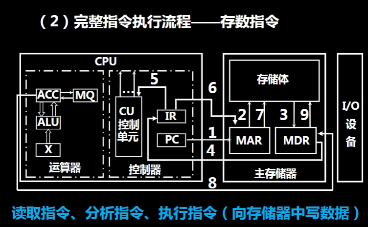

# 01绪论
## 计算机系统的基本组成与工作过程
### 计算机的基本组成
- 

协同工作流程（一个简单的指令执行过程为例）：
取指令： 控制器从存储器中取出下一条要执行的指令。
指令译码： 控制器对取出的指令进行译码，分析指令的类型和操作数。
取操作数： 如果指令需要操作数，控制器会发出信号，使运算器从存储器中取出所需的数据。
执行指令： 控制器指挥运算器对数据进行运算。
存结果： 运算器将计算结果送回存储器存储。
输出结果： 如果需要，控制器指挥将存储器中的结果通过输出设备输出。
### 计算机硬件各部分的关系
- 
### 主存器的组成
- 
### 运算器的组成
- 

ACC-accumulator
ALU-alrithmetic logic unit

### 控制器的组成
- 

### 计算机的工作流程
#### 完整指令执行流程--取数指令
- 读取指令 分析指令 执行指令（从存储器中取数据）
- 
1.  **PC -> MAR (路径 1)：** **程序计数器 (PC)** 中存放着下一条要执行的指令的地址。在指令执行的开始阶段，控制单元将 PC 中的指令地址送入**存储器地址寄存器 (MAR)**。MAR 寄存器连接到地址总线，用于向主存储器发送要访问的地址。

2.  **存储体 -> MDR (路径 2)：** 主存储器根据 MAR 中的地址，从**存储体**中读取相应的指令（在指令执行阶段的初期）。读取到的指令被存入**存储器数据寄存器 (MDR)**。MDR 寄存器连接到数据总线，用于暂存从内存读出或要写入内存的数据。

3.  **MDR -> IR (路径 3)：** MDR 中的指令被送入**指令寄存器 (IR)**。指令寄存器位于**控制器 (CU)** 内部，用于存放当前正在执行的指令。

4.  **IR -> MAR (路径 4)：** 控制器对 IR 中的指令进行**分析（译码）**。如果这条指令是“取数指令”（例如，将内存某个地址的数据加载到寄存器），控制器会从 IR 中取出操作数（通常是数据所在的内存地址），并将其送入 MAR。现在，MAR 中存放的是要读取的**数据**的地址。

5.  **CU 控制信号 (未编号的数据通路)：** 控制单元根据指令的译码结果，发出相应的控制信号。对于“取数指令”，CU 会向主存储器发出一个“读”命令。

6.  **存储体 -> MDR (路径 6)：** 主存储器根据 MAR 中存放的**数据地址**，从**存储体**中读取相应的数据。读取到的数据被存入 MDR。

7.  **MDR -> X (路径 7)：** MDR 中存放的**数据操作数**被送入**运算器 (ALU)** 中的**操作数寄存器 (X)**（或直接送入累加器 ACC，取决于具体的指令和设计）。至此，要操作的数据已经被取到运算器中，准备进行后续的运算处理。

**图示额外显示的数据通路：**

* **ALU内部 (未编号的通路)：** ALU 内部各寄存器（ACC, MQ, X）之间以及它们与 ALU 之间的通路，用于进行算术逻辑运算。
* **CPU与I/O之间 (未编号的通路)：** CPU 与 I/O 设备之间通过数据总线和控制线进行数据传输和控制。
* **I/O -> MDR / MDR -> 存储体 (路径 9)：** 这条路径表示 I/O 设备与主存储器之间可以通过 MDR 进行数据传输，这可能涉及数据输入到内存或内存数据输出到 I/O 设备，例如通过 DMA 方式。虽然与指令执行相关，但路径 1-7 更直接地描述了“取数指令”从内存获取数据到 ALU 的核心流程。

**总结来说，取数指令的完整执行流程包括了指令的读取（步骤 1-3），然后根据指令中指定的地址，从存储器中读取数据（步骤 4-7），最终将数据送到运算器中。** 整个过程由控制器发出各种控制信号来协调完成。
#### 完整指令执行流程--存数指令
- 读取指令 分析指令 执行指令（向存储器中写数据）
- 

## 计算机系统性能指标
### 机器字长
- CPU一次能处理数据的位数，通常为CPU的寄存器长度
- 
### 存储容量
- 主存容量
- 辅存容量
- 
MAR 的作用： 存储器地址寄存器 (MAR) 中存放着 CPU 或其他主设备想要访问的内存单元的地址。MAR 的位数决定了它能表示的地址的范围。
计算机内部使用二进制来表示信息，包括内存地址。如果 MAR 有 $n$ 位，那么它可以表示 $2^n$个不同的二进制数值。
### 运行速度
- 
主频：CPU 的时钟频率
### 程序执行的时间度量方法
- 

CPU 时间 = 指令数 × CPI × 时钟周期时间

这个公式解释了 CPU 执行一个特定程序所需的总时间，并将其分解为几个关键因素。下面我来解释公式中的每一个项以及为什么它们相乘就能得到 CPU 时间。

- CPU 时间 (CPU Time)：

含义： 这是 CPU 实际花费在执行一个程序上的总时间。它测量的是 CPU 从程序开始执行到结束所经历的时间。这个时间通常不包括等待 I/O 操作完成或其他不是由 CPU 计算引起的时间。
单位： 通常以秒 (s) 或毫秒 (ms) 为单位。

- 指令数 (Instruction Count)：

含义： 这是 CPU 在执行这个程序期间所执行的总的机器指令条数。
决定因素： 指令数取决于程序本身（程序员编写的代码）、编译器（如何将高级语言代码翻译成机器语言指令集）、以及计算机的指令集体系结构 (ISA)。不同的算法、不同的编程语言、不同的编译器优化级别以及不同的 CPU 指令集都会导致执行相同任务所需的指令数不同。

- CPI (Cycles Per Instruction)：

含义： CPI 的全称是“Cycles Per Instruction”，即每条指令所需的平均时钟周期数。
决定因素： 不同的机器指令需要不同的时钟周期数来完成执行。例如，一个简单的加法指令可能只需要一个时钟周期，而一个复杂的浮点乘法指令可能需要几十个时钟周期。CPI 是针对整个程序而言的平均值。它受到 CPU 的微体系结构（如流水线、缓存、分支预测等）和程序中各种指令的使用频率（即指令组合）的影响。一个较低的 CPI 表示 CPU 平均执行一条指令所需的时钟周期更少，效率更高。

- 时钟周期时间 (Clock Cycle Time)：

含义： 这是 CPU 一个时钟周期的持续时间。
决定因素： 它由 CPU 的主频决定。时钟周期时间是时钟频率的倒数。如果主频是 f，那么时钟周期时间就是 1/f。主频越高，时钟周期时间越短。
单位： 通常以纳秒 (ns) 或皮秒 (ps) 为单位。

**CPU 执行所有这些时钟周期所需的总时间，就等于总的时钟周期数乘以每个周期的持续时间**
**CPU 时间=总时钟周期数×时钟周期时间**
**CPU 时间=(指令数×CPI)×时钟周期时间**
### 功耗墙
- 
