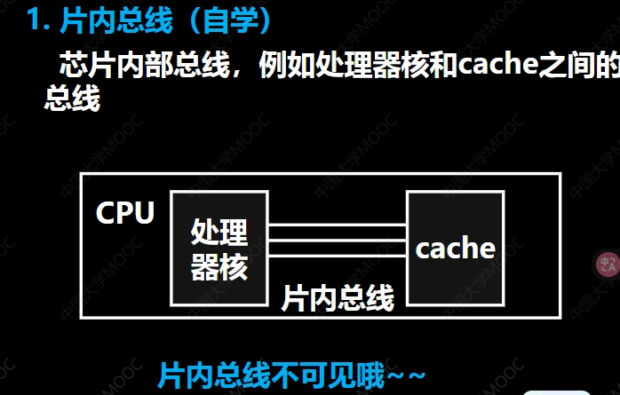

# 02系统总线
## 总线的概念与分类
### 总线概念

### 总线特点

### 片内总线

### 系统总线

#### 数据总线

#### 地址总线

- **地址总线的位数如何确定**
	地址总线的位数决定了CPU能够直接访问的内存空间的大小。具体来说，**如果地址总线有 $n$ 位，那么它可以表示 $2^n$ 个不同的地址。每个地址通常对应一个存储单元（例如，一个字节）。**
	确定地址总线位数的主要因素是：
	1.  **CPU的设计和架构：** CPU在设计时就确定了其内部寄存器、指令集以及与外部总线接口的宽度，其中包括地址总线的位数。不同的CPU架构（如32位或64位）通常对应不同的地址总线宽度。
	2.  **系统对最大内存容量的需求：** 系统需要支持的最大内存容量直接决定了所需的地址总线位数。例如，如果系统需要支持4GB（$2^{32}$ 字节）的内存，那么至少需要32位的地址总线。
	3.  **兼容性：** 为了保持与现有硬件和软件的兼容性，新的CPU和系统设计通常会考虑之前的标准和约定。
	

- QA
	
	要确定需要多少条地址线，我们使用以下关系：

	$$2^n = \text{存储单元总数（字节）}$$

	其中，$n$ 是地址线的数量。我们需要将给定的存储单元大小转换为字节，然后计算 $n$。

	1.  **如有256B存储单元，需要多少条地址线？**
			* 存储单元总数 = 256 字节
			* $2^n = 256$
			* 因为 $2^8 = 256$，所以需要 **8 条** 地址线。

	2.  **如有2KB存储单元，需要多少条地址线？**  
			* 存储单元总数 = 2 KB
			* 1 KB = 1024 Bytes = $2^{10}$ Bytes
			* 2 KB = $2 \times 1024$ Bytes = $2^1 \times 2^{10}$ Bytes = $2^{11}$ Bytes
			* $2^n = 2^{11}$
			* 所以需要 **11 条** 地址线。

	3.  **如有16MB存储单元，需要多少条地址线？**
			* 存储单元总数 = 16 MB
			* 1 MB = 1024 KB = $2^{10}$ KB
			* 1 KB = 1024 Bytes = $2^{10}$ Bytes
			* 1 MB = $2^{10} \times 2^{10}$ Bytes = $2^{20}$ Bytes
			* 16 MB = $16 \times 2^{20}$ Bytes = $2^4 \times 2^{20}$ Bytes = $2^{24}$ Bytes
			* $2^n = 2^{24}$
			* 所以需要 **24 条** 地址线。

	4.  **如有4GB存储单元，需要多少条地址线？**
			* 存储单元总数 = 4 GB
			* 1 GB = 1024 MB = $2^{10}$ MB
			* 1 MB = 1024 KB = $2^{10}$ KB
			* 1 KB = 1024 Bytes = $2^{10}$ Bytes
			* 1 GB = $2^{10} \times 2^{10} \times 2^{10}$ Bytes = $2^{30}$ Bytes
			* 4 GB = $4 \times 2^{30}$ Bytes = $2^2 \times 2^{30}$ Bytes = $2^{32}$ Bytes
			* $2^n = 2^{32}$
			* 所以需要 **32 条** 地址线。

#### 控制总线

##### 典型控制总线

### 典型系统总线结构

### 通信总线

#### 通信总线特点

## 总线控制

### 典型总线控制信号

### 总线事务

#### 典型总线事务

#### 突发传送事务

### 总线判优
#### 判优逻辑

#### 判优逻辑分类

#### 链式查询方式

1.  **总线请求 (BR - Bus Request):** 当某个 I/O 接口（如图中的 I/O 接口 0, I/O 接口 1, ... I/O 接口 n）需要使用总线（例如，进行数据传输）时，它会发出一个总线请求信号 BR。在链式查询中，通常所有设备共享同一条 BR 线，并将请求发送给总线控制部件。

2.  **总线忙 (BS - Bus Busy):** 总线控制部件或当前正在使用总线的设备通过 BS 信号指示总线是否正在被占用。如果 BS 线有效，表示总线忙，其他设备需要等待。

3.  **总线同意 (BG - Bus Grant):** 当总线控制部件接收到 BR 请求，并且总线当前不忙（BS 无效）时，它会发出总线同意信号 BG，以允许请求设备使用总线。链式查询的关键在于 BG 信号的传递方式。

4.  **链式传递 BG 信号:** 总线控制部件发出的 BG 信号是串行传递的，它首先发送给链中的第一个设备（在图示中是 I/O 接口 0）。
    * 如果 I/O 接口 0 发出了总线请求 (BR)，并且接收到了 BG 信号，它就会截住这个 BG 信号，不再将其向下传递给链中的下一个设备。然后，I/O 接口 0 获得总线控制权，并开始使用总线进行数据传输。在使用总线期间，I/O 接口 0 会保持 BS 信号有效，表明总线忙。
    * 如果 I/O 接口 0 没有发出总线请求，或者虽然发出了请求但已经完成了总线操作，它就会将接收到的 BG 信号传递给链中的下一个设备（I/O 接口 1）。
    * I/O 接口 1 接收到 BG 信号后，也会按照同样的逻辑判断自己是否发出了总线请求。如果发出了请求，就截住 BG 信号并使用总线；如果没有，就将 BG 信号传递给 I/O 接口 2，以此类推。

5.  **优先级确定:** 在链式查询中，设备在链中的位置决定了其优先级。越靠近总线控制部件的设备优先级越高。例如，I/O 接口 0 的优先级最高，I/O 接口 1 次之，I/O 接口 n 的优先级最低。这是因为 BG 信号总是先到达链前端的设备。

6.  **释放总线:** 当获得总线控制权的设备完成数据传输后，它会释放总线，即撤销对 BS 信号的置位，并将总线控制权交还给总线控制部件。

##### 优劣

#### 计数器定时查询方式

1.  **总线请求 (BR - Bus Request):** 当任一 I/O 接口需要使用总线时（例如，进行数据传输），它会发出一个总线请求信号 BR。与链式查询类似，通常所有设备共享同一条 BR 线，并将请求发送给总线控制部件。

2.  **总线忙 (BS - Bus Busy):** 总线控制部件或当前正在使用总线的设备通过 BS 信号指示总线当前是否正在被占用。如果 BS 信号有效，表示总线忙，其他设备需要等待。

3.  **启动计数器和设备地址输出:** 当总线控制部件检测到 BR 请求，并且总线当前处于空闲状态（BS 无效）时，总线控制部件内部的**计数器**开始工作。计数器的值代表一个设备的地址。总线控制部件将计数器的当前值通过**设备地址线**发送出去。

4.  **设备地址比较和查询:** 连接在总线上的每个 I/O 接口都有一个唯一的设备地址。当总线控制部件将设备地址放到地址线上时，所有的 I/O 接口都会比较自己的地址与地址线上的地址。

5.  **总线授权:**
    * 如果地址线上的地址与某个 I/O 接口的地址相匹配，并且这个 I/O 接口发出了总线请求 (BR)，那么这个匹配的 I/O 接口就会识别到自己的地址，并获得总线的控制权。获得总线控制权后，该设备会停止自己的 BR 请求，并置位 BS 信号，表示总线正在被使用。
    * 如果地址线上的地址与某个设备的地址匹配，但该设备没有发出总线请求；或者地址线上的地址没有匹配到任何正在请求总线的设备，那么总线控制部件就会**增加计数器的值**。

6.  **循环查询:** 总线控制部件会不断地增加计数器的值，并将新的地址放到设备地址线上，以此循环查询每个设备的请求状态，直到找到一个发出请求的设备。

7.  **使用总线:** 获得总线控制权的设备就可以通过数据线、地址线和控制线进行数据传输操作。在此期间，BS 信号保持有效。

8.  **释放总线:** 当设备完成总线操作后，它会撤销对 BS 信号的置位，释放总线，使其回到空闲状态。

#### 计数器定时查询方式的特点

#### QA

根据图示，设备地址线用于总线控制部件向各个 I/O 接口发送设备地址，以便在计数器定时查询方式中选中特定的设备。

图示显示了从 I/O 接口 0 到 I/O 接口 *n*，这意味着总共有 $n + 1$ 个 I/O 接口设备。

要唯一地标识这 $n + 1$ 个不同的设备，设备地址线需要足够的位数来表示 $n + 1$ 种不同的状态。

如果设备地址线有 $m$ 条，那么它可以表示 $2^m$ 个不同的地址。为了能够寻址到所有的 $n + 1$ 个设备，需要满足：

$$2^m \ge n + 1$$

因此，设备地址线所需的条数 $m$ 是大于或等于 $\log_2(n+1)$ 的最小整数。这通常表示为 $\lceil \log_2(n+1) \rceil$。

**简单来说，设备地址线的数量取决于系统中总共有多少个 I/O 接口设备。如果设备数量是 N，那么至少需要 $\lceil \log_2 N \rceil$ 条设备地址线。**

在您图示的情况下，设备数量是 $n + 1$，所以设备地址线需要 $\lceil \log_2(n+1) \rceil$ 条。

### 独立请求方式

1.  **独立总线请求 (BR - Bus Request):** 当任一 I/O 接口需要使用总线时（例如，进行数据传输），它会通过自己**独立的**总线请求线（如图中的 $BR_0, BR_1, ..., BR_n$）向总线控制部件发出请求。每个设备都有自己专用的 BR 线。

2.  **总线控制部件和排队器:** 总线控制部件接收所有设备发出的独立总线请求信号。总线控制部件内部通常包含一个**排队器**（Arbiter），负责处理这些并发的总线请求。

3.  **仲裁和优先级判决:** 排队器根据预设的仲裁策略（如固定优先级、循环优先级、公平策略等）对所有同时到达的请求进行判决，决定哪一个设备将获得下一次总线的使用权。

4.  **独立总线同意 (BG - Bus Grant):** 一旦排队器决定了由哪个设备使用总线，总线控制部件就会通过该设备**独立的**总线同意线（如图中的 $BG_0, BG_1, ..., BG_n$）向其发送总线同意信号。例如，如果决定由 I/O 接口 0 使用总线，总线控制部件就只在 $BG_0$ 线上发出同意信号。

5.  **设备获得总线使用权:** 接收到总线同意信号的设备（例如，I/O 接口 0 接收到 $BG_0$）就知道自己已经获得了总线的控制权。此时，它可以开始通过数据线和地址线进行数据传输操作。通常，获得总线的设备会发出一个总线忙信号（图示中没有独立的 BS 线，但隐含着获得授权即表示总线忙的状态）。

6.  **释放总线:** 当设备完成总线操作后，它会撤销自己的总线请求信号（例如，I/O 接口 0 撤销 $BR_0$），并释放总线。总线控制部件检测到设备释放总线后，排队器会继续处理其他等待的总线请求。

**总结来说，独立请求方式的流程是：** 各设备通过独立 BR 线请求总线；总线控制部件中的排队器并行接收并仲裁请求；根据仲裁结果，总线控制部件通过独立 BG 线授权给获准设备；获准设备使用总线，完成后释放总线。这种方式的优点是可以实现更灵活和高效的优先级控制，响应速度相对较快，但硬件成本相对较高，需要更多的控制线。

#### 独立请求方式的特点

## 总线的通信控制

### 四种方式

#### 同步通信
- 读

1.  **$T_1$ 周期（地址和命令发出阶段）：**
    * 在 $T_1$ 周期开始时（通常是时钟的某个边沿，例如上升沿），执行总线操作的主设备（例如 CPU）将要访问的存储单元或 I/O 设备的**地址**放到地址总线上。
    * 同时或紧接着，主设备会在**读命令**线上发出有效的读命令信号，表示这次总线操作是要从指定的地址读取数据。
    * 地址信号和读命令信号在整个 $T_1$ 周期内保持稳定。

2.  **$T_2$ 周期（等待和设备响应阶段）：**
    * 地址和读命令信号继续在总线上保持稳定。
    * 被寻址的存储器或 I/O 设备在 $T_1$ 周期结束前或在 $T_2$ 周期开始时识别到自己的地址和读命令。
    * 设备内部开始进行响应，例如从指定的存储单元读取数据，或者准备 I/O 设备的数据。这个阶段是设备准备数据的时间。

3.  **$T_3$ 周期（数据传输阶段）：**
    * 在 $T_3$ 周期开始时，被寻址的设备将准备好的**数据**放到数据总线上。
    * 主设备在 $T_3$ 周期内（通常在周期的后半段，以确保数据稳定）从数据总线上读取数据。这是实际数据传输发生的阶段。

4.  **$T_4$ 周期（传输结束阶段）：**
    * 主设备完成对数据的读取。
    * 在 $T_4$ 周期内，主设备会撤销读命令信号，表示总线操作即将结束。
    * 地址和数据信号可能会被撤销，总线恢复到空闲状态，为下一次总线传输做准备。

**总结来说，这个同步式读总线传输过程是：** 主设备在 $T_1$ 周期发出地址和读命令，被寻址设备在 $T_2$ 周期进行准备，然后在 $T_3$ 周期将数据放到总线上，主设备在 $T_3$ 周期读取数据，最后在 $T_4$ 周期结束整个传输。整个过程都受到时钟信号的严格同步控制。

- 写

1.  **$T_1$ 周期：**
    * 在这个周期的**开始**（通常由时钟信号的某个边沿触发），主设备（如 CPU）将要进行写操作的**地址**放到地址总线上。
    * **同时或几乎同时**，主设备将要写入的**数据**放到数据总线上。从图上看，数据信号在 $T_1$ 周期内就已经变为有效状态并稳定下来。
    * **几乎同时**，主设备也会在**写命令**线上发出有效的写命令信号（从图上看，写命令在 $T_1$ 周期开始时就变为有效状态）。
    * 在整个 $T_1$ 周期内，地址、数据和写命令信号都处于稳定状态。

2.  **$T_2$ 周期：**
    * 地址、数据和写命令信号继续保持稳定和有效。
    * 被寻址的从设备（存储器或 I/O 设备）在这个阶段识别并锁存地址，确认是写操作，并准备接收数据。

3.  **$T_3$ 周期：**
    * 地址、数据和写命令信号仍然保持稳定和有效。
    * 被寻址的从设备在这个周期内根据有效的写命令信号，将数据总线上的数据**写入**到指定的地址位置。实际的写入动作通常在这个周期内完成。

4.  **$T_4$ 周期：**
    * 在这个周期的**开始或前半段**，主设备撤销**写命令**信号（使其变为无效状态），表示写操作完成。
    * 随后，主设备也会撤销地址和数据信号。
    * 总线恢复到空闲状态，准备进行下一次总线传输。

#### 异步通信

1.  **不互锁（Non-interlocked） - 通常用于简单的 I/O 设备：**
    * **过程：** 主设备发出一个**请求**信号（将其置为有效状态），并在一个固定的时间后撤销该请求信号，**不等待**从设备的**回答**信号。从设备在接收到请求信号后，执行相应的操作，并发出一个**回答**信号，并在一个固定的时间后撤销该回答信号，**不等待**主设备撤销请求。
    * **特点：** 这种方式最简单，但**不可靠**。主设备发出请求后不确定从设备是否已经接收并处理；从设备发出回答后也不确定主设备是否已经收到。它依赖于双方预设的固定时间，如果设备速度变化或传输延迟较大，容易出错。图示中可以看到，请求信号在回答信号到来之前就可能已经撤销，回答信号也在请求信号完全撤销之前就可能已经撤销。

2.  **半互锁（Semi-interlocked） - 常用于共享内存系统：**
    * **过程：** 主设备发出一个**请求**信号，并**等待**从设备发出**回答**信号。当主设备检测到从设备的回答信号有效后，**撤销**请求信号。从设备在接收到主设备的请求信号后，发出**回答**信号，并在完成操作后撤销该回答信号，**不等待**主设备撤销请求。
    * **特点：** 比不互锁方式可靠，主设备至少确认从设备已经开始响应。但是，从设备的回答撤销与主设备的请求撤销之间没有直接的互锁关系，可能导致下一次通信的问题。图示中可以看到，主设备的请求在从设备的回答到来后才撤销，但从设备的回答撤销不等待主设备下次请求的到来。

3.  **全互锁（Fully Interlocked） - 常用于网络通信或复杂的总线系统：**
    * **过程：** 这是一种四阶段握手协议，是最可靠的异步通信方式。
        * 阶段 1：主设备发出**请求**信号。
        * 阶段 2：从设备接收到请求后，发出**回答**信号。
        * 阶段 3：主设备接收到回答后，**撤销**请求信号。
        * 阶段 4：从设备接收到主设备撤销请求后，**撤销**回答信号，表示准备接收下一个请求。
    * **特点：** 这种方式**最可靠**，每一个信号的变化都作为下一个信号变化的触发条件。这确保了主从设备之间的完全同步，无论传输延迟有多大，都不会丢失或错误地处理信号。图示中清晰地展示了这种依赖关系：请求升高 -> 回答升高 -> 请求降低 -> 回答降低。

**总结来说，异步通信通过请求和回答信号进行协调，避免了对共享时钟的依赖。不互锁最简单但不可靠，半互锁有所改进但仍有潜在问题，而全互锁通过完整的四阶段握手提供了最高的可靠性。** 选择哪种方式取决于设备对通信可靠性的要求和硬件实现的复杂性。

#### 半同步通信

##### 半同步通信时序图

**核心思想：** 主设备发出同步时钟信号，但从设备可以通过反馈信号（等待信号 WAIT）来控制总线周期的长度，从而实现“主体同步，细节异步”。

**读操作时序过程（如图所示）：**

1.  **$T_1$ 周期（地址和命令发出阶段）：**
    * 在时钟的控制下，主设备在总线传输周期的开始（$T_1$ 周期）将要读取的**地址**和**读命令**信号放到总线上。
    * 这些信号在 $T_1$ 周期内保持稳定。

2.  **$T_2$ 周期（等待和设备准备阶段）：**
    * 地址和读命令信号继续保持稳定。
    * 被寻址的从设备接收并识别地址和读命令。从设备开始准备数据。

3.  **$T_W$ 周期（等待阶段 - 引入异步性）：**
    * 如果从设备速度较慢，无法在 $T_2$ 周期结束时准备好数据，它会**拉低（或拉高，取决于设计）等待信号线 WAIT**，向主设备发出“请等待”的信号。
    * 主设备检测到 WAIT 信号有效，就知道从设备还没有准备好。此时，主设备会**插入一个或多个等待周期（$T_W$）**。在 $T_W$ 周期内，地址和命令信号通常保持不变，时钟仍然在运行，但总线的数据传输被暂停。
    * 从设备会一直保持 WAIT 信号有效，直到数据准备完毕。

4.  **$T_3$ 周期（数据传输阶段 - 恢复同步性）：**
    * 当从设备准备好数据后，它会**撤销 WAIT 信号**（使其变为无效状态）。
    * 主设备检测到 WAIT 信号变为无效。在下一个时钟周期（紧跟在最后一个 $T_W$ 周期之后），总线传输进入 **$T_3$ 周期**。
    * 在 $T_3$ 周期内，从设备将准备好的**数据**放到数据总线上。
    * 主设备在 $T_3$ 周期内读取数据。

5.  **$T_4$ 周期（传输结束阶段）：**
    * 主设备撤销读命令信号。
    * 地址和数据信号被撤销。
    * 总线周期结束。

**半同步通信的特点概括：**

* **发送方（主设备）仍然发送时钟：** 提供了基本的同步框架。
* **接收方（从设备）通过 WAIT 信号反馈：** 允许从设备根据自身速度调整传输节奏。这是实现“细节异步”的关键。
* **增加了 WAIT 信号线：** 需要额外的控制线。
* **“主体同步，细节异步”：** 地址和命令的发出、数据读取的起始等基本步骤是与时钟同步的（主体同步），但在数据准备慢时可以通过 WAIT 信号插入等待周期（细节异步），使得总线周期长度可变。
* **允许不同速率的设备协调工作：** 这是半同步通信的主要优点，解决了慢速设备无法跟上快速总线时钟的问题。

#### 上述三种通信方式的共同点

1.  **主模块发出地址、命令：**
    * **过程：** 总线的主设备（通常是 CPU 或其他DMA控制器等） initiates a read operation. 它首先将要访问的内存地址或 I/O 设备的地址放到地址总线上，同时在控制总线上发出“读”命令信号。
    * **占用总线：** **占用总线**。在这一阶段，地址总线和控制总线是被主设备占用的，用于传输地址信息和命令信号。

2.  **从模块准备数据：**
    * **过程：** 总线的从设备（被主设备寻址的内存或 I/O 设备）接收到地址和读命令。它会根据地址找到对应的数据，并准备好将数据放到数据总线上。这是一个从设备内部进行操作的阶段。
    * **占用总线：** **不占用总线**。这里的“不占用总线”主要是指**数据总线**在此时还没有被从设备用来输出数据。虽然地址总线和控制总线上的信号可能还保持着由主设备发出的地址和命令，但从**设备自身进行数据读取或准备的过程不直接使用数据总线进行外部传输。**

3.  **从模块发出数据：**
    * **过程：** 当从设备将数据准备好之后，它将读取到的数据放到数据总线上。
    * **占用总线：** **占用总线**。在这一阶段，**数据总线被从设备占用，用于将数据传输给主设备**。主设备会在这个阶段从数据总线上读取数据。

#### 分离式通信

**每个总线传输周期分为两个子周期：**

1.  **子周期 1：主模块申请占用总线，使用完后即放弃总线的使用权。**
    * **过程：** 当主设备（例如 CPU）需要进行一次总线读或写操作时，它首先通过总线仲裁过程获得总线的使用权。
    * 获得总线后，主设备利用总线向从设备（例如内存控制器或 I/O 设备）发送**请求信息**。对于一个读操作，这包括发送要读取的**地址**和**读命令**。对于一个写操作，这包括发送要写入的**地址**、**写命令**以及要写入的**数据**（注意，在某些分离式设计中，写数据也可能在第二个子周期发送，但这取决于具体的实现）。
    * 发送完请求信息后，主设备会**立即释放对总线的占用**，不再持有总线。

2.  **子周期 之间的总线活动：**
    * 在第一个子周期结束后，主设备释放了总线，而从设备正在处理主设备的请求（例如，对于读请求，从设备正在访问内存获取数据）。
    * 在从设备处理请求的这段时间内，**总线是空闲的，可以被其他需要使用总线的设备（其他主设备）申请和占用**，进行它们自己的总线操作。这就是分离式通信能够提高总线利用率的关键。

3.  **子周期 2：从模块申请占用总线，将各种信息送到总线上。**
    * **过程：** 当从设备完成了主设备的请求（例如，对于读请求，数据已经从内存中取出）并准备好向主设备发送响应时，从设备现在需要**自己申请占用总线**。它也需要通过总线仲裁过程来获得总线使用权。
    * 获得总线后，从设备将响应信息发送给最初发出请求的主设备。对于一个读操作，这通常是将请求的**数据**放到数据总线上，并可能带有一些标识（例如，最初请求的地址或事务 ID），以便主设备知道这个数据对应哪一个请求。
    * 发送完响应信息后，从设备释放总线。

**分离式通信的主要优点：**

* **提高总线利用率：** 总线不会在从设备处理请求的漫长时间内被主设备独占而处于空闲状态，其他设备可以利用这段时间使用总线，从而提高了总线的整体效率和吞吐量。
* **允许设备独立工作：** 主设备发出请求后可以去做其他事情，不必等待从设备的立即响应。
* **适应高速主设备和慢速从设备：** 主设备不受慢速从设备的限制，发出请求后即可释放总线，不会被从设备的慢速响应所阻塞。

**缺点：**

* **总线控制逻辑更复杂：** 需要更复杂的仲裁机制来管理两次总线申请，主设备需要有机制来接收和匹配从设备在第二个子周期发回的响应数据。
* **需要额外的标识信息：** 从设备在发送响应时需要包含一些标识信息，以便主设备能够正确地将响应与之前发出的请求关联起来。

##### 特点

