# 03存储器
## 半导体存储器
### 半导体存储芯片的基本结构
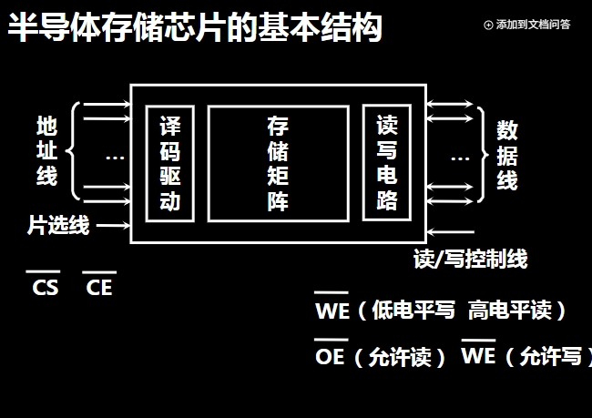
1.  **半导体存储芯片的基本结构 (Basic Structure of Semiconductor Memory Chip):** 这是整个图的标题，说明了图的主题。
2.  **译码驱动 (Decoding Driver):**
    * 负责接收来自**地址线 (Address Lines)** 和 **片选线 (Chip Select Lines)** 的信号。
    * 地址线用来指定存储矩阵中需要访问的特定存储单元的位置（行地址和列地址）。
    * 片选线 (通常表示为 $\overline{\text{CS}}$ 或 $\overline{\text{CE}}$) 用来选择当前工作的存储芯片，当芯片未被选中时，它不响应任何读写操作，通常数据线处于高阻态。
    * 译码驱动根据地址和片选信号，产生相应的控制信号，用于在 **存储矩阵 (Memory Matrix)** 中选中唯一的存储单元或一组存储单元。
3.  **存储矩阵 (Memory Matrix):**
    * 这是存储芯片的核心部分，由大量的存储单元（如SRAM的六管MOS电路或DRAM的电容晶体管组合）排列成行列结构组成。
    * 每个存储单元可以存储一个比特（bit）的数据（0或1）。
    * 译码驱动产生的地址信号会指向存储矩阵中的特定位置。
4.  **读写电路 (Read/Write Circuit):**
    * 负责在 **存储矩阵 (Memory Matrix)** 和外部的 **数据线 (Data Lines)** 之间传输数据。
    * 受 **读/写控制线 (Read/Write Control Lines)** 的控制。
    * **数据线 (Data Lines):** 是双向的，用于传输要写入存储矩阵的数据（写操作）或从存储矩阵中读取的数据（读操作）。
    * **读/写控制线 (Read/Write Control Lines):**
        * $\overline{\text{WE}}$ (Write Enable): 写入使能信号。通常图中标注为“低电平写，高电平读”，这意味着当 $\overline{\text{WE}}$ 为低电平时执行写操作，为高电平时执行读操作。另一个标注“允许写”也指代这个功能，当 $\overline{\text{WE}}$ 有效时（通常是低电平），允许数据写入存储矩阵。
        * $\overline{\text{OE}}$ (Output Enable): 输出使能信号。图中标注为“允许读”，通常用于控制数据线是否输出数据。当 $\overline{\text{OE}}$ 有效时（通常是低电平），读出的数据会被放到数据线上；当 $\overline{\text{OE}}$ 无效时，数据线处于高阻态，避免与其他芯片的数据线冲突。

**工作流程概要：**

* **读操作：** 当需要读取数据时，外部提供地址信号和有效的片选信号。译码驱动根据地址信号在存储矩阵中选中相应的存储单元。同时，读/写控制线设置为读模式（例如 $\overline{\text{WE}}$ 为高电平，$\overline{\text{OE}}$ 为低电平）。读写电路将选中存储单元的数据从存储矩阵中读出，并通过数据线输出。
* **写操作：** 当需要写入数据时，外部提供地址信号、有效的片选信号以及要写入的数据。译码驱动根据地址信号在存储矩阵中选中相应的存储单元。同时，读/写控制线设置为写模式（例如 $\overline{\text{WE}}$ 为低电平）。读写电路将数据线上的数据写入到存储矩阵中选中的存储单元。

### 主存地址单元
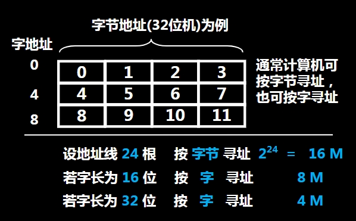
- **1个Byte是8位**

### 半导体芯片的译码驱动
#### 线选法
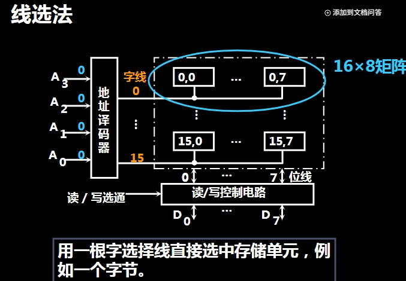
1.  **标题：线选法 (Line Selection Method)**
    * 这是图的主题，说明了将要介绍的内存寻址方式。
2.  **地址线 (Address Lines) A0-A3:**
    * 这是输入信号，用于指定要访问的存储单元的地址。图中使用了4根地址线（A0, A1, A2, A3）。
3.  **地址译码器 (Address Decoder):**
    * 接收来自地址线 A0-A3 的4位地址信号。
    * 4位地址可以产生 $2^4 = 16$ 种不同的组合。
    * 地址译码器的作用是根据输入的地址信号，激活其16个输出线中的唯一一根。
4.  **字线 (Word Lines):**
    * 地址译码器的16个输出线被称为字线，编号从0到15。
    * **在线选法中，每一根字线直接对应存储矩阵中的一行存储单元，代表一个“字”或一个存储单元块（在本例中是一个字节）。**
    * 当地址译码器激活某根字线时，与这根字线相连的所有存储单元都被选中。
5.  **存储矩阵 (Memory Matrix):**
    * 这是存储数据的核心区域，由存储单元构成，排列成一个 $16 \times 8$ 的矩阵。
    * $16$ 代表有16行，每一行对应一根字线。
    * $8$ 代表有8列，每一列对应一根位线。
    * 矩阵中的每个交叉点（由一根字线和一根位线确定）代表一个存储单元，可以存储一个比特的数据。
6.  **位线 (Bit Lines) 0-7:**
    * 共有8根位线，垂直穿过存储矩阵。
    * 每一根位线连接着存储矩阵中同一列的所有存储单元。
    * **位线用于在存储单元和读写控制电路之间传输数据。**
7.  **读写控制电路 (Read/Write Control Circuit):**
    * 连接到位线和数据线。
    * 接收 **读/写选通 (Read/Write Gate/Strobe)** 信号。
    * 在读操作时，将选中字线上的存储单元通过位线传输到数据线上。
    * 在写操作时，将数据线上的数据通过位线写入到选中字线上的存储单元。
8.  **读/写选通 (Read/Write Gate/Strobe):**
    * 控制信号，指示当前是进行读操作还是写操作。
9.  **数据线 (Data Lines) D0-D7:**
    * 共有8根数据线，用于外部电路与存储芯片之间传输数据。
    * 由于有8根数据线和8根位线，表明该存储器是按字节 (8 bits) 进行读写的。
10. **底部文字解释：** "用一根字选择线直接选中存储单元，例如一个字节。"
    * 这句话总结了线选法的核心特点：通过地址译码器激活一根字线，就可以直接选中与该字线相连的一组存储单元（在本例中是8个存储单元，构成一个字节）。

**线选法的工作原理：**

当外部提供一个4位的地址信号时，地址译码器会根据这个地址信号激活16根字线中的唯一一根。被激活的这根字线将选中它所连接的整个一行存储单元。然后，根据读/写选通信号，读写控制电路会通过8根位线将这一行的8个比特数据读出到数据线上，或者将数据线上的8个比特数据写入到这一行的存储单元中。
相比于其他更复杂的译码方式（如行列译码），线选法在译码器部分相对简单，但需要较多的字线驱动电路。这种方法常用于存储容量相对较小、按字（或字节）访问的存储芯片中。
#### 重合法
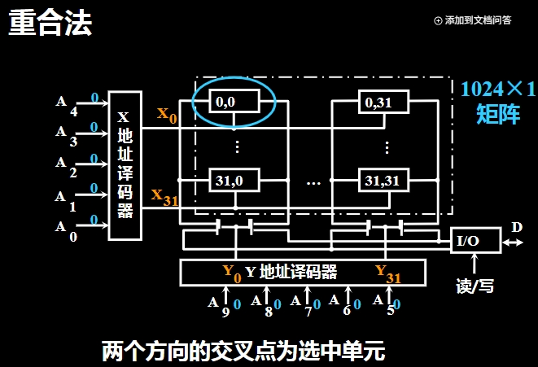
1.  **标题：重合法 (Coincidence Method)**
    * 这是图的主题，说明了将要介绍的内存寻址方式。
2.  **地址线 (Address Lines) A0-A9:**
    * 外部提供的地址信号线。图中共有10根地址线 (A0到A9)。
    * 这10根地址线被分成两组：A0-A4（低5位）和 A5-A9（高5位）。
3.  **X 地址译码器 (X Address Decoder):**
    * 接收地址线的低5位 (A0-A4)。
    * 5位地址可以产生 $2^5 = 32$ 种组合。
    * 根据输入的低5位地址，X 译码器激活其32个输出线中的唯一一根，这些输出线通常代表存储矩阵的**行选择线 (Row Select Lines)** 或称为 X 线 (X0到X31)。
4.  **Y 地址译码器 (Y Address Decoder):**
    * 接收地址线的高5位 (A5-A9)。
    * 5位地址可以产生 $2^5 = 32$ 种组合。
    * 根据输入的高5位地址，Y 译码器激活其32个输出线中的唯一一根，这些输出线通常代表存储矩阵的**列选择线 (Column Select Lines)** 或称为 Y 线 (Y0到Y31)。
5.  **存储矩阵 (Memory Matrix):**
    * 这是存储数据的区域，由存储单元构成。图中标注为 $1024 \times 1$ 矩阵，表示总共有1024个存储单元，每个单元存储1个比特，并且可以独立访问。
    * 图中内部结构显示为一个 $32 \times 32$ 的网格，这与 X 和 Y 译码器的输出数量相对应 ($32 \times 32 = 1024$)。
    * **在线性译码法中，一个存储单元由一根行选择线 (X 线) 和一根列选择线 (Y 线) 的交叉点唯一确定。**
6.  **I/O (输入/输出) Block:**
    * 连接到存储矩阵和外部的 **数据线 (Data Line) D**。
    * 接收 **读/写 (Read/Write)** 控制信号。
    * 负责在选中的存储单元和数据线之间传输数据。在读操作时，将选中单元的数据读出到数据线 D 上；在写操作时，将数据线 D 上的数据写入到选中单元中。由于只有一个数据线 D，表明该存储器是按比特 (bit) 进行读写的。
7.  **数据线 (Data Line) D:**
    * 单根数据线，用于外部电路与存储芯片之间传输单个比特的数据。
8.  **读/写 (Read/Write):**
    * 控制信号，指示当前是进行读操作还是写操作。
9.  **底部文字解释：** "两个方向的交叉点为选中单元"
    * 这句话总结了重合法或行列译码法的核心思想：通过 X 译码器选中的一根行线和 Y 译码器选中的一根列线，它们的**交叉点**所对应的存储单元就是本次操作要访问的单元。

**重合法 (行列译码法) 的工作原理：**

当外部提供一个10位的地址信号时，地址的高5位被送到 Y 译码器，低5位被送到 X 译码器。X 译码器激活其中一根 X 线，Y 译码器激活其中一根 Y 线。这两根被激活的线在存储矩阵中的唯一交叉点就确定了要访问的单个存储单元。然后，根据读/写信号，通过 I/O 电路完成对这个单元的读出或写入操作。
重合法（行列译码法）的优点是，与简单的线选法相比，使用相同数量的地址线可以寻址更大的存储容量，并且所需的译码器和选择线数量相对较少。例如，10根地址线用线选法最多只能选择 $2^{10}=1024$ 个字线，每个字线可能对应一个字。而用重合法可以组织成 $32 \times 32$ 的矩阵，总共有 $32 \times 32 = 1024$ 个单元，并且可以精确到选择其中任意一个单元（bit）。这使得重合法成为构建大容量存储芯片的常用方法。
### QA

根据地址信息选中某个存储单元的过程如下：
1.  **CPU 生成地址：** 当 CPU 需要从内存中读取数据（执行 load 指令）或向内存中写入数据（执行 store 指令）时，它会根据程序的要求计算出要访问的内存单元的**地址**。这个地址是一个二进制数值，唯一标识了目标存储单元。

2.  **地址送上地址总线：** CPU 将生成的这个地址码放到计算机的**地址总线**上。地址总线是一组并行的电线，负责将地址信息从 CPU 传输到内存及其他I/O设备。地址总线的位数决定了 CPU 可以直接寻址的内存空间的大小。

3.  **内存地址译码器工作：** 内存系统接收到地址总线上的地址信息后，会通过一个重要的电路——**内存地址译码器**（Memory Address Decoder）来解析这个地址。
    * 译码器是一个组合逻辑电路，它接收地址总线上的二进制地址作为输入。
    * 根据地址的数值，译码器会产生一个或多个输出信号。这些输出信号用于**选中**内存中的特定存储单元。

4.  **选中目标存储单元：** 译码器的输出信号会连接到内存芯片或内存模块内部的选址逻辑。
    * 如果内存由多个芯片组成，地址的一部分可能用于选择**片选**（Chip Select），即确定是哪一个内存芯片被访问。
    * 地址的另一部分可能用于在被选中的内存芯片内部进行**行选**和**列选**，精确地定位到具体的存储单元（例如，一个字节或一个字）。

5.  **启用读/写控制：** 除了地址信息，CPU 还会通过**控制总线**发送读命令或写命令信号。这些命令信号与被选中的存储单元的控制电路相结合。

6.  **执行读写操作：**
    * **如果是读操作：** 被选中的存储单元中的数据会被放到**数据总线**上，供 CPU 读取。
    * **如果是写操作：** CPU 通过**数据总线**发送的数据会被写入到被选中的存储单元中。

### 主存的技术指标
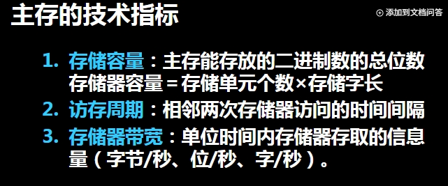


## 半导体存储器
### 静态随机存储器
#### 静态随机存储器基本单元电路
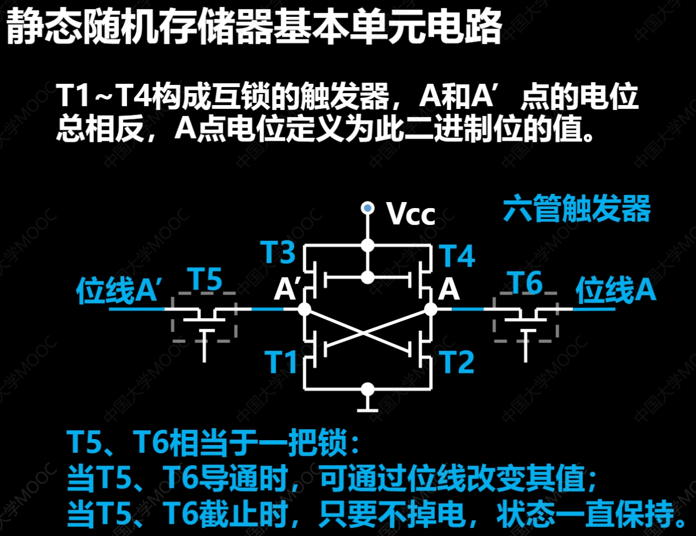
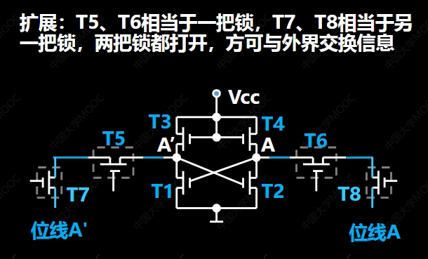
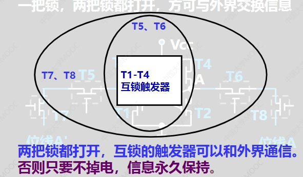

#### 静态随机存储器读写方法
##### 读操作
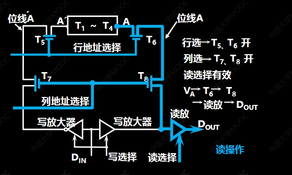
1.  **地址输入与译码：** 首先，要读取的存储单元的地址被提供给 SRAM 芯片。这个地址通常被分成**行地址**和**列地址**两部分。
    * **行地址选择：** **行地址选择**逻辑电路对输入的行地址进行译码。译码的结果会激活存储器阵列中的特定一行（字线）。在图示中，行地址选择会导通该行存储单元的访问晶体管，例如图中的 **$T_5$ 和 $T_6$**（文字说明“行地址选择 -> $T_5, T_6$ 开”）。这使得该行的所有存储单元都连接到位线。图示中 $T_1$ 到 $T_4$ 可能代表行地址选择的准备或保持时间。

2.  **列地址选择：** 同时或紧接着，**列地址选择**逻辑电路对输入的列地址进行译码。译码的结果会导通连接到该列的晶体管，例如图中的 **$T_7$ 和 $T_8$**（文字说明“列地址选择 -> $T_7, T_8$ 开”）。这些列选晶体管将选定列的位线连接到读出数据总线或读写放大器。

3.  **读选择有效：** **读选择**（Read Select）控制信号被置为有效状态。这个信号使读数据通路（包括读放大器）处于工作状态。

4.  **数据感应与放大：** 当行和列都被选中，并且读选择有效时，被选中存储单元的状态（存储的 0 或 1）会导致与其相连的位线产生一个微小的电压差。这个微小的信号通过列选晶体管（$T_7, T_8$）被送到**读放大器**。读放大器是一个高灵敏度的放大器，它能够检测并放大这个微小的电压差，将其转换为标准的数字逻辑电平（0 或 1）。图示中的路径 "$V_A \rightarrow T_6 \rightarrow T_8 \rightarrow$ 读放大器 $\rightarrow$ DOUT" 展示了信号从存储单元相关的位线 ($V_A$) 经过访问晶体管 ($T_6$) 和列选晶体管 ($T_8$)，到达读放大器，最终输出到数据输出线 $D_{OUT}$ 的通路。

5.  **数据输出 (DOUT)：** 读放大器输出的稳定数字信号就是从被选中存储单元读取到的数据，这个数据通过 $D_{OUT}$ 引脚输出。

图示中的 $T_5, T_6, T_7, T_8$ 开（Open/On）指示了在读操作过程中这些晶体管导通的时间点或阶段，它们受行地址选择和列地址选择逻辑的控制。

**总结来说，SRAM 的读操作是通过行地址和列地址选择特定的存储单元，然后通过读选择信号使能读数据通路，最后由读放大器感应并放大存储单元的状态，将数据输出。** 这是一个通过地址译码和模拟信号感应（位线上的微小电压差）来实现数字数据读取的过程。
#### 写操作
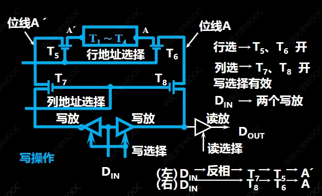
1.  **地址输入与译码：** 首先，要写入数据的存储单元的地址被提供给 SRAM 芯片。地址同样被分成**行地址**和**列地址**两部分。
    * **行地址选择：** **行地址选择**逻辑电路对输入的行地址进行译码，激活存储器阵列中的特定一行（字线）。这会导通该行所有存储单元的访问晶体管，例如图中的 **$T_5$ 和 $T_6$**（文字说明“行地址选择 -> $T_5, T_6$ 开”）。这使得该行的所有存储单元都连接到位线 $A$ 和 $A'$（$A'$ 是 $A$ 的反相线）。图示中 $T_1$ 到 $T_4$ 可能代表行地址选择的时序。

2.  **列地址选择：** 同时或紧接着，**列地址选择**逻辑电路对输入的列地址进行译码。这会导通连接到该列的晶体管，例如图中的 **$T_7$ 和 $T_8$**（文字说明“列地址选择 -> $T_7, T_8$ 开”）。这些列选晶体管将选定列的位线 $A$ 和 $A'$ 连接到写入数据通路（写放大器）。

3.  **写选择有效：** **写选择**（Write Select）控制信号被置为有效状态。这个信号使写数据通路（包括写放大器）处于工作状态，准备将数据写入存储单元。

4.  **数据输入与写入放大：** 要写入的**数据**从 **$D_{IN}$** 引脚输入。这个输入数据被送到**写放大器**（通常有两个，用于产生数据及其反相信号）。文字说明“$D_{IN} \rightarrow$ 两个写放”表示输入数据驱动着两个写放大器。一个写放大器在位线 $A$ 上驱动输入数据，另一个写放大器在位线 $A'$ 上驱动输入数据的反相。

5.  **数据写入存储单元：** 当行和列都被选中，并且写选择有效时，写放大器将强驱动的互补电压（代表要写入的数据）施加到选定列的位线 $A$ 和 $A'$ 上。图示中的写入路径清晰地展示了这一点：
    * 右侧路径：输入数据 $D_{IN} \rightarrow$ 写放大器 $\rightarrow$ 通过列选晶体管 $T_8 \rightarrow$ 通过行访问晶体管 $T_6 \rightarrow$ 到达位线 $A$。
    * 左侧路径：输入数据 $D_{IN} \rightarrow$ 反相器 $\rightarrow$ 另一个写放大器 $\rightarrow$ 通过列选晶体管 $T_7 \rightarrow$ 通过行访问晶体管 $T_5 \rightarrow$ 到达位线 $A'$。
    * 位线 $A$ 和 $A'$ 上的强信号会**翻转**选定存储单元（由六个晶体管构成的交叉耦合反相器对）的状态，强制其存储新的数据。

6.  **写操作结束：** 在经过足够的时间，确保数据已经稳定地写入存储单元后，写选择信号被撤销，地址信号也可能被移除，结束写操作周期。行和列选晶体管关闭，断开存储单元与位线的连接。

**总结来说，SRAM 的写操作是通过行地址和列地址选择特定的存储单元，使能写数据通路，然后由写放大器将要写入的数据及其反相驱动到位线上，从而强制改变存储单元的状态。** 这是一个通过地址译码和施加强信号到位线上来实现数字数据写入的过程。

#### 静态RAM举例
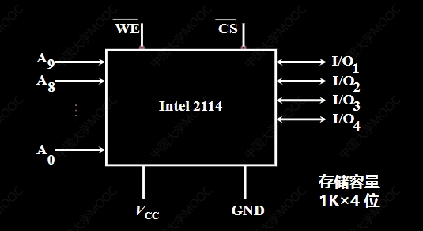
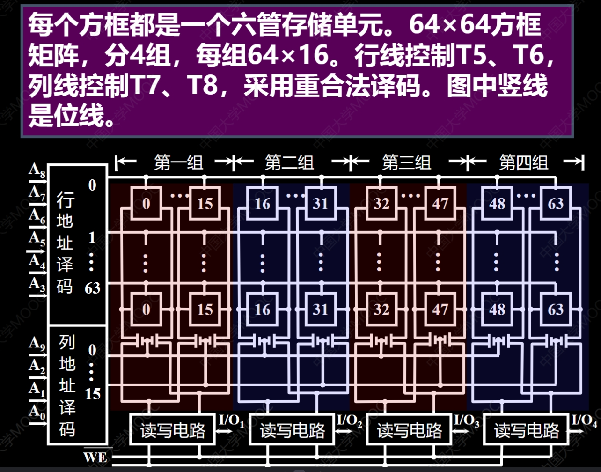

##### 读过程
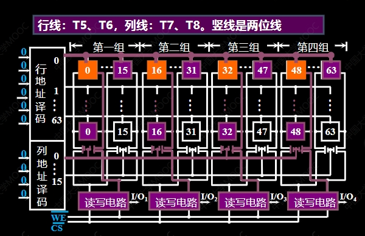
1.  **地址输入与控制信号使能：**
    * CPU 或其他主设备将要读取的内存地址提供给存储器芯片的地址引脚。这个地址被分成**行地址**和**列地址**两部分。
    * 同时，**片选信号（CS）**必须有效，以使能整个存储器芯片。
    * **写使能信号（WE）**必须无效（对于活跃低电平的 WE 信号来说，就是高电平），表示这是一个读操作。

2.  **行地址译码与行选择：**
    * **行地址译码器**接收输入的行地址。它根据行地址的值，在芯片内部的存储器阵列中激活唯一的一条**行线**（或称为字线）。图示中行地址范围从 0 到 63，表示有 64 行。
    * 激活的行线会导通该行所有存储单元的访问晶体管（如之前图示中的 T5 和 T6），将该行所有存储单元连接到相应的位线上（图示中“竖线是两位线”，表示每列有一对互补位线）。

3.  **列地址译码与列选择：**
    * **列地址译码器**接收输入的列地址。它根据列地址的值，选择存储器阵列中的特定**列**。图示将列分成了四组，每组都有相应的读写电路和 I/O 线（I/O0 到 I/O3），这表明该存储器芯片可以一次读写 4 位数据。列地址范围从 0 到 15，结合四组结构，意味着列译码器会从每组中选择一个特定的列。
    * 列译码器通过控制列选择晶体管（如之前图示中的 T7 和 T8），将选定列的位线连接到相应的**读写电路**。

4.  **读写电路进行数据读取：**
    * 在读操作模式下，连接到选定列的**读写电路**中的**读放大器**开始工作。
    * 读放大器感应连接到选定列位线对上的微小电压差（这个电压差反映了存储单元中存储的逻辑状态 0 或 1）。
    * 读放大器将这个微小的模拟信号放大，并转换为标准的数字逻辑电平。

5.  **数据输出到 I/O 线：**
    * 从每组列中读取到的数据（每组通常是一位或几位）通过相应的读写电路，被送到芯片的 **I/O 线**（I/O0 到 I/O3）。
    * 由于图示有 4 条 I/O 线，且有四组列，这表明芯片一次可以并行读取 4 位数据。

6.  **数据送上数据总线：**
    * 存储器芯片的 I/O 线连接到计算机系统的数据总线。CPU 或其他主设备从数据总线上读取这 4 位数据，完成读操作。

**总结来说，存储器芯片的读操作流程是：接收地址和控制信号 -> 行地址译码选中行 -> 列地址译码选中列 -> 行线和列线共同定位到目标存储单元 -> 读写电路中的读放大器感应并放大存储单元的状态 -> 数据通过 I/O 线输出到数据总线。** 这个过程就是通过地址信息层层选择，最终将目标存储单元的数据提取出来的过程。
##### 写过程

1.  **地址和数据输入，控制信号使能：**
    * 主设备（CPU 等）将要写入数据的**地址**（包含行地址和列地址）提供给存储器芯片的地址引脚。
    * 主设备将要写入的**数据**放到数据总线上，这些数据通过芯片的 **I/O 线**（I/O0 到 I/O3）进入存储器芯片。
    * **片选信号（CS）**必须有效，使能芯片。
    * **写使能信号（WE）**必须有效（通常是低电平），指示这是一个写操作。

2.  **行地址译码与行选择：**
    * **行地址译码器**对输入的行地址进行译码，激活唯一的**行线**。
    * 激活的行线会导通该行所有存储单元的访问晶体管（T5 和 T6），将它们连接到位线 $A$ 和 $A'$。

3.  **列地址译码与列选择：**
    * **列地址译码器**对输入的列地址进行译码，选择特定的**列**（对于 4 位宽的芯片，会从每组中选择一个列）。
    * 列译码器导通列选择晶体管（T7 和 T8），将选定列的位线 $A$ 和 $A'$ 连接到相应的**读写电路**。

4.  **读写电路进行数据写入：**
    * 由于写使能信号 WE 有效，选定列连接到的**读写电路**中的**写放大器**被使能。
    * 从 **I/O 线**进入的要写入的**数据**被送到这些写放大器。
    * 写放大器根据输入数据，在选定列的位线 $A$ 和 $A'$ 上驱动产生一对强电平的互补信号（例如，如果要写入逻辑 1，可能在 $A$ 上驱动高电平，在 $A'$ 上驱动低电平；如果要写入逻辑 0，则相反）。

5.  **数据写入存储单元：**
    * 写放大器在位线上驱动的强电压信号通过导通的列选晶体管和行访问晶体管，施加到位于被选定行和列交叉点的存储单元上。
    * 这对强电平信号会**强制翻转** SRAM 存储单元（通常是一个由交叉耦合反相器构成的锁存器）的状态，使其存储新的数据。

6.  **写操作结束：**
    * 在数据稳定写入存储单元后，写使能信号 WE 和片选信号 CS 被撤销，地址和数据信号被移除。行和列选晶体管关闭，写操作完成。

**总结来说，存储器芯片的写操作流程是：接收地址、数据和控制信号 -> 行地址译码选中行 -> 列地址译码选中列 -> 行线和列线共同定位到目标存储单元 -> 数据通过 I/O 线输入到读写电路 -> 读写电路中的写放大器驱动位线 -> 位线上的强信号强制改变存储单元的状态，完成写入。** 这个过程就是通过地址选择，然后将外部数据通过写通路写入到指定的存储单元中。

### 动态随机存储器基本单元电路
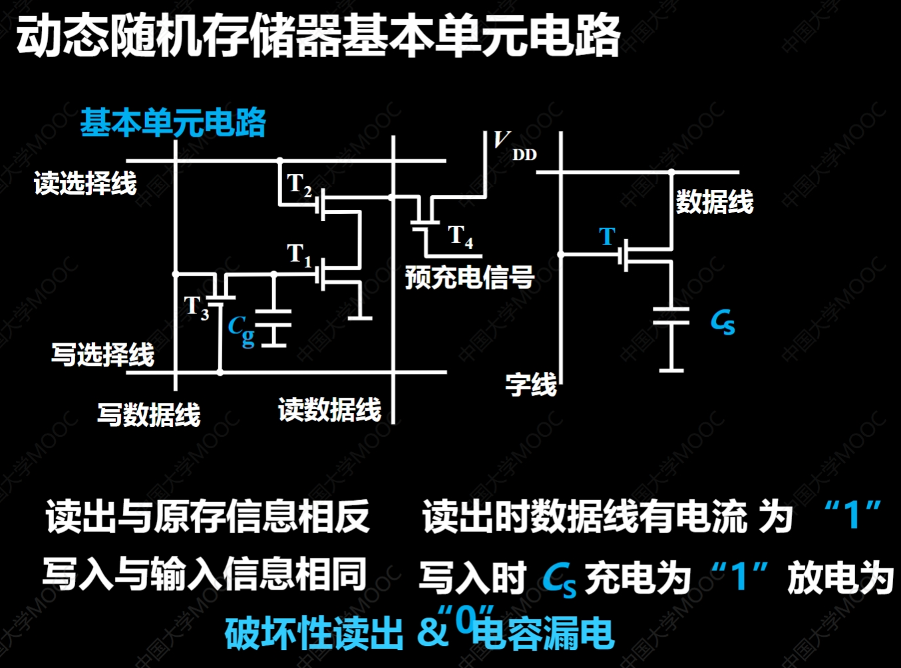
**读操作 (Read Operation):**

1.  **数据线预充电：** 在进行读操作之前，连接存储单元的**数据线**通常会被预充电到一个特定的电压（例如，$V_{DD}/2$）。这是为了更容易地感应电容器上的微小电压变化。
2.  **激活字线：** 与要读取的存储单元对应的**字线**被激活（置为高电平）。这会使存储单元中的晶体管 T 导通，将存储电容器 $C_S$ 连接到数据线上。
3.  **电荷共享与感应：** 当电容器连接到数据线时，电容器上存储的电荷会与数据线的寄生电容发生**电荷共享**。这会导致数据线的电压发生一个微小的变化，其变化方向和幅度取决于电容器中存储的电荷量（即存储的是逻辑 1 还是逻辑 0）。
4.  **读出放大器感应与放大：** **读出放大器**（Read Amplifier）是一个高灵敏度的电路，它感应数据线上的这个微小电压变化。它将这个模拟电压差放大，转换为一个明确的数字逻辑电平（0 或 1）。
5.  **破坏性读出：** 需要特别注意的是，电荷共享的过程会**破坏**电容器上原有的电荷状态。也就是说，**读操作是破坏性的**。读取之后，存储单元的数据就没有了或者处于不确定的状态。图示文字“破坏性读出”指的就是这个特性。
6.  **数据写回（刷新）：** 为了恢复被破坏的数据，DRAM 的读操作通常包含一个**写回（Refresh）**阶段。读取到的数据会被立即沿着原路径写回到同一个存储单元中，恢复其原始电荷状态。

**写操作 (Write Operation):**

1.  **激活字线：** 要写入数据的存储单元对应的**字线**被激活，导通晶体管 T，将电容器 $C_S$ 连接到数据线上。
2.  **驱动数据线：** 要写入的**数据**（逻辑 1 或 逻辑 0）通过**写放大器**被施加到**数据线**上。
    * 如果要写入逻辑 1，数据线被驱动到高电平（例如 $V_{DD}$）。
    * 如果要写入逻辑 0，数据线被驱动到低电平（例如 0V）。
3.  **电容器充电/放电：** 由于晶体管 T 导通，数据线上的电压会加到电容器 $C_S$ 上。
    * 如果数据线是高电平，电容器会被**充电**，存储逻辑 1。
    * 如果数据线是低电平，电容器会**放电**，存储逻辑 0。
    * 图示文字“写入时 $C_S$ 充电为 "1" 放电为 "0"" 描述的就是这个过程。
4.  **字线去激活：** 在电容器充电或放电完成后，字线被去激活（置为低电平），晶体管 T 截止，将电容器从数据线上隔离，以便电容器能够保持存储的状态。

**DRAM 的主要特点和挑战（来自图示文字）：**

* **破坏性读出：** 读操作会破坏存储的数据，因此每次读取后都需要立即写回以恢复数据。
* **电容漏电：** 电容器上存储的电荷会随着时间通过晶体管 T 的漏电流或电容器自身的漏电而逐渐丢失。这意味着 DRAM 存储的数据不是永久的，需要在电荷丢失到无法可靠识别之前，周期性地进行**刷新（Refresh）**操作。刷新操作本质上是读出数据然后立刻写回。图示文字“电容漏电”指的就是这个需要刷新的原因。

#### 刷新问题
##### 集中刷新
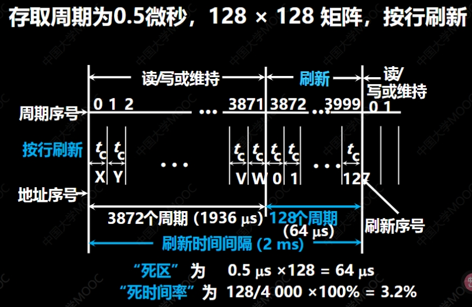
1.  **刷新时间间隔：** DRAM 芯片规定了每个存储单元的电荷能够保持有效不丢失的最大时间，称为刷新周期（Refresh Period），例如图示中隐含的需要在 2 毫秒 (ms) 内完成所有行的刷新。

2.  **集中刷新周期：** 在集中刷新方式下，系统会在每个刷新时间间隔内，**暂停正常的内存读写操作**，专门安排一个集中的时间段来执行刷新。图示中的“刷新时间间隔 (2 ms)”以及其中的“刷新”区域就代表了这个概念。

3.  **按行逐一刷新：** 在这个集中的刷新时间段内，内存控制器会**按顺序逐一刷新** DRAM 芯片中的每一行。图示中“按行刷新”下面的地址序号从 0 变化到 127，表明一次刷新操作会依次处理所有 128 行（对应于 128 x 128 的矩阵中的 128 行）。刷新一行通常需要一个总线存取周期的时间（图示中存取周期为 0.5 微秒）。

4.  **刷新过程：** 刷新一行的过程类似于一个读操作后立即进行写回的操作。当某一行被选中刷新时，该行的所有存储单元的数据被读出到感应放大器中，然后立即沿着原路径写回该行。这会重新加强电容器上的电荷。

5.  **“死区”（Dead Zone）：** 在进行集中刷新期间，由于内存正忙于刷新，它无法响应 CPU 或其他设备的正常读写请求。这段时间内存是不可用的，被称为“死区”。图示中明确标出了这个“刷新”区域的持续时间。

6.  **死区持续时间：** 死区的长度取决于需要刷新的行数和刷新每一行所需的时间。图示中，$128 \times 128$ 矩阵有 128 行，每个存取周期（即刷新一行所需时间）为 0.5 微秒。因此，集中刷新的死区时间为 128 行 $\times$ 0.5 微秒/行 = 64 微秒 (µs)。图示中的计算也证实了这一点。

7.  **死时间率：** 死时间率是死区时间占整个刷新时间间隔的比例，用来衡量刷新对系统性能的影响。图示中，死时间率 = 死区时间 / 刷新时间间隔 = 64 µs / 2 ms = 64 µs / 2000 µs = $128 / 4000 = 3.2\%$。这意味着在每个 2 ms 的周期内，有 3.2% 的时间内存因为刷新而无法被正常访问。

**集中刷新的特点：**

* **控制逻辑简单：** 实现起来相对容易，只需在固定的时间间隔内暂停正常操作并执行一系列刷新。
* **内存暂时不可用：** 在刷新期间，内存完全被刷新操作占用，导致正常读写操作必须等待，影响了系统的实时性。
* **存在性能瓶颈：** 死区的存在会导致一部分总线带宽损失，降低了系统的有效工作效率。

总而言之，集中刷新是一种通过在一个集中的时间段内刷新所有行来保持 DRAM 数据有效的策略，其优点是控制简单，但缺点是在刷新期间导致内存不可用，产生“死区”。
##### 分散刷新
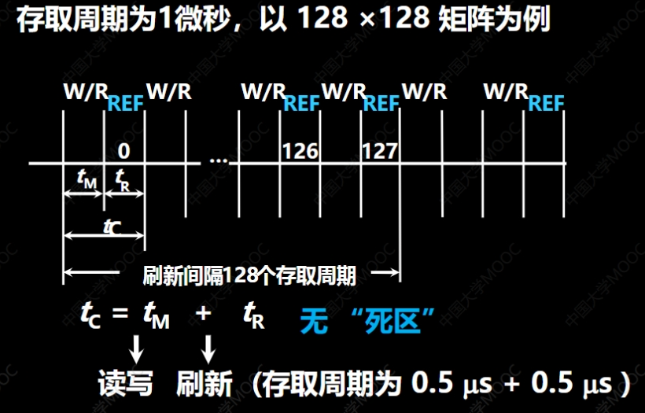
1.  **标题：分散刷新 (Distributed Refresh)**
    * 这是图的主题，表明介绍的是一种特殊的内存刷新策略。
2.  **存取周期为 1微秒，以 $128 \times 128$ 矩阵为例 (Access cycle is 1 microsecond, taking a $128 \times 128$ matrix as an example):**
    * 设定了内存的一个存取周期是 1微秒（1 $\mu\text{s}$）。
    * 以一个由 $128 \times 128 = 16384$ 个存储单元组成的矩阵为例进行说明。在 DRAM 中，刷新通常是以行为单位进行的，所以这个矩阵可能有128行需要刷新。
3.  **时间轴 (Timeline):**
    * 水平线表示时间进程。
4.  **W/R 和 $\text{REF}$ (Read/Write and Refresh):**
    * 时间轴上的每个段代表一个存取周期 (1 $\mu\text{s}$)。
    * 每个周期内都包含了 W/R (读/写操作) 和 $\text{REF}$ (刷新操作)。这表明读写操作和刷新操作是**交替进行**或**分时进行**的。
5.  **定时参数 ($\text{t}_M$, $\text{t}_R$, $\text{t}_C$):**
    * $\text{t}_M$: 存储器访问时间 (进行读写操作所需的时间)。
    * $\text{t}_R$: 刷新时间 (进行一次刷新操作所需的时间)。
    * $\text{t}_C$: 存取周期时间。图中标注 $\text{t}_C = \text{t}_M + \text{t}_R$。
    * 图中下方进一步说明：“读写 刷新 (存取周期为 $0.5 \mu \text{s} + 0.5 \mu \text{s}$)” - 这表示在一个 1 $\mu\text{s}$ 的存取周期中，有 0.5 $\mu\text{s}$ 用于读写操作，有 0.5 $\mu\text{s}$ 用于刷新操作。读写和刷新在同一个周期内分时完成。
6.  **刷新过程及时序：**
    * 时间轴下方显示了刷新操作的顺序：刷新行 0，然后是其他行，直到刷新行 127。
    * **刷新间隔128个存取周期 (Refresh interval 128 access cycles):** 这句话表明，在刷新完一行（例如行 0）之后，要等待 128个存取周期（即总共 $128 \times 1 \mu\text{s} = 128 \mu\text{s}$）才会再次刷新这一行。在连续的128个存取周期内，每个周期刷新不同的一行，从而在128个周期内完成所有128行的刷新。
7.  **无 "死区" (No "dead zone"):**
    * 这句话是分散刷新的一个重要优点。由于每个存取周期都被分成读写时间和刷新时间，系统可以在几乎任何时候发起读写请求，而不需要等待一个长时间的集中刷新周期结束。内存不会出现一段完全无法进行读写操作的“死区”。

**分散刷新的原理：**

分散刷新将所有需要刷新的行分散到整个刷新周期内完成。在每个内存存取周期内，除了进行可能的读写操作外，还会插入一个短暂的刷新操作，对存储矩阵的其中一行进行刷新。通过在连续的周期内轮流刷新不同的行，可以确保在规定时间内所有行都能得到刷新。

**与集中刷新的对比：**

集中刷新是另一种刷新方式，它会暂停所有的读写操作，集中在一个时间段内对所有需要刷新的行进行连续刷新。这种方式会产生一段“死区”，在此期间内存无法进行正常的读写访问。分散刷新则避免了这个问题，通过将刷新操作分散并与读写操作交错进行，提高了内存的可用性。

分散刷新虽然有避免“死区”、提高内存可用性的优点，但它也存在一些缺点：

1.  **降低了读写操作的有效带宽/吞吐量：** 在分散刷新中，每个存取周期都被分成了读写时间和刷新时间（如图中所示的 $0.5 \mu\text{s} + 0.5 \mu\text{s}$）。这意味着用于实际数据读写的时间只占每个周期的一部分。虽然内存始终可被访问，但在单位时间内，能够完成的纯读写操作数量会因此减少，整体的有效数据传输率（带宽）受到影响。
2.  **增加了每次读写操作的延迟：** 由于刷新操作被嵌入到每个存取周期中，一次完整的存取周期变成了读写时间和刷新时间之和（$\text{t}_C = \text{t}_M + \text{t}_R$）。即使你只进行读写操作，也必须等待整个周期结束。这意味着单次读写访问的时间比没有刷新操作介入时的理想最短时间要长。
3.  **控制逻辑相对复杂：** 需要精确地控制在每个存取周期的不同时间段内执行读写操作还是刷新操作，并且要管理轮流刷新不同行的顺序。这使得内存控制器或刷新控制逻辑的设计比简单的集中刷新方式更为复杂。
4.  **不适合需要极致低延迟的场景：** 尽管没有长“死区”，但每次访问都被刷新延迟所“拖慢”一点，这对于对访问延迟有极高要求的实时系统来说，可能不是最优的选择。

总的来说，分散刷新是用牺牲一部分读写性能（降低带宽和增加单次访问延迟）和增加控制复杂度为代价，换取内存的持续可用性（无死区）。选择哪种刷新方式取决于具体的应用需求和性能权衡。
##### 异步刷新
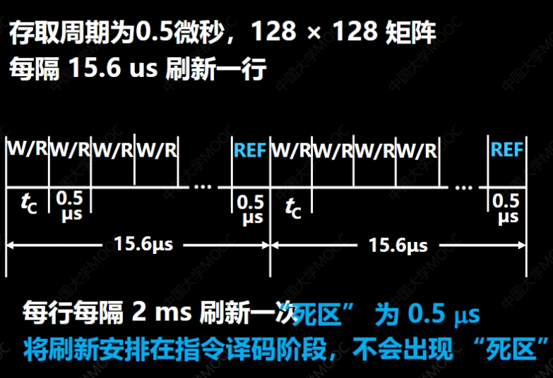
1.  **标题：异步刷新 (Asynchronous Refresh)**
    * 说明了这是一种不同于同步刷新或分散刷新的刷新策略。
2.  **存取周期为 0.5微秒, $128 \times 128$ 矩阵 (Access cycle is 0.5 microsecond, $128 \times 128$ matrix):**
    * 设定了内存的一个存取周期是 0.5 $\mu\text{s}$。
    * 以一个由 128 行的存储矩阵为例进行说明，共有 128 行需要定期刷新。
3.  **每隔 15.6 $\mu$s 刷新一行 (Refresh one row every 15.6 $\mu$s):**
    * 这指定了相邻两次刷新操作之间的时间间隔。也就是说，大约每隔 15.6 微秒，就会对存储矩阵中的**一行**进行刷新。
4.  **时间轴 (Timeline):**
    * 显示了正常读写操作 (W/R) 和刷新操作 (REF) 在时间上的分布。
    * 图中显示了一连串的 W/R 操作，然后是一个 REF 操作，接着又是一连串的 W/R 操作，再是一个 REF 操作，以此类推。
    * 每个 W/R 操作占用一个存取周期，时长为 0.5 $\mu$s。
    * 每个 REF 操作也占用 0.5 $\mu$s。
    * 两个相邻的 REF 操作之间的时间间隔是 15.6 $\mu$s。这15.6 $\mu$s 包含了多个 W/R 周期和一个 REF 周期。
5.  **刷新周期要求：每行每隔 2 ms 刷新一次 (Refresh each row once every 2 ms):**
    * 这是 DRAM 芯片本身对数据保持的要求，即任何一行的数据都需要在 2 毫秒 (2000 $\mu\text{s}$) 内至少被刷新一次。
    * **计算验证：** 如果每隔 15.6 $\mu\text{s}$ 刷新一行，并且共有 128 行需要刷新，那么完成所有 128 行的刷新所需的时间大约是 $128 \times 15.6 \mu\text{s} \approx 1996.8 \mu\text{s}$，这非常接近 2000 $\mu\text{s}$（即 2 ms）。这说明每隔 15.6 $\mu\text{s}$ 刷新一行的策略，是为了满足每行每隔 2 ms 必须刷新一次的要求。
6.  **“死区” 为 0.5 $\mu$s ("Dead zone" is 0.5 $\mu$s):**
    * 这里的“死区”指的是进行一次刷新操作本身所需的时间，即 0.5 $\mu\text{s}$。在这个短暂的时间内，与被刷新行相关的内存单元可能无法进行读写访问。
7.  **将刷新安排在指令译码阶段，不会出现“死区” (Arrange refresh in the instruction decoding phase, will not appear "dead zone"):**
    * 这是异步刷新的关键所在，也是其名称“异步”的体现。
    * **核心思想：** 不是简单地暂停 CPU 或内存访问来执行刷新，而是将刷新操作的启动或执行时间点与 CPU 的工作流程**异步协调**。
    * 具体做法可能是：内存控制器（或其他控制逻辑）在需要刷新时（每隔15.6 $\mu\text{s}$）发出刷新请求，但实际的刷新操作会被安排在 CPU 执行指令的译码阶段、内存总线空闲时，或者其他不涉及内存访问的关键路径的时间点。
    * 通过这种方式，刷新操作可以“隐藏”在正常的指令执行流程中，从而避免出现一个长时间的、完全阻塞内存访问的“死区”。用户或程序感觉不到因为刷新而导致的明显停顿。这里的“不会出现‘死区’”指的是不会出现传统集中刷新那种导致系统停顿的长时间死区，而不是说刷新操作本身不需要时间。

**异步刷新的优点：**

* 通过巧妙地安排刷新时机，最大限度地减少了刷新对正常读写操作的影响。
* 避免了长时间的内存不可访问“死区”，提高了内存的可用性。
* 对系统整体性能的影响相对较小，尤其是在内存访问不连续或者 CPU 有其他非内存密集型任务执行时。

**异步刷新的缺点：**

* 控制逻辑更加复杂，需要与 CPU 或系统总线进行更紧密的协调。
* 虽然避免了长时间死区，但在刷新进行的短暂时间内（例如图中的 0.5 $\mu\text{s}$），相关的内存区域仍然是不可访问的。如果此时恰好有对该区域的访问请求，仍然会产生短暂的延迟。

总的来说，异步刷新是一种更精细的 DRAM 刷新管理策略，它试图通过将刷新操作与系统的其他活动同步（或更确切地说是巧妙地安排在空闲时段），来优化性能并避免长时间的内存阻塞。

#### DRAM芯片举例
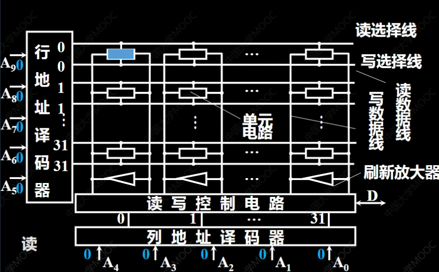
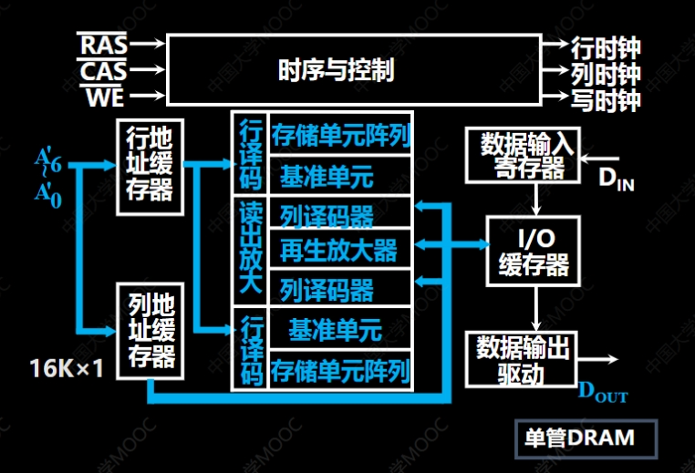

### 静态RAM和动态RAM比较
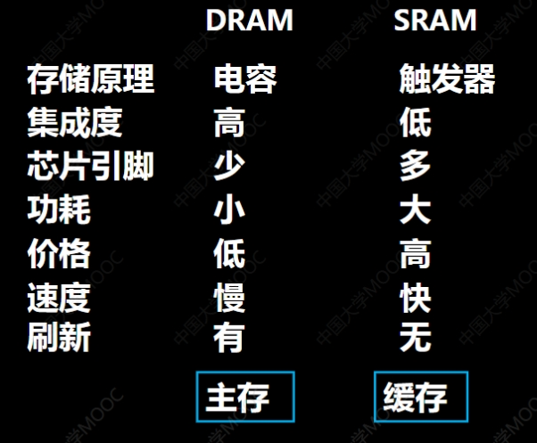

## 存储器的扩展方式
### 存储器扩展
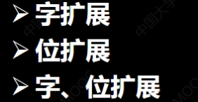
#### 位扩展增加存储字长

**实现方法（位扩展）：**

要实现这个目标，最直接的方法就是像图中那样，将多个字长较小的存储芯片的地址线和控制线并联起来，而将它们的数据线分开连接到更宽的数据总线上。

图中具体展示了：

1.  **使用的芯片：** 两个相同的“2114”芯片。根据常见型号，2114 芯片通常是 1K (1024) 容量，字长为 4 比特的静态 RAM 芯片。
2.  **地址线 (A0-A9):** 共有 10 根地址线。$2^{10} = 1024$，这对应了芯片的 1K 容量。**这些地址线被并联连接到两个 2114 芯片上**。这意味着对于任何一个给定的地址，两个芯片都会同时接收到相同的地址信号，并指向各自内部的同一个存储位置（行）。
3.  **控制线 ($\overline{\text{CS}}$, $\overline{\text{WE}}$ 等):** 图中显示了片选线 ($\overline{\text{CS}}$) 和写使能线 ($\overline{\text{WE}}$) **也被并联连接到两个芯片上**。这意味着这两个芯片是**同步工作**的，它们同时被选中或未选中，同时进行读操作或写操作。
4.  **数据线 (D0-D7):** 数据线被分成了两组。
    * 左边的 2114 芯片连接到数据线的低 4 位 (D0-D3)。
    * 右边的 2114 芯片连接到数据线的高 4 位 (D4-D7)。

**工作原理：**

* **读操作：** 当外部系统需要读取某个地址的数据时，会通过地址线 (A0-A9) 提供地址，并激活片选和读控制信号。由于地址线和控制线是并联的，两个 2114 芯片会同时响应，并从各自内部的同一个地址读取数据。左边的芯片会将它在该地址处存储的 4 位数据放到 D0-D3 数据线上，右边的芯片会将它在该地址处存储的 4 位数据放到 D4-D7 数据线上。最终，外部系统通过 D0-D7 数据线就可以同时读出 8 位数据，构成一个完整的字。
* **写操作：** 当外部系统需要向某个地址写入 8 位数据 (D0-D7) 时，会提供地址、数据以及写使能和片选信号。数据线 D0-D3 的数据会被写入左边的 2114 芯片在该地址处，而数据线 D4-D7 的数据会被写入右边的 2114 芯片在该地址处。通过一次写操作，8 位数据被同时存储到了两个芯片中对应同一个地址的位置。

**“字长为4位”通常是指存储芯片自身的数据宽度**
**CPU 一次性读取或写入的字长 是由 CPU 的架构和它与内存相连的数据总线宽度决定的**
#### 字扩展增加存储字的数量
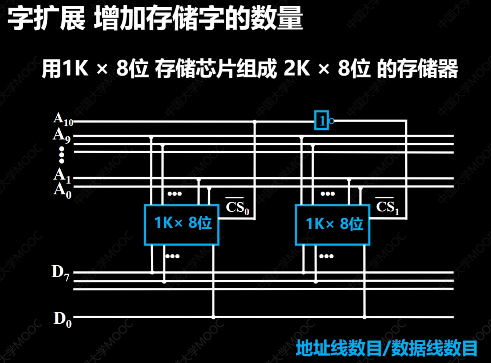
**实现方法（字扩展）：**

要实现这个目标，需要将多个存储芯片的数据线并联起来（因为字长不变），而**使用额外的地址线来选择激活哪个芯片。**

图中具体展示了：

1.  **使用的芯片：** 两个相同的“1K $\times$ 8位”存储芯片。每个芯片有 1K (1024) 个存储单元，每个单元存 8 位。
2.  **地址线 (A0-A10):** 共有 11 根地址线 (A0到A10)。$2^{11} = 2048$，这对应了目标 2K 的总容量。
    * 地址线的**低位 (A0-A9)** 共有 10 根 ($2^{10} = 1024$)，**它们被并联连接到两个芯片上**。这些低位地址线用于选择**每个芯片内部**的 1K 个存储单元中的一个。
    * 地址线的**最高位 (A10)** 被用于**选择芯片**。图中显示 A10 控制着两个芯片的片选线 ($\overline{\text{CS}}_0$ 和 $\overline{\text{CS}}_1$)。通过一个简单的译码电路（图中用 A10 和一个经过反相的 A10 来控制两个 $\overline{\text{CS}}$），可以实现当 A10 = 0 时选中其中一个芯片（例如 $\overline{\text{CS}}_0$ 有效），而当 A10 = 1 时选中另一个芯片（例如 $\overline{\text{CS}}_1$ 有效）。**在任何时候，只有一个芯片会被选中**。
3.  **数据线 (D0-D7):** 共有 8 根数据线。**这些数据线被并联连接到两个芯片上**。由于在任何时候只有一个芯片被选中并工作，所以多个芯片可以共享同一组数据线，不会发生冲突（未被选中的芯片的数据线通常处于高阻态）。
4.  **控制线 ($\overline{\text{WE}}$ 等):** 虽然图中只明确标出了片选线，但通常写使能 ($\overline{\text{WE}}$) 等控制线也会被并联连接到所有芯片上，与片选信号配合使用。

**工作原理：**

* 当外部系统需要访问某个地址的数据时，会提供一个 11 位的地址 (A0-A10)。
* 地址线 A10 用于决定访问的是哪一个 1K 容量的芯片。
    * 如果 A10 = 0，则第一个芯片被选中 ($\overline{\text{CS}}_0$ 有效)，第二个芯片未被选中 ($\overline{\text{CS}}_1$ 无效)。此时，地址线的低 10 位 (A0-A9) 用于选择第一个芯片内部的某个地址（0到1023）。
    * 如果 A10 = 1，则第二个芯片被选中 ($\overline{\text{CS}}_1$ 有效)，第一个芯片未被选中 ($\overline{\text{CS}}_0$ 无效)。此时，地址线的低 10 位 (A0-A9) 用于选择第二个芯片内部的某个地址（1024到2047）。
* 被选中的芯片然后根据读/写控制信号，通过共享的 8 位数据线进行数据的读出或写入操作。

**结果：**

通过这种字扩展的方式，利用两个 1K $\times$ 8位的芯片，成功构建了一个拥有 2K (2048) 个存储单元，每个单元仍然存储 8 位数据的存储器系统。总的存储字数量增加了，而每个字的字长保持不变。

**总结：** 字扩展是通过并联数据线和低位地址线，并使用额外的高位地址线配合片选信号来选择不同芯片的方式，利用多个容量较小的存储芯片来构建一个具有相同字长但更大总容量的存储器系统。
#### 字/位扩展
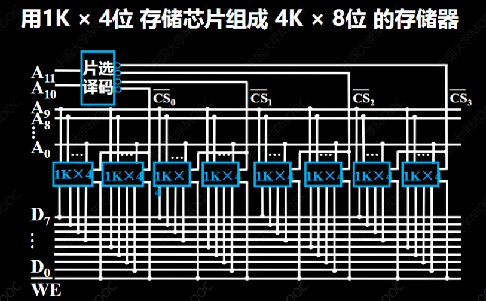
**实现方法：**

要达到 4K 的总容量，我们需要 $4\text{K} / 1\text{K} = 4$ 倍的地址空间。要达到 8 位的字长，我们需要 8位 / 4位 = 2 倍的数据宽度。因此，我们需要 $4 \times 2 = 8$ 个 1K $\times$ 4位的芯片来构建这个 4K $\times$ 8位的存储器。

图中将这 8 个芯片排列成一个 $4 \times 2$ 的矩阵（4行2列）。

1.  **使用的芯片：** 8 个“1K $\times$ 4位”存储芯片。
2.  **地址线 (A0-A11):** 共有 12 根地址线。$2^{12} = 4096 = 4\text{K}$，对应目标总容量。
    * 地址线的**低 10 位 (A0-A9)**：这 10 根地址线 ($2^{10} = 1024$) **并联连接到所有 8 个芯片上**。它们用于选择**每个芯片内部**的 1K 个存储单元中的一个特定位置。
    * 地址线的**高 2 位 (A10-A11)**：这 2 根地址线 ($2^2 = 4$) 连接到一个“片选译码”电路。这 2 位地址用于选择**激活哪一行芯片**（总共 4 行）。
3.  **片选译码 (Chip Select Decoder):**
    * 接收高 2 位地址 A10 和 A11 作为输入。
    * 根据 A10 和 A11 的不同组合 ($00, 01, 10, 11$)，译码器会激活其 4 个输出中的唯一一个：$\overline{\text{CS}}_0, \overline{\text{CS}}_1, \overline{\text{CS}}_2, \overline{\text{CS}}_3$。
    * 这 4 个片选信号分别连接到 4 行芯片的片选引脚上。例如，当 A10A11=00 时，$\overline{\text{CS}}_0$ 有效，选中第一行的两个芯片；当 A10A11=01 时，$\overline{\text{CS}}_1$ 有效，选中第二行的两个芯片，以此类推。
4.  **数据线 (D0-D7):** 共有 8 根数据线。
    * **垂直方向（列）上的芯片进行位扩展：** 左边一列的 4 个芯片（连接到 $\overline{\text{CS}}_0$ 到 $\overline{\text{CS}}_3$ 的左侧芯片）将它们的数据线**并联**连接到数据线的低 4 位 (D0-D3)。右边一列的 4 个芯片（连接到 $\overline{\text{CS}}_0$ 到 $\overline{\text{CS}}_3$ 的右侧芯片）将它们的数据线**并联**连接到数据线的高 4 位 (D4-D7)。这样，每一行被选中的两个芯片就构成了 8 位的数据宽度。
5.  **控制线 ($\overline{\text{WE}}$):** 写使能线 ($\overline{\text{WE}}$) **并联连接到所有 8 个芯片上**。

**工作原理：**

当外部系统需要访问一个 4K $\times$ 8位存储器中的特定地址时：

1.  提供 12 位的地址 (A0-A11)。
2.  地址的高 2 位 (A10-A11) 由片选译码器进行译码，选中 4 行芯片中的唯一一行。
3.  地址的低 10 位 (A0-A9) 同时送到所有 8 个芯片，用于选择每个芯片内部的同一位置。
4.  只有被高 2 位地址选中的那一行的两个芯片会被激活 ($\overline{\text{CS}}$ 有效)。
5.  在被选中的那一行中，左边的芯片（连接到 D0-D3）处理该地址处的低 4 位数据，右边的芯片（连接到 D4-D7）处理该地址处的高 4 位数据。
6.  根据读/写控制信号 ($\overline{\text{WE}}$)，进行数据的读出（两个芯片同时将 4 位数据放到各自的数据线上，组成 8 位）或写入（数据线上的 8 位数据被分割成两部分，写入两个被选中的芯片）。

### 存储器与CPU的连接
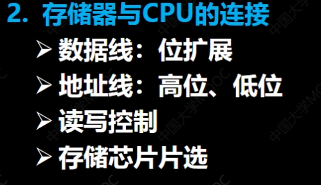
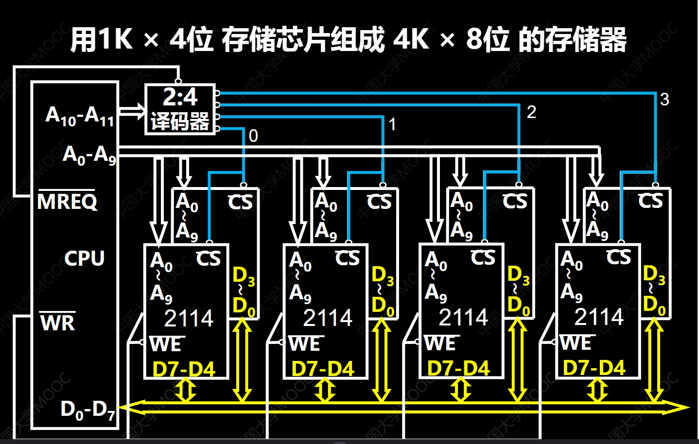
图示的目标与上一张类似：“用 1K $\times$ 4位 存储芯片组成 4K $\times$ 8位 的存储器”。这意味着要用容量为 1K (1024)，字长为 4 比特的芯片来构建一个总容量为 4K (4096)，字长为 8 比特的存储器。

为了达到这个目标，总共需要 $(4\text{K} \times 8\text{位}) / (1\text{K} \times 4\text{位}) = (4096 \times 8) / (1024 \times 4) = 32768 / 4096 = 8$ 个 1K $\times$ 4位的芯片。

图中的核心思想是将这 8 个芯片组织成一个 $4 \times 2$ 的矩阵（4 行 2 列），其中：

* **4 行** 实现字扩展（增加存储单元数量）。
* **2 列** 实现位扩展（增加字长）。

虽然图中只明确画出了 4 个芯片连接到数据线 D0-D3 的部分，但根据目标是组成 4K $\times$ 8位的存储器，可以推断在右侧还有另外 4 个完全相同的芯片，它们也排成 4 行，并连接到数据线 D4-D7。图示很可能只是展示了用于处理低 4 位数据（D0-D3）的那一列芯片及其控制连接。

下面解释图中各部分的连接和作用：

1.  **CPU 部分：**
    * 显示了从 CPU 发出的信号线：地址线 (A0-A11)，内存请求信号 ($\overline{\text{MREQ}}$)，读写控制信号 ($\overline{\text{WR}}$)。
    * 也显示了 CPU 与内存之间的数据线 (D0-D7)。
2.  **地址线 (A0-A11):** 共有 12 根地址线，对应 4K 的地址空间 ($2^{12} = 4096$)。
    * **A0-A9 (低 10 位):** 这 10 根地址线并联连接到图示的**所有 4 个芯片**的 A0-A9 地址输入端。它们用于选择**每个芯片内部**的 1K 个存储单元中的一个特定位置。
    * **A10-A11 (高 2 位):** 这 2 根地址线连接到 **2:4 译码器** 的输入端。
3.  **2:4 译码器：**
    * 接收 A10 和 A11 这 2 位地址作为输入。
    * 还接收 CPU 的 $\overline{\text{MREQ}}$ 信号（通常作为一个使能端）。只有当 $\overline{\text{MREQ}}$ 有效时，译码器才工作。
    * 根据 A10 和 A11 的组合，译码器会激活其 4 个输出线中的唯一一根（标号 0, 1, 2, 3）。
    * 这 4 个输出线分别连接到图示的 4 个芯片的**片选 ($\overline{\text{CS}}$)** 输入端（芯片从上到下分别连接到译码器输出 0, 1, 2, 3）。**这实现了字扩展中的芯片/行选择**。例如，当 A10A11 = 00 且 $\overline{\text{MREQ}}$ 有效时，译码器输出 0 有效，选中第一个芯片（假定为第一行）。
4.  **存储芯片 (1K $\times$ 4位 2114):** 图中显示了 4 个这样的芯片。
    * 每个芯片接收 A0-A9 作为内部地址输入。
    * 每个芯片接收来自 2:4 译码器的独立片选信号 $\overline{\text{CS}}$。
    * 每个芯片接收来自 CPU 的写使能信号 $\overline{\text{WR}}$（通过一个可能的逻辑门或直接连接到芯片的 $\overline{\text{WE}}$ 输入端）。
    * 每个芯片有 4 根数据引脚 (D0-D3 或 D4-D7)。
5.  **数据线 (D0-D7):**
    * 图中明确显示这 4 个芯片的数据引脚连接到**系统数据总线的 D0-D3 部分**。
    * 根据构建 4K $\times$ 8位存储器的目标，可以推断还有另外 4 个相同的芯片，它们也通过 2:4 译码器接收相同的片选信号（与左边同行的芯片一起被选中），接收相同的 A0-A9 地址和控制信号，但它们的数据引脚连接到**系统数据总线的 D4-D7 部分**。这实现了位扩展中的数据线分组。
6.  **控制线 ($\overline{\text{WE}}$):** 图中显示连接到芯片的 $\overline{\text{WE}}$ 引脚，这通常由 CPU 的写控制信号 ($\overline{\text{WR}}$) 生成。

**工作原理概括：**

1.  CPU 发出内存访问请求 ($\overline{\text{MREQ}}$ 有效) 和 12 位地址 (A0-A11)。
2.  A10-A11 地址进入 2:4 译码器，结合 $\overline{\text{MREQ}}$，译码器激活其中一条输出线，从而选中 4 行芯片中的唯一一行（包含左侧处理 D0-D3 的芯片和右侧处理 D4-D7 的芯片）。
3.  A0-A9 地址同时送入所有 8 个芯片，但只有被选中的那一行的两个芯片会根据 A0-A9 访问其内部的特定存储单元。
4.  如果是读操作，被选中的那一行中，左侧芯片将其内部数据放到 D0-D3 数据线上，右侧芯片将其内部数据放到 D4-D7 数据线上，共同构成一个 8 位字送给 CPU。
5.  如果是写操作，CPU 将 8 位数据放到 D0-D7 数据线上，被选中的那一行中，左侧芯片接收 D0-D3 的数据写入其内部，右侧芯片接收 D4-D7 的数据写入其内部。

这张图比上一张更完整地展示了译码器在字扩展中的作用，以及芯片与 CPU 总线的连接方式，特别是数据总线如何在位扩展中被分割和利用。图示通过一个 4x2 的芯片矩阵，成功地用 1K $\times$ 4位的芯片构建了 4K $\times$ 8位的存储器。
### 高速缓冲存储器
#### Cache的工作原理
##### 问题的提出以及理论基础
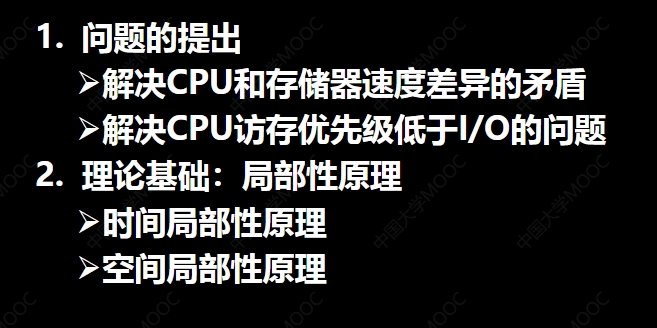
1.  **问题的提出 (Problem Statement):** 这一部分指出了设计和使用缓存所要解决的核心问题。
    * **解决CPU和存储器速度差异的矛盾：** 这是缓存出现的最主要原因。现代 CPU 的处理速度远高于主存储器（通常是 DRAM）的访问速度。当 CPU 需要从内存中读取数据或指令时，如果直接访问主存，就会因为等待主存响应而花费大量时间，导致 CPU 的计算能力无法充分发挥，形成“瓶颈”。缓存作为一种高速存储器，位于 CPU 和主存之间，可以存放 CPU 经常需要的数据和指令，以更快的速度提供给 CPU，从而缓解这种速度差异。
    * **解决CPU访存优先级低于I/O的问题：** 这一点可能与特定的系统架构或历史背景有关，但在现代计算机系统中，虽然 I/O 操作有时确实会与 CPU 争夺内存带宽，导致 CPU 访存延迟，但这通常不是缓存设计的首要驱动力。缓存主要是为了弥补 CPU 与主存之间的速度鸿沟。如果按照图示解释，可以理解为在某些情况下，为了保证 I/O 设备的数据传输效率，系统可能会赋予 I/O 访存更高的优先级，从而使得正常的 CPU 访存请求被延迟。缓存通过减少 CPU 对主存的访问次数，可以在一定程度上减轻这种冲突的影响。

2.  **理论基础：局部性原理 (Theoretical Basis: Locality Principle):** 这一部分解释了为什么缓存能够有效地工作。人类的行为和程序的执行往往表现出局部性特征。
    * **时间局部性原理 (Principle of Temporal Locality):** 指的是如果一个数据或指令被访问过，那么在**未来的短时间内**它很可能**再次被访问**。例如，程序中的循环、子程序调用等都会导致对同一段代码或数据的重复访问。
    * **空间局部性原理 (Principle of Spatial Locality):** 指的是如果一个数据或指令被访问过，那么与它在内存地址上**相邻近**的数据或指令也**很可能在未来的短时间内被访问**。例如，程序通常是顺序执行指令的，数组或数据结构中的元素也往往是连续存放的，访问其中一个元素后很可能会访问其附近的元素。

**缓存的工作原理就是基于这两个局部性原理：**

当 CPU 需要访问某个数据或指令时，首先会去速度更快、容量较小的缓存中查找。
* 如果找到（称为“缓存命中”），CPU 直接从缓存中获取数据，速度非常快。
* 如果没找到（称为“缓存未命中”），则需要从速度较慢的主存中读取。此时，系统不仅仅会将 CPU 需要的那个数据读取到缓存，还会根据空间局部性原理，**将该数据附近的一块（一个“缓存行”或“块”)数据也一起读取到缓存中**。这样，下次 CPU 再次需要访问这些数据（无论是原数据还是附近的数据），就很可能直接在缓存中找到，从而避免了频繁访问主存的低效率。

##### 主存与Cache的编址
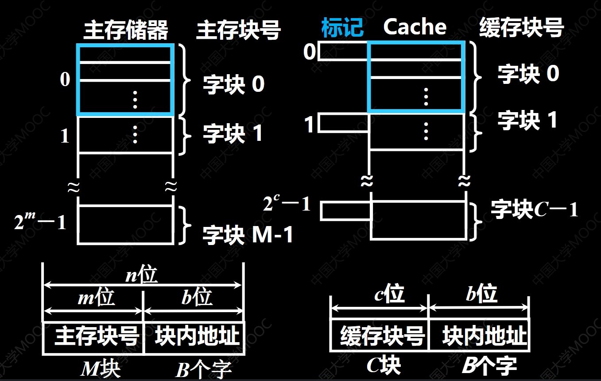
**核心思想：** 主存储器被划分成固定大小的块（Block），缓存也是由同样大小的块（称为缓存行或Cache Line）组成。当数据从主存调入缓存时，是以块为单位进行的。主存地址被分解成几个部分，用于定位数据在主存和缓存中的位置。

**图的左侧：主存储器 (Main Memory)**

* 主存储器被概念上划分成许多大小相同的**主存块 (Main Memory Block)**。图示从块 0 到块 M-1，表示主存共有 M 个块。
* 每个主存块内部包含多个字（或字节），图示称为**字块**。每个块包含 B 个字/字节。
* **主存地址结构：** 一个完整的 n 位主存地址被分成两部分：
    * **主存块号 (Main Memory Block Number):** 占 m 位。这 m 位用于唯一标识主存中的 M 个块中的某一个。主存块的数量 M 与 m 的关系是 $M = 2^m$。
    * **块内地址 (Address within the Block) / 字块地址:** 占 b 位。这 b 位用于标识块内的 B 个字/字节中的某一个。块的大小 B 与 b 的关系是 $B = 2^b$。
* 主存的总地址空间大小为 $2^n$，总容量为 $M \times B = 2^m \times 2^b = 2^{m+b}$ 个字/字节，因此 $n = m + b$。

**图的右侧：高速缓存 (Cache)**

* 高速缓存由 C 个**缓存块 (Cache Block) 或缓存行 (Cache Line)** 组成，图示从块 0 到块 C-1。缓存块的大小与主存块的大小相同，都是 B 个字/字节。
* 每个缓存块除了存储从主存调入的数据块外，还有一个额外的区域用于存储**标记 (Tag)**。标记用于记录当前缓存块中存储的是哪个主存块的数据。
* **缓存访问地址结构：** 当 CPU 发出一个主存地址时，为了在缓存中查找对应的数据，这个主存地址（或其一部分）被用于缓存的访问。根据不同的缓存组织方式（如直接映射、组相联、全相联），主存地址会被分解成不同的字段来访问缓存。图中所示的分解方式（缓存块号 + 块内地址 + 标记）适用于直接映射或组相联缓存的查找过程。
    * **缓存块号 (Cache Block Number) / 索引 (Index):** 占 c 位。这 c 位用于确定主存块可能存储在缓存中的哪个位置（哪个缓存块或哪个组）。缓存块的数量 C 与 c 的关系是 $C = 2^c$。
    * **块内地址 (Address within the Block) / 字块地址:** 占 b 位。这 b 位用于标识块内的 B 个字/字节中的某一个。它与主存地址中的块内地址部分相同，用于在找到正确的缓存块后，从中取出所需的字/字节。
    * **标记 (Tag):** 图中虽然没有给出标记字段的位数，但它通常包含主存块号中**不**用于确定缓存块号（或组号）的那部分信息。标记的作用是用来**验证**找到的缓存块中存储的数据是否是 CPU 所请求的那个主存块的数据。在缓存命中时，需要将主存地址中的标记与缓存行中存储的标记进行比较，如果匹配，并且缓存行是有效的，才表明数据在缓存中。

**主存与缓存地址的对应关系：**

* 主存块的大小等于缓存块的大小 (都是 B 个字/字节)。因此，主存地址和缓存访问地址的**块内地址**部分的位数是相同的 (都是 b 位)。
* 主存的块数 M 通常远大于缓存的块数 C ($M > C$)。
* 主存中的多个不同的主存块可能会映射到缓存中的同一个位置（同一个缓存块或同一个组）。这就需要**标记**来区分不同的主存块。

总的来说，这张图通过地址的分解，形象地展示了主存和缓存的结构以及它们之间的数据块对应关系。主存地址被用于确定数据在主存中的位置（块号+块内地址），而部分主存地址则被用于在缓存中查找数据（缓存块号/索引+块内地址），并通过标记来确认是否找到了正确的数据。
##### Cache的命中与未命中
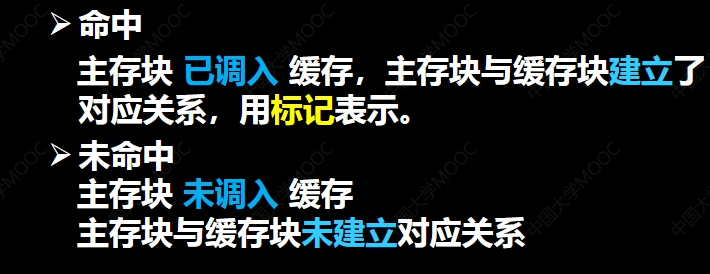

##### Cache块替换算法
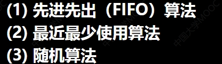

##### Cache工作过程
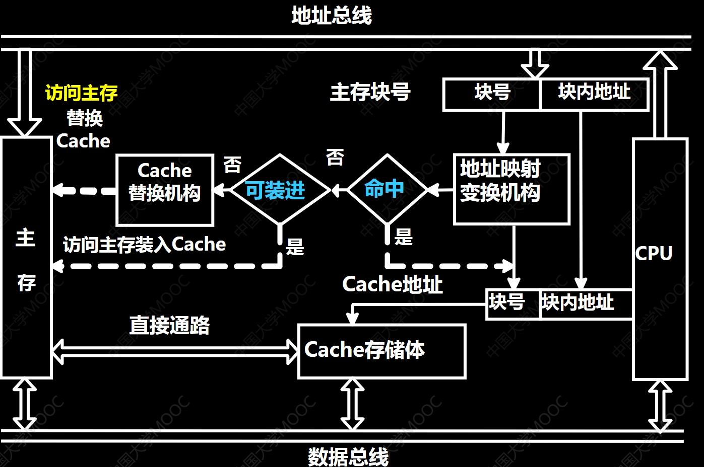
1.  **CPU 发出访问请求并提供地址：** 过程开始于 CPU 需要读取或写入某个内存地址的数据或指令。CPU 将这个地址放到**地址总线**上。
2.  **地址映射与命中判断：** 地址总线上的地址被送到 **地址映射变换机构**。这个机构根据缓存的组织方式（如直接映射、组相联、全相联），将主存地址分解（分解为主存块号和块内地址），并确定该主存块可能存储在缓存中的哪个位置（缓存地址或组号），同时进行**命中判断**。
    * 命中判断会查找缓存存储体中对应位置（根据缓存地址）的标记（Tag），并将其与主存地址中的标记部分进行比较。如果标记匹配，并且该缓存块是有效的，则判断为**命中 (Hit)**。
    * 如果标记不匹配，或者该缓存块无效，则判断为**不命中 (Miss)**。

3.  **Cache 命中 (Hit)：**
    * 如果命中判断结果为“是”（命中），则说明 CPU 需要的数据已经在 Cache 中。
    * 此时，使用由地址映射变换机构产生的 **Cache 地址**，直接从 **Cache 存储体**中读取数据。
    * 被读取的数据通过**数据总线**传送回 CPU。这是一个非常快速的过程，因为 Cache 的速度远高于主存。

4.  **Cache 不命中 (Miss)：**
    * 如果命中判断结果为“否”（不命中），则说明 CPU 需要的数据不在 Cache 中，必须从主存储器中获取。
    * 系统会发起一次**访问主存 (Access Main Memory)** 的操作。根据主存地址（包含主存块号和块内地址），在**主存储器**中找到包含所需数据的一整个**主存块**。
    * 从主存读取的这个数据块需要被**装入 Cache (Load into Cache)**，以备将来再次访问。在装入之前，Cache 的**替换机构**会检查目标位置是否**可装进 (Available to load)**。
    * 如果目标位置已经被其他数据占用（并且这些数据可能已被修改，需要写回主存），**替换机构**会根据预设的替换算法（如 LRU - 最近最少使用，FIFO - 先进先出等），选择一个现有的 Cache 块进行**替换 (Replace)**。被替换的 Cache 块（如果有效且已修改）可能会被写回主存。
    * 确定好 Cache 中的位置后，从主存读取的整个数据块被写入 **Cache 存储体**中对应的位置，同时更新该 Cache 块的标记和有效位。
    * 在数据块从主存装入 Cache 的同时，CPU 最先请求的那个数据字（位于块内的特定地址）通常会通过一个**直接通路 (Direct Path)** 直接送达 CPU。这样 CPU 就不必等到整个块全部装入 Cache 后再获取数据，减少了不命中时的延迟（称为不命中惩罚 Miss Penalty）。
    * 数据通过**数据总线**传送给 CPU。

**总结：**

Cache 的工作过程就是一个**查-读-写**的过程。CPU 发出地址，Cache 先尝试快速查找。命中则直接从 Cache 读取；不命中则访问慢速的主存，将包含所需数据的整个数据块调入 Cache，并同时将所需数据送给 CPU。调入新块时，如果 Cache 已满，还需要根据替换算法决定替换哪个旧块。整个过程旨在利用访问局部性原理，通过将常用数据保留在高速的 Cache 中，提高平均访存速度。
##### Cache的一致性问题
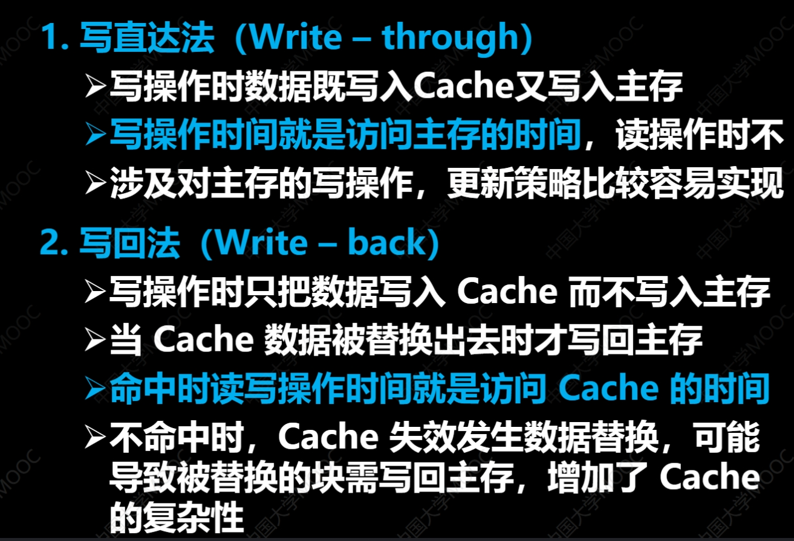

##### Cache的命中率
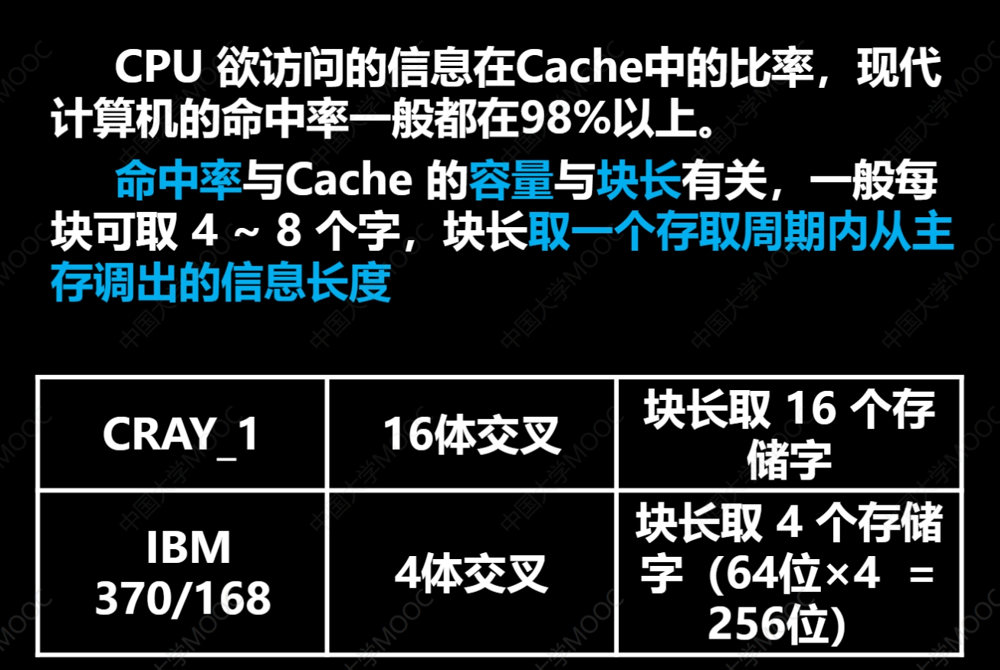
##### Cache的效率
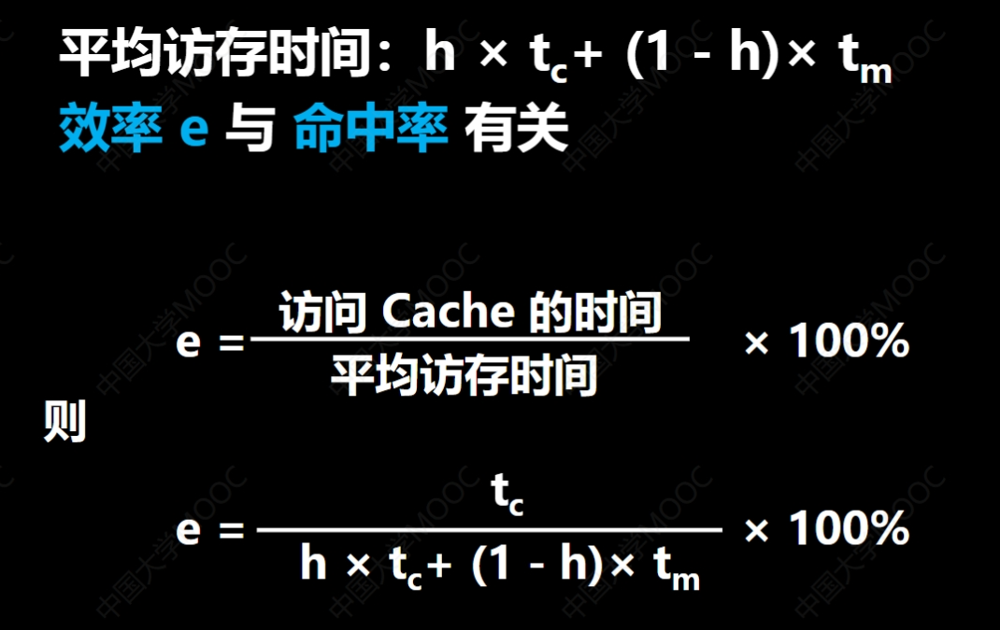

##### Cache的改进
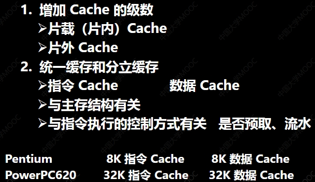
1.  **增加 Cache 的级数 (Increase the Number of Cache Levels):**
    * 这是目前高性能处理器普遍采用的方法。它不是只使用一层 Cache，而是使用多层 Cache，形成一个 Cache 层次结构。靠近 CPU 的 Cache 速度更快但容量较小，离 CPU 越远层级越低的 Cache 容量越大但速度越慢。
    * **片载 (片内) Cache (On-chip Cache):** 指的是集成在 CPU 芯片内部的 Cache。这通常是速度最快、容量最小的 Cache，比如 L1 Cache（一级缓存）。有些 CPU 甚至还有 L2 Cache 也集成在片内。访问片载 Cache 的速度非常接近 CPU 的处理速度。
    * **片外 Cache (Off-chip Cache):** 指的是位于 CPU 芯片外部的 Cache，可能在 CPU 封装内（但不在 CPU 核上）或在主板上（较老的架构）。它的速度介于片内 Cache 和主存之间。例如，早期的 L2 Cache 或 L3 Cache 可能是片外的，但现代 CPU 为了提高性能，通常将 L2 和 L3 Cache 也集成到片内。
    * **多级 Cache 的好处：** 利用 Cache 的层次结构，可以同时拥有小容量高速 Cache 的优势（极低的访问延迟）和大容量 Cache 的优势（更高的命中率）。当 CPU 需要数据时，首先访问 L1 Cache，如果命中则立即获取；如果不命中，再访问 L2 Cache，以此类推，直到主存。这样可以有效降低平均访存时间。

2.  **统一缓存和分立缓存 (Unified Cache and Split Cache):**
    * 这指的是 Cache 是统一存放指令和数据，还是将它们分开存放。
    * **统一缓存 (Unified Cache):** 指令 Cache 和数据 Cache 合并在一起，共用一个 Cache 存储区域。这种结构的优点是设计相对简单，并且可以根据实际需要动态地分配指令和数据所需的 Cache 空间。如果某个程序段的数据访问频繁，统一 Cache 可以为数据分配更多空间，反之亦然。
    * **分立缓存 (Split Cache):** 指令 Cache (Instruction Cache) 和数据 Cache (Data Cache) 是完全分开的两个独立的 Cache 模块。一个专门存放 CPU 执行的指令，另一个专门存放指令操作所需的数据。
    * **分立缓存的考虑因素：**
        * **与主存结构有关：** 虽然不是直接决定因素，但有时主存的组织方式或总线接口设计可能会影响 Cache 的设计选择。
        * **与指令执行的控制方式有关：** 这是分立缓存的主要优势所在。在采用流水线 (Pipelining) 或超标量 (Superscalar) 等高级指令执行技术的 CPU 中，CPU 常常需要同时获取指令和数据。如果使用统一 Cache，在同一个周期内既要取指令又要取数据时可能会发生冲突。而使用分立 Cache，指令 Cache 可以同时向 CPU 提供指令，数据 Cache 可以同时向 CPU 提供数据，互不干扰，从而提高了流水线的效率和并行度。
        * **是否预取、流水：** 分立 Cache 非常有利于**指令预取 (Instruction Prefetching) 和流水线技术**。指令 Cache 可以提前预取下一条指令，数据 Cache 可以独立处理当前指令的数据访问，两者并行工作，提高了 CPU 的吞吐率。

    * **示例：** 图中列举了两种处理器的 Cache 配置：
        * **Pentium:** 使用 8K 指令 Cache 和 8K 数据 Cache。这表明 Pentium 采用了分立的 L1 Cache 来提高指令和数据的并行访问能力。
        * **PowerPC620:** 使用 32K 指令 Cache 和 32K 数据 Cache。これも分立 Cache の例で、Pentium より容量が大きいことを示しています。

**总结：**

增加 Cache 的级数是利用存储器访问的时间和容量层次关系，用多层 Cache 来逼近 CPU 的速度同时保持较大容量。分立缓存则是为了适应流水线和并行处理的需求，通过将指令和数据分开存放来提高同时获取指令和数据的能力。这两种改进方法通常会结合使用，例如现代 CPU 普遍采用多级（L1, L2, L3 等）且 L1 Cache 通常是指令和数据分立的 Cache 结构。

### Cache的映射方式

#### Cache的地址映像

##### 直接映像
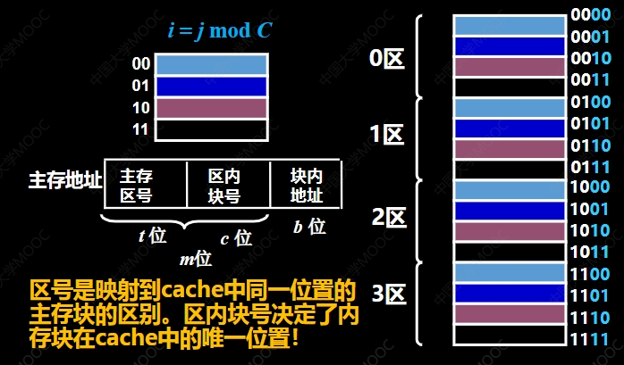
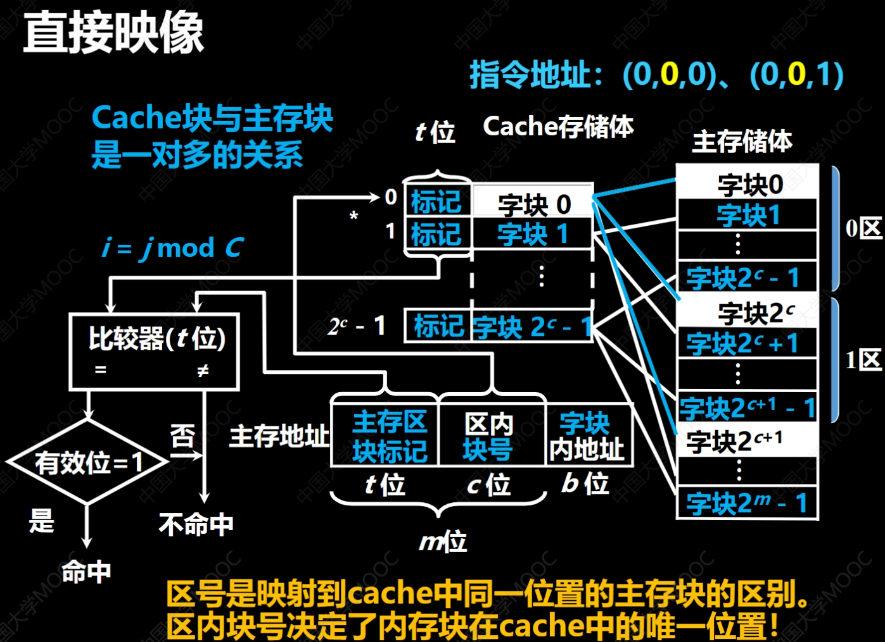

##### 全相联映像
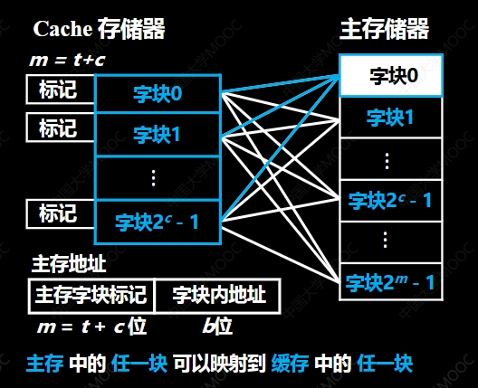

##### 组相联映像
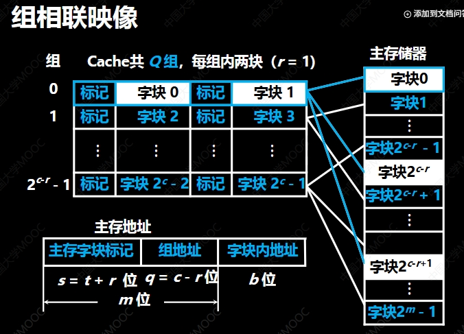
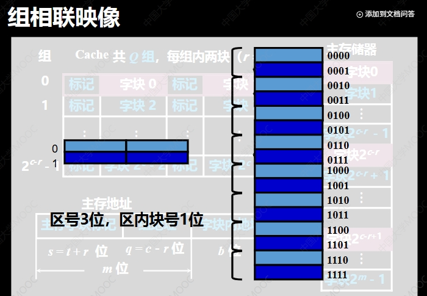
**1. 主存储器 (Main Memory):**
* 在图的右边，表示计算机的主存储器。
* 它被划分成许多大小相等的**字块 (Blocks)**，从字块0一直到字块$2^m - 1$。这说明主存总共有 $2^m$ 个字块。

**2. Cache:**
* 在图的左边，表示高速缓存。
* 它的结构是“Cache共 $Q$ 组, 每组内两块 ($r=1$)”。这意味着Cache被分成了 $Q$ 个**组 (Sets)**。
* 每一组里面有两行（或称为槽位），因为 $r=1$ 表示每组有 $2^r = 2$ 块。图例中显示了从组0到组$2^{c-r}-1$。
* 每一行Cache都可以存储一个主存的字块。
* 在每一行Cache旁边有一个**标记 (Tag)**。这个标记用来记录当前这行Cache存储的是主存中哪个字块的数据。

**3. 组相联映象 (Set-Associative Mapping):**
* 这是Cache与主存之间的一种映象方式。在组相联映象中，主存中的一个字块可以被映射到Cache的特定**组**中的**任意**一个空闲行里。图中的连线也表明了主存的多个字块可以映象到Cache的同一个组。

**4. 主存地址 (Main Memory Address):**
* 图的下方展示了主存地址的构成方式，它被分成了三个部分，以便于Cache的查找：
    * **字块内地址 (Block Offset):** 占 $b$ 位。这部分地址用来指明在一个字块内部具体要访问哪个字节或字。一个字块的大小是 $2^b$ 个字节/字。
    * **组地址 (Set Index):** 占 $q = c-r$ 位。这部分地址用来确定主存中的字块应该被映象到Cache的哪一个组。Cache共有 $Q = 2^{c-r}$ 个组。
    * **主存字块标记 (Main Memory Block Tag):** 占 $s = t+r$ 位。这部分地址用于在找到对应的组后，进一步确认该组中的Cache行是否存储了我们要找的主存字块。根据图中的连接，这个标记会与Cache行中的**标记**字段进行比较。通常来说，Cache中存储的标记是主存字块地址的高位部分，足以在特定组内唯一标识一个字块。

**工作流程简述：**

当CPU需要访问一个主存地址时：

1.  它将主存地址分解成 字块内地址、组地址 和 主存字块标记。
2.  使用**组地址**来确定要去Cache中的哪一个**组**查找数据。
3.  在确定的组内，Cache会同时检查该组内的所有Cache行（在这个图中是两行）。
4.  将主存地址中的**主存字块标记**与该组内每一行Cache的**标记**字段进行比较。
5.  如果找到了匹配的标记，并且该Cache行有效（图中未 explicitly 画出有效位，但通常存在），则表示Cache命中。此时，使用**字块内地址**在该Cache行存储的字块中找到所需的数据。
6.  如果该组内的所有Cache行都没有匹配的标记，则表示Cache不命中。此时，需要从主存中将对应的字块读取到Cache的该组中（如果组已满，则需要根据替换策略淘汰其中一个旧的字块）。

总的来说，这张图清晰地展示了组相联Cache如何利用主存地址的各个部分（标记、组地址、块内地址）来实现数据的查找和管理。其中 $r=1$ 说明这是一个2路组相联Cache（每组2个块）。

**组最少时的组相联映象就是全相联映象**
**如果组相联 Cache 的每组内块数 (number of blocks per set) 为 1（也就是 1 路组相联，1-way set-associative），那么它就变成了直接映象 (Direct Mapped) Cache**
#### 三种映像方式比较
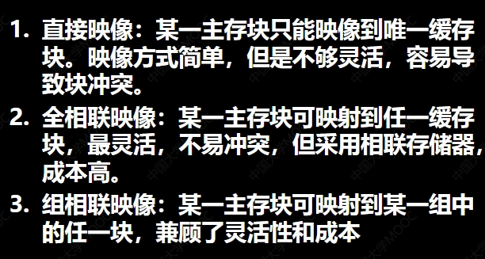


#### 硬件与软件的关系
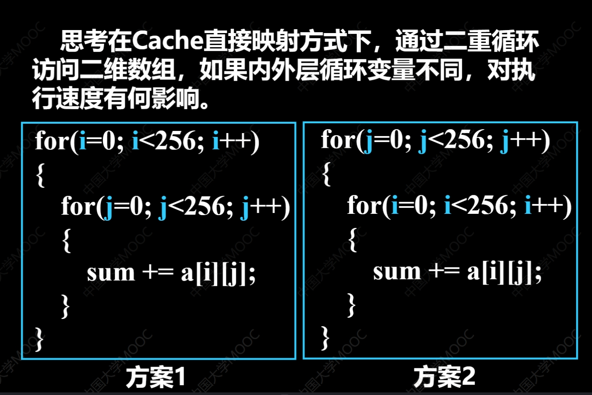
1.  **二维数组在内存中的存储方式：**
    在 C/C++ 等大多数编程语言中，二维数组是按**行主序 (Row-major order)** 存储的。这意味着数组 `a[ROWS][COLS]` 的元素在内存中是这样连续存放的：先存放 `a[0][0], a[0][1], ..., a[0][COLS-1]`，接着是 `a[1][0], a[1][1], ..., a[1][COLS-1]`，依此类推，直到 `a[ROWS-1][0], ..., a[ROWS-1][COLS-1]`。

2.  **Cache 直接映象方式：**
    在直接映象 Cache 中，主存中的每一个块只能映射到 Cache 中的**唯一一个**特定的位置（行）。如果多个主存块映射到同一个 Cache 行，它们会互相冲突，后载入的块会覆盖先载入的块。这种映射方式的计算通常是 `Cache行号 = 主存块地址 % Cache总行数`。

3.  **分析 方案1:**
    ```c++
    for(i=0; i<256; i++) {
        for(j=0; j<256; j++) {
            sum += a[i][j];
        }
    }
    ```
    外层循环是 `i`，内层循环是 `j`。在内层循环中，`i` 固定，`j` 变化。这意味着它会按顺序访问 `a[i][0]`, `a[i][1]`, `a[i][2]`, ... 一直到 `a[i][255]`。
    由于二维数组是按行主序存储的，`a[i][0]`, `a[i][1]`, `a[i][2]`, ... 这些元素在内存中是**连续存放**的。当第一次访问 `a[i][0]` 导致 Cache 不命中时，整个包含 `a[i][0]` 的主存块会被调入 Cache。由于空间局部性，紧接着访问的 `a[i][1]`, `a[i][2]` 等很有可能就位于刚刚调入的那个 Cache 块中，从而产生 Cache 命中。这可以高效地利用 Cache 块。

4.  **分析 方案2:**
    ```c++
    for(j=0; j<256; j++) {
        for(i=0; i<256; i++) {
            sum += a[i][j];
        }
    }
    ```
    外层循环是 `j`，内层循环是 `i`。在内层循环中，`j` 固定，`i` 变化。这意味着它会按顺序访问 `a[0][j]`, `a[1][j]`, `a[2][j]`, ... 一直到 `a[255][j]`。
    由于二维数组是按行主序存储的，`a[0][j]`, `a[1][j]`, `a[2][j]`, ... 这些元素在内存中是**不连续存放**的。`a[0][j]` 和 `a[1][j]` 之间隔着 `a[0][j+1]` 到 `a[1][j-1]` 的所有元素（整整一行减去1个元素）。每次访问 `a[i][j]` 时，如果 `a[i][j]` 不在 Cache 中，就需要从主存调入包含它的块。由于下一个要访问的元素 `a[i+1][j]` 在内存中距离较远，很可能不在同一个 Cache 块中，甚至可能映射到与之前访问过的元素**相同**的 Cache 行（在直接映象下容易发生冲突），导致频繁的 Cache 不命中（Cache Miss）和 Cache 行冲突。

**结论：**

在 Cache 直接映象方式下，以及二维数组按行主序存储的情况下，**方案1** 的执行速度会比 **方案2** 快得多。

这是因为方案1按照内存中数据的存放顺序（行主序）进行访问，能够很好地利用**空间局部性**，产生较高的 Cache 命中率。而方案2按照列进行访问，跳跃式地访问内存，导致难以利用空间局部性，容易产生大量的 Cache 不命中和 Cache 冲突，从而频繁地访问速度慢得多的主存，降低执行速度。

这个问题强调了程序的数据访问模式（软件）对硬件（Cache）性能的巨大影响。编写程序时考虑数据的内存布局和访问模式对于提高程序性能非常重要。

#### 如何选择cache块长
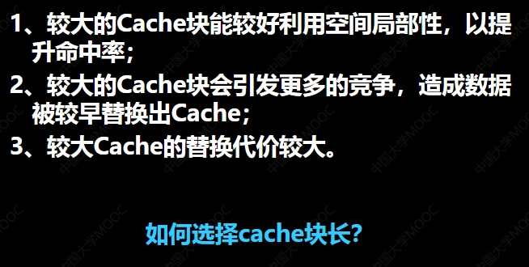
1.  **“较大的Cache块能较好利用空间局部性，以提升命中率；”**
    * **空间局部性 (Spatial Locality)** 是指如果程序访问了某个存储单元，那么在接下来的一段时间里，很可能会访问其附近的存储单元。
    * 当 Cache 发生不命中（Cache Miss）时，主存中的一个**块**会被调入 Cache。如果 Cache 块比较大，那么一次不命中就会把主存中更多的数据（包括当前访问地址附近的数据）带入 Cache。
    * 如果程序具有良好的空间局部性，那么接下来要访问的数据很可能就在刚刚调入的这个大块中，从而产生 Cache 命中（Cache Hit），避免了再次访问主存，提高了命中率。

2.  **“较大的Cache块会引发更多的竞争，造成数据被较早替换出Cache；”**
    * 虽然大块有利于利用空间局部性，但如果 Cache 的总容量是固定的，那么块越大，Cache 能容纳的总块数就越少。
    * 块数减少意味着主存中的不同块映射到同一个 Cache 行（对于直接映象和组相联 Cache）或同一组（对于组相联 Cache）的可能性增加，这会导致**冲突 (Conflict)**。
    * 更多的冲突意味着 Cache 行更容易被不同的主存块“争夺”，一些数据块可能在下次被访问之前就被其他数据块替换出去，导致所谓的**冲突不命中 (Conflict Miss)** 增加。
    * 简单来说，虽然每个块带入的数据更多，但由于 Cache 能存放的总块数少了，反而可能降低了 Cache 的有效利用率，使得数据被“挤出”Cache 的速度加快。

3.  **“较大Cache的替换代价较大。”**
    * 当 Cache 发生不命中需要从主存调入新的块，而 Cache 中又没有空闲行时，就需要替换掉 Cache 中的某个旧块。
    * 如果被替换的旧块在 Cache 中被修改过（称为**脏块 Dirty Block**），那么在替换之前需要将这个旧块写回主存以保证数据的一致性。
    * Cache 块越大，需要写回或从主存读入的数据量就越大。这意味着一次 Cache 不命中带来的**惩罚 (Penalty)** 就越大，因为它需要更多的时间和总线带宽来传输整个块的数据。

**如何选择 Cache 块长？**

从上面的分析可以看出，选择 Cache 块长是一个权衡的问题：

* 较大的块有利于利用空间局部性，提高命中率（点1）。
* 较大的块可能导致更多冲突，减少Cache能容纳的总块数，有时反而降低了实际的命中率（点2）。
* 较大的块使得不命中的代价更高（点3）。

因此，Cache 块长并不是越大越好，也不是越小越好。理想的块长取决于多种因素，包括：

* **程序的访存局部性特征：** 程序访问内存的模式是偏向于空间局部性还是时间局部性？
* **Cache 的总容量：** 容量越大，块数越多，冲突相对越少。
* **Cache 的关联度（直接映象、组相联、全相联）：** 关联度越高，冲突越少，块长对冲突的影响相对小一些。
* **主存和 Cache 之间的总线带宽和访存延迟：** 这决定了不命中的代价。
* **工艺和成本等硬件约束。**

### 数据校验码
#### 码距
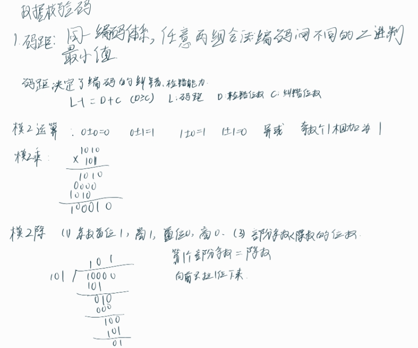
好的，我们来解释一下数据校验码和码距这两个概念。

**数据校验码 (Data Check Code)**：
**数据校验码是在原始数据（有效信息位）的基础上，根据一定的规则，附加一些**冗余位 (Redundant Bits)** 组成的一种编码。

**码距 (Code Distance) 或 汉明距离 (Hamming Distance)**

* **是什么：** 码距是衡量两个等长二进制码字之间差异的量度。
* **如何计算：** 两个等长码字之间的码距定义为将一个码字变换成另一个码字所需要的**最小位数改变的次数**。换句话说，就是两个码字中对应位置上不相同的二进制位的个数。
    * 例如，码字 A = 10110，码字 B = 11100。
    * 比较对应位：1和1（相同），0和1（不同），1和1（相同），1和0（不同），0和0（相同）。
    * 不同的位数是第2位和第4位，共2位。
    * 所以，码字 A 和码字 B 之间的码距是 2。
* **对数据校验码的重要性：** 码距是决定一个数据校验码**错误检测和纠正能力**的关键指标。在一个编码方案中，所有**合法码字**（也就是经过编码规则生成的所有可能的有效编码）中，**任意两个码字之间的最小码距 (Minimum Code Distance, 通常记作 $d_{min}$)** 决定了这个编码方案的能力。

**码距与错误检测/纠正能力的关系：**

* **错误检测能力：** 如果一个编码方案的最小码距是 $d_{min}$，那么它可以检测出**任意 $d$ 个或少于 $d$ 个**的错误，当且仅当 $d_{min} \ge d + 1$。例如，如果 $d_{min} = 2$，它可以检测出任意 1 个错误（如奇偶校验）。如果 $d_{min} = 3$，它可以检测出任意 1 个或 2 个错误。
* **错误纠正能力：** 如果一个编码方案的最小码距是 $d_{min}$，那么它可以纠正出**任意 $t$ 个或少于 $t$ 个**的错误，当且仅当 $d_{min} \ge 2t + 1$。例如，如果 $d_{min} = 3$，它可以纠正任意 1 个错误（如汉明码）。如果 $d_{min} = 5$，它可以纠正任意 1 个或 2 个错误。

**总结来说：**
数据校验码是为了在数据传输或存储中发现或修复错误而附加的冗余信息。码距是衡量编码方案中不同合法码字之间差异的指标，而编码方案的**最小码距**则直接决定了该校验码能够检测和纠正错误的数量。更大的最小码距意味着更强的错误检测和纠正能力，但也通常需要更多的冗余位。

----
**最小码距 ($d_{min}$) 与错误检测和纠正能力之间的关系**

我们可以想象一下，所有的**合法码字**就像空间中的一些点。任意两个点之间的“距离”就是它们之间的码距（汉明距离）。最小码距 $d_{min}$ 就是这些合法码字中，**离得最近的两个点**之间的距离。

理解了这一点，我们来看公式：

**1. 错误检测能力：$d_{min} \ge d + 1$ 可以检测出任意 $d$ 个或少于 $d$ 个错误。**

* 假设我们发送了一个合法的码字 $C$。
* 在传输过程中发生了错误，比如有 $d$ 个位翻转了，接收方收到了码字 $C'$。
* $C'$ 和原始的 $C$ 之间的码距就是错误的位数，最多是 $d$。
* 为了能够**检测**到错误，接收方收到的 $C'$ **必须不是**任何一个**合法的码字**（除非 $C'=C$，即没有错误）。
* 如果 $d_{min} \ge d+1$，这意味着**任意两个不同的合法码字**之间的距离都至少是 $d+1$。
* 现在假设实际发生的错误位数是 $k$ ($k \le d$). 接收到的码字 $C'$ 与原始码字 $C$ 的距离是 $k$ ($距离(C, C') = k$).
* 因为 $k \le d$ 且 $d_{min} \ge d+1$，所以 $k < d_{min}$。
* 这意味着，接收到的码字 $C'$ **不可能**是除了原始码字 $C$ 以外的**任何其他合法码字** $C_{other}$，因为所有其他合法码字 $C_{other}$ 离 $C$ 的距离都**至少是** $d_{min}$，而 $C'$ 离 $C$ 的距离只有 $k < d_{min}$。
* 所以，如果接收方收到的码字 $C'$ **不是一个合法的码字**（即在合法码字集合中找不到 $C'$），它就知道一定发生了错误。只要发生的错误位数不超过 $d$ (且 $d_{min} \ge d+1$)，接收到的错误码字 $C'$ 就不会“跳”到另一个合法码字的位置上，而会落在合法码字“点”的周围，但**不在任何合法码字点上**。

**简单来说：** 最小码距是合法码字之间的最小间隔。要检测 $d$ 个错误，你需要保证发生了 $d$ 个错误后的码字不会变成另一个合法的码字。这要求合法码字之间的间隔（最小码距）要比你想要检测的最大错误数多1，即 $d_{min} \ge d+1$。这样，任何经过 $d$ 个或少于 $d$ 个错误变换的码字，都会落到非法码字的位置上，从而被检测出来。

**例子：**
* $d_{min}=2$: 任意两个合法码字至少相差2位。发送 10，收到 11 (1位错)，11不是合法码字，检测到错误。发送 11，收到 00 (2位错)，00如果是另一个合法码字就检测不到了。但因为 $d_{min}=2$，任意两个合法码字至少差2位，所以1位错肯定不会变成另一个合法码字。它可以检测任意 1 个错误 ($2 \ge 1+1$)。
* $d_{min}=3$: 任意两个合法码字至少相差3位。发送 101，收到 111 (1位错)，111不是合法码字，检测到错误。发送 101，收到 011 (2位错)，011不是合法码字，检测到错误。发送 110，收到 001 (3位错)，001可能是另一个合法码字，就检测不到了。它可以检测任意 1 个或 2 个错误 ($3 \ge 2+1$)。

**2. 错误纠正能力：$d_{min} \ge 2t + 1$ 可以纠正任意 $t$ 个或少于 $t$ 个错误。**

* 假设我们发送了一个合法的码字 $C$。
* 发生了错误，有 $t$ 个位翻转了，接收方收到了码字 $C'$。
* $C'$ 和原始的 $C$ 之间的码距是 $k$ ($k \le t$).
* 为了能够**纠正**错误，接收方需要从收到的 $C'$ 确定**原始发送的码字**是哪个。最常用的方法是**最小距离判决**：认为原始码字是离接收到的 $C'$ **最近**的那个合法码字。
* 为了让这种判决方法有效且**唯一确定**原始码字，就需要保证：接收到的码字 $C'$ (与原始码字 $C$ 相距最多 $t$ )，一定比离任何**其他**合法码字 $C_{other}$ 都**更近**。
* 想象以每个合法码字为中心，画一个半径为 $t$ 的“球”。要能够纠正 $t$ 个错误，就必须保证以任何两个不同的合法码字为中心的、半径为 $t$ 的球是**完全不重叠**的。
* 两个球的中心（两个合法码字）之间的距离至少是 $d_{min}$。
* 如果这两个半径为 $t$ 的球不重叠，那么它们的中心之间的距离必须大于两个半径之和，即 $d_{min} > t + t = 2t$。
* 所以，需要 $d_{min} \ge 2t + 1$。
* 如果满足这个条件，任何一个与原始码字 $C$ 相距不超过 $t$ 的接收码字 $C'$，都将落在这个以 $C$ 为中心的、半径为 $t$ 的球内。而这个球与以任何其他合法码字 $C_{other}$ 为中心的、半径为 $t$ 的球都是不重叠的。
* 因此，接收方收到 $C'$ 后，发现它落在了以合法码字 $C$ 为中心的球内（或者说，发现 $C$ 是离 $C'$ 最近的合法码字），就能**唯一地判定**原始发送的码字就是 $C$，从而实现纠错。

**简单来说：** 最小码距是合法码字之间的最小间隔。要纠正 $t$ 个错误，你需要保证发生了 $t$ 个错误后的码字，离原始码字比离任何其他合法码字都近。这要求合法码字之间的间隔（最小码距）要比你想要纠正的最大错误数的两倍还多1，即 $d_{min} \ge 2t+1$。这样，每个合法码字周围半径为 $t$ 的区域都不会与其他合法码字周围半径为 $t$ 的区域重叠，接收到的错误码字会落入唯一一个合法码字的“势力范围”内，从而被纠正。

**例子：**
* $d_{min}=3$: 任意两个合法码字至少相差3位。它可以纠正任意 1 个错误 ($3 \ge 2 \times 1 + 1$)。发送 101，收到 111 (1位错)。合法的码字只有 101 和 000 (假设)，111 离 101 的距离是 1，离 000 的距离是 3。因为 1 < 3，判定原始码字是 101，纠错成功。
* $d_{min}=5$: 任意两个合法码字至少相差5位。它可以纠正任意 1 个或 2 个错误 ($5 \ge 2 \times 2 + 1 = 5$)。发送 11111，收到 10101 (2位错)。合法的码字只有 11111 和 00000 (假设)。10101 离 11111 的距离是 2，离 00000 的距离是 3。因为 2 < 3，判定原始码字是 11111，纠错成功。

#### 多项式编码与循环冗余校验码
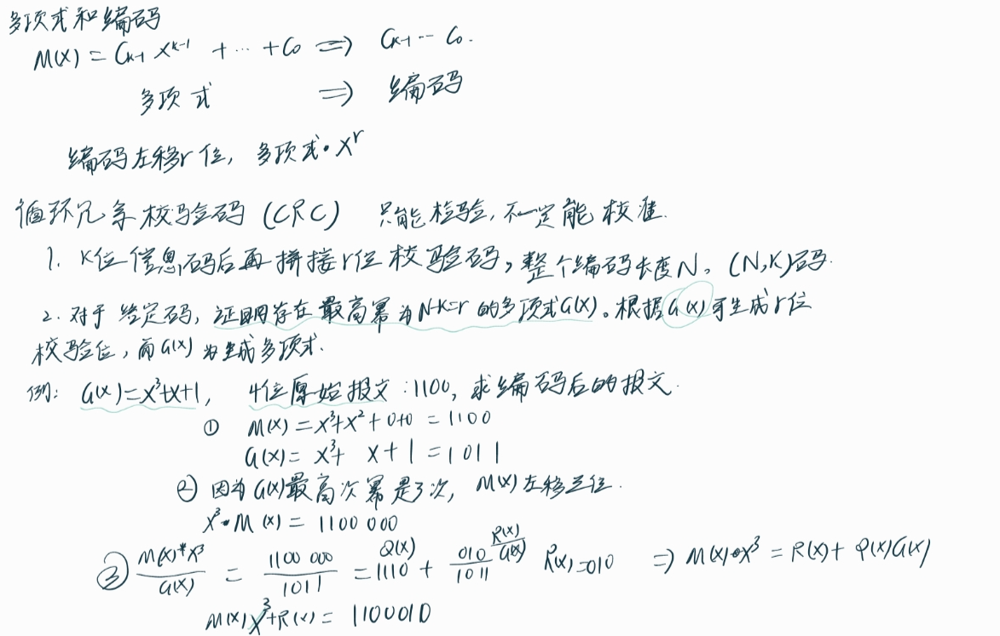

##### CRC特性 
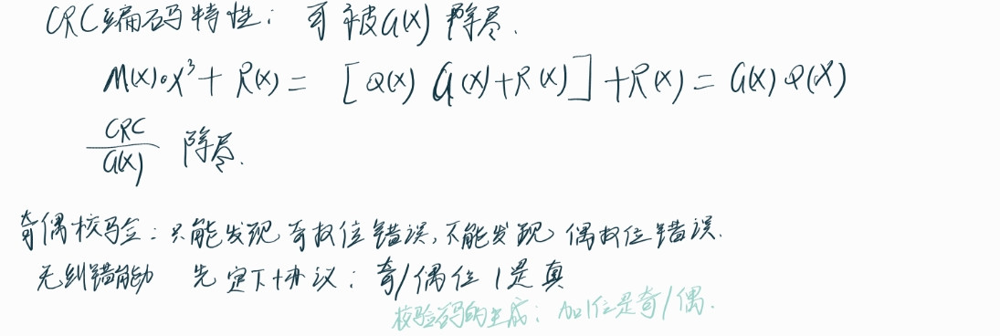
只能检测出奇数位的错误： 如果数据中发生偶数个位的错误（例如，同时有两个位由0变1，或由1变0），那么总共“1”的个数的奇偶性可能不会改变，接收方会误认为数据是正确的，从而无法检测到错误。这是奇偶校验的主要缺点。
无法确定是哪个位错了： 奇偶校验只能告诉你“出错了”，但不能告诉你具体是哪个位出了错，因此也无法进行纠错。

#### 海明码的组成
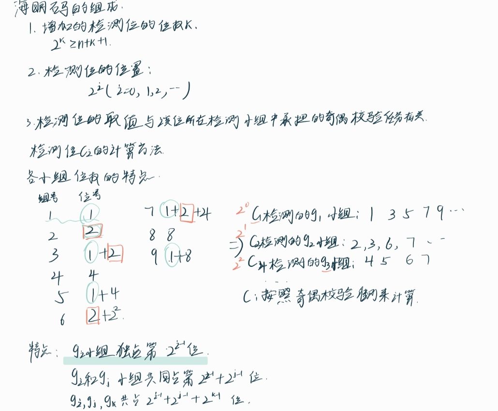
#### 例题
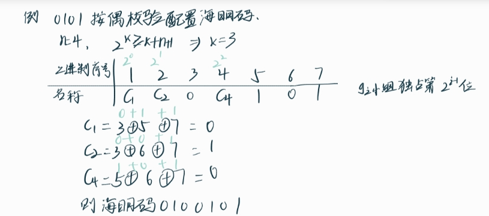
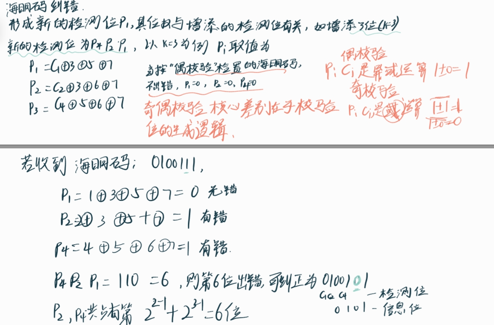

