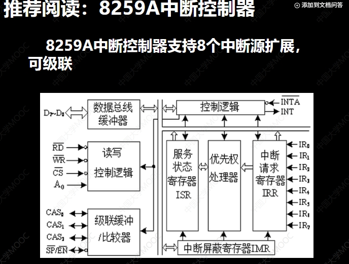
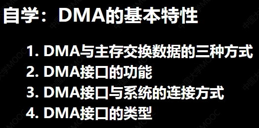
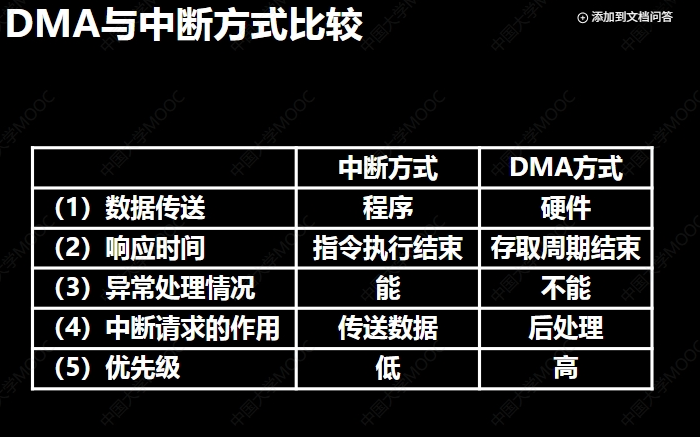

# 04输入输出系统
## 输入输出系统概述
### 输入输出的5种方式
- 查询
- 中断
- DMA
- 通道
- 外围处理机
### 输入输出系统的组成
#### 1.I/O软件
##### I/O指令

1.  **操作码 (Opcode):**
    * 这是指令中最基本的组成部分，它指明了指令的**类型**。
    * 在 I/O 指令中，操作码会有一个特定的值或模式，用来表明这是一条与输入/输出操作相关的指令，而不是算术指令、逻辑指令、数据传输指令（内存访问）或其他类型的指令。图片中也说明它是“I/O 指令标志”。

2.  **命令码 (Command Code):**
    * 这个部分是 I/O 指令特有的，它在操作码识别出这是一条 I/O 指令后，进一步指明要对 I/O 设备执行的**具体操作**。
    * 图片中列举了一些常见的 I/O 操作命令：
        * **读 (Read):** 从指定的输入设备读取数据到 CPU 或内存。
        * **写 (Write):** 将 CPU 或内存中的数据写入到指定的输出设备。
        * **检测 (Test):** 检查 I/O 设备的状态，比如是否忙碌、是否就绪、是否发生错误等。
        * **控制 (Control):** 向 I/O 设备发送控制命令，使其执行特定的动作，比如打印机进纸、磁带机快进、磁盘寻道等。

3.  **设备码 (Device Code):**
    * 这个部分用来**唯一标识**要进行操作的那个具体的 I/O 设备。
    * 它就像是 I/O 设备的“地址”，CPU 通过这个设备码找到想要与之通信的设备。图片中也称之为“地址码”，这是因为在指令格式中，它占据了地址码的位置，但其含义是设备的地址而不是内存地址。

##### 通道指令

1.  **通道指令是通道自身的指令：** 它们是专门设计给 I/O 通道这种硬件执行的，用来指导通道完成输入/输出任务。
2.  **用于执行 I/O 操作：** 通道指令的根本目的就是让通道能够独立地完成数据的输入和输出。
3.  **存放于主存：** 通道指令序列（通常称为通道程序）是存放在主存储器（内存）中的。CPU 会将通道程序的起始地址等信息提供给通道。
4.  **由通道执行：** 通道会像一个简单的处理器一样，从主存中取出并执行这些通道指令，而不是由 CPU 来执行。
5.  **完成输入输出功能：** 通过执行通道指令，通道能够独立地完成数据块的读写、设备的控制等输入输出任务。

**在具有通道的计算机系统中，CPU 的 I/O 指令的作用发生了变化：**

图片中也提到了这一点：

* 在没有通道的简单系统中，CPU 的 I/O 指令可能直接负责启动设备和进行少量数据的传输（通常需要 CPU 频繁干预，效率低）。
* 但在**具有通道的计算机中**，CPU 的 I/O 指令不再直接负责**实际的数据输入输出**。
* CPU 的 I/O 指令主要用于**启动设备、启动通道**，并对通道进行**控制**（比如告诉通道去主存的哪个位置找到它要执行的通道程序，或者检查通道的状态）。
* **实际的、大批量的数据传输**工作则完全由**通道执行通道指令来完成**。

**总结：**

通道指令是为了解放 CPU 而引入的一种机制。在有通道的系统中，CPU 通过执行少数几条 **CPU I/O 指令**来“告诉”通道去做某个 I/O 任务。然后，通道就接过任务，根据存放在主存中的 **通道指令序列**，独立地与 I/O 设备交互，完成数据的读写等操作。在这个过程中，CPU 可以去执行其他计算任务，大大提高了系统的并行处理能力和效率。

因此，通道指令和 CPU 的 I/O 指令是两种不同层面的指令：CPU I/O 指令是 CPU 控制通道的指令，而通道指令是通道控制 I/O 设备的指令。
#### 2.I/O硬件：通道-》设备控制器-》设备

### I/O接口在系统中的位置

**首先，什么是接口？**

图片最上方定义了接口：
“接口可以看做两个系统或部件之间的**交接部分**，它既是两种硬件设备之间的连接电路，也可以看做两个软件之间的共同逻辑边界。”
这说明接口是一个通用的概念，可以是硬件层面的连接和信号转换，也可以是软件层面的模块之间交互的规范或约定。在计算机硬件领域，I/O 接口就是连接计算机主机和外部设备的硬件电路。

**I/O 接口在系统中的位置：**

图示很清楚地表明了 I/O 接口的位置：
它位于 **主机 (Host)** 和 **外部设备 (External Device)** 之间。
主机通常指代 CPU 和内存。外部设备则包括了我们使用的键盘、鼠标、显示器、硬盘、打印机等等。

外部设备本身又可以分为两个主要部分：
1.  **设备控制器 (Device Controller):** 这是外部设备中负责控制其机械、电、磁、光等物理部分的电路。它接收来自主机（通过 I/O 接口）的命令，并将其翻译成设备能理解的动作，同时也将设备的状态和数据反馈给主机。
2.  **机械、电、磁、光部分 (Mechanical, Electrical, Magnetic, Optical Part):** 这是外部设备进行实际工作（如硬盘的磁头移动、打印机的喷墨、键盘按键的检测等）的物理执行机构。

所以，I/O 接口就像是主机和设备控制器之间的“翻译官”和“协调员”。

**I/O 接口的作用 (Functions of I/O Interface):**
I/O 接口的主要功能：

1.  **设备选择 (Device Selection):** 一台计算机可能连接了多个外部设备，每个设备都有一个唯一的设备地址。当 CPU 发出 I/O 指令时，接口需要识别指令中的设备地址，并选择与指定的设备进行通信。
2.  **速度匹配 (Speed Matching):** 主机（CPU 和内存）的工作速度通常远快于外部设备。接口中通常包含缓冲器（Buffer），用于暂存数据，协调主机和设备之间的速度差异，实现高速设备与低速设备之间的数据平滑传输。
3.  **串并转换 (Serial-Parallel Conversion):** 计算机内部总线通常是并行传输数据（一次传输多个位），而许多外部设备（特别是通信设备）使用串行传输（一次传输一个位）。I/O 接口负责在并行和串行之间进行数据格式的转换。有些设备虽然也用并行传输，但其数据格式或时序可能与主机总线不同，接口也需要进行转换。
4.  **电平转换 (Level Shifting):** 主机内部电路使用的电信号电压和电流标准可能与外部设备不同。I/O 接口负责进行电平转换，确保信号能够正确传输而不会损坏设备。
5.  **传送控制命令 (Transmit Control Commands):** CPU 或通道通过 I/O 接口向设备控制器发送控制命令（如启动读、启动写、寻道等）。接口负责将这些命令信号正确地发送给设备控制器。
6.  **反映设备状态 (Reflect Device Status):** 设备控制器会将设备当前的状态（如设备忙、设备就绪、传输完成、发生错误等）通过 I/O 接口反馈给 CPU 或通道。接口负责接收并提供这些状态信息。

**总结来说：**

I/O 接口是连接主机和外部设备的桥梁，它屏蔽了各种外部设备的具体物理特性和工作方式的差异，为主机提供一个标准的、统一的接口来控制和访问外部设备。它负责处理设备选择、速度差异、数据格式和电平转换，以及传递控制和状态信息，是实现计算机系统与外部世界交互的关键组成部分。

### I/O接口的基本组成

**1. I/O 接口的整体作用：**

正如我们之前讨论的，I/O 接口是连接主机（CPU 和主存）与外部设备的桥梁。它屏蔽了外部设备的具体细节，为主机提供一个标准的交互方式。

**2. 与 CPU 的连接：**

图的左侧显示 I/O 接口通过标准总线与 CPU 连接。这些连接线是计算机系统总线的一部分：
* **数据线 (Data Bus):** CPU 与 I/O 接口之间双向传输数据。比如 CPU 读取设备状态，或者 CPU 向设备写入数据，或者从设备读取数据到 CPU/内存，都通过数据线。
* **地址线 (Address Bus):** CPU 通过地址线来选择要访问的特定的 I/O 接口，甚至可能是接口内部的特定寄存器（如数据缓冲寄存器、状态寄存器、命令寄存器）。
* **控制线 (Control Bus):** CPU 通过控制线发送各种控制信号，比如读/写信号（区分是读接口还是写接口）、I/O 请求信号（表明当前总线周期是 I/O 操作）、中断请求信号等。

**3. 与外部设备的连接：**

图的右侧显示 I/O 接口与外部设备（或更准确地说，是设备控制器）连接。这些线通常是设备特有的，与系统总线不同：
* **数据线 (Data Bus):** I/O 接口与外部设备之间双向传输实际的数据。
* **命令 (Command):** 从 I/O 接口发送给外部设备的控制命令信号。
* **状态 (Status):** 从外部设备反馈给 I/O 接口的状态信号。

**4. I/O 接口内部的基本组成部分：**

图中间虚线框内展示了 I/O 接口的几个核心功能块：

* **数据缓冲寄存器 DBR (Data Buffer Register):**
    * 作用：这是一个临时存储区域，用于暂存 CPU 和外部设备之间正在传输的数据。
    * 重要性：由于 CPU 和外部设备的速度差异很大，DBR 起到缓冲作用，协调两者的数据传输速度。CPU 可以快速地将数据写入 DBR 或从 DBR 读取数据，而设备则可以按照自己的速度慢一些地从 DBR 读取或写入 DBR。

* **设备状态标记 (Device Status Flags):**
    * 作用：这些是寄存器或标志位，用来反映外部设备当前的各种状态信息。
    * 例子：比如设备是否忙碌 (Busy)、是否准备好接受数据 (Ready)、是否有数据可读 (Data Available)、是否发生了错误 (Error) 等。
    * CPU 可以通过读取这些状态标记来了解设备的情况，从而决定下一步的操作。

* **设备选择电路 (Device Selection Circuit):**
    * 作用：这个电路负责根据 CPU 在地址线上发送的地址信号，判断当前的总线操作是否是针对这个特定的 I/O 接口。
    * 工作方式：它解码地址线上的地址，如果地址与本接口的地址匹配，就激活本接口，使其响应 CPU 的操作；否则，本接口保持静默，不参与总线上的数据传输。

* **命令寄存器 / 命令译码器 (Command Register / Command Decoder):**
    * **命令寄存器：** CPU 将要发送给外部设备的控制命令代码写入这个寄存器。
    * **命令译码器：** 这个电路负责解释命令寄存器中的代码，将其翻译成外部设备能够理解的具体控制信号（比如启动读操作、启动写操作、磁头寻道等）。

* **控制逻辑电路 (Control Logic Circuit):**
    * 作用：这是 I/O 接口的核心控制大脑。它协调接口内部各个部件的工作时序和流程。
    * 功能：根据 CPU 发来的控制信号（如读/写命令），以及从设备控制器收到的状态信号，控制数据在 DBR、状态标记、命令寄存器之间的流动，控制命令信号发送给设备，控制状态信号反馈给 CPU。它也负责处理中断请求信号等。

**总的来说：**

这张图通过展示 I/O 接口的内部结构，进一步说明了接口是如何实现其连接和协调功能的。它包含了处理数据缓冲、状态反馈、设备地址识别、命令解析和整体控制的关键部件，使得 CPU 可以通过相对简单和标准的方式与种类繁多、特性各异的外部设备进行高效通信。
### I/O设备编址方式

### I/O设备与主机的连接方式
#### 辐射式

#### 总线连接方式

### 接口类型

## 查询
---

## 程序中断方式
### 程序中断方式概述

#### 中断方式特点

#### 中断流程举例

#### 中断源

#### 中断系统需解决的问题

1.  **(5) 各中断源如何向 CPU 提出请求？** (图片中顺序是 (5) 在 (1) 之前，但逻辑上先解释请求更顺畅)
    * **问题：** 计算机系统中有许多可能的中断源（比如 I/O 设备、定时器、电源故障等），它们如何让 CPU 知道它们需要服务？
    * **解决：** 各个中断源通过专门的硬件信号线（通常是**中断请求线** IRQ）连接到 CPU 或中断控制器。当一个中断源需要请求服务时，它会在对应的中断请求线上发出信号。

2.  **(6) 各中断源同时提出请求怎么办？**
    * **问题：** 如果多个中断源在同一时刻或极短的时间间隔内同时向 CPU 提出中断请求，CPU 应该响应哪一个？
    * **解决：** 这需要中断系统具备**中断仲裁 (Interrupt Arbitration)** 和**优先级判断 (Priority Resolution)** 的能力。通常由硬件（如中断控制器）或软件（操作系统）根据预设的优先级规则来决定响应哪个中断源的请求。优先级高的中断会先被响应。

3.  **(7) CPU 什么条件、什么时间、以什么方式响应中断？**
    * **问题：** CPU 不是随时都能被中断的。它在什么情况下会去检查是否有中断请求？什么时候会真正停下当前工作去处理中断？整个响应过程是怎样的？
    * **解决：** CPU 通常在执行完一条指令后，会检查是否有中断请求信号。如果检测到有未被屏蔽（被允许响应）的中断请求，并且当前 CPU 允许中断（中断标志位 ENA 或 IF 为真），CPU 就会开始响应中断。响应方式包括：关闭中断（避免在响应过程中被更低优先级中断打断）、保存当前程序的状态（现场保护）、跳转到对应的中断服务程序入口地址。

4.  **(1) 如何保护现场？**
    * **问题：** CPU 响应中断时，需要暂停当前正在执行的程序。为了之后能正确地回到被中断的地方继续执行，需要保存被打断那一刻程序的所有相关状态。
    * **解决：** 需要保存 CPU 的寄存器内容（包括通用寄存器、程序计数器 PC、状态寄存器 PSW 等）。这些信息通常被保存在内存的**栈**中。这是由硬件自动完成一部分，软件（中断服务程序）完成另一部分。

5.  **(2) 如何寻找入口地址？** (图片中顺序是 (2) 在 (1) 之前，但逻辑上放这里解释更顺畅)
    * **问题：** CPU 知道有中断发生了，也知道是哪个中断源发出的请求（通过仲裁和优先级判断），但它怎么知道应该去执行哪个特定的中断服务程序（ISR）？每个中断源都有自己的 ISR。
    * **解决：** 这通常通过**中断向量表 (Interrupt Vector Table)** 来实现。中断源通过硬件向 CPU 提供一个“中断类型号”或“向量地址”。CPU 利用这个号或地址去内存中的中断向量表中找到对应的中断服务程序的入口地址，然后跳转到那里执行。

**中断向量表中存放着中断服务程序的入口地址**：所以说中断向量地址是中断服务程序的入口地址的地址。

6.  **(3) 如何恢复现场，如何返回？** (图片中顺序是 (3) 在 (2) 之前，但逻辑上放这里解释更顺畅)
    * **问题：** 中断服务程序执行完毕后，如何让 CPU 准确无误地回到被中断的主程序，并从之前暂停的地方继续执行？
    * **解决：** 在中断服务程序的末尾，会执行一个特殊的**中断返回指令**（如 `RETI` 或 `IRET`）。这条指令会从之前保存现场的栈中恢复 CPU 的所有寄存器内容（包括程序计数器和状态寄存器），然后 CPU 就能回到主程序中，从被中断指令的下一条指令处继续执行。

7.  **(4) 处理中断的过程中又出现新的中断怎么办？**
    * **问题：** 当 CPU 正在执行一个中断服务程序时，如果又有新的中断请求发生，而且这个新的请求优先级更高，系统应该如何处理？是立即响应还是等待当前 ISR 执行完？
    * **解决：** 这需要中断系统支持**中断嵌套 (Interrupt Nesting)** 和优先级。在响应一个中断并进入 ISR 后，CPU 的中断允许标志位通常会被关闭，以防止更低优先级的中断打断当前 ISR。但是，如果系统设计允许，可以在 ISR 内部重新开启中断，并设置优先级阈值，使得优先级**更高**的新中断可以打断当前正在执行的 ISR。被打断的 ISR 的现场也会像主程序一样被保护，然后去执行更高优先级中断的 ISR。高优先级 ISR 执行完毕后再返回到低优先级 ISR 继续执行。

#### BIOS中断

**首先，什么是 BIOS？**

BIOS 是 **Basic Input/Output System** 的缩写，中文通常称为“基本输入输出系统”。它是一段固件程序，固化在计算机主板上的一个 ROM 芯片中（如下图所示的芯片）。当计算机启动时，CPU 首先执行的就是 BIOS 程序。

BIOS 的主要职责包括：
* **硬件初始化和自检 (POST, Power-On Self Test):** 检测并初始化 CPU、内存、显卡、硬盘等基本硬件。
* **引导操作系统：** 找到存储设备上的操作系统引导程序，并加载它到内存中，然后将控制权交给操作系统。
* **提供基本 I/O 服务：** 在操作系统完全加载和运行起来之前，为软件提供访问硬件的基本功能接口。

**什么是 BIOS 中断？**

图片中定义 BIOS 中断是“**软件与硬件之间的一个可编程接口**”。

* 这里的“中断”不是我们前面讨论的由外部硬件事件引起的硬件中断。
* BIOS 中断是一种**软件中断**。它是通过在程序中使用 CPU 的中断指令（在 x86 架构下通常是 `INT n`，其中 `n` 是中断号）**主动触发**的。
* 当 CPU 执行到这样一条软件中断指令时，它会暂停当前的执行，然后根据中断号去查找中断向量表，找到对应的**中断服务程序**的入口地址并跳转过去执行。
* 而 BIOS 中断的特别之处在于，中断向量表中对应某些特定中断号（比如图片中的 10H, 13H 等）的服务程序，其代码是由 BIOS 提供并存放在 BIOS ROM 中的。
* 因此，通过触发特定的 BIOS 中断号，软件（比如操作系统启动前的引导程序，或者早期操作系统如 DOS 下的应用程序）就可以调用 BIOS 提供的预设功能服务，从而间接地访问和控制硬件。

**BIOS 中断作为可编程接口：**

BIOS 中断提供了一种标准的、独立于具体硬件细节的方式来执行基本 I/O 操作。软件不需要直接了解和操作复杂的硬件寄存器和控制逻辑，只需要设置好一些参数（通常放在 CPU 的寄存器中），然后调用特定的 BIOS 中断号。BIOS 中的中断服务程序会接收这些参数，完成对硬件的操作，并将结果或状态通过寄存器返回给调用者。这就像调用一个低级别的函数库一样。

**常用的 BIOS 中断：**

图片中列举了一些常见的 BIOS 中断及其服务内容：

* **INT 10H:** **显示服务 (Video Services)。** 提供与显示器相关的基本功能，如设置屏幕模式（分辨率、颜色）、在屏幕上显示字符或字符串、移动光标等。在操作系统加载前的文本界面通常会用到 INT 10H。
* **INT 13H:** **直接磁盘服务 (Disk Services)。** 提供对软盘和硬盘进行扇区级的读写操作、格式化、获取磁盘参数等功能。操作系统的引导程序需要使用 INT 13H 从硬盘加载自身。
* **INT 14H:** **串口服务 (Serial Port Services)。** 提供通过计算机的串行端口发送和接收数据的功能。
* **INT 15H:** **杂项系统服务 (Miscellaneous System Services)。** 这是一个比较杂的服务集合，包括获取内存大小、键盘服务、操纵杆 (joystick) 支持、电源管理等等。

**总结：**

BIOS 中断是一种基于软件中断机制，由 BIOS 固件提供的硬件访问服务接口。它允许早期的软件或操作系统启动阶段的程序，通过调用特定的中断号来执行预定义的基本输入输出操作，作为在高级操作系统和驱动程序加载之前与硬件交互的标准方式。虽然现代操作系统在运行时通常会绕过 BIOS 直接控制硬件以获得更好的性能，但在系统启动的关键阶段，BIOS 中断仍然发挥着不可或缺的作用。

### 中断接口电路
#### 中断请求标记触发器

#### 中断屏蔽触发器

1.  **中断请求 (Interrupt Request):**
    * 这是来自某个具体的外部设备或中断源的信号线。当设备需要 CPU 服务时，它会在这条线上发出中断请求信号（通常是一个电平变化或脉冲）。

2.  **中断请求触发器 INTR (Interrupt Request Flip-flop):**
    * 这是一个触发器（图中标注了 D 输入和 Q 输出，通常是 D 触发器）。
    * **作用：** 它的功能是**记录和锁存**中断请求。当“中断请求”信号到来时，这个触发器会被置位（Q 输出变为 1）。
    * **重要性：** 即使中断请求信号本身是短暂的，这个触发器也能记住这个请求，直到 CPU 响应并清除它。
    * **图中的标注：** "INTR = 1 有请求" 说明当触发器 Q 输出为 1 时，表示有该中断源的请求正在等待处理。下方的 "D 完成触发器" 进一步说明了这是一个 D 触发器，用于捕获请求信号。

3.  **中断屏蔽触发器 MASK (Interrupt Mask Flip-flop):**
    * 这是另一个触发器。
    * **作用：** 它的功能是**存储**该中断源是否被屏蔽的状态。这个触发器的值通常是由**CPU 通过软件控制**写入的（图中的“受设备本身控制”可能是一个误导或表示其值来自外部控制信号，但在标准中断系统中，这个控制信号来自 CPU 的写操作）。
    * **图中的标注：** "MASK = 1 被屏蔽" 说明当这个触发器的 Q 输出为 1 时，表示该中断源当前处于被屏蔽（禁用）状态，即使它发出了中断请求，CPU 也不会响应。如果 Q 输出为 0，则表示未被屏蔽（启用）。

4.  **控制逻辑（与门 & 和反相器）:**
    * 图中的与门接收两个输入：
        * 来自中断请求触发器 INTR 的输出 Q（表示是否有请求）。
        * 来自中断屏蔽触发器 MASK 的输出 Q，经过一个**反相器**（图中的小圆圈表示反相）。反相器的输出是 MASK Q 的反相，表示该中断源**未被屏蔽**。
    * **与门的作用：** 只有当**既有中断请求 (INTR Q = 1)** **且** **该中断源未被屏蔽 (MASK Q 的反相 = 1)** 时，与门的输出才为高电平。这个高电平信号表示“这是一个有效且未被屏蔽的中断请求”，可以被提交给 CPU 进一步处理。

5.  **来自 CPU 的中断查询信号 (Interrupt Query Signal from CPU):**
    * 这个信号也是与门的输入之一。这部分设计可能取决于具体的中断控制器架构。通常，CPU 在某个时刻会检查是否有中断请求。这个“中断查询信号”可能是在 CPU 检查中断状态时发出的一个信号，用来**允许**当前逻辑单元的输出信号通过。
    * 结合图中的结构，与门的最终输出只有在 **有请求 AND 未被屏蔽 AND CPU 正在查询** 三个条件同时满足时才有效。这可能表示 CPU 需要通过某种方式主动去读取或确认这个有效的中断请求信号。在更常见的简化模型中，与门的输出（INTR Q AND NOT MASK Q）会直接汇总到 CPU 的总中断请求线上。

**整个流程概括：**

一个中断源发出**中断请求**信号，这个信号被**中断请求触发器 (INTR)** 捕获并锁存。同时，**中断屏蔽触发器 (MASK)** 存储着这个中断源是否被允许的状态（由 CPU 控制）。一个**控制逻辑（与门和反相器）** 将“有请求”的状态和“未被屏蔽”的状态结合起来。只有当一个中断请求**既已发生又未被屏蔽**时，相关的信号才会通过控制逻辑。图中的“来自 CPU 的中断查询信号”可能进一步控制何时将这个有效信号送给 CPU 或供 CPU 读取。最终，这个单元的输出信息将被送到 CPU 的中断处理机制中，与其他中断源的请求一起进行仲裁和优先级判断。

这个图展示的是处理**单一中断源**的基本逻辑，在一个多中断源的系统中，会有多个这样的单元，它们产生的有效中断信号会再经过仲裁电路，最终产生送往 CPU 的总中断请求信号。

#### 中断硬件排队器

#### 中断软件判优逻辑

#### 中断向量地址形成部件

1.  **排队器输出 (Prioritizer Output):**
    * 在一个有多个中断源的系统中，中断控制器会接收到来自各个设备的中断请求。如果多个请求同时到达，排队器（或优先级判断电路）会根据优先级或其他策略，确定当前应该响应哪个中断源的请求。
    * “排队器输出”就代表了已经被选中、即将被响应的那个中断源。图中的箭头表示可能有多个输入（来自不同中断源的请求），但经过排队后，会输出一个信号来标识当前被选中的源。

2.  **设备编码器 / 中断向量地址形成部件 (Device Encoder / Interrupt Vector Address Formation Component):**
    * 这是图中的核心硬件部件。
    * **作用：** 它接收来自排队器的输出信号（标识是哪个设备发出的中断请求），并将其转换成一个短的、唯一的数字编码，这个编码就是**向量地址 (Vector Address)**，也常被称为**中断号 (Interrupt Number)**。
    * **图示：** 图中展示了设备编码器接收不同的信号（比如 010...0，0001100 等，这些可能是排队器识别出的某种标识）并输出对应的向量地址（例如 12, 13, 14）。这个过程是由硬件快速完成的。

3.  **向量地址 (Vector Address / 中断号):**
    * 这个由硬件生成的数字（例如 12, 13, 14）本身并不是中断服务程序的内存地址。它是一个**索引**或**编号**，用于在中断向量表中查找信息。

4.  **中断向量表 (Interrupt Vector Table):**
    * 这是一个存放在计算机**主存储器 (Main Memory)** 中特定区域的表格。
    * **结构：** 这个表格就像一个列表，其中每个条目都对应一个向量地址（中断号）。表格的索引就是向量地址。
    * **内容：** 表格的每个条目中存放着对应那个中断源的**中断服务程序 (ISR) 的入口地址 (Entry Address)**。

5.  **查找入口地址：**
    * CPU 接收到由“中断向量地址形成部件”提供的向量地址后，会使用这个向量地址作为索引，去内存中的**中断向量表**中查找对应的条目。
    * 例如，如果向量地址是 12，CPU 就去中断向量表中查找索引为 12 的条目。
    * 在图示中，中断向量表中索引 12 的位置存放的值是 200。那么 200 就是打印机服务程序的入口地址。索引 13 的位置存放的值是 300，是显示器服务程序的入口地址。

6.  **入口地址 (Entry Address):**
    * 这是从中断向量表中查找到的，真正指向中断服务程序在内存中起始位置的地址。
    * **图示：** “入口地址 200” 指向了内存中存放“打印机服务程序”代码的起始位置。“入口地址 300” 指向了“显示器服务程序”的起始位置。

**整个流程的意义：**

当一个中断请求被确认并排队优先后：
* 硬件（中断向量地址形成部件）快速地将这个中断源转换成一个**向量地址**（中断号）。
* CPU 利用这个向量地址，像查字典一样，快速地在内存的**中断向量表**中找到对应的**中断服务程序的入口地址**。
* CPU 然后跳转到这个入口地址，开始执行处理该中断源的特定服务程序。

这种机制叫做**中断向量寻址 (Vectored Interrupt Addressing)** 或**中断向量法**。它比让 CPU 去挨个询问每个设备（轮询）看是谁发出了中断请求，然后再决定去哪个地址执行的方式要高效得多，大大缩短了中断响应的时间。
#### 中断服务程序入口地址跳转

#### 中断模式读取按键

**1. 什么是矩阵式键盘？**

* 矩阵式键盘是一种通过将按键排列成**行 (Rows)** 和**列 (Columns)** 的二维阵列来减少所需的连接线数量的键盘结构。
* 图中的 3x3 键盘就是一个例子，它有 3 条输入线 (Key_In1, Key_In2, Key_In3) 和 3 条输出线 (Key_Out1, Key_Out2, Key_Out3)。按键 (S1-S9) 位于行线和列线的交点上。
* 如果每个按键都单独连接到微控制器，一个有 9 个按键的键盘就需要 9 个输入引脚。而矩阵式键盘只需要 3 条行线和 3 条列线，总共 6 个引脚就可以管理这 9 个按键（甚至更多的按键，一个 R x C 的矩阵只需要 R + C 个引脚）。

**2. 为什么要用中断模式读取按键？**

* **传统方法（查询/扫描模式）：** 在没有中断的情况下，微控制器需要不断地、循环地去“扫描”键盘，检查是否有按键被按下。这通常涉及到轮流行输出低电平，然后读取所有输入线的状态，以确定哪个按键被按下。这种方法会**占用 CPU 的大量时间**，尤其是在键盘没有按键被按下的绝大多数时间里，CPU 都在徒劳地进行扫描。
* **中断模式：** 中断模式的目的是让微控制器只有在“真正有事发生”（即有按键被按下）的时候才去处理键盘输入。这样可以**解放 CPU** 去执行其他任务，提高系统效率。

**3. 中断模式读取按键的工作原理：**

这种方法主要分为两个阶段：**中断检测**和**按键识别（在中断服务程序中完成）**。

* **中断检测 (Detecting the Interrupt):**
    * **硬件连接：** 通常，矩阵键盘的**行线 (Key_In)** 会连接到微控制器的 GPIO 引脚，并将这些引脚配置为**外部中断源**。图中的电阻 (R1-R9) 将行线拉高到 VCC。
    * **配置中断：** 微控制器将连接行线的引脚配置为在检测到**下降沿**（当高电平变为低电平时）时触发中断。
    * **触发中断：** 在微控制器正常运行时，它会持续输出信号扫描列线（通常是默认拉高或高阻态），或者将列线配置为输出低电平（取决于具体设计）。当用户按下某个按键时，该按键会连接对应的行线和列线。如果列线被驱动为低电平，就会把对应的行线从高电平拉低。
    * **生成中断请求：** 行线上的高到低跳变会被微控制器检测到，从而触发一个外部中断请求信号，打断 CPU 的当前任务。

* **按键识别 (Identifying the Key - 在中断服务程序 ISR 中):**
    * 当 CPU 接收到键盘中断请求并进入对应的中断服务程序 (ISR) 后，它知道**有按键被按下了**，但还不知道是**哪个按键**。
    * **扫描识别过程：** ISR 需要执行一个快速的扫描过程来确定具体是哪个按键：
        1.  将**所有列线 (Key_Out)** 配置为**输出**。
        2.  **逐一**将某一列线驱动为**低电平**（其他列线保持高电平或高阻态）。
        3.  **读取所有行线 (Key_In)** 的状态。
        4.  检查哪些行线变为了低电平。如果某一行线在某一列被驱动为低电平时被读到低电平，那么该行与该列交叉点的按键就是被按下的键。
        5.  重复步骤 2-4，直到所有列都被扫描一遍，确定了被按下的键。
    * **消抖 (Debouncing):** 按键在按下或释放时，金属触点可能会弹跳，产生多次快速的信号跳变，导致误判或重复中断。ISR 需要包含消抖处理，比如在第一次检测到按键后，等待一个短暂的时间（几十毫秒），然后再次读取按键状态进行确认。
    * **清除中断：** ISR 在完成按键识别和处理后，需要清除相应的外部中断标志位，并可能需要暂时禁用该中断源，直到按键释放并稳定下来，以避免重复触发。
    * **返回：** ISR 执行完毕后，通过中断返回指令回到主程序继续执行。
		。
### 中断处理过程
#### Linux中断机制

#### CPU相应中断的条件和时间

#### 中断响应的实现

这张图片解释了 CPU 在接收并响应一个中断请求时，由硬件自动完成的几个关键步骤。这些步骤通常被认为是由一条“**中断隐指令**”来完成的，意思是它们不是程序中的一条显式指令，而是 CPU 硬件在检测到中断并决定响应时自动执行的一系列操作。

这些自动完成的步骤主要包括：

1.  **(1) 保护程序断点 (Protect Program Breakpoint):**
    * **断点**在这里指被中断的程序即将要执行的下一条指令的地址。保存这个地址是为了在中断服务程序 (ISR) 执行完毕后，能够准确地返回到主程序继续执行。
    * **如何保护：** 这个步骤的核心是保存当前**程序计数器 (PC)** 的值。PC 寄存器存储着下一条指令的地址。
    * 图中提到“断点存于特定地址 (0号地址) 内” 和 “断点进栈”。这是一个可能有点混淆的描述。在大多数现代计算机体系结构中，标准的做法是将当前的程序计数器 (PC) 值以及**状态寄存器 (PSW)** 的内容**自动压入（进栈）**到内存的堆栈中。堆栈是一个非常适合临时保存这种“返回信息”的数据结构。图中的“0号地址”通常与系统的复位向量或某些特定中断向量有关，而不是用来存放所有中断的返回地址。所以，“断点进栈”是更普遍和标准的现场保护方式之一（除了 PC，通常还会保存 PSW）。

2.  **(2) 寻找服务程序入口地址 (Find Service Program Entry Address):**
    * **问题：** CPU 知道有中断发生了，并且完成了初步的现场保护，接下来需要找到处理这个特定中断的**中断服务程序 (ISR)** 在内存中的起始地址，以便跳转过去执行。
    * 图中列举了两种寻找入口地址的方法：
        * **向量地址 -> PC (硬件向量法) (Vector Address -> PC (Hardware Vector Method)):** 这是更先进和常用的方法（我们之前讨论过）。发出中断请求的硬件会提供一个**中断向量地址**（或者中断类型号）。CPU 利用这个向量地址作为索引，在内存中的**中断向量表**中查找，直接获取到对应中断服务程序的真正**入口地址**。然后将这个入口地址加载到程序计数器 (PC) 中，CPU 就会跳转到 ISR 的起始位置开始执行。这个过程主要依赖硬件完成向量地址到入口地址的映射。
        * **中断识别程序入口地址 M -> PC (软件查询法) (Interrupt Identification Program Entry Address M -> PC (Software Polling Method)):** 这是相对简单但效率较低的方法。在这种方式下，所有中断源的中断请求都会导致 CPU 跳转到**同一个固定的地址 M** 去执行一个通用的**中断识别程序**（这是一个软件程序）。这个识别程序会通过查询各个设备的**状态寄存器**来判断是哪个设备发出了中断请求。一旦确定了中断源，这个软件程序再通过软件跳转指令转到对应设备的中断服务程序的入口地址。这个过程需要软件（中断识别程序）进行查询和判断。

3.  **(3) 硬件关中断 (Hardware Disables Interrupts):**
    * **目的：** 在刚进入中断响应阶段时，为了防止在保存现场、寻找 ISR 入口等关键步骤被其他更低优先级的中断再次打断，CPU 硬件会自动清除其中断允许标志位（通常是 PSW 中的一个标志），从而**暂时屏蔽**所有（或大部分）外部中断请求。
    * **重要性：** 这保证了 CPU 可以先专注于完成进入 ISR 的准备工作。在 ISR 的开始部分，软件可以根据需要重新开启中断，并设置优先级，允许更高优先级的中断发生嵌套。但硬件响应的初始阶段通常是强制关闭中断的。

**总结：**

CPU 响应中断的硬件实现是一个自动过程（中断隐指令），主要包含三个关键步骤：首先，**保护被中断程序的返回地址和状态**（通常压栈），以便之后能正确返回；其次，**确定处理这个中断的服务程序的入口地址**（通过硬件向量法或软件查询法）；最后，**暂时关闭中断**，避免立即被其他中断打断。完成这三个步骤后，CPU 才正式开始执行中断服务程序。
#### I/O中断处理过程

#### 中断服务程序流程

流程可以分为几个主要阶段：

**1. 中断响应和入口寻找 (由硬件自动完成一部分)**

* 当 CPU 接收到中断请求信号后，如果中断被允许（未被屏蔽），并且 CPU 在当前指令执行完毕后检查到中断，就会进入中断响应阶段。
* CPU 会根据中断的来源（不同的设备或事件）查找一个**中断向量表**。中断向量表是一个预先存储在内存中的表格，其中存放着各个中断服务程序的入口地址。
* CPU 通过查找向量表，找到对应于当前中断源的**中断服务程序入口地址**。
* 在这个阶段，CPU 硬件还会自动完成一些关键任务，比如保存当前程序的程序计数器（PC，即断点地址）和程序状态字（PSW，包含各种标志位，如条件码、中断允许标志等），这些信息通常会被自动压入堆栈。同时，还会自动关闭中断，防止在处理当前中断的关键时刻再次被其他中断打断（在更复杂的系统中可能会有优先级管理）。
* 最后，CPU 会将找到的中断服务程序入口地址加载到程序计数器 PC 中，从而使 CPU 的下一条指令从 ISR 的入口开始执行。

**2. 执行中断服务程序 (软件部分)**

这是图片中详细列出的 numbered steps，是程序员编写的、用于具体处理中断事件的代码：

* **1. 保护现场：**
    * 这是 ISR 的第一步软件操作。虽然 CPU 硬件已经自动保存了 PC 和 PSW 等关键信息，但是 ISR 在执行过程中会用到 CPU 的通用寄存器。为了不破坏被中断程序的状态，ISR 需要将它即将使用的那些**通用寄存器的当前值保存起来**。
    * 图片中提到“保存寄存器值：进栈指令”，这意味着通常使用**压栈 (Push)** 指令将这些寄存器的值保存到系统堆栈中。

* **2. 中断服务：**
    * 这是 ISR 的主体部分，用于真正处理引起中断的事件。
    * 例如，如果是键盘输入中断，这里会读取键盘输入的数据；如果是磁盘完成中断，这里会更新文件状态信息；如果是定时器中断，这里可能会更新系统时间。
    * 图片中括号里提到“(视情形开、关中断)”，这意味着在处理中断事件的过程中，根据系统的设计和需求（例如是否允许更高优先级的中断嵌套发生），ISR 可能会在某个阶段手动执行开中断或关中断指令。

* **3. 恢复现场：**
    * 在中断事件处理完毕后，ISR 需要恢复被中断程序的执行环境。
    * 这一步是保护现场的逆过程，将步骤 1 中保存的那些**通用寄存器的值恢复回去**。
    * 图片中提到“恢复寄存器的值：出栈指令”，这意味着通常使用**出栈 (Pop)** 指令将之前压入堆栈的值弹回到对应的寄存器中。

* **4. 开中断：**
    * 如果在进入中断服务程序时中断被关闭了（无论是硬件自动还是软件手动），那么在准备返回被中断程序之前，通常需要重新**开启中断**，使得系统能够响应后续可能发生的中断请求。这一步确保了中断系统在 ISR 执行完毕后恢复正常工作状态。

* **5. 中断返回：**
    * 这是 ISR 的最后一步，标志着中断处理的结束。
    * 通过执行一条特殊的**中断返回指令**（例如 `RETI`, `IRET` 等）。这条指令不同于普通的子程序返回指令，它会执行以下关键操作：
        * 将之前保存在堆栈中的被中断程序的**返回地址**（断点，即 PC 的原值）弹出并加载到 PC 中。
        * 将之前保存在堆栈中的被中断程序的**程序状态字**（PSW）弹出并加载到 PSW 寄存器中（这会恢复原来的标志位，包括可能重新启用中断，如果第 4 步没有单独开中断的话）。
        * 退出中断处理模式，使 CPU 返回到正常的用户模式或 Supervisor 模式（如果中断发生在用户模式）。

**整个流程的意义：**

这一系列步骤确保了中断处理过程能够顺利进行，并且在处理完成后，系统能够正确地恢复到被中断程序的状态，使得用户程序能够在被中断的地方继续正确执行，而不会丢失信息或出现错误。中断机制允许 CPU 在等待慢速 I/O 设备时去做其他有用的事情，从而提高了系统的效率和响应性。

这张图片很好地概括了中断服务程序（软件部分）的核心执行流程，从现场保护到事件处理再到现场恢复和最终返回。而图片最上方的那句话描述了在执行软件 ISR 之前，硬件完成的查找入口和转移控制的过程。

#### 中断响应的完整过程

#### 8259A中断控制器

### 中断屏蔽技术
#### 实现多重中断的条件

#### 中断屏蔽字

#### 通过中断屏蔽技术改变处理优先级

1.  **响应优先级 (Response Priority):**
    * **定义：** 这是指当多个中断源**同时**向 CPU 提出中断请求时，CPU （或中断控制器）**响应这些请求的先后次序**。
    * **性质：** 响应优先级通常是**硬件设计固定**的，比如通过硬件线路连接顺序、中断控制器内部的电路逻辑等确定。它决定了在多个中断请求并存时，哪一个请求能够首先被 CPU 接收并开始处理流程。
    * **图示例子：** 图中给出的“响应优先级 A→B→C→D 降序排列”表示在没有屏蔽的情况下，如果中断源 A, B, C, D 同时发出请求，CPU 会先响应 A 的请求，然后是 B，接着是 C，最后是 D。A 的响应优先级最高，D 最低。

2.  **处理优先级 (Processing Priority):**
    * **定义：** 这是指 CPU **实际处理某个中断源请求时，能否被**其他新的中断请求**打断的优先次序**。它决定了中断的嵌套能力。
    * **性质：** 处理优先级是**动态的**，它可以通过**中断屏蔽技术**由软件（通常是在中断服务程序 ISR 中）来控制和改变。它反映了当前正在执行的任务（无论是主程序还是某个 ISR）的重要性，决定了哪些新的、更高优先级的中断请求可以打断它。

**响应优先级与处理优先级之间的关系和区别：**

* **响应优先级**决定了哪个中断先**开始**被服务（从多个待处理请求中选择）。
* **处理优先级**决定了当前正在运行的服务程序（ISR）是否会被**新的**更高优先级中断**打断**。
* 响应优先级是先天的、固定的；处理优先级是后天的、可调的。

**通过中断屏蔽技术改变处理优先级：**

图片中提到“通过中断屏蔽技术改变处理优先级”，这是因为处理优先级主要是通过设置**中断屏蔽字 (Interrupt Mask Word)** 来实现的。

* **中断屏蔽字：** 是一个寄存器（或一组标志位），其中的每一位通常对应一个中断源。如果某个中断源对应的屏蔽位设置为“1”（如图中所示，“MASK = 1 被屏蔽”），那么这个中断源发出的中断请求就会被屏蔽（被忽略），不会被 CPU 响应。如果屏蔽位设置为“0”，则表示该中断源未被屏蔽，可以被响应。
* **如何改变处理优先级：** 在执行某个中断源（比如源 X）的中断服务程序时，软件会修改中断屏蔽字，通常会屏蔽掉那些**响应优先级低于或等于**源 X 的中断请求，而**不屏蔽**响应优先级高于源 X 的中断请求。这样，在处理源 X 的中断时，只有响应优先级更高的中断源发出的新请求才能打断当前的 ISR，从而实现了处理优先级的动态调整和中断嵌套。

**总结：**

* **响应优先级** 是硬件决定的，用于仲裁同时到达的请求。
* **处理优先级** 是软件通过设置屏蔽字动态调整的，决定了正在运行的 ISR 是否会被新的中断打断。
* 通过巧妙设置不同 ISR 中的屏蔽字，可以实现灵活的中断嵌套和处理顺序控制。
#### 先分析不修改屏蔽字的示例

#### 新屏蔽字设定

#### 中断屏蔽技术举例

## DMA工作方式
### DMA与中断的比较

图中有几个主要的部件：
* **主存 (Main Memory):** 存储数据和程序的地方。
* **CPU:** 中央处理器，负责执行指令。图中标注了 ACC (Accumulator)，这是 CPU 内部的一个寄存器，在中断方式中数据常会经过这里。
* **I/O 设备 (I/O Device):** 输入/输出设备，比如硬盘、网卡等。
* **中断接口 (Interrupt Interface):** I/O 设备与 CPU 之间用于中断通信和少量数据传输的接口。
* **DMA 接口 (DMA Interface):** 专门负责高速、批量数据传输的接口或控制器。

分别解释这两种方式的数据传送通路：

1.  **中断方式数据传送通路 (图中蓝色线条):**
    * 这种方式下，当 I/O 设备准备好数据（输入）或需要数据（输出）时，它会通过 **中断接口** 向 CPU 发出**中断请求**。
    * CPU 收到中断请求并响应后，会暂停当前正在执行的任务，转去执行对应的**中断服务程序 (ISR)**。
    * 在 ISR 中，CPU 通过执行输入/输出指令，从 **中断接口** 读取数据（如果是输入）或将数据写入到 **中断接口**（如果是输出）。这个过程通常是**一个字（或一个字节）一个字**地进行。
    * CPU 读入的数据会先暂存在 CPU 的寄存器中（比如图中的 ACC），然后再由 CPU 执行指令将数据写入到**主存**中。输出过程类似，CPU 从主存读数据到寄存器，再写入中断接口。
    * **特点：** 这种方式下，**数据的实际传输（从接口到主存或反之）是由 CPU 执行指令来完成的**。每传输一个数据，CPU 都需要介入。对于传输少量数据是可行的，但如果需要传输大量数据块，CPU 会非常忙碌地处理数据传输，效率很低，影响了 CPU 执行其他计算任务。

2.  **DMA 方式数据传送通路 (图中棕黄色线条):**
    * DMA 是为了解决中断方式下 CPU 参与数据传输效率低的问题而提出的。
    * 这种方式下，数据传输**不经过 CPU**。
    * 首先，CPU 会对 **DMA 接口**进行初始化设置，告诉 DMA 接口要传输的数据量、数据在主存的起始地址、数据在设备的地址、传输方向（输入/输出）等信息。然后 CPU 去执行其他任务。
    * DMA 接口接收到指令后，**直接**与 **I/O 设备**和**主存**打交道。
    * 当 I/O 设备准备好数据或需要数据时，它通知 DMA 接口。DMA 接口会向系统总线发出请求，**夺取总线控制权**。
    * 一旦获得总线控制权，DMA 接口就绕过 CPU，直接在 **I/O 设备**和**主存**之间建立连接，进行数据的批量传输（一个数据块）。图中的棕黄色线条直接连接了 I/O 设备、DMA 接口和主存，形象地说明了这一点。
    * **特点：** 数据的实际传输（从设备到主存或反之）由 DMA 接口**独立完成**，**CPU 不参与每个数据的传送过程**。只有在传输整个数据块开始前和传输完成后，DMA 接口才会通过中断等方式通知 CPU。这种方式极大地减轻了 CPU 的负担，提高了大批量数据传输的效率。

**总结：**

图示清晰地对比了两种方式的数据路径：
* **中断方式：** 数据路径是 I/O 设备 → 中断接口 → **CPU** (ACC) → 主存（或反之），CPU 是数据流动的中间环节。
* **DMA 方式：** 数据路径是 I/O 设备 ↔ DMA 接口 ↔ 主存，数据直接在设备和主存之间传输，**绕过了 CPU**。

因此，DMA 方式更适合于高速、大批量的数据传输，而中断方式（有时结合缓冲区）适用于实时性要求不高的少量数据传输或用于通知 CPU 某个事件的发生。
### DMA的基本特性

1.  **DMA 与主存交换数据的三种方式：**
    这指的是 DMA 控制器在进行数据传输时，如何与 CPU 共享系统总线（地址总线、数据总线、控制总线）的使用权。常见的三种方式是：
    * **停止 CPU 工作 (Halt Mode / Stop Mode):** 当 DMA 控制器需要传输数据时，它向 CPU 发出总线请求。CPU 收到请求后，立即停止当前的工作，放弃总线使用权，将总线控制权交给 DMA 控制器。DMA 控制器获得总线控制权后，独占总线进行数据传输，直到传输完成。传输完成后，DMA 控制器释放总线，并通知 CPU，CPU 继续原来的工作。这种方式简单但会导致 CPU 在 DMA 传输期间完全停止，对 CPU 利用率影响较大。
    * **周期窃取 (Cycle Stealing Mode):** DMA 控制器在需要传输数据时，依然向 CPU 发出总线请求。CPU 不会完全停止，而是在当前指令执行过程中，如果遇到不需要访问主存的总线周期（比如CPU执行加法运算等），CPU 会让出总线。或者 DMA 控制器强制暂停 CPU 的一个内存访问周期，插入一个 DMA 传输周期。DMA 控制器“窃取”CPU 的总线周期进行少量数据的传输（通常一个字或一个字节），然后立即释放总线。这样，CPU 的工作只是**偶尔被“暂停”一下，没有完全停止**,提高了 CPU 的利用率。这种方式适用于数据传输不是很密集的场合。
    * **透明模式 / 交错方式 (Transparent Mode / Interleaved Mode):** 这是对 CPU 影响最小的方式。DMA 控制器利用 CPU 不使用总线的那些总线周期进行数据传输。例如，CPU 在执行某些指令时，有一部分时间是在进行内部操作，不需要访问主存。**DMA 控制器就在这些空闲的总线周期内进行数据传输**。这种方式下，DMA 传输与 CPU 工作几乎是**并行**进行的，对 CPU 没有影响，传输过程对 CPU 是“透明”的。但这种方式要求 DMA 控制器能够检测到 CPU 的总线空闲周期，实现比较复杂，且 DMA 的传输速度依赖于 CPU 的总线使用情况。

2.  **DMA 接口的功能：**
    DMA 接口（或 DMA 控制器）是一个独立的硬件模块，它负责协调和管理 DMA 数据传输的全过程。其主要功能包括：
    * **接收 I/O 设备发出的 DMA 请求：** 当 I/O 设备准备好数据或需要数据时，向 DMA 接口发出 DMA 请求信号。
    * **向 CPU 发出总线请求：** DMA 接口收到设备请求后，向 CPU 发出总线请求信号，申请获得总线控制权。
    * **接收 CPU 发来的控制信息：** CPU 在启动 DMA 传输前，会向 DMA 接口写入一些控制信息，如数据在主存中的起始地址、要传输的数据块大小（字数或字节数）、数据传输方向（读还是写）、以及相关的设备地址等。
    * **控制数据传输：** DMA 接口获得总线控制权后，根据 CPU 设置的信息，自动生成主存地址和控制信号，控制数据直接在 I/O 设备和主存之间进行传输。
    * **计数和判断传输是否结束：** DMA 接口内部有计数器，记录已传输的数据量。当达到设定的数据量时，认为传输完成。
    * **传输结束后向 CPU 发送中断：** 整个数据块传输完成后，DMA 接口会向 CPU 发送一个中断信号，通知 CPU 本次 DMA 传输已经完成。
    * **总线仲裁：** 当多个 DMA 接口或 CPU 同时需要使用总线时，DMA 控制器（如果支持多通道）或总线控制逻辑需要进行仲裁，决定哪个设备优先使用总线。

3.  **DMA 接口与系统的连接方式：**
    DMA 接口作为 CPU 和 I/O 设备之间进行高速数据传输的桥梁，需要连接到系统的总线上。它主要连接到：
    * **系统总线 (System Bus):** 包括数据线、地址线和控制线。DMA 接口需要通过总线访问主存和 I/O 设备。
    * **CPU (部分控制线):** DMA 接口需要连接到 CPU 的总线请求 (Bus Request) 和总线允许 (Bus Grant) 等控制线上，以申请和获得总线控制权。
    * **I/O 设备 (数据线和控制线):** DMA 接口直接连接到 I/O 设备的数据线，以及设备的状态和控制线上，接收设备的 DMA 请求并进行数据交换。

4.  **DMA 接口的类型：**
    DMA 接口的类型可以从不同的角度划分：
    * **按通道数分：** 单通道 DMA 控制器和多通道 DMA 控制器。多通道控制器可以管理来自多个设备的中断请求，通过硬件排队和总线仲裁来处理。
    * **按功能强弱分：** 简单的 DMA 接口可能只支持基本的传输功能，而复杂的 DMA 接口可能具备链式传输（Chain Mode，传输一个块完成后自动接着传输下一个块）、Scatter/Gather 功能（将非连续的内存区域的数据集中传输或将一块数据分散写入非连续内存区域）等高级功能。
    * **按所处的硬件位置分：** 可以是集成在 CPU 或芯片组内部的 DMA 控制器，也可以是作为独立芯片存在于主板上的 DMA 控制器。
    * **第三方 DMA (Third-Party DMA):** 大多数 DMA 控制器都是第三方 DMA，即 DMA 控制器作为独立的单元，在 CPU 和 I/O 设备之间协调数据传输。相对的是第一方 DMA，比如某些设备（如显卡）自身集成 DMA 功能，可以直接控制总线与主存传输。

### DMA接口组成

### DMA工作过程

三个阶段分别是：

1.  **预处理: CPU 参与 (Pre-processing: CPU Participates)**
    * 这是 DMA 数据传输开始前的**准备阶段**。
    * **CPU 的作用：** 在这个阶段，CPU 需要执行指令来**配置** DMA 控制器。它会将本次 DMA 传输所需的各种信息写入到 DMA 控制器内部的寄存器中。
    * **配置信息通常包括：**
        * **数据在主存中的起始地址：** 数据要从主存的哪个位置读出，或者要写入主存的哪个位置。
        * **要传输的数据块大小：** 总共要传输多少个字或字节。
        * **数据传输方向：** 是从 I/O 设备读数据到主存（输入），还是从主存写数据到 I/O 设备（输出）。
        * **相关的 I/O 设备地址：** 要与哪个具体的设备进行数据传输。
        * **传输方式：** 比如是周期窃取模式还是突发模式。
        * **是否在传输完成后产生中断** 等。
    * **结束：** CPU 完成这些设置后，会向 DMA 控制器发出一个启动命令，然后 CPU 就可以**立即脱离**本次 DMA 传输任务，去执行其他的程序了。

2.  **数据传送: CPU 不参与, 由 DMA 控制器完成 (Data Transfer: CPU Does Not Participate, Completed by DMA Controller)**
    * 这是 DMA 数据传输过程的**核心阶段**。
    * **CPU 的作用：** 在这个阶段，**CPU 基本上不参与**实际的数据传输过程。它可以去执行其他的计算任务。
    * **DMA 控制器的作用：** DMA 控制器接收到 CPU 的启动命令后，就接管了数据传输的任务。
        * 当 I/O 设备准备好进行数据交换时（比如输入设备数据已就绪，或输出设备可以接收数据了），它会向 DMA 控制器发出 DMA 请求信号。
        * DMA 控制器收到请求后，会向 CPU 申请总线控制权。
        * CPU 收到总线请求后，会在适当的时机（根据工作模式，如周期窃取、停止模式等）让出总线控制权给 DMA 控制器。
        * DMA 控制器获得总线控制权后，就成为了**总线主控器**。它直接通过系统总线，在 **I/O 设备**和**主存**之间进行数据的**直接传输**。它会根据预设的地址信息自动生成读写主存和 I/O 设备的控制信号，并自动更新主存地址和计数器。
    * **特点：** 数据传输完全由硬件（DMA 控制器）控制完成，**数据不经过 CPU 的寄存器**，大大提高了传输效率。

3.  **后处理: 中断形式, CPU 参与 (Post-processing: Interrupt Method, CPU Participates)**
    * 这是 DMA 数据传输完成后的**结束阶段**。
    * **DMA 控制器的作用：** 当 DMA 控制器完成整个数据块的传输（计数器减到零）后，它会向 CPU 发出**中断请求**。
    * **CPU 的作用：** CPU 收到这个中断请求后，会暂停当前任务，转去执行 DMA 控制器的**中断服务程序 (ISR)**。在这个 ISR 中，CPU 进行一些善后处理工作。
    * **后处理任务通常包括：**
        * **检查 DMA 传输的状态：** 确认数据是否成功传输，是否发生了错误。
        * **处理错误：** 如果传输过程中发生错误，进行相应的处理。
        * **更新数据结构：** 通知操作系统或其他程序数据传输已经完成，数据已经到位或已经发送。
        * **准备下一次 DMA 传输：** 如果还需要传输更多的数据块，CPU 会再次配置 DMA 控制器，启动下一次传输。
        * **释放 I/O 设备等资源。**
    * **结束：** CPU 完成这些后处理任务后，从 ISR 返回，继续执行之前被中断的任务。

**总结来说：**

DMA 传输是一个分阶段的过程。CPU 在**开始前**进行**预处理**（设置参数），在**结束后**通过**中断**进行**后处理**（善后工作）。而整个**数据实际传输**的关键阶段则完全**由 DMA 控制器独立完成**，CPU 不介入，从而极大地提升了 I/O 效率。

### DMA传送示意

### 数据传送过程（输入）

好的，这张图详细描述了 **DMA 数据传送过程（输入方向，即从设备到主存储器）** 的流程，通过图中带编号的信号和模块之间的连线来展示。

这个流程是在 CPU 已经完成 DMA 的“预处理”阶段（设置好 DMA 控制器的寄存器，比如起始地址 AR、传输字数 WC、设备地址 DAR 等）并启动 DMA 传输后发生的。

1.  **① 设备准备数据并请求 DMA 传输：**
    * 外部**设备**准备好要输入（写入主存）的数据。
    * 设备将数据放到其内部的数据寄存器或缓冲器中（图中的 BR，Buffer Register）。
    * **设备**向 **DMA 接口**发出 **DREQ (DMA Request)** 信号 **②**，表示它已经准备好进行一次 DMA 数据传输周期。

2.  **③ DMA 控制逻辑请求总线：**
    * **DMA 控制逻辑**接收到 DREQ 信号后，如果 DMA 接口当前允许进行总线操作，它会向 **CPU** 发出 **HRQ (Hold Request)** 信号 **③**，请求 CPU 释放系统总线控制权。

3.  **④ CPU 允许使用总线：**
    * **CPU** 在完成当前的总线周期后，如果允许 DMA 使用总线（即 CPU 不需要立即访问总线），它会向 **DMA 控制逻辑**发出 **HLDA (Hold Acknowledge)** 信号 **④**，表示 CPU 已经释放了总线，DMA 控制器现在可以使用总线了。

4.  **DMA 控制器获得总线控制权：**
    * **DMA 控制逻辑**接收到 HLDA 信号后，就获得了系统总线（地址线、数据线、控制线）的控制权。

5.  **⑤ DMA 接口输出主存地址：**
    * **DMA 接口**使用其内部的**地址寄存器 AR (Address Register)** **⑤** 中的地址值，通过**地址线**发送给**主存**。这个地址指示了数据要写入主存的哪个位置。AR 中的初始值是 CPU 在预处理阶段设置的，指向数据块在主存的起始地址。

6.  **⑥ DMA 接口通知设备请求被响应：**
    * **DMA 控制逻辑**向**设备**发出 **DACK (DMA Acknowledge)** 信号 **⑥**。这个信号是 DREQ 请求的确认，告诉设备“你的 DMA 请求已经被接受了，准备进行数据传输”。

7.  **⑦ 设备传输数据到主存：**
    * **设备**收到 DACK 信号后，通过数据线**⑦**将数据放到系统数据总线上（这个数据通常来自设备的缓冲寄存器 BR）。
    * **DMA 控制逻辑**同时发出主存写控制信号（图上未编号，但这是总线控制权带来的能力），将数据线上的数据写入到总存地址线指定的单元中。数据直接从设备经过 DMA 接口到达主存，不经过 CPU。

8.  **DMA 控制器更新地址和计数（自动完成）：**
    * 在数据传输一个单元（如一个字或一个字节）完成后，**DMA 控制逻辑**会自动：
        * 将**地址寄存器 AR 的值加 1**（或其他步长，取决于数据单元大小），指向主存中下一个要操作的位置。
        * 将**字数计数器 WC (Word Count)** 的值**加 1**（图中标注 +1 连到 WC表示计数器溢出发出信号）。
    * **溢出信号：** 当 WC 溢出时，表示整个数据块传输完成，WC 会产生一个信号（图中的“溢出信号”）通知 DMA 控制逻辑传输结束。

9.  **重复过程：**
    * 步骤 **②** 到 **⑧**（一个数据传输周期）会重复进行，直到字数计数器 WC 溢出。

10. **传输完成和后续处理：**
    * 当 WC 溢出时，**DMA 控制逻辑**知道数据块传输完成，它会释放总线控制权（撤销 HRQ 信号）。
    * CPU 检测到 HRQ 信号撤销，也撤销 HLDA 信号，重新获得总线控制权，并从暂停的地方继续执行。
    * **DMA 接口**通过**中断机构**向 CPU 发出中断请求（如前所述的 DMA 传输完成中断），通知 CPU 本次 DMA 传输任务已全部完成。
    * CPU 响应中断，进入 DMA 的中断服务程序，进行后续处理（检查状态、处理错误、准备下一次传输等）。

整个图示描述的就是一个 DMA 输入传输周期内的详细信号交换和硬件操作流程，展示了 DMA 控制器如何在没有 CPU 介入的情况下，直接控制总线完成设备与主存之间的数据搬运。

### 数据传送过程（输出）

我们按照图中标注的编号顺序来叙述一次数据传输周期（通常是传输一个字或一个字节）的流程，这次的数据流是从主存流向设备：

1.  **CPU 已完成预处理并启动 DMA。**
2.  **② 设备请求 DMA 传输周期：**
    * 外部**设备**已经准备好**接收**来自主存的数据，向 **DMA 接口**发出 **DREQ (DMA Request)** 信号 **②**，表示它已经准备好进行一次 DMA 数据传输周期。
3.  **③ DMA 控制逻辑请求总线：**
    * **DMA 控制逻辑**接收到 DREQ 信号后，如果允许进行总线操作，会向 **CPU** 发出 **HRQ (Hold Request)** 信号 **③**，请求 CPU 释放系统总线控制权。
4.  **④ CPU 允许使用总线：**
    * **CPU** 在完成当前的总线周期后，向 **DMA 控制逻辑**发出 **HLDA (Hold Acknowledge)** 信号 **④**，表示 CPU 已释放总线。
5.  **DMA 控制器获得总线控制权：**
    * **DMA 控制逻辑**接收到 HLDA 信号后，获得系统总线控制权。
6.  **⑤ DMA 接口输出主存地址：**
    * **DMA 接口**使用其内部的**地址寄存器 AR (Address Register)** **⑤** 中的地址值，通过**地址线**发送给**主存**。这个地址指示了数据要**从**主存的哪个位置**读出**。AR 的初始值是 CPU 在预处理阶段设置的，指向数据块在主存的起始地址。
7.  **数据从主存读出到 DMA 接口（未编号，但由总线控制和数据线⑦表示）：**
    * **DMA 控制逻辑**发出主存读控制信号（通过控制线），使主存将 AR 指向的数据放到系统数据总线上。
    * 数据通过系统**数据线** **⑦** 传输到 **DMA 接口**内部的**缓冲寄存器 BR (Buffer Register)** 中暂存。
8.  **⑥ DMA 接口通知设备准备接收数据：**
    * 在数据从主存读出到 BR 后（或者与总线传输并行进行），**DMA 控制逻辑**向**设备**发出 **DACK (DMA Acknowledge)** 信号 **⑥**。这是对设备 DREQ 请求的确认，告诉设备“数据已准备好或即将准备好给你”。
9.  **① 数据从 DMA 接口传输到设备：**
    * **DMA 接口**将暂存在 BR 中的数据，通过**数据线** **①** 传输到**设备**中。设备接收数据并进行处理。
10. **DMA 控制器更新地址和计数（自动完成）：**
    * 在数据传输一个单元到设备完成后，**DMA 控制逻辑**会自动：
        * 将**地址寄存器 AR 的值加 1**，指向主存中下一个要读取的位置。
        * 将**字数计数器 WC (Word Count)** 的值**减 1**。
    * **溢出信号：** 当 WC 减到零时，表示整个数据块传输完成，WC 会产生一个信号通知 DMA 控制逻辑传输结束。

11. **重复过程：**
    * 步骤 **②** 到 **⑩**（或类似的流程，通常由设备通过 DREQ 控制节奏）会重复进行，直到字数计数器 WC 减为零。

12. **传输完成和后续处理：**
    * 当 WC 减为零时，**DMA 控制逻辑**释放总线控制权（撤销 HRQ）。
    * CPU 重新获得总线控制权，继续执行。
    * **DMA 控制器**通过**中断机构**向 CPU 发出中断请求，通知 CPU 本次 DMA 输出传输已全部完成。
    * CPU 响应中断，进入 DMA 的 ISR 进行后处理。

这个图示描述的是一个 DMA 输出传输周期内的详细流程，核心是 DMA 控制器在获得总线控制权后，先从主存读数据到其内部缓冲区，再将数据传输给设备，完成设备与主存之间的数据块输出。

### 后处理

### DMA与中断方式比较

1.  **中断方式的响应时间：“指令执行结束”**
    * **含义：** 对于传统的 CPU 中断请求，CPU 通常不是在收到中断请求信号后立即停下正在执行的指令。而是要等到**当前正在执行的指令全部完成**后，才去检查是否有中断请求，并决定是否响应。
    * **理解：** 这意味着中断响应存在一个延迟，最长可达执行一条最复杂指令所需的时间。CPU 需要完成当前指令，以便其内部状态（如寄存器、标志位等）处于一个一致、可保存的状态，才能进行现场保护和跳转到中断服务程序。

2.  **DMA 方式的响应时间：“存取周期结束”**
    * **含义：** 对于 DMA 请求（通常是 HRQ 信号），CPU 或总线控制器响应的速度要快得多。它**不需要等到当前指令执行完毕**，而只需要等到当前的**存取周期（内存访问周期或 I/O 访问周期）结束**时，就可以释放总线控制权给 DMA 控制器。
    * **理解：** 一个指令通常包含多个存取周期（比如取指令、取操作数、存结果等）。存取周期是比指令执行时间更短的单位。这意味着 DMA 请求可以在指令执行过程中的某个存取周期结束后就得到响应，从而比等待整个指令执行完要快得多。这是因为 DMA 控制器主要需要的是总线使用权来进行数据传输，而不需要 CPU 完全停下来并保存全部内部状态。CPU 只需要在当前总线操作完成后暂时让出总线即可。

* **中断方式的响应时间较长**，因为 CPU 需要等待当前指令执行完毕。
* **DMA 方式的响应时间较短**，因为 CPU 只需要等待当前的存取周期结束就可以响应 DMA 的总线请求。

这种响应时间的差异体现了两种方式的不同机制：中断是让 CPU 暂停当前“计算”任务去执行一个“服务程序”，需要完整的上下文切换；而 DMA 是让外部设备绕过 CPU 利用总线进行“数据搬运”，CPU 只需要在总线使用权上进行协调，不需要完成当前指令的整个执行。因此，DMA 的响应可以更及时，更适合对总线访问有较高实时性要求的大批量数据传输。

这里的“异常处理情况”指的是在数据传输过程中，如果发生了错误（例如设备故障、传输错误、数据格式问题等），系统如何检测和应对这些情况。

1.  **中断方式的异常处理情况：“能”**
    * **为什么能：** 在中断方式下，数据的实际传输是由 **CPU 执行中断服务程序 (ISR)** 来完成的。CPU 会执行一系列的输入/输出指令，一个数据一个数据地从 I/O 接口读取或写入，并将它们搬运到主存。
    * **如何处理异常：** 由于 CPU 正在执行软件代码（ISR），程序具有**灵活性**和**判断能力**。在每次传输一个数据单元后，或者在执行特定的 I/O 指令时，ISR 可以：
        * **检查设备的状态寄存器：** 查看设备是否报告了错误（比如硬盘读写错误、网卡冲突、打印机缺纸等）。
        * **检查传输是否成功：** 比如读取接口的状态标志。
        * **根据错误类型执行不同的处理逻辑：** 如果检测到错误，ISR 可以分支到专门的错误处理代码，比如尝试重试几次传输、记录错误信息、向操作系统报告错误、或者执行其他补救措施。
    * **总结：** 在中断方式下，异常检测和处理逻辑是**由 CPU 通过软件编程实现的**，可以非常精细和灵活，能够处理多种复杂的异常情况。

2.  **DMA 方式的异常处理情况：“不能”**
    * **为什么不能：** 在 DMA 方式下，数据传输的核心阶段是由**DMA 控制器**这个专门的**硬件**来完成的。数据的搬运是绕过 CPU，直接在设备和主存之间进行的。
    * **限制：** DMA 控制器是一个高效的数据搬运工，但它的逻辑功能相对有限。它主要负责地址计数、传输计数、申请总线、控制数据流等**物理层面的传输控制**。
    * **无法直接处理异常：** DMA 控制器**无法执行指令**，也通常不具备复杂的状态判断和控制流程能力。它很难在传输过程中：
        * 理解设备内部发生的复杂错误（比如硬盘在读某个扇区时出现的校验错误，这需要设备控制器内部的判断）。
        * 根据数据的具体内容或格式来做判断。
        * 执行重试、分支到不同的处理流程等软件操作。
    * **如何报告异常：** 如果在 DMA 传输过程中发生了错误（例如设备报告错误、总线错误、传输计数溢出前的意外中止等），DMA 控制器通常只能停下传输，并在其自身的状态寄存器中记录错误信息，然后向 CPU 发送一个中断信号，通知 CPU “DMA 传输完成了（但可能带错误）”。
    * **总结：** DMA 控制器本身在数据传输**进行时**无法直接处理大多数复杂的异常情况。异常的**检测**可能由设备控制器完成，而异常的**具体处理和恢复**则必须等到 DMA 传输完成后，由 CPU 在接收到 DMA 完成中断后，通过执行 DMA 的中断服务程序**软件**来完成。表格中说“不能”处理异常，指的是在 DMA 控制器**独立进行数据传输的那个阶段**，它不具备像 CPU 那样执行程序来处理异常的能力。异常处理被推迟到了传输后的 CPU 介入阶段。

**对比总结：**

* **中断方式：** 异常处理能力强且灵活，由 CPU 在数据传输过程中通过软件实现精细控制。
* **DMA 方式：** 数据传输阶段本身异常处理能力弱，异常发生时通常只能中止传输并报告给 CPU。具体的错误处理由 CPU 在传输后通过软件完成。

因此，在对数据传输过程中异常处理要求非常高、需要立即进行复杂判断和处理的场景下，中断方式可能更灵活。但对于追求高效、大批量数据传输的场景，DMA 方式是首选，其异常处理能力虽然在硬件传输阶段受限，但可以通过后期的软件处理来弥补。
### 几种方式的性能比较

程序查询方式是最简单的 I/O 控制方式。在这种方式下，CPU 主动控制 I/O 设备的读写，并通过**反复查询**设备的状态来判断设备是否准备好进行数据交换。

我们来看图中“程序查询方式”的流程解释：

1.  **CPU 执行现行程序 (CPU executes current program):**
    * 最开始，CPU 正在执行主程序中的其他计算任务。

2.  **启动 I/O (Initiate I/O):**
    * 当程序需要进行 I/O 操作时，CPU 会执行一条 I/O 指令，向 I/O 设备发出启动命令。这告诉设备“请开始准备数据”（如果是输入）或“我已经准备好给你数据了”（如果是输出）。

3.  **CPU 查询等待并传输 I/O 数据 (CPU polls, waits, and transfers I/O data):**
    * 这是程序查询方式的**核心**，也是它效率低下的原因所在。
    * **查询：** 在启动 I/O 后，CPU 不会去做其他有用的计算任务，而是进入一个**循环**。在这个循环里，CPU 不断地执行指令去**读取** I/O 设备接口的状态寄存器。
    * **等待：** CPU 检查读取到的状态信息，看设备是否已经准备好进行数据传输（比如输入设备是否有数据已经放入接口的缓冲器，或者输出设备是否可以接收下一个数据了）。
    * **“忙等”：** 如果设备**还没准备好**，状态显示设备仍然“忙碌”或“未就绪”，CPU 就会**一直呆在查询循环里**，反复地读取状态寄存器并判断，**不做任何其他有意义的工作**。这就像一个人不断地去敲门问“好了吗？好了吗？”，在对方说“没好”的时候只能干等着，什么事也做不了。这段时间就被称为 **CPU 的“忙等”**。
    * **传输：** 只有当 CPU 查询到设备**已经准备好**进行数据传输时，它才会执行相应的 I/O 指令，将一个数据单元（通常是一个字或一个字节）从设备接口读入到 CPU 寄存器或主存，或者将数据从 CPU 寄存器或主存写入到设备接口。
    * 这个**查询 → 等待 → 传输** 的过程会**重复**进行，直到整个数据块（比如要读入的一个文件块或要输出的一张图片）全部传输完成。

4.  **CPU 执行现行程序 (CPU executes current program):**
    * 当所有数据都传输完毕后，CPU 退出查询循环，回到被耽误很久的主程序，继续执行后面的任务。

**程序查询方式的特点和缺点：**

* **特点：** 实现最简单，不需要中断控制器等复杂的硬件支持，逻辑流程直观。
* **缺点：** **CPU 效率极低**。由于 CPU 在设备准备数据期间处于“忙等”状态，占用了大量的 CPU 时间，导致 CPU 无法进行计算或其他任务。设备的速速越慢，数据量越大，CPU 在“忙等”上浪费的时间就越多。这种方式只适用于设备速度非常快，或者数据传输量非常小的简单系统。

图中的时序线形象地展示了这一点：在“CPU 查询等待并传输 I/O 数据”这个阶段，CPU 一直处于“执行现行程序”（这里的“现行程序”指的是那个查询循环），直到整个 I/O 传输完成。这与下方中断方式和 DMA 方式中 CPU 可以去执行其他任务形成鲜明对比。
### I/O性能度量

1.  **不存在完美的度量标准，不同标准有可能相互冲突，例如响应时间和吞吐量。**
    * **解释：** 这意味着衡量 I/O 系统的性能是一个复杂的问题，没有一个单一的指标能完全反映其好坏。不同的应用场景关心的是不同的性能方面。
    * **响应时间 (Response Time)：** 指的是完成**一个独立的 I/O 请求**所花费的时间，通常越短越好。比如点击打开一个文件，从点击到文件内容显示出来的时间。
    * **吞吐量 (Throughput)：** 指的是在单位时间内 I/O 系统能够处理的**总数据量**或者完成的**总 I/O 操作次数**。例如，每秒能够读取多少 MB 的数据，或者每秒能够完成多少个读/写请求 (IOPS - Input/Output Operations Per Second)。通常越高越好。
    * **冲突：** 响应时间和吞吐量有时是相互矛盾的。例如，为了最大化吞吐量，系统可能会对多个小请求进行批量处理，但这样可能会增加单个请求的等待时间，导致响应时间变长。反之，如果极力追求最低的响应时间，可能需要立即处理每一个到来的请求，这在高并发情况下可能会导致系统开销增加，反而限制了总的吞吐量。
    * **总结：** 选择哪个指标作为主要衡量标准，取决于应用的需求。例如，数据库系统通常更看重**响应时间**（特别是对于在线事务处理），因为用户或应用程序在等待单个操作的结果；而文件备份或科学计算等应用可能更看重**吞吐量**，因为它们需要处理大量数据。

2.  **事务处理的 I/O 基准程序 (Benchmark programs for transaction processing I/O)。**
    * **解释：** **基准程序 (Benchmark Program)** 是专门设计用来测试计算机系统或某个部件（这里是 I/O 系统）在特定类型工作负载下的性能的标准化程序。
    * **事务处理 (Transaction Processing)：** 这是一种典型的 I/O 工作负载类型，常见于数据库系统（如银行交易、在线购物）。其特点是**并发用户多，请求频率高，但每个请求涉及的数据量通常较小，且访问模式偏向于随机读写**。
    * **基准程序作用：** 针对事务处理的 I/O 基准程序（如 TPC-C, TPC-E 等）会模拟大量用户并发地执行短小的事务操作，通过衡量系统在单位时间内能处理多少个事务（每秒事务数 TPS）以及事务的响应时间来评估 I/O 系统的性能。

3.  **文件系统和 Web I/O 的基准程序 (Benchmark programs for file system and Web I/O)。**
    * **解释：** 同样是特定工作负载下的基准测试。
    * **文件系统 I/O：** 涉及到文件的创建、读取、写入、删除、重命名等操作。文件访问的模式多样，可能涉及连续读写大文件，也可能涉及随机读写小文件。文件系统 I/O 基准程序（如 Iometer, FIO 等）会模拟各种文件操作，测试不同访问模式下（顺序读写、随机读写、不同文件大小、不同队列深度等）的吞吐量和响应时间（通常以 IOPS 和 MB/s 为单位）。
    * **Web I/O：** 指的是 Web 服务器处理客户端请求时产生的 I/O 操作。这通常包括读取网页文件（静态内容，可能有很多小文件），以及与后端数据库进行交互（动态内容）。Web I/O 基准程序（如 ApacheBench, SpecWeb 等）会模拟大量的 Web 请求，测试服务器每秒能处理多少个请求以及平均响应时间。

**总结：**

衡量 I/O 性能需要根据具体的应用场景来选择合适的指标（响应时间 vs 吞吐量）和使用相应的基准测试程序。没有一个通用的“最好”的 I/O 系统，只有“最适合”特定工作负载的 I/O 系统。理解不同工作负载的特点以及如何用相应的基准测试来衡量，是评估 I/O 性能的关键。
### DMA与主存交换数据的三种方式
#### 停止CPU访问主存

#### 周期挪用

#### DMA与CPU交替访问

### DMA接口的功能

### DMA接口与系统的连接方式
#### 具有公共请求线的DMA请求

#### 独立的DMA请求

### DMA接口的类型
#### 选择型

#### 多路型

#### 多路型DMA接口的工作原理

**多路型 DMA 接口：**

与单路型 DMA 每次只能为一个设备服务不同，多路型 DMA 控制器可以连接多个 I/O 设备，并能够**分时**地为这些设备提供 DMA 服务。它通过在不同设备的请求之间快速切换来管理它们的传输。

**时序图解释：**

图的纵轴列出了三个设备（硬盘、磁带、打印机）以及 DMA 控制器为它们服务的时段，横轴代表时间 ($t$)。

1.  **设备发出 DMA 请求：**
    * 图的上半部分显示了硬盘、磁带和打印机这三个设备各自发出的 **DMA 请求**信号随时间的变化。
    * 注意，不同设备的请求频率可能不同。例如，硬盘的请求大约每 30 微秒发生一次，磁带的请求大约每 45 微秒发生一次。这取决于设备的数据传输速率和其内部的数据缓冲情况。当设备内部的数据达到一定量，准备好进行一次 DMA 传输时，它就会发出一个 DMA 请求。

2.  **多路 DMA 控制器处理请求并服务：**
    * 图的下半部分显示了 DMA 控制器为各个设备提供服务的时间段。
    * **分时复用：** 当多个设备发出 DMA 请求时（例如在图的开始，打印机、硬盘、磁带几乎同时发出了请求），多路 DMA 控制器会根据其内部的优先级判断或轮询机制，决定首先响应哪个设备的请求。
    * **穿插服务：** 图中清晰地展示了 DMA 控制器是**穿插**地为这三个设备提供服务的。
        * 最开始，DMA 控制器响应打印机的请求，进入服务时段 **T1**（图中标注了 T1 持续大约 5 微秒，这是一个 DMA 传输周期，可能传输一个字或几个字节）。在这个时段内，DMA 控制器获得总线控制权，为打印机和主存之间传输数据。
        * 在 T1 结束后，可能硬盘或磁带的请求优先级更高或者轮到它们了。图显示接下来是为**硬盘服务**的时段 **T2**。
        * 接着是为**磁带服务**的时段 **T3**。
        * 然后又回到为**硬盘服务**的时段 **T4**。
        * 接着是为**磁带服务**的时段 **T5**。
        * 依此类推，**硬盘 (T2, T4, T6, T7)** 和**磁带 (T3, T5, T8)** 的服务时段是交替出现的。打印机的下一个服务时段在图中没有完全画出，但会在某个时刻再次出现。
    * **效率：** 这种分时穿插的服务方式使得多路 DMA 控制器能够在宏观上同时处理多个设备的 DMA 请求，而不是让低速设备的长时间传输阻塞高速设备的请求。它有效地利用了总线带宽，因为总线在不同设备的服务时段之间快速切换，保持忙碌状态。

**图示的关键点：**

* 不同设备的 DMA 请求是独立发生的，频率不同。
* 多路 DMA 控制器**不是同时**为多个设备传输数据，而是在极短的时间内**快速切换**，轮流为发出请求的设备服务一个 DMA 传输周期。
* 通过这种分时服务，多路 DMA 接口实现了对多个设备请求的并发管理，提高了 I/O 系统的整体吞吐量。
* 图中的时间间隔（如 30 µs, 45 µs, 5 µs）代表了设备请求的频率或一个服务周期的持续时间，这些数值是具体设备和系统性能的体现。

总的来说，这张图通过时序关系，形象地展示了多路型 DMA 接口如何通过时间复用的方式，在多个发出 DMA 请求的设备之间进行切换，从而实现高效的、并行的 I/O 数据传输管理。

## 典型外设
### I/O设备

### 磁盘驱动器

**当传动机构运动时会带动主轴旋转**
### 磁盘盘片结构

### 磁表面存储器的技术指标

### 磁盘容量计算

#### 格式化计算

#### 非格式化计算

**环半径而不是圆半径，因为磁盘中心被主轴占用不可以存储数据**
### 关于磁盘的其他内容

### 激光打印机

**中心的圆：感光鼓，顺时针转动，依次处理

