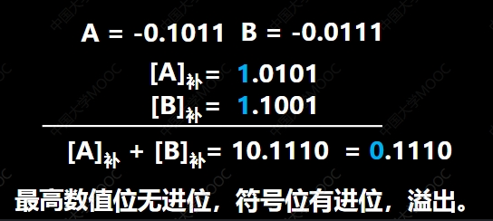
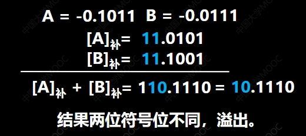
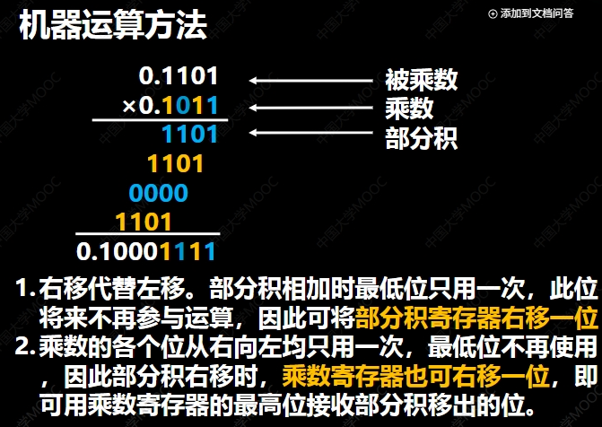
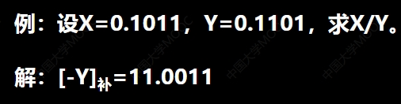
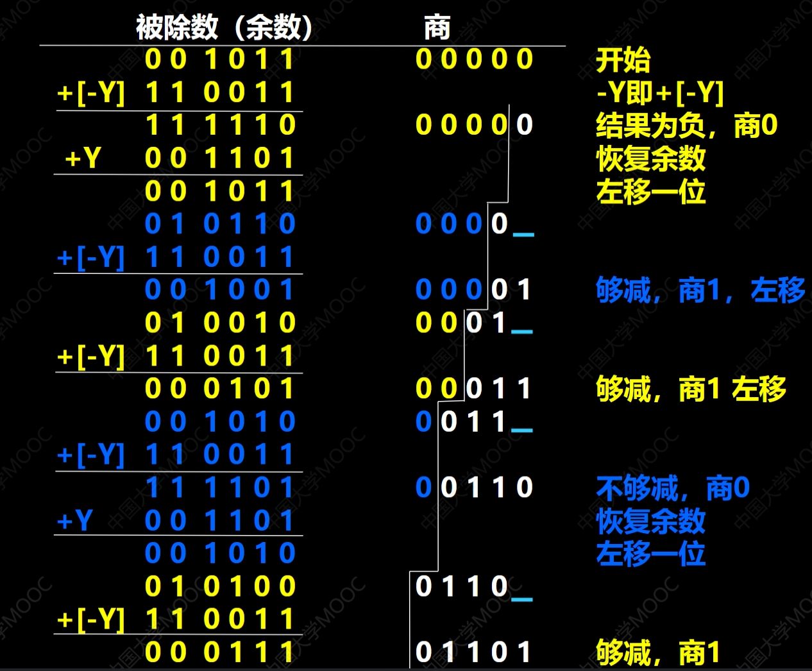
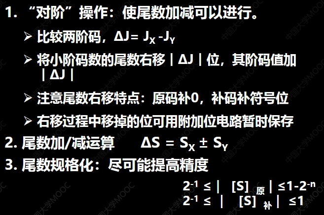
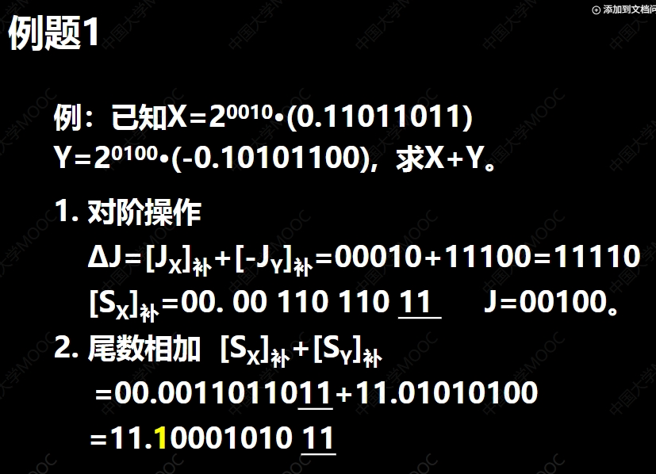
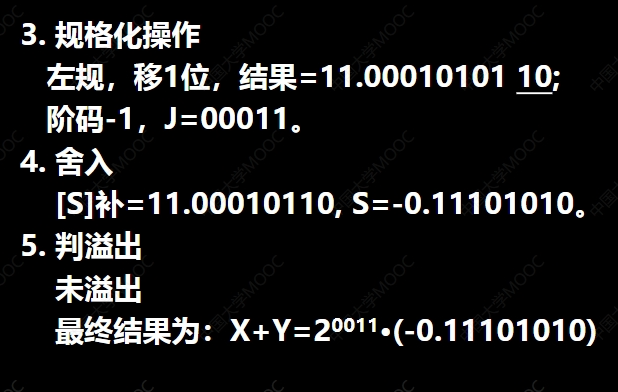

# 05计算方法
原码中符号位不直接占用权值，反码和补码占用，并且有正负
## 数的源码表示法
### 原码表示法
- 无符号数： 没有符号，只有数值
- 有符号数：有符号，有数值。（0表示正数，1表示负数）
符号数字化的数(机器数，数字原本（带有正负号）的值)真值

#### 机器数和真值


#### 定义
**符号位0表示正数，1表示负数，数值部分为真值，又称为带符号的绝对值**
**书写时，正数的符号位与数值位用‘，’分割开，小数的符号位与数值位用小数点分割**


例子：x=+1110 [x]原=0,1110
      x=-1110 [x]原=2^4+1110=1,1110
              2^4=10000
      
      x=+0.1101 [x]=0.1101
      x=-0.1101 [x]=1-(-0.1101)=1.1101

### 反码表示法 (One's Complement)

**定义：**

反码表示法是一种在计算机中表示有符号整数的方法。对于一个给定的二进制数：

* **正数和零：** 反码与原码相同。符号位为 `0`，数值位保持不变。
* **负数：** 反码是在其原码的基础上，**符号位保持不变**，**数值位按位取反**（0 变为 1，1 变为 0）。

**要点：**

* **符号位：** 最高位仍然用于表示符号（0 为正，1 为负）。
* **数值位取反：** 仅对符号位之后的数值位进行 0 和 1 的互换。
* **双零表示：** 反码表示法存在正零 (`00...0`) 和负零 (`11...1`) 两种表示形式，这是一个缺点。

**举例说明 (假设我们使用 8 位二进制来表示一个整数)：**

**例 1: 真值 +5**

1.  **原码:** `00000101` (符号位为 0，数值位为 5 的二进制)
2.  **反码:** 由于是正数，反码与原码相同，为 `00000101`。

**例 2: 真值 -3**

1.  **原码:** `10000011` (符号位为 1，数值位为 3 的二进制)
2.  **反码:** 符号位保持 `1` 不变，数值位 `0000011` 按位取反得到 `1111100`。
3.  **机器数 (反码):** `11111100`。

**例 3: 真值 +127**

1.  **原码:** `01111111`
2.  **反码:** `01111111` (正数，与原码相同)

**例 4: 真值 -126**

1.  **原码:** `1111110` (注意：8 位表示，所以是 `11111110`)
2.  **反码:** 符号位保持 `1`，数值位 `1111110` 取反得到 `0000001`。
3.  **机器数 (反码):** `10000001`。

**例 5: 真值 +0**

1.  **原码:** `00000000`
2.  **反码:** `00000000`

**例 6: 真值 -0**

1.  **原码:** `10000000`
2.  **反码:** 符号位保持 `1`，数值位 `0000000` 取反得到 `1111111`。
3.  **机器数 (反码):** `11111111` (这就是负零的表示)

**总结:**

反码表示法通过对负数的数值位进行按位取反来表示负数。虽然概念相对简单，但由于存在正零和负零，以及进行跨零的加减运算时需要进行额外的“循环进位”处理，使得它在现代计算机中不如补码表示法应用广泛。反码通常作为理解补码的一种中间过渡形式。

### 补码表示法 (Two's Complement)

**定义：**
补码表示法是现代计算机系统中最常用的表示有符号整数的方法。对于一个给定的二进制数：
正数和零： 如果 X≥0，则 [X] 补=X。也就是说，正数的补码就是其原码。
负数： 如果 X<0，则 [X] 补 =2^(n+1) + X (mod 2^(n+1)) X为真值，n为整数的位数（不包括符号位）

* **正数和零：** 补码与原码相同。符号位为 `0`，数值位保持不变。
* **负数：** 补码是在其**反码**的基础上，**末位加 1** 得到的。

**更直接的定义负数补码的方法：**

* **从右往左看，找到第一个出现的 `1`，该 `1` 及其右边的 `0` 保持不变，该 `1` 左边的所有位（符号位仍为1）按位取反。**
### 让我们来详细解释一下为什么在符号位占据权值的情况下，`11111101` 对应的值是 -3。

**回顾补码的权值：**

对于一个 n 位二进制补码数，从右往左数，每一位的权值分别是：

* 第 1 位（最右边）：2<sup>0</sup> = 1
* 第 2 位：2<sup>1</sup> = 2
* 第 3 位：2<sup>2</sup> = 4
* ...
* 第 n 位（最左边，符号位）：**-2<sup>n-1</sup>**

注意，**最高位（符号位）的权值是负的**。

**计算 `11111101` 的值（假设是 8 位补码）：**

* **第 8 位（符号位）：** 1 * (-2<sup>7</sup>) = 1 * (-128) = -128
* **第 7 位：** 1 * (2<sup>6</sup>) = 1 * 64 = 64
* **第 6 位：** 1 * (2<sup>5</sup>) = 1 * 32 = 32
* **第 5 位：** 1 * (2<sup>4</sup>) = 1 * 16 = 16
* **第 4 位：** 1 * (2<sup>3</sup>) = 1 * 8 = 8
* **第 3 位：** 1 * (2<sup>2</sup>) = 1 * 4 = 4
* **第 2 位：** 0 * (2<sup>1</sup>) = 0 * 2 = 0
* **第 1 位：** 1 * (2<sup>0</sup>) = 1 * 1 = 1

将这些权值相加：

-128 + 64 + 32 + 16 + 8 + 4 + 0 + 1 = -64 + 32 + 16 + 8 + 4 + 0 + 1
                                      = -32 + 16 + 8 + 4 + 0 + 1
                                      = -16 + 8 + 4 + 0 + 1
                                      = -8 + 4 + 0 + 1
                                      = -4 + 0 + 1
                                      = -3

**因此，当符号位占据权值 -2<sup>7</sup> 时，二进制数 `11111101` 所代表的十进制值正是 -3。**

**总结：**

补码通过赋予最高位（符号位）一个负的权值，巧妙地将正数和负数统一在了一套加法运算规则之下。当你把补码看作一个带有负权重的二进制数进行计算时，就能理解为什么 `11111101` 对应的值是 -3 了。
**要点：**

* **符号位：** 最高位仍然用于表示符号（0 为正，1 为负）。
* **统一的零表示：** 补码表示法中，正零和负零的表示是相同的，只有一个 `00...0`。
* **简化加减运算：** 补码的关键优势在于可以将减法运算转化为加法运算，简化了计算机的硬件设计。
* **更大的负数表示范围：** 对于相同的位数，补码可以表示比原码和反码多一个最小的负数。例如，对于 8 位二进制，原码和反码的表示范围是 -127 到 +127，而补码的表示范围是 -128 到 +127。

**举例说明 (假设我们使用 8 位二进制来表示一个整数)：**

**例 1: 真值 +5**

1.  **原码:** `00000101`
2.  **反码:** `00000101` (正数，与原码相同)
3.  **补码:** `00000101` (正数，与原码相同)

**例 2: 真值 -3**

1.  **原码:** `10000011`
2.  **反码:** `11111100` (符号位不变，数值位取反)
3.  **补码:** 在反码的基础上末位加 1，`11111100 + 1 = 11111101`。
4.  **机器数 (补码):** `11111101`。

**使用第二种方法计算 -3 的补码：**

1.  **原码:** `10000011`
2.  **从右往左找到第一个 `1`:** 是最右边的那个 `1`。
3.  **该 `1` 及其右边的 `0` (没有) 保持不变:** `...001`
4.  **该 `1` 左边的所有位按位取反:** `1` 变为 `0`，`00000` 变为 `11111`。
5.  **补码:** `11111101`。


**总结:**

补码表示法是计算机中表示有符号整数的关键方法。它通过对负数进行特定的转换（反码加 1 或从右往左特定规则取反）实现了零的唯一表示，并且最重要的是，简化了加减运算，使得计算机可以使用统一的加法电路来处理有符号数的加法和减法。这也是现代计算机广泛采用补码的原因。

### 移码的表示

**定义：**

移码（Offset Binary Code），也称为偏置二进制码，是一种将真值（通常是有符号数）在计算机中表示为无符号数的方法。它的主要特点是在真值的基础上加上一个固定的常数（称为偏置值或偏移量），从而将真值映射到一个非负的数值范围。

**核心思想：**

通过加上一个合适的偏置值，使得原本可能为负数的真值在移码表示中都变为正数或零。这样做的目的是为了方便在某些计算机硬件中进行大小比较等操作，因为比较无符号数比比较有符号数通常更直接。

**一般表示形式：**

假设真值为 `x`，偏置值为 `bias`，则其移码表示 `[x]_移` 为：

`[x]_移 = x + bias`

**偏置值的选择：**

偏置值的选择通常与数据的表示范围有关。


**特点：**

* **将有符号数映射为无符号数：** 这是移码最主要的目的。
* **保持数值顺序：** 真值越大，其对应的移码也越大，反之亦然。这使得可以直接通过比较移码的大小来判断真值的大小。
* **零的表示不唯一（取决于偏置值的选择）：** 当偏置值为 `2^(n-1)` 时，真值 0 的移码是 `2^(n-1)`，而负数和正数都有各自的移码表示。当偏置值为 `2^(n-1) - 1` 时，真值 0 的移码是 `2^(n-1) - 1`，同样是唯一的。
* **最小真值的移码为全0。 
* **常用于浮点数的阶码表示：** 在浮点数中，为了方便比较阶码的大小，通常使用移码来表示阶码部分。

**举例说明**


## 数的定点表示


数的定点表示是一种在计算机中表示数值的方法，其核心思想是**约定小数点（或二进制中的小数点，称为“小数点”）在数中的位置是固定不变的**。

与此相对的是**浮点表示**，浮点表示中小数点的位置是“浮动”的，通过指数来调整小数点的位置，可以表示更大范围和更高精度的数值。

**定点表示的关键点：**

1. **小数点位置固定：** 这是定点表示最核心的特征。一旦确定了小数点的位置，那么所有用这种方式表示的数值的小数点都在这个位置。

2. **有限的表示范围和精度：** 由于小数点位置固定，且用于表示整数部分和小数部分的位数是有限的，因此定点数能表示的数值范围和精度都是有限的。

3. **简单的硬件实现：** 定点数的运算规则相对简单，硬件实现也比较容易，成本较低。

**如何理解小数点位置的固定？**

我们可以想象在一个固定长度的存储单元（例如一个字节、两个字节等）中，我们事先约定好哪几位用于表示整数部分，哪几位用于表示小数部分。

**举例说明（以十进制为例）：**

假设我们用 6 位十进制数来表示一个定点数，并约定小数点固定在从右往左数第 3 位的前面。那么：

* **整数部分：** 最左边的 3 位
* **小数部分：** 最右边的 3 位

这样，我们可以表示的数值范围是 000.000 到 999.999。

* 例如，数值 `123456` 在这种定点表示下就代表 `123.456`。
* 数值 `001230` 就代表 `001.230`，即 `1.230`。

**二进制定点表示：**

在计算机中，数值通常以二进制形式存储。定点表示同样适用于二进制数。

例如，假设我们用 8 位二进制数来表示一个定点数，并约定小数点固定在从右往左数第 4 位的前面。那么：

* **整数部分：** 最左边的 4 位
* **小数部分：** 最右边的 4 位

* 二进制数 `01101011` 在这种定点表示下就代表 `0110.1011`。
* 将其转换为十进制：
    * 整数部分 `0110` (二进制) = 6 (十进制)
    * 小数部分 `1011` (二进制) = 1 * 2<sup>-1</sup> + 0 * 2<sup>-2</sup> + 1 * 2<sup>-3</sup> + 1 * 2<sup>-4</sup> = 0.5 + 0 + 0.125 + 0.0625 = 0.6875 (十进制)
    * 因此，`01101011` (二进制定点) = 6.6875 (十进制)。

**定点表示的优点：**

* **运算速度快：** 定点数的加减法等运算可以直接进行，不需要复杂的指数处理，因此运算速度较快。
* **硬件成本低：** 实现定点运算的硬件电路相对简单，成本较低。
* **可预测性：** 由于表示范围和精度固定，程序的行为更容易预测。

**定点表示的缺点：**

* **表示范围有限：** 小数点位置固定，无法灵活地表示非常大或非常小的数值。
* **精度受限：** 小数部分的位数固定，无法表示更高精度的数值。
* **需要人为进行比例缩放：** 在实际应用中，为了表示特定范围的数值，可能需要人为地进行比例缩放，这增加了编程的复杂性。

**定点表示的应用场景：**

由于其简单高效的特点，定点表示常用于以下场景：

* **嵌入式系统：** 资源受限的嵌入式系统中，定点运算可以节省计算资源和功耗。
* **数字信号处理 (DSP)：** 许多 DSP 算法对实时性要求高，定点运算可以满足这一需求。
* **早期计算机系统：** 在浮点运算硬件不普及的早期计算机中，定点运算是主要的数值表示方法。
* **某些特定的金融系统：** 有些金融系统对数值的精确性要求非常高，可能会使用定点数来避免浮点运算可能带来的精度损失。

**总结：**

数的定点表示是一种简单直观的数值表示方法，其核心在于**固定小数点的位置**。虽然其表示范围和精度有限，但在某些对速度和成本有要求的应用场景中，仍然是一种非常有效的选择。理解定点表示的关键在于理解小数点位置的固定以及由此带来的范围、精度和运算特点。

这张图片展示了**定点数**的两种常见表示方式以及不同编码方式下定点数可以表示的数值范围。

**上半部分：定点数的表示方式**

图片的上半部分展示了两种约定小数点位置的定点数表示方法：

* **第一种：表示小数**
    * 结构：**S<sub>f</sub> S<sub>1</sub> S<sub>2</sub> ... S<sub>n</sub>**
    * **S<sub>f</sub> (数符):** 表示符号位（通常 0 代表正，1 代表负）。
    * **S<sub>1</sub> S<sub>2</sub> ... S<sub>n</sub> (数值部分):** 表示数值的尾数部分。
    * **小数点位置 (小数点位置):** 约定小数点位于符号位之后，数值部分之前。这意味着这种表示方法主要用于表示绝对值小于 1 的小数。

* **第二种：表示整数**
    * 结构：**S<sub>f</sub> S<sub>1</sub> S<sub>2</sub> ... S<sub>n</sub>**
    * **S<sub>f</sub> (数符):** 表示符号位。
    * **S<sub>1</sub> S<sub>2</sub> ... S<sub>n</sub> (数值部分):** 表示数值的尾数部分。
    * **小数点位置 (小数点位置):** 约定小数点位于数值部分之后（最右边），即表示一个整数。

**下半部分：定点机中小数和整数的表示范围**

图片的下半部分是一个表格，总结了在“定点机”中，对于小数和整数，使用不同的编码方式（原码、补码、反码）时，能够表示的数值范围。

* **定点机 (定点机):** 指的是使用固定小数点表示方法的计算机系统。
* **小数 (小数):** 指的是小数点位于符号位和数值部分之间的定点数（如上半部分第一种表示）。
* **整数 (整数):** 指的是小数点位于数值部分之后的定点数（如上半部分第二种表示）。
* **原码 (原码):** 最高位为符号位，其余位表示数值的绝对值。
* **补码 (补码):** 正数的补码与原码相同；负数的补码是其反码加 1。
* **反码 (反码):** 正数的反码与原码相同；负数的反码是其原码的数值位按位取反。

表格中的数值范围（假设数值部分有 n 位）：

| 编码方式 | 小数                                    | 整数                                      |
| -------- | --------------------------------------- | ----------------------------------------- |
| 原码     | -(1 - 2<sup>-n</sup>) ~ +(1 - 2<sup>-n</sup>) | -(2<sup>n</sup> - 1) ~ +(2<sup>n</sup> - 1) |
| 补码     | -1 ~ +(1 - 2<sup>-n</sup>)               | -2<sup>n</sup> ~ +(2<sup>n</sup> - 1)            |
| 反码     | -(1 - 2<sup>-n</sup>) ~ +(1 - 2<sup>-n</sup>) | -(2<sup>n</sup> - 1) ~ +(2<sup>n</sup> - 1) |
**反码小数最小值不是-1：**
- 我们的定点小数表示中（小数点在符号位之后），数值部分的最大值只能无限接近 1，但无法达到 1

**问题一：为什么 `1.00...0` 对应的值是 `-(1 - 2⁻ⁿ)`？**

你的理解是正确的。让我们一步步分解：

1. **`0.11...1` (n 个 1)**：这是一个正数，其值为 `1/2 + 1/4 + ... + 1/2ⁿ = 1 - 2⁻ⁿ`。这是在小数点后有 n 位的情况下，能表示的最大正小数。

2. **反码的定义（负数）：** 负数的反码是对其绝对值的原码（包括符号位）**按位取反**。

3. **对 `0.11...1` 取反：** 将 `0` 变为 `1`，将所有的 `1` 变为 `0`，得到 `1.00...0`。

4. **反码的解释：** 在反码表示中，符号位为 `1` 表示这是一个负数。数值部分 `00...0` 对应于原始正数的数值部分 `11...1` 的取反。

5. **计算 `1.00...0` 的值：** 在反码系统中，一种理解负数的方法是先将其看作一个符号位为 1 的数，然后将其数值位取反，得到其绝对值。
   * `1.00...0` 的符号位是 `1`，表示负数。
   * 将其数值位 `00...0` 取反得到 `11...1`。
   * `0.11...1` 对应的十进制值是 `1 - 2⁻ⁿ`。
   * 因此，`1.00...0` 在反码中表示的是 `-(1 - 2⁻ⁿ)`。

**问题二：最小小数反码为什么不是 `1.111..1`？**

`1.11...1` 在反码中代表的是 **-0**。让我们分析一下：

1. **`1.11...1` 的符号位是 `1`，表示负数。**

2. **按照反码的规则，要得到其绝对值，我们需要将数值位（包括符号位一起取反）：**
   * 将 `1.11...1` 所有位取反得到 `0.00...0`。

3. **`0.00...0` 代表的十进制值是 0。**

4. **因此，`1.11...1` 在反码中表示的是 -0。**

**真正的最小（最负）值：**

为了得到最小的负数（即绝对值最大的负数），我们需要从最大的正数开始，然后取其反码。

* **最大正小数：** `0.11...1`，值为 `1 - 2⁻ⁿ`。
* **对其取反得到：** `1.00...0`，值为 `-(1 - 2⁻ⁿ)`。

这就是反码能表示的最小的负数。

**总结：**

* `1.00...0` 是通过对最大正小数 `0.11...1` 取反得到的，因此对应的值是 `-(1 - 2⁻ⁿ)`。
* `1.11...1` 是通过对正零 `0.00...0` 取反得到的，因此对应的值是 -0。

反码的一个特点是存在两个零：`0.00...0` (+0) 和 `1.11...1` (-0)。这与补码不同，补码只有唯一的零表示。这也解释了为什么反码的最小值不是直觉上的全 1。
**总结来说，这张图片解释了：**

1.  **定点数可以通过约定小数点的位置来表示小数或整数。**
2.  **在定点计算机中，使用不同的编码方式（原码、补码、反码）会影响能够表示的数值范围。** 例如，补码表示法在表示负数时具有独特的优势，其表示范围与原码和反码略有不同。

理解这张图片有助于理解计算机中定点数的概念以及不同表示方法之间的差异。

## 数的浮点表示


这张图片解释了计算机中**浮点数 (Floating-point number)** 的表示方法。

**N = S × r^j**

这里：

1.  **S (尾数 - Mantissa/Significand):**
    * 代表数字的有效数字部分。
    * 通常是一个小数 (fractional part)。
    * 可以是正数或负数 (可正可负)，实际存储时会有一个单独的符号位。

2.  **r (基数 - Base/Radix):**
    * 表示计数系统的基底。
    * 在计算机中，常用的基数 r 是 2 (二进制)、4、8 (八进制)、16 (十六进制) 等。图片中特别提到了这些值。

3.  **j (阶码 - Exponent):**
    * 表示基数 r 的多少次方，决定了小数点实际应该移动的位置，从而确定数的范围（大小）。
    * 是一个整数 (integer)。
    * 可以是正数、负数或零 (可正可负)。

**例子 (当 r = 2，即二进制时):**

图片给出了一个二进制数 `N = 11.0101` 的例子。这个数可以用多种浮点形式表示：

* `0.110101 × 2^10` (这里的 `10` 是二进制，表示十进制的 2)。 这意味着将 `0.110101` 的小数点向右移动 2 位，得到 `11.0101`。
* `1.10101 × 2^1` (这里的 `1` 是二进制，表示十进制的 1)。 这意味着将 `1.10101` 的小数点向右移动 1 位，得到 `11.0101`。
* `1101.01 × 2^-10` (这里的 `-10` 是二进制，表示十进制的 -2)。 这意味着将 `1101.01` 的小数点向左移动 2 位，得到 `11.0101`。
* `0.00110101 × 2^100` (这里的 `100` 是二进制，表示十进制的 4)。 这意味着将 `0.00110101` 的小数点向右移动 4 位，得到 `11.0101`。

**规格化数 (Normalized Number):**

* 图片中将 `0.110101 × 2^10` (即 `0.110101 × 2^2`) 标记为 **规格化数**。
* 规格化是为了让同一个数值的浮点表示尽可能唯一。通常规定尾数 S 的绝对值必须在某个范围内，例如 `1/r ≤ |S| < 1`。对于二进制 (r=2)，这意味着规格化尾数的最高有效位（小数点后的第一位）必须是 1 (即 `0.1xxxx...` 的形式)。
* 注意：现代计算机中最常用的 IEEE 754 标准对二进制浮点数有不同的规格化定义，通常是 `1.xxxxx...` 的形式，并隐含最高位的 1。但这张图片展示的是 `0.1xxxxx...` 形式的规格化。

**总结:**

浮点表示法通过将数字分解为 **尾数 (S)**、**基数 (r)** 和 **阶码 (j)**，允许计算机在有限的存储空间内表示非常大或非常小的数值，以及带有小数部分的数值。规格化是确保表示唯一性的重要步骤。


这张图片描述了浮点数在计算机中的表示形式。它将一个浮点数分解为几个部分来存储：

* **阶码 (Exponent):** 这部分表示数值的大小范围或者说数量级。它由两部分组成：
    * **阶符 (Exponent Sign) (Jf):** 表示指数的符号，即正还是负。
    * **阶码的数值部分 (Numerical part of the exponent) (j1, j2, ..., jm):** 表示指数的实际数值。
    * **m:** 指数数值部分的位数，它决定了浮点数可以表示的数值范围。
* **尾数 (Mantissa/Significand):** 这部分表示数值的精确度。它也由两部分组成：
    * **数符 (Sign) (Sf):** 表示浮点数本身的符号，即正数还是负数。
    * **尾数的数值部分 (Numerical part of the mantissa) (S1, S2, ..., Sn):** 表示数值的有效数字。
    * **n:** 尾数数值部分的位数，它决定了浮点数的精度。
* **小数点位置 (Decimal Point Position):** 在浮点数的表示中，小数点的位置通常是隐含的，并不需要显式存储。
* Jf (阶符): 类似于指数 b 的符号。如果 Jf 表示正，则意味着小数点需要向某个方向移动（通常是右边，取决于具体的浮点数标准）。如果 Jf 表示负，则意味着小数点需要向相反的方向移动（通常是左边）。

图片中还给出了以下解释：

* **Sf 代表浮点数的符号 (Sf represents the sign of the floating-point number).**
* **n 其位数反映浮点数的精度 (n, the number of its bits, reflects the precision of the floating-point number).** 尾数的位数越多，能表示的数值就越精确。
* **m 其位数反映浮点数的表示范围 (m, the number of its bits, reflects the representation range of the floating-point number).** 阶码的位数越多，能表示的数值范围就越大。
* **Jf 和 m 共同表示小数点的实际位置 (Jf and m together represent the actual position of the decimal point).** 指数的符号和数值共同决定了小数点相对于尾数的位置，从而确定了浮点数的实际值。小数点移动的方向和位数

总而言之，浮点数的这种表示方法允许计算机在有限的存储空间内表示非常大或非常小的数值，并且具有一定的精度。通过阶码来调整数值的范围，通过尾数来记录数值的精度。
### 浮点数的表示范围

这张图片描述了浮点数的表示范围，即计算机能够表示的浮点数值的上限和下限。它展示了数轴上浮点数的分布情况，并解释了上溢和下溢的概念。

以下是对图片内容的理解：

* **浮点数的表示范围 (Range of floating-point numbers):** 这是图表的标题。
* **数轴 (Number line):** 图中展示了一条数轴，中心为 0，向左是负数区域，向右是正数区域。
* **正数区域 (Positive number region):**
    * **最小正数 (Smallest positive number):** 表示为 `2<sup>-(2<sup>m-1</sup>)</sup> x 2<sup>-n</sup>`。这是计算机能表示的最小的正浮点数。
    * **最大正数 (Largest positive number):** 表示为 `2<sup>(2<sup>m-1</sup>)</sup> x (1 - 2<sup>-n</sup>)`。这是计算机能表示的最大的正浮点数。
* **负数区域 (Negative number region):**
    * **最小负数 (Smallest negative number):** 表示为 `-2<sup>(2<sup>m-1</sup>)</sup> x (1 - 2<sup>-n</sup>)`。这是计算机能表示的绝对值最大的负浮点数。
    * **最大负数 (Largest negative number):** 表示为 `-2<sup>-(2<sup>m-1</sup>)</sup> x 2<sup>-n</sup>`。这是计算机能表示的绝对值最小的负浮点数。
* **上溢 (Overflow):**
    * **上溢 (正数区):** 当计算结果大于最大正数时，发生上溢。图中表示为 "阶码 > 最大阶码" (Exponent > Maximum exponent)。
    * **上溢 (负数区):** 当计算结果小于最小负数（即绝对值大于最大负数）时，也发生上溢。
    * **中断溢出处理 (Interrupt overflow handling):** 当发生上溢时，通常会触发中断并进行相应的处理。
* **下溢 (Underflow):**
    * **下溢 (正数区):** 当计算结果小于最小正数且不为零时，发生下溢。图中表示为 "阶码 < 最小阶码" (Exponent < Minimum exponent)。
    * **下溢 (负数区):** 当计算结果大于最大负数且不为零时，也发生下溢。
    * **按机器零处理 (Handle as machine zero):** 当发生下溢时，计算结果通常会被近似为机器零。

### 浮点数的规格化表示
浮点数的规格化表示是为了确保表示的唯一性，并尽可能提高数值的精度。规格化涉及到调整尾数和指数，使得尾数在一个特定的范围内。这里我们来理解一下“左规”和“右规”。

**规格化表示的目标:**

对于一个非零的浮点数，我们希望通过调整尾数和指数，使得尾数满足一定的条件。最常见的规格化要求是让尾数的最高有效位是一个非零的数。对于二进制浮点数来说，这意味着尾数的第一个有效位是 1。

**1. 左规 (Left Normalization)**

* **场景:** 当浮点数运算的结果，或者初始给定的浮点数的尾数部分，其最高有效位不是 1，或者存在前导零时，需要进行左规。这通常发生在尾数过小的情况下。
* **操作:**
    1. 将尾数向左移动一位，相当于尾数乘以 2。
    2. 将指数减 1，以保持数值大小不变 (因为尾数乘以 2，所以指数要除以 2，即减 1)。
* **目的:** 通过左移尾数，将第一个非零位（通常是 1）移动到小数点后（或者小数点前，取决于具体的规格化定义），从而提高有效数字的位数，即提高精度。
* **示例 (二进制):**
    假设我们有一个浮点数，其尾数是 `0.00110...`，指数是 `5`。
    进行左规：
    * 尾数左移一位：`0.0110...`，指数变为 `4`。
    * 尾数再左移一位：`0.110...`，指数变为 `3`。
    现在，尾数的第一个有效位是 1（在小数点后），达到了规格化的目的。

**2. 右规 (Right Normalization)**

* **场景:** 当浮点数运算的结果，其尾数部分超出了规定的范围（例如，发生了溢出），需要进行右规。这通常发生在尾数过大的情况下。
* **操作:**
    1. 将尾数向右移动一位，相当于尾数除以 2。
    2. 将指数加 1，以保持数值大小不变 (因为尾数除以 2，所以指数要乘以 2，即加 1)。
* **目的:** 通过右移尾数，将尾数调整回规定的范围内，通常是为了防止溢出。
* **示例 (二进制):**
    假设我们有一个浮点数，其尾数是 `10.110...`（假设尾数的小数点前只能有一位有效数字），指数是 `3`。
    进行右规：
    * 尾数右移一位：`1.0110...`，指数变为 `4`。
    现在，尾数的小数点前只有一位有效数字，符合了规格化的要求。

**总结:**

* **左规 (Left Normalization):** 用于处理尾数中出现前导零的情况，通过左移尾数和减小指数来提高精度，使得尾数的最高有效位为 1。
* **右规 (Right Normalization):** 用于处理尾数溢出的情况，通过右移尾数和增加指数来将尾数调整回规定范围。

这两种规格化操作是浮点数运算中非常重要的步骤，它们保证了浮点数表示的标准化，从而使得数值的比较和运算更加可靠。在 IEEE 754 等浮点数标准中，都定义了明确的规格化形式。对于规范化的浮点数，通常要求尾数的小数点前有一位非零的数（对于二进制是 1），这通常通过左规来实现。右规通常在某些运算后需要进行调整。
   

* **基数 r 越大，可表示的浮点数的范围越大**
* **基数 r 越大，浮点数的精度降低**

**1. 基数 r 越大，可表示的浮点数的范围越大**

* **理解:** 在浮点数的表示中，基数（通常是 2 对于计算机内部表示，但也可以是其他值，例如在某些理论模型中）是指数的底。指数部分决定了数值的“大小”或数量级。
* **原因:** 当基数 `r` 增大时，相同的指数值可以表示更大的数值。
    * 例如，假设我们用一位指数来表示 `r^e`。
    * 如果 `r=2`，指数为 3，则表示 `2^3 = 8`。
    * 如果 `r=10`，指数为 3，则表示 `10^3 = 1000`。
    * 可以看到，相同的指数值，基数越大，表示的数值越大。
* **结论:** 因此，使用更大的基数可以使得在相同的指数范围下，浮点数能够表示的数值范围（从很小到很大）更广。

**2. 基数 r 越大，浮点数的精度降低**

* **理解:** 精度指的是浮点数能够表示的有效数字的位数。这通常与尾数的位数有关。
* **原因:** 当基数 `r` 增大时，对于相同位数的尾数，它所能表示的数值之间的间隔也会增大，从而导致精度降低。
    * 考虑一个简单的例子，假设我们用 3 位尾数（不包括符号位）来表示 `±d1.d2d3 × r^e`，其中 `di` 是 0 到 `r-1` 的数字。
    * 如果 `r=2`，尾数可以表示 `0.000` 到 `1.111` (二进制)，即 0 到接近 2 的范围，可以区分更小的数值间隔。
    * 如果 `r=10`，尾数可以表示 `0.000` 到 `9.999` (十进制)，即 0 到接近 10 的范围。虽然能表示更大的数，但相邻两个可表示数之间的间隔也更大。
* **更深入的理解:** 假设尾数有 `n` 位。那么它可以表示大约 `r^n` 个不同的值。如果基数 `r` 较大，那么这 `r^n` 个值会分布在一个更广的范围内，导致相邻数值之间的“步长”更大，因此精度相对较低。为了达到相同的精度，可能需要更多的尾数位数。

**总结:**
* **范围 (Range):** 更大的基数可以扩展浮点数能够表示的数值范围。
* **精度 (Precision):** 更大的基数可能会降低浮点数在一定尾数位数下所能达到的精度。

### 定点数与浮点数比较
* **数的表示位数相同时，浮点数的表示范围远大于定点数的表示范围。**
    * **理解:** 假设我们都用同样的位数来存储一个数值。定点数的小数点位置是固定的，因此能表示的数值范围是有限的，且数值之间的间隔也是固定的。浮点数通过使用指数（阶码）来动态调整小数点的位置，从而可以在相同的总位数下表示非常大或非常小的数值。
    * **例子:** 假设我们用 8 位来表示一个数。如果用定点数，我们可以固定小数点在中间，那么可以表示的范围可能就是 -12.7 到 +12.7，精度是 0.1。如果用浮点数，同样的 8 位可以表示非常广阔的范围，例如很小的分数到很大的整数，只是精度在不同范围内会有所不同。

* **当浮点数为规格化时，其相对精度比定点数高。**
    * **理解:** 规格化浮点数（如我们之前讨论的左规）通过确保尾数的最高有效位非零，从而最大化了有效数字的位数。定点数的精度是固定的，由小数点后的位数决定。对于浮点数，其相对精度（有效数字相对于数值大小的比例）在规格化后通常比相同总位数的定点数更高，尤其是在表示非常大或非常小的数时。
    * **例子:** 对于一个很大的数，定点数可能无法表示，而浮点数可以，并且能保持一定的有效数字。对于很小的数，浮点数也能表示，而定点数可能只能表示为 0。

* **浮点数表示方法复杂，运算复杂，速度慢。**
    * **理解:** 浮点数的内部表示需要存储符号、指数和尾数，这比定点数直接存储数值要复杂。进行浮点数运算（加减乘除）时，需要处理指数的对齐、尾数的运算以及结果的规格化等步骤，这些都比定点数的直接运算要复杂，因此通常速度也更慢，且需要更复杂的硬件支持。

* **在溢出判断和编程方面，定点数比浮点数繁琐（定点数：比例因子；浮点数：上溢）。**
    * **理解:**
        * **定点数:** 使用定点数时，程序员需要仔细选择小数点的位置（比例因子），以确保在运算过程中不会发生溢出或精度损失。溢出的判断也需要在数值超出预设范围时进行额外的处理，这可能比较繁琐。
        * **浮点数:** 浮点数有专门的机制来处理超出表示范围的情况，例如上溢（数值过大）和下溢（数值过小接近于零）。当发生上溢时，通常会得到一个特殊的表示（如无穷大），这在某些情况下可以简化溢出的判断和处理。
    * **对比:** 虽然浮点数的表示和运算更复杂，但在处理数值范围和溢出方面，其提供的机制（如上溢、下溢）在某些情况下可能比定点数需要手动管理的比例因子和溢出判断更方便。

**总结:**

这张图片总结了定点数和浮点数的主要区别和优缺点：

* **浮点数的优势:** 更大的表示范围和更高的相对精度（在规格化时）。
* **定点数的优势:** 表示和运算更简单，速度更快。
* **浮点数的劣势:** 表示和运算更复杂，速度可能较慢。
* **定点数的劣势:** 表示范围有限，溢出和精度控制可能更繁琐。

选择使用定点数还是浮点数取决于具体的应用场景，需要根据数值范围、精度要求、运算速度以及实现的复杂度等因素进行权衡。

### 机器零

这张图片解释了浮点数中的**机器零 (Machine Zero)** 的概念。机器零是指计算机在处理浮点数时，将一些非常接近零或者实际为零的值统一表示为零。这有助于简化硬件实现和处理浮点数运算中的特殊情况。

图片中给出了以下几点：

* **浮点数尾数为 0 时，不论其阶码为何值按机器零处理。**
    * **理解:** 如果浮点数的尾数部分是 0，那么这个数的值就是 0 乘以 2 的某个幂次方，结果仍然是 0。因此，在这种情况下，阶码的值不会影响最终的数值，都被认为是机器零。

* **当浮点数阶码等于或小于它所表示的最小数时，不论尾数为任何值，按机器零处理。**
    * **理解:** 阶码决定了浮点数的数量级。如果阶码已经达到了或低于系统能表示的最小的指数值（这通常对应于浮点数的下溢），那么这个数的值将非常接近于零，以至于在计算机的精度范围内可以被认为是零。即使尾数不是 0，由于指数非常小，其结果也会被当作机器零。这与之前讨论的“下溢”概念相关。

* **示例 (假设 m=4 位阶码，n=10 位尾数):**

    * **当阶码和尾数都用补码表示时，机器零为:**
        * `x, x, x, x; 0, 0, 0, 0, 0, 0, 0, 0, 0, 0`
            * **理解:** 这里 `x, x, x, x` 表示阶码可以是任意值，但只要尾数是全 0 (`0, 0, ..., 0`)，整个浮点数就被认为是机器零。这符合第一条规则。
        * `(阶码 = -16) 1, 0, 0, 0; x, x, ...`
            * **理解:** 这里假设阶码用 4 位补码表示。通常 4 位补码的范围是 -8 到 +7。但是这里写的是 `(阶码 = -16)`，这超出了这个范围，表示一个非常小的指数值（可能代表了最小值或者更小）。在这种情况下，即使尾数 `x, x, ...` 不是全 0，整个数也被认为是机器零。这符合第二条规则。**注意:** 4 位补码通常不表示 -16。这可能是一个特殊的定义或者为了说明当指数非常小时的情况。

    * **当阶码用移码，尾数用补码表示时，机器零为:**
        * `0, 0, 0, 0; 0, 0, 0, 0, 0, 0, 0, 0, 0, 0`
            * **理解:** 阶码用移码表示时，通常全 0 代表最小的指数值。当阶码是全 0 且尾数也是全 0 时，自然是机器零。
        * `0, 0, 0, 0; x, x, ...`
            * **理解:** 即使尾数 `x, x, ...` 不是全 0，只要阶码是全 0（代表最小的指数），整个数也被认为是机器零。

* **有利于机器中“判 0”电路的实现。**
    * **理解:** 通过定义机器零，计算机在硬件层面可以更容易地判断一个浮点数是否为零。例如，只需要检查尾数是否全为 0，或者检查阶码是否达到了最小允许值。这简化了比较和条件判断等操作的实现。

**总结:**

机器零是浮点数表示中一个重要的概念，它定义了计算机如何处理数值上非常接近于零的情况。主要有两种情况会被认为是机器零：一是尾数为 0，二是阶码过小（下溢）。这种定义简化了硬件设计，并有助于处理浮点数运算的边界情况。

## 定点数移位运算
### 什么是算术移位？

算术移位是一种在二进制表示的定点数上执行的移位操作，它保留了数值的符号。这与逻辑移位不同，逻辑移位只是简单地移动位，并在空出的位置填充零。算术移位在进行乘除法运算时非常有用，特别是乘以或除以 2 的幂次方。

### 算术左移

* **操作：** 将定点数的所有位向左移动指定的位数。
* **空位填充：** 右侧空出的位用 **0** 填充。
* **效果：** 相当于将该数值乘以 2 的移动位数次方。
* **注意事项：**
    * 如果移动后，符号位发生改变（对于有符号数），则可能发生**溢出**，导致结果不正确。
    * 对于无符号数，左移不会改变符号，但可能超出其表示范围。

**举例说明（假设我们有一个 8 位定点数，其中 4 位表示整数部分，4 位表示小数部分）：**

假设我们有一个二进制数 `0001.1010`，它表示十进制数 1.625。

执行算术左移 1 位：

`0001.1010` 左移 1 位变为 `0011.0100`

这个二进制数 `0011.0100` 转换为十进制是 3.25。可以看到，1.625 * 2 = 3.25。

执行算术左移 2 位：

`0001.1010` 左移 2 位变为 `0110.1000`

这个二进制数 `0110.1000` 转换为十进制是 6.5。可以看到，1.625 * 2 * 2 = 6.5。

**有符号数的溢出示例（假设最高位是符号位）：**

假设我们有一个 8 位有符号定点数 `0111.1111` (正数，接近最大值)。

执行算术左移 1 位：

`0111.1111` 左移 1 位变为 `1111.1110`

原本是正数，左移后符号位变成了 1，表示负数，发生了溢出。

### 算术右移

* **操作：** 将定点数的所有位向右移动指定的位数。
* **空位填充：**
    * 对于**正数**和**无符号数**，左侧空出的位用 **0** 填充。
    * 对于**负数**（通常使用补码表示），左侧空出的位用**符号位**填充，这称为**符号扩展**。目的是在右移后保持数值的符号不变。
* **效果：** 相当于将该数值除以 2 的移动位数次方。
* **注意事项：**
    * 对于负数的右移，符号扩展保证了数值在除以 2 后仍然是负数。
    * 可能会丢失最低有效位，导致精度损失。

**举例说明（仍然假设我们有一个 8 位定点数，其中 4 位表示整数部分，4 位表示小数部分）：**

假设我们有一个二进制数 `0010.1100`，它表示十进制数 2.75。

执行算术右移 1 位：

`0010.1100` 右移 1 位变为 `0001.0110`

这个二进制数 `0001.0110` 转换为十进制是 1.375。可以看到，2.75 / 2 = 1.375。

执行算术右移 2 位：

`0010.1100` 右移 2 位变为 `0000.1011`

这个二进制数 `0000.1011` 转换为十进制是 0.6875。可以看到，2.75 / 2 / 2 = 0.6875。

**有符号负数的右移示例（假设使用补码表示，最高位是符号位）：**

假设我们有一个 8 位有符号定点数 `-2.75`，其补码表示可能为 `1101.0100`。

执行算术右移 1 位：

`1101.0100` 右移 1 位变为 `1110.1010` (注意左侧填充了符号位 `1`)

这个二进制数 `1110.1010` 仍然表示一个负数，其绝对值大约是 2.75 / 2 = 1.375。

执行算术右移 2 位：

`1101.0100` 右移 2 位变为 `1111.0101` (注意左侧填充了符号位 `1`)

这个二进制数 `1111.0101` 仍然表示一个负数，其绝对值大约是 2.75 / 2 / 2 = 0.6875。

**总结一下：**

* **算术左移** 相当于乘以 2 的幂次方，右侧补 0，可能发生溢出。
* **算术右移** 相当于除以 2 的幂次方，左侧补 0（正数/无符号数）或符号位（负数），可能损失精度。


### 什么是逻辑移位？

逻辑移位是一种在二进制表示的定点数上执行的移位操作，它将数值视为一个**纯粹的比特序列**，而不考虑其算术意义或符号。与算术移位不同，逻辑移位在移位后空出的位置总是填充 **0**。

### 逻辑左移

* **操作：** 将定点数的所有位向左移动指定的位数。
* **空位填充：** 右侧空出的位用 **0** 填充。
* **效果：**
    * 从数值的角度来看，逻辑左移在一定程度上类似于乘以 2 的幂次方，但**不考虑符号**。
    * 如果左移导致高位（包括可能的符号位）被移出，这些位将被丢弃。
* **应用场景：** 逻辑左移常用于对位模式进行操作，例如在某些数据处理或控制应用中。

**举例说明（假设我们有一个 8 位定点数，其中 4 位表示整数部分，4 位表示小数部分）：**

假设我们有一个二进制数 `1010.0110`，它表示一个数值（我们暂时不关心它的具体十进制值）。

执行逻辑左移 1 位：

`1010.0110` 逻辑左移 1 位变为 `0100.1100`

可以看到，所有位都向左移动了一位，原来的最高位 `1` 被移出丢弃，最低位用 `0` 填充。

执行逻辑左移 2 位：

`1010.0110` 逻辑左移 2 位变为 `0100.1100` -> `1001.1000`

再次，所有位向左移动，高位被丢弃，低位用 `0` 填充。

### 逻辑右移

* **操作：** 将定点数的所有位向右移动指定的位数。
* **空位填充：** 左侧空出的位用 **0** 填充。
* **效果：**
    * 从数值的角度来看，逻辑右移在一定程度上类似于除以 2 的幂次方，但**不考虑符号**。
    * 最低有效位会被移出并丢弃。
* **应用场景：** 逻辑右移也常用于对位模式进行操作，例如在数据提取或位字段处理中。

**举例说明（仍然假设我们有一个 8 位定点数，其中 4 位表示整数部分，4 位表示小数部分）：**

假设我们有一个二进制数 `1010.0110`。

执行逻辑右移 1 位：

`1010.0110` 逻辑右移 1 位变为 `0101.0011`

可以看到，所有位都向右移动了一位，原来的最低位 `0` 被移出丢弃，最高位用 `0` 填充。

执行逻辑右移 2 位：

`1010.0110` 逻辑右移 2 位变为 `0101.0011` -> `0010.1001`

再次，所有位向右移动，低位被丢弃，高位用 `0` 填充。

### 逻辑移位与算术移位的区别

关键的区别在于如何填充移位后空出的位以及是否保留符号：

* **算术移位：**
    * 左移时，右侧填充 **0**。
    * 右移时，左侧填充 **符号位**（对于有符号数）或 **0**（对于无符号数）。目的是保留数值的符号。
* **逻辑移位：**
    * 左移时，右侧填充 **0**。
    * 右移时，左侧填充 **0**。**不考虑符号**，将数值视为纯粹的比特序列。

**总结一下：**

* **逻辑左移** 将所有位向左移动，右侧补 0，高位被丢弃。
* **逻辑右移** 将所有位向右移动，左侧补 0，低位被丢弃。

在处理定点数时，选择使用算术移位还是逻辑移位取决于具体的应用场景和对数值符号的考虑。如果需要进行乘以或除以 2 的幂次方的运算并保留数值的符号，通常会使用算术移位。如果只是需要对二进制位进行操作，而不关心其算术意义，则会使用逻辑移位。

### 整数与浮点数的表示差异：
**整数**可以在其表示范围内精确地表示每一个整数值。例如，一个 8 位整数可以精确地表示 -128 到 127 之间的每一个整数。
**浮点数**通常是对一个无法精确表示的实数的近似。由于计算机的存储空间是有限的，而实数是无限且连续的，因此浮点数只能表示有限个数值。对于大多数实数，我们只能找到一个最接近的浮点数来表示它。

* **浮点数的精度限制：**
    * 例如，在 0 和 1 之间存在着无穷多个实数。
    * 但是，一个标准的 64 位浮点数（通常称为双精度浮点数）只能精确地表示 2<sup>53</sup> 个不同的数值。这个数字来源于其尾数部分的位数。
    * 因此，当我们用浮点数表示实数时，我们能做的就是给出尽可能接近实际数值的浮点数表示。这会导致一定的精度损失，尤其是在进行多次运算后，误差可能会累积。

* **IEEE 754 标准提供的舍入方法：**
    * **保护位 (Guard Bit)、舍入位 (Round Bit)、粘滞位 (Sticky Bit)：** 这三个额外的位在浮点运算的中间结果中被使用，以提高舍入的准确性。
        * **保护位**是执行运算时在最低有效位之后产生的第一位。
        * **舍入位**是保护位之后的下一位。
        * **粘滞位**是舍入位之后所有位的逻辑或。如果这些位中任何一个为 1，则粘滞位为 1，否则为 0。
    * **奇数加 1，偶数截尾 (Round to Nearest Even)：** 这是一种最常用的舍入策略。当需要舍入的数值正好位于两个可表示的浮点数中间时，它会舍入到最近的偶数（即尾数部分的最后一位是 0 的那个）。这种方法在统计上可以减少舍入误差的累积。
    * **混合基数转换 (Mixed Radix Conversion)：** 这通常涉及到在不同的数值表示系统（例如，十进制和二进制）之间进行精确转换的技术，这对于保证浮点数运算的准确性非常重要。


## 定点数加减法及溢出判断
### 补码加减运算


**补码加减运算公式**

**1. 加法**

* **整数：** `[A]补 + [B]补 = [A + B]补 (mod 2^(n+1))`
* **小数：** `[A]补 + [B]补 = [A + B]补 (mod 2)`

**解释：**

* **`[A]补` 和 `[B]补`**:  分别表示整数或小数 A 和 B 的补码形式。
* **`[A + B]补`**: 表示 A 和 B 的算术和的补码形式。
* **`(mod 2^(n+1))` (对于整数)**:
    * `n` 通常指的是表示该整数（不包括符号位）的位数。
    * `n+1` 则包括了符号位。
    * `mod 2^(n+1)` 表示结果需要对 2 的 `n+1` 次方取模。在补码运算中，这实际上意味着如果结果超出了 `n+1` 位所能表示的范围（即发生了溢出），那么溢出的最高位将被丢弃，最终结果仍然会保持在 `n+1` 位以内。
    * **本质上，在补码加法中，符号位和数值位一起参与运算，不需要特殊处理。如果最高位（符号位）产生了进位，这个进位会被自然丢弃，结果仍然是正确的补码表示（在没有真正溢出的情况下）。**

* **`(mod 2)` (对于小数)**:
    * 在定点小数的补码表示中，通常约定小数点位于符号位之后，数值部分占一定的位数。
    * `mod 2` 在这里表示，如果运算结果的整数部分超出了 1 位（即符号位），那么多余的整数部分将被丢弃，只保留小数点后的部分。
    * **对于纯小数（绝对值小于 1），符号位之后的才是数值部分。补码加法同样是符号位和数值位一起运算。如果符号位产生了进位，这个进位也会被丢弃。**

**简单来说，补码加法的核心思想是：**

* 将要相加的两个数的补码直接进行二进制加法运算（包括符号位）。
* 运算结果的最高位（符号位）也参与加法。
* 如果最高位产生了进位，则将该进位丢弃。
* 最终得到的结果就是和的补码。

**举例 (整数):**

假设我们用 4 位补码表示整数（1 位符号位，3 位数值位）。
计算 3 + (-2):

* [3]原 = 0011, [3]补 = 0011
* [-2]原 = 1010, [-2]补 = 1110 (取反加一)

进行补码加法：
```
  0011 ([3]补)
+ 1110 ([-2]补)
-------
 10001
```
结果是 5 位 `10001`。根据公式 `mod 2^(4)` (因为是 4 位补码)，丢弃最高位的 `1`，得到 `0001`。
`0001` 的十进制值是 1，这正是 3 + (-2) 的结果。

**举例 (小数):**

假设我们用 4 位补码表示纯小数（1 位符号位，3 位小数位）。
计算 0.5 + (-0.25):

* [0.5]原 = 0.100, [0.5]补 = 0.100
* [-0.25]原 = 1.010, [-0.25]补 = 1.110 (假设小数点在符号位后)

进行补码加法：
```
  0.100 ([0.5]补)
+ 1.110 ([-0.25]补)
-------
 10.010
```
结果是 `10.010`。根据公式 `mod 2`，整数部分 `10` 超出了 1 位，丢弃高位的 `1`，得到 `0.010`。
`0.010` 的十进制值是 0.25，这正是 0.5 + (-0.25) 的结果。

**注意：** 上面的小数例子可能不是最标准的定点小数补码表示方法，但它旨在说明 `mod 2` 的含义，即关注小数点后的数值部分。在实际应用中，需要根据具体的定点数格式来理解。

总而言之，补码的加法运算非常方便，因为它将带符号数的加法统一转换为无符号数的加法，并通过取模运算自动处理溢出（在一定范围内）。


### 溢出
**什么是溢出**：
运算结果超出计算机字长所能表示范围的情况--溢出

**溢出判断**

**1. (符号相同两数) 一位符号位判断溢出：**

参与运算的两个数（减法时即为被减数和求补后的减数）符号相同，其结果的符号与原操作数的符号不同，即为溢出。

**详细解释：**

* **符号相同：** 指的是两个参与运算的数，它们的符号位是相同的。
    * 如果是加法运算，就是两个正数相加（符号位都是 0）或者两个负数相加（符号位都是 1）。
    * 如果是减法运算 (A - B)，在计算机中通常会转换为加法运算 (A + (-B))，即 A 加上 B 的补码。所以这里指的是被减数 A 的符号位和减数 B 的补码形式 (-B 的补码) 的符号位相同。

* **结果的符号与原操作数的符号不同：** 指的是运算结果的符号位与最初参与运算的两个数的符号位相反。
    * **正数 + 正数 = 负数：** 如果两个正数相加，理论上结果应该还是正数。如果结果的符号位变成了 1（表示负数），那么就发生了上溢（结果超出了正数能表示的最大范围）。
    * **负数 + 负数 = 正数：** 如果两个负数相加，理论上结果应该还是负数。如果结果的符号位变成了 0（表示正数），那么就发生了下溢（结果超出了负数能表示的最小范围）。

**举例说明 (假设使用 4 位补码，一位符号位，三位数值位)：**

**上溢 (正数 + 正数 = 负数):**

* 计算 3 + 4:
    * [3]补 = 0011
    * [4]补 = 0100
    * [3]补 + [4]补 = 0011 + 0100 = 0111 (结果是 7，符号位为 0，正确)

* 计算 3 + 5:
    * [3]补 = 0011
    * [5]补 = 0101
    * [3]补 + [5]补 = 0011 + 0101 = 1000 (结果的符号位变成了 1，表示负数 -8，发生了上溢)
    * 原始操作数 3 和 5 都是正数（符号位为 0），但结果的符号位是 1，因此发生溢出。

**下溢 (负数 + 负数 = 正数):**

* 计算 (-2) + (-3):
    * [-2]补 = 1110
    * [-3]补 = 1101
    * [-2]补 + [-3]补 = 1110 + 1101 = 11011 (舍弃最高位的进位) = 1011 (结果是 -5，符号位为 1，正确)

* 计算 (-4) + (-5):
    * [-4]补 = 1100
    * [-5]补 = 1011
    * [-4]补 + [-5]补 = 1100 + 1011 = 10111 (舍弃最高位的进位) = 0111 (结果的符号位变成了 0，表示正数 7，发生了下溢)
    * 原始操作数 -4 和 -5 都是负数（符号位为 1），但结果的符号位是 0，因此发生溢出。

**总结：**

对于一位符号位的补码运算，当两个符号相同的数相加（或相减，转换为加法后符号相同），如果结果的符号位与原来的符号位不同，就表示发生了溢出，结果超出了该数据类型所能表示的范围。

**2. (任意符号位两数) 一位符号位判断溢出：**

参与运算的两个数，符号位可以不同，如果运算结果中**最高数值位**的进位与**符号位**的进位不同，则发生了溢出。

**详细解释：**

* **符号位可以不同：** 这意味着参与运算的两个数，一个可能是正数（符号位为 0），另一个可能是负数（符号位为 1）。这种情况通常发生在加法运算中，例如正数加负数，或者在减法运算中，被减数和求补后的减数符号不同。

* **最高数值位：** 指的是符号位之前的最高一位数值位。

* **进位：** 指的是在进行二进制加法时，某一位产生的向更高位的进位。

* **最高数值位的进位与符号位的进位不同：**
    * 在补码加法中，符号位也作为一位参与运算。
    * **最高数值位的进位**是指数值部分的最高位（紧邻符号位）在加法运算时产生的进位。
    * **符号位的进位**是指符号位本身在加法运算时产生的进位（如果存在的话）。
    * **如果这两个进位不同（一个产生了进位，另一个没有），则表示发生了溢出。**

**逻辑理解：**

* **没有溢出：**
    * 如果最高数值位产生了进位，并且符号位也产生了进位（两个都有进位），这意味着数值部分产生了进位并影响了符号位，但符号位的性质没有改变，结果仍然在表示范围内。
    * 如果最高数值位没有产生进位，并且符号位也没有产生进位（两个都没有进位），这意味着数值部分没有超出范围，符号位也没有改变，结果是正确的。

* **发生溢出：**
    * 如果最高数值位产生了进位，但符号位没有产生进位，这意味着数值部分的进位“挤占”了符号位，导致符号位翻转，结果的符号错误，发生了溢出（通常是上溢，例如一个很大的正数加一个较小的负数，结果变成了负数）。
    * 如果最高数值位没有产生进位，但符号位产生了进位，这意味着符号位发生了不应有的改变，结果的符号错误，发生了溢出（通常是下溢，例如一个很小的负数加一个较大的正数，结果变成了正数）。

**举例说明：**


**3. 两位符号位判断溢出：**

参与运算的两个数，均采用双符号位（变形补码），如果结果的两位符号位不同，则发生了溢出。

**详细解释：**

* **双符号位（变形补码）：** 在变形补码中，正数用 `00` 表示符号位，负数用 `11` 表示符号位。这样做的好处是可以更方便地判断溢出。

* **运算过程：** 两个采用双符号位的数进行加法运算时，符号位也作为数值的一部分参与运算。

* **溢出判断：** 运算结果的两位符号位如果出现 `01` 或 `10` 的情况，则表示发生了溢出。
    * **结果符号位为 `01`：** 表示发生了正溢出（上溢）。原本应该是正数，但结果超出了正数能表示的最大范围，导致符号位变成了 `01`。
    * **结果符号位为 `10`：** 表示发生了负溢出（下溢）。原本应该是负数，但结果超出了负数能表示的最小范围，导致符号位变成了 `10`。
    * **结果符号位为 `00`：** 表示结果为正数，没有溢出。
    * **结果符号位为 `11`：** 表示结果为负数，没有溢出。

**举例说明 (假设使用变形补码，两位符号位，三位数值位):**



### 补码加减法硬件

这张图片展示了一个 **补码加减法硬件电路** 的框图。

以下是对图中各个部分的解释：

* **A, X 均为 n+1 位 (A, X are both n+1 bits):** 这表示输入到电路中的两个操作数 A 和 X 都是 n+1 位的二进制数。在补码表示中，最高位通常用作符号位。
* **加法器 (n+1) (Adder (n+1)):** 这是电路的核心部分，一个能够执行 (n+1) 位二进制数加法运算的加法器。
* **求补控制逻辑 (Complementation Control Logic):** 这个模块负责根据控制信号来决定是否对输入 X 进行求补运算。求补运算是实现减法的基础，因为 A - X 可以通过 A + (-X) 来实现，而 -X 在补码中可以通过对 X 进行求反加一的操作得到。
* **用减法标记 Gs 控制求补逻辑 (Use subtraction flag Gs to control complementation logic):** 这说明有一个控制信号 Gs，当 Gs 被激活（通常为1）时，求补控制逻辑会对输入 X 进行求补运算，从而实现减法。如果 Gs 未被激活（通常为0），则不对 X 进行求补，电路执行加法运算。
* **V:** 这个方框可能表示电路的最终输出结果，即 A + X 或 A - X 的结果。
* **溢出判断 (Overflow Detection):** 这个模块用于检测在加法或减法运算过程中是否发生了溢出。在补码运算中，溢出发生在两个相同符号的数相加（或不同符号的数相减）时，结果的符号位与预期不符的情况。
* **Ga, Gs:** 这可能是电路的输出标志信号。Gs 可能是前面提到的减法标记，也可能是其他的状态标志。Ga 的具体含义需要更多上下文，但可能与加法运算的状态有关。
* **0:** 在输入 A 和 X 的旁边都有一个 "0" 的标记，这可能表示在进行加法或减法运算时，可能会有一个初始的进位输入为 0。

**通过控制信号 Gs，可以选择执行加法（Gs=0）或减法（Gs=1，通过对操作数 X 进行求补来实现）。电路还包含了溢出检测功能，并可能输出一些状态标志信号。**

### 多媒体算术运算 (Recommended Reading: Multimedia Arithmetic Operations)

* **在图像系统中，一般用 8 位表示一个颜色分量；在音频系统中，音频一般用 16 位精度。 (In image systems, generally 8 bits are used to represent a color component; in audio systems, audio generally uses 16-bit precision.):** 这句话指出了在多媒体数据中，图像和音频数据通常使用的数据位宽。例如，在常见的 RGB 颜色模型中，每个颜色分量（红、绿、蓝）通常用 8 位来表示，可以表示 2<sup>8</sup> = 256 种不同的强度。音频信号的采样精度通常更高，例如使用 16 位来表示一个采样点，提供更高的动态范围和声音细节。

* **一般微处理器除了数据传输操作外，很少有指令直接支持这么短位长的操作。 (Generally, microprocessors, besides data transfer operations, rarely have instructions that directly support such short bit-length operations.):** 这句话说明了现代通用微处理器通常以更长的位宽（例如 32 位、64 位）进行运算。对于像 8 位或 16 位这样的较短位宽的数据，微处理器可能没有专门优化的指令集来直接处理。

* **解决方案是将 64 位加法器的进位链打断，使其可以同时处理 8 个 8 位数据，或者 4 个 16 位数据。 (The solution is to break the carry chain of a 64-bit adder so that it can simultaneously process 8 8-bit data, or 4 16-bit data.):** 这是解决上述问题的关键技术。现代处理器为了提高并行处理能力，会采用 SIMD (Single Instruction, Multiple Data) 等技术。通过将一个 64 位的加法器的进位链进行分割，可以使其在一次运算中同时处理多个较短位宽的数据。例如，一个 64 位加法器可以被配置为 8 个独立的 8 位加法器，或者 4 个独立的 16 位加法器，从而显著提高多媒体数据处理的效率。这种技术常用于图像和音频处理中的像素或采样点级别的并行计算。

* **饱和操作是通用微处理器中不常出现的特征。饱和意味着计算结果溢出时，结果被设定为最大的正数或最小的负数，而非取模。 (Saturation operation is a feature not commonly found in general-purpose microprocessors. Saturation means that when the calculation result overflows, the result is set to the maximum positive number or the minimum negative number, instead of wrapping around.):** 这介绍了饱和运算的概念。在标准的整数运算中，如果计算结果超出数据类型的表示范围，通常会发生溢出并进行“回绕”（modulo）。例如，对于 8 位无符号整数，255 + 1 的结果会回绕到 0。而饱和运算则不同，当结果超出范围时，它会将结果钳制到该范围内的最大值或最小值。例如，对于 8 位无符号整数，255 + 1 的饱和结果仍然是 255。饱和运算在多媒体处理中非常有用，例如在图像处理中，像素值通常需要在 0 到 255 的范围内，超出这个范围的值会被截断到边界值，而不是回绕，这样可以避免图像失真。


## 定点数乘法
### 定点原码一位乘法
定点原码一位乘法是一种在计算机中进行定点数乘法运算的方法，它使用原码表示法来处理操作数的符号位，并对数值位进行逐位相乘和累加。


       0.1101  (被乘数数值位)
    x  0.1011  (乘数数值位)
    ---------
       1101   (乘以乘数的第一位 1)
      1101    (乘以乘数的第二位 1，左移一位)
     0000     (乘以乘数的第三位 0，左移两位)
    1101      (乘以乘数的第四位 1，左移三位)
    ---------
    0.10001111 (最终数值位)
   

**解释步骤：**

1.  **符号位处理：** 首先，确定乘积的符号位。根据乘法规则，如果被乘数和乘数的符号位相同，则乘积的符号位为正（0）；如果符号位不同，则乘积的符号位为负（1）。符号位在实际的数值运算中通常是分开处理的。

2.  **数值位乘法：** 对被乘数和乘数的数值位（即绝对值）进行逐位相乘。这个过程类似于我们手工进行十进制乘法。对于乘数的每一位（从最低位开始），如果该位是 1，则将**被乘数的数值位**加到**部分积**中，并根据当前乘数位的权重进行相应的移位；如果该位是 0，则将 0 加到部分积中。

3.  **移位和累加：** 每处理完乘数的一位后，需要将部分积向左移动一位（相当于乘以 2），以便与下一位乘数产生的新的部分积进行累加。

4.  **得到最终数值位：** 当乘数的每一位都处理完毕后，累加得到的结果就是乘积的数值位。

5.  **组合符号位和数值位：** 将第一步确定的符号位和第四步得到的数值位组合起来，就得到了最终的乘积的原码表示。

**举例：**

假设我们要计算 `X = -0.1101` 和 `Y = 0.1011` 的乘积。

1.  **符号位处理：**
    * `X` 的符号位为 1（负），数值位为 0.1101。
    * `Y` 的符号位为 0（正），数值位为 0.1011。
    * 乘积的符号位为 1 ⊕ 0 = 1（负）。

2.  **数值位乘法（按照图片中的方法）：**
    * 被乘数数值位：1101
    * 乘数数值位：1011

    从乘数的最低位开始：
    * 乘数最低位为 1，部分积加上被乘数：`0000 + 1101 = 1101`
    * 乘数第二位为 1，部分积左移一位后加上被乘数：`11010 + 1101 = 100111`
    * 乘数第三位为 0，部分积左移一位后加上 0：`1001110 + 0000 = 1001110`
    * 乘数最高位为 1，部分积左移一位后加上被乘数：`10011100 + 1101 = 10110001`

    根据定点小数的规则，操作数是四位小数，所以乘积应该是八位小数。我们需要调整小数点的位置。原始数值是 0.1101 和 0.1011，所以它们的数值位是 1101 和 1011。

3.  **组合符号位和数值位：**
    * 乘积的符号位是 1（负）。
    * 乘积的数值位是 0.10001111。

    因此，`X * Y = -0.10001111`。




1.  **右移代替左移：** 在进行部分积的累加时，最低位的部分积只使用一次，后续不再参与运算。因此，可以将部分积寄存器右移一位，而不是将被乘数左移。这在硬件实现上更为方便。

2.  **乘数也右移：** 乘数的每一位也只使用一次（从右向左）。在每次部分积相加和部分积寄存器右移后，乘数寄存器也可以右移一位。这样，乘数寄存器的最高位就可以接收部分积移出的位，从而更有效地利用寄存器资源。

总而言之，定点原码一位乘法是一种基本的乘法运算方法，它通过分离处理符号位和数值位，并结合移位和累加的操作，实现了定点数的乘法。图片中的例子和解释有助于理解这一过程的细节和优化方法。

**特点：**

1.  **用移位的次数判断乘法是否结束 (Use the number of shifts to determine if the multiplication is finished):**

    * 在定点原码一位乘法的过程中，我们实际上是对乘数的每一位进行处理。对于一个 n 位的乘数（不包括符号位），我们需要进行 n 次加法（加上被乘数或零）和 n 次移位操作。
    * 每次处理完乘数的一位后，部分积会进行相应的移位（通常是右移，相当于将被乘数左移的累加效果）。
    * 因此，通过记录移位的次数，我们可以判断乘数的所有数值位是否都已经被处理完毕。当移位的次数达到乘数数值位的位数时，乘法运算就结束了。
    * 例如，如果乘数的数值位有 4 位，那么当移位操作执行了 4 次后，我们就知道所有的乘数位都参与了运算，可以得到最终的乘积数值位。

2.  **绝对值运算 (Absolute value operation):**

    * 在定点原码一位乘法中，为了简化乘法过程，符号位通常是分开处理的。我们首先判断被乘数和乘数的符号，确定最终乘积的符号。
    * 然后，对被乘数和乘数的**绝对值**（即数值位）进行乘法运算。这意味着我们在进行实际的逐位相乘和累加操作时，只考虑操作数的正数值，忽略它们的符号。
    * 例如，对于 `-0.1101 * 0.1011`，我们先确定结果是负数，然后对 `0.1101` 和 `0.1011` 这两个正数进行乘法运算。

3.  **逻辑移位 (Logical shift):**

    * 在定点原码一位乘法的过程中，部分积在每次与被乘数（或零）相加后，需要进行移位操作。这里的移位通常是**逻辑移位**。
    * 逻辑移位指的是在移位过程中，空出的位用 0 填充。
    * 例如，当部分积右移一位时，最左边空出的位会填充 0。这保证了数值在移位过程中不会因为符号位的扩展而发生错误，因为我们在原码乘法中是单独处理符号位的。
    * 与算术移位（会考虑符号位的扩展）不同，逻辑移位更适用于这种只对数值位进行操作的乘法过程。

**总结：**

这三个特点共同描述了定点原码一位乘法的主要流程和关键操作：

* 通过移位次数来控制乘法运算的结束。
* 将符号位的处理与数值位的乘法分开，对数值位进行绝对值运算。
* 在数值位的运算过程中，使用逻辑移位来调整部分积。

这张图片展示了定点原码一位乘法运算的控制流程。我们可以将其分解为以下几个步骤来理解：

1.  **开始 (Start)**：运算流程的起始点。

2.  **初始化 (Initialization)**：
    * `A ← 0`：将累加器 A 初始化为 0。这个累加器将用于存储部分积。
    * `C<sub>n</sub> ← n`：初始化计数器 `C<sub>n</sub>` 为 `n`，其中 `n` 是乘数数值位的位数。这个计数器用来控制乘法循环的次数。
    * `B ← |X|`：将被乘数 X 的绝对值存储到寄存器 B 中。
    * `C ← |Y|`：将乘数 Y 的绝对值存储到寄存器 C 中。

3.  **循环判断 (Loop Condition)**：`(C<sub>0</sub>) = 1?` 检查乘数 C 的最低位 `C<sub>0</sub>` 是否为 1。

    * **是 (Y)**：如果 `C<sub>0</sub>` 为 1，则执行 `A ← (A) + (B)`，即将被乘数 B 加到累加器 A 中。
    * **否 (N)**：如果 `C<sub>0</sub>` 为 0，则跳过加法操作。

4.  **(A), (C) 右移一位 (Shift Right)**：将累加器 A 和乘数 C 同时向右逻辑移位一位。
    * 对 A 右移一位相当于将部分积累加的结果除以 2，为处理下一位乘数做准备。
    * 对 C 右移一位相当于将已经处理过的乘数位移出，以便检查下一位。

5.  **`C<sub>n</sub> ← (C<sub>n</sub>) - 1` (Decrement Counter)**：将计数器 `C<sub>n</sub>` 的值减 1。

6.  **`(C<sub>n</sub>) = 0?` (Loop Termination Condition)**：检查计数器 `C<sub>n</sub>` 是否为 0。

    * **否 (N)**：如果 `C<sub>n</sub>` 不为 0，表示乘数还有未处理的位，则返回步骤 3 继续循环。
    * **是 (Y)**：如果 `C<sub>n</sub>` 为 0，表示乘数的所有数值位都已处理完毕，跳出循环。

7.  **求符号 (Determine Sign)**：`A<sub>s</sub> ← (X<sub>s</sub>) ⊕ (Y<sub>s</sub>)`。通过对被乘数 X 的符号位 `X<sub>s</sub>` 和乘数 Y 的符号位 `Y<sub>s</sub>` 进行异或运算来确定乘积的符号位 `A<sub>s</sub>`。异或运算的规则是：相同为 0，不同为 1。

8.  **结果 (Result)**：最终的乘积由符号位 `A<sub>s</sub>` 和累加器 A 中的数值位组成。

9.  **结束 (End)**：运算流程的结束点。

**右侧的公式描述 (Partial Product Iteration):**

右侧的公式描述了部分积的循环迭代过程，与流程图中的步骤相对应。

* `Z<sub>0</sub> = 0`：初始部分积为 0，对应于累加器 A 的初始化。
* `Z<sub>i+1</sub> = (Z<sub>i</sub> + X * Y<sub>n-i</sub>) * 2<sup>-1</sup>`：这是一个迭代公式，表示在每一步 `i` 中：
    * 如果乘数 Y 的第 `n-i` 位（从右往左数）是 1，则将当前部分积 `Z<sub>i</sub>` 加上被乘数 X。
    * 然后将结果乘以 `2<sup>-1</sup>`，即右移一位。这对应了流程图中的加法（如果需要）和右移操作。
* `Z<sub>n</sub>`：经过 `n` 次迭代后，得到最终的乘积数值位。

**总结来说，这个流程图描述了如何使用移位和加法操作来实现定点原码一位乘法。它首先处理符号位，然后对数值位进行迭代处理。在每次迭代中，根据乘数的当前位决定是否将被乘数加到部分积中，然后将部分积和乘数都右移一位，直到乘数的所有位都被处理完毕。**


这张图片展示了定点原码一位乘法的硬件配置框图。我们可以将其理解为计算机中执行这种乘法运算所需的关键组件及其连接方式。下面对各个部分进行解释：

1.  **A (n+1 位)**：这是一个累加器寄存器，用于存储部分积。它被初始化为 0。之所以是 n+1 位，是因为在进行 n 位数加法时，可能会产生一位的溢出，需要额外的位来存储。

2.  **X (n 位)**：这是一个寄存器，用于存储被乘数的数值位（绝对值）。

3.  **Q (n 位)**：这是一个寄存器，用于存储乘数的数值位（绝对值）。在乘法过程中，Q 会进行右移操作，用于逐位检查乘数的每一位。

4.  **加法器 (Adder)**：这是一个算术单元，用于将寄存器 X 中的被乘数数值位与累加器 A 中的部分积进行相加。

5.  **控制门 (Control Gate)**：这是一个逻辑控制单元，它决定是否将加法器的输出加载到累加器 A 中。这个决定通常取决于当前乘数 Q 的最低位。如果 Q 的最低位是 1，则进行加法；如果是 0，则不进行加法。

6.  **移位和加控制 (Shift and Add Control)**：这是一个控制单元，负责协调整个乘法过程。它会控制累加器 A 和乘数寄存器 Q 的右移操作，以及控制加法器的使能和控制门的开关。

7.  **计数器 C (Counter C)**：这是一个计数器，用于记录乘法运算的步骤。对于 n 位的乘数，通常需要进行 n 次加法和移位操作。计数器从 n 开始递减，当计数到 0 时，乘法运算结束。

8.  **S**：这是被乘数的符号位。

9.  **G<sub>M</sub>**：这是乘数的符号位（图片中使用了 G<sub>M</sub>，通常也用 Y<sub>s</sub> 或其他符号表示）。

**工作流程理解：**

* **初始化：** 将被乘数 X 的绝对值放入寄存器 X，乘数 Y 的绝对值放入寄存器 Q，累加器 A 清零，计数器 C 设置为 n，分别获取被乘数和乘数的符号位 S 和 G<sub>M</sub>。
* **循环执行 n 次：**
    * 检查乘数寄存器 Q 的最低位。
    * 如果最低位是 1，则通过控制门使能加法器，将 X 的值加到 A 的低 n 位。
    * 将累加器 A 和乘数寄存器 Q 都向右逻辑移位一位。对于 A，右移后空出的最高位通常补 0；对于 Q，右移后最低位被移出，用于下一轮的判断。
    * 计数器 C 减 1。
* **结束：** 当计数器 C 减到 0 时，循环结束，累加器 A 中存储的是乘积的数值位。
* **确定符号：** 将被乘数的符号位 S 和乘数的符号位 G<sub>M</sub> 进行异或运算，得到乘积的符号位。
* **结果：** 将计算得到的乘积符号位和累加器 A 中的数值位组合起来，就是最终的乘法结果。

**关键点：**

* **分离处理符号位：** 符号位在开始时被记录下来，数值位的乘法过程只处理绝对值。最终结果的符号通过对原始操作数符号位的异或得到。
* **移位和加法：** 乘法的核心操作是根据乘数的每一位，条件性地将被乘数加到部分积中，并通过移位来处理乘数的下一位。
* **计数器控制：** 计数器的作用是控制循环的次数，确保乘数的每一位都被处理到。

总而言之，这个硬件配置框图清晰地展示了实现定点原码一位乘法所需的硬件单元以及它们之间的协作方式。通过控制门的开关、加法器的运算以及寄存器的移位操作，逐步完成乘法运算。

## 定点数除法

### 恢复余数法
**特点：**

* **左移被除数（余数）来代替右移除数。** 在恢复余数法中，我们不是将除数向右移动来与被除数对齐，而是将被除数（在运算过程中表现为部分余数）向左移动。每次左移一位，相当于将被除数乘以 2，以便与除数进行比较和相减。

**上商规则：**

* **将部分余数 R<sub>i</sub> 与除数 Y 相减，判断余数的符号，确定商的值。** 这是该算法的核心步骤。在每一步迭代中，我们将当前的余数（或者初始时的被除数）减去除数，并根据结果的符号来决定当前的商位是 1 还是 0。

* **差为正：商上 1，不恢复余数，部分余数左移 1 位。** 如果相减的结果是正数或零，这意味着当前的被除数部分可以容纳一个除数，所以我们在商的相应位上记录为 1。由于相减结果是有效的余数，我们不需要进行恢复操作，直接将这个新的部分余数左移一位，为下一步的运算做准备。

* **差为负：商上 0，恢复余数，部分余数左移 1 位。** 如果相减的结果是负数，这意味着当前的被除数部分无法容纳一个完整的除数，所以我们在商的相应位上记录为 0。由于之前的减法导致了负余数，我们需要“恢复”原来的余数，即将负的差加上除数，得到正确的余数。然后，将恢复后的部分余数左移一位，继续下一步的运算。

**特点（再次强调）：**

* **速度慢，控制方式复杂。** 恢复余数法由于在出现负余数时需要进行额外的恢复操作（加法），因此运算速度相对较慢。同时，由于需要判断余数的符号并根据情况进行恢复，其控制逻辑也相对复杂。

**总结理解：**
恢复余数法是一种通过不断地将被除数（或部分余数）左移，并尝试减去除数来确定商的每一位的方法。关键在于根据减法结果的符号来决定商是 1 还是 0，并在减法结果为负时进行恢复操作。这种方法虽然概念上比较直观，但效率相对较低。




## 浮点数运算
### 浮点数加减法运算步骤

1.  **对阶（Alignment）：**
    * **理解：** 在进行浮点数加减运算时，首先需要将两个操作数的指数部分调整为相同的值。这是因为只有当指数相同时，它们的尾数才能直接进行加减。

2.  **尾数相加减（Mantissa Addition and Subtraction）：**
    * **理解：** 当两个浮点数的指数对齐后，就可以直接对它们的尾数进行加法或减法运算。

3.  **规格化（Normalization）：**
    * **理解：** 运算结果的尾数可能不在标准的表示范围内（例如，尾数可能大于等于基数，或者小于 1 且非零）。规格化的目的是将尾数调整到标准的表示形式。对于十进制浮点数，通常要求尾数的小数点前只有一位非零数字。

4.  **舍入（Rounding）：**
    * **理解：** 在对阶或规格化过程中，可能会发生尾数移位导致精度丢失的情况。为了控制精度，需要对尾数进行舍入操作。
   
**舍入**是指在浮点数运算中，当结果的有效位数超过了计算机所能表示的范围时，需要对超出部分的数值进行处理，使其能够用有限的位数来表示。

**右规**和**左规**。

**规格化操作**是指在浮点数运算后，调整结果的尾数和阶码（指数），使其符合标准的表示形式。这样做的目的是为了保证浮点数表示的唯一性和尽可能高的精度。

**1. 右规（向右规格化）：**

* **规则：** 当运算结果的两个符号位不同时，表示发生了尾数溢出。此时需要将尾数向右移动一位，同时将阶码（指数）加 1。
* **理解：** 在浮点数加减运算中，如果两个操作数尾数相加（或相减的绝对值较大），可能会导致结果的尾数超出了其表示范围，尤其是在用补码表示的情况下，两个符号位不同就表示溢出。通过右移尾数并增加阶码，可以将溢出的高位移到阶码中，从而保证结果的正确性。为了便于判断溢出，结果可能会保留两位符号位。
这两位符号位是：
标准的符号位（最高位）。
紧邻符号位的数值位（即次最高位）。
正常情况下（没有溢出），这两位应该是相同的（00表示正，11表示负）。如果这两位不同（01或10），则表示发生了溢出。

* **例子**：
根据右规的规则处理 `01.010000`。

我们知道，结果的两个符号位是 `01`，它们不同，这表示发生了**正溢出**。

根据右规的规则：
1.  **右移1位尾数**
2.  **阶码 J + 1**

在我们的8位定点数例子 `01.010000` 中，“尾数”就是包括符号位在内的整个数值部分。右移1位并进行符号位扩展（对于补码正数，高位补0）的操作如下：

原始结果： `01.010000`
向右移动1位：
* 最右边的 `0` 被移出丢弃。
* 所有的位向右移动一位。
* 最高位（新的第一位符号位）通常复制原符号位的值。原第一符号位是 `0`，所以新的第一符号位补 `0`。

右移1位后的结果是：`00.101000`

现在来看右移后的结果 `00.101000` 的两个符号位：它们是 `00`。这两个符号位相同，表示经过规格化处理后，结果的表示形式不再显示溢出。

第二步：**阶码 J + 1**
在纯粹的定点数运算中，没有明确的“阶码”。但这个规则通常是在**浮点数**规格化中使用。在浮点数中：
* **尾数**是表示数值有效数字的部分。
* **阶码**是表示小数点位置的部分。

当尾数右移1位时，它表示的实际数值大小会减半。为了保持浮点数总体的数值不变，就需要增加阶码的值来补偿这个变化。将阶码 J 加上 1，相当于将整个数值乘以 2（因为浮点数的数值 = 尾数 × 基数的阶码次方，基数通常是2），从而抵消尾数减半的影响。

**在我们这个定点数例子中，你可以理解为：**

右移尾数 `01.010000` 变成 `00.101000` 这个操作本身改变了数值表示。如果在浮点数语境下，为了让 `00.101000` 在新的阶码下仍然代表原来 `01.010000`（溢出前的真实值）所期望的那个数值，就需要将阶码加 1。

**总结右规过程：**

1.  检测到结果的两个符号位不同 (`01`)，判断为正溢出。
2.  将结果的尾数（数值部分，包括符号位）向右移动1位，并进行符号位扩展。
  `01.010000 `$\rightarrow$` 00.101000`
3.  在浮点数系统中，将阶码加 1（补偿尾数右移带来的数值变化）。

经过右规后，结果的两个符号位变为相同 (`00`)，符合规格化形式的要求，同时通过调整阶码（在浮点数中）确保了数值的正确性。

**2. 左规（向左规格化）：**

* **规则：** 当运算结果的两个符号位相同，且满足以下条件之一时，需要进行左规：
    * **原码：** 且数值位的最高位为 0。
    * **补码：** 且数值位的最高位与符号位相同。
    此时需要将尾数向左移动，同时将阶码（指数）减去移动的位数。
* **理解：** 左规的目的是提高浮点数的精度，尽可能地利用尾数的有效位数。当尾数的有效最高位不是 1（对于原码）或者与符号位相同（对于补码）时，可以通过左移尾数并减小阶码的方式，将有效位移到最高位，从而增加有效数字的位数。
* **举例说明：**
    * **原码：** 假设尾数是 `0010`（符号位是 0，数值位最高位是 0）。需要将尾数左移一位变成 `0100`，同时阶码减 1。
    * **补码：** 假设尾数是 `0010`（符号位是 0，数值位最高位也是 0，相同）。需要将尾数左移一位变成 `0100`，同时阶码减 1。再比如，尾数是 `1101`（符号位是 1，数值位最高位也是 1，相同）。需要将尾数左移一位变成 `1010`，同时阶码减 1。

**总结一下：**

* **右规**通常在尾数溢出时使用，目的是保证结果的正确性。
* **左规**通常在尾数出现前导零（或在补码表示下符号位与数值位最高位相同）时使用，目的是提高结果的精度。

这两种规格化操作是浮点数运算中非常重要的步骤，能够确保浮点数表示的规范性和运算结果的准确性。

下面分别解释这三种**舍入**方法：

**1. 截断法（Truncation）：**

* **理解：** 截断法是最简单的一种舍入方法。它直接将超出有效位数的尾数部分**直接舍弃**，不做任何处理。
* **特点：** 实现简单，但会引入一定的误差，且误差总是向零的方向偏。
* **举例说明：** 假设需要保留 3 位有效数字，结果是 `1.2345`。采用截断法，结果会变成 `1.23`。如果结果是 `-1.2345`，采用截断法，结果会变成 `-1.23`。

**2. 恒置1法（Always set to 1）：**

* **理解：** 恒置1法是指当尾数超出有效位数的任何一位为 1 时，就在保留的有效位数的**最低位强制置为 1**。如果超出部分全部为 0，则不进行操作。
* **特点：** 这种方法可以避免结果总是偏向某一方向，但也会引入一定的误差。它常用于某些特定的数值计算场合。
* **举例说明：** 假设需要保留 3 位有效数字，结果是 `1.2301`。超出部分有 1，所以最低位强制置为 1，结果是 `1.231`。如果结果是 `1.2300`，超出部分全是 0，结果是 `1.230`。如果结果是 `1.2345`，超出部分有 1，结果是 `1.231`。

**3. 0舍1入法（Round to nearest，也称为四舍五入）：**

* **理解：** 0舍1入法是最常用的舍入方法。它根据超出有效位数的**第一位**的值来决定是否进位。
    * 如果该位是 0，则直接舍弃。
    * 如果该位是 1，则在保留的有效位数的**最低位加 1**。
* **特点：** 这种方法通常能得到更精确的近似值，误差相对较小。

**判溢出（Overflow Judgment）：**
  **理解：** 运算结果的指数可能超出浮点数表示范围的最大或最小值，这时就会发生溢出。如果指数超出最大值，称为上溢；如果指数超出最小值，称为下溢。
  **举例：** 假设浮点数能表示的最大指数是 `+127`。如果运算结果的指数是 `+128`，那么就发生了上溢。同样，如果最小指数是 `-128`，结果的指数是 `-129`，则发生了下溢。需要根据具体的浮点数表示标准来判断是否溢出。
**阶码溢出**是指浮点数运算结果的指数部分超出了计算机所能表示的最大或最小值。

**1. 阶码下溢，则置运算结果为机器零；**

* **理解：** **阶码下溢**（Exponent Underflow）发生在运算结果的指数非常小，小于计算机所能表示的最小指数值时。这意味着结果的数值非常接近于零，以至于无法用正常的浮点数格式来精确表示。
* **处理方式：** 当发生阶码下溢时，通常会将运算结果直接设置为**机器零**（Machine Zero）。机器零是计算机中用来表示数值零的一种特殊形式。
* **举例说明：** 假设某个浮点数格式能表示的最小指数是 -128。如果运算结果的实际指数是 -130，那么就发生了阶码下溢。在这种情况下，结果会被认为是机器零。

**2. 阶码上溢，则置溢出标志，报警中断。**

* **理解：** **阶码上溢**（Exponent Overflow）发生在运算结果的指数非常大，大于计算机所能表示的最大指数值时。这意味着结果的数值非常大，超出了计算机所能表示的范围。
* **处理方式：** 当发生阶码上溢时，通常会：
    * **设置溢出标志（Set Overflow Flag）：** 在计算机的某些寄存器或状态位中设置一个标志，表明发生了溢出。
    * **报警中断（Report an Interrupt）：** 计算机系统会发出一个中断信号，通知操作系统或其他程序发生了错误。这通常会导致程序停止执行或采取特定的错误处理措施。
* **举例说明：** 假设某个浮点数格式能表示的最大指数是 +127。如果运算结果的实际指数是 +130，那么就发生了阶码上溢。此时，系统会设置溢出标志并可能中断程序的执行。

**总结一下：**

* **阶码下溢**表示结果太小，无法用正常浮点数表示，通常被视为零。
* **阶码上溢**表示结果太大，超出了浮点数表示范围，通常会导致错误并中断程序。

判断和处理阶码溢出是浮点数运算中必不可少的环节，它能帮助我们识别和处理超出计算机数值表示能力的极端情况，保证程序的稳定性和正确性。

#### 加减法举例


### 浮点数乘除法
**1. 浮点乘法、除法运算规则**

* **设有两个浮点数 X 和 Y：**
  	* 浮点数表示为科学计数法的形式，其中：
        * `X = 2^(Ex) * Mx`
        * `Y = 2^(Ey) * My`
        * `Ex` 和 `Ey` 分别是浮点数 X 和 Y 的阶码（指数）。
        * `Mx` 和 `My` 分别是浮点数 X 和 Y 的尾数。
        * 这里的基数是 2，实际计算机中也可能是其他基数（例如 IEEE 754 标准中常用 2）。
* **浮点乘除法运算的公式：**
    * **乘法 (X × Y)：**
        * `X × Y = 2^(Ex + Ey) * (Mx × My)`
        * **解释：** 两个浮点数相乘，其结果的阶码是两个操作数的阶码相加，尾数是两个操作数的尾数相乘。
    * **除法 (X ÷ Y)：**
        * `X ÷ Y = 2^(Ex - Ey) * (Mx ÷ My)`
        * **解释：** 两个浮点数相除，其结果的阶码是被除数的阶码减去除数的阶码，尾数是被除数的尾数除以除数的尾数。

**2. 浮点乘除法运算的步骤：**

* **操作数检查：**
    * 在进行乘除法运算之前，需要对操作数进行检查，例如判断是否有特殊值（如零、无穷大、NaN - Not a Number）。对于零的乘法结果为零，除数为零的情况需要特殊处理（可能导致无穷大或错误）。
* **计算阶码（加减）和尾数（乘除）：**
    * **乘法：** 将两个操作数的阶码相加，将两个操作数的尾数相乘。
    * **除法：** 将被除数的阶码减去除数的阶码，将被除数的尾数除以除数的尾数。
* **结果规格化、舍入和判溢出：**
    * **规格化：** 运算得到的尾数可能需要进行规格化操作，使其符合浮点数的标准表示形式（例如，尾数的小数点前只有一位非零数字）。这部分规则在之前的图片（image\_ca5e7d.png）中已经解释过，包括左规和右规。
    * **规格化规则：** 
    * **舍入：** 由于尾数相乘或相除的结果可能超出尾数的表示范围，需要进行舍入操作，以得到最终的精确结果。舍入的方法在之前的图片（image\_ca5627.png）中已经解释过，包括截断法、恒置1法和0舍1入法。
    * **判溢出：** 需要判断运算结果的阶码是否超出了浮点数所能表示的范围，即判断是否发生了阶码上溢或下溢。这部分内容在之前的图片（image\_ca52e1.png）中已经解释过。如果发生阶码下溢，结果通常置为机器零；如果发生阶码上溢，则会设置溢出标志并可能中断程序。

**总结：**

浮点数的乘除法运算涉及到对阶码和尾数分别进行计算，然后对结果进行规格化、舍入，并判断是否发生溢出。其基本原理与科学计数法的乘除法类似，但需要考虑到浮点数表示的特殊性和精度限制。

### 浮点数乘除法中阶码运算
* **阶码通常有两种表示：移码 / 补码**
    * 在浮点数中，为了方便比较大小和进行运算，阶码通常会采用移码（biased code）或者补码（complement code）来表示。
    * **移码**是在真值的基础上加上一个固定的偏移量（bias），使得阶码的表示全为正数，方便比较大小。
    * **补码**常用于表示有符号整数，在浮点数的阶码中也有应用。

* **两个要用到的关系：[X]移 = 2^n + X, [Y]补 = 2^(n+1) + Y**
    * `[X]移 = 2^n + X`：这个公式定义了移码的表示。其中，`X` 是阶码的真值，`n` 通常是阶码的位数减 1。通过加上 `2^n` 这个偏移量，将真值 `X` 映射到一个非负的移码表示 `[X]移`。
    * `[Y]补 = 2^(n+1) + Y`：这个公式定义了补码的表示。其中，`Y` 是阶码的真值，`n+1` 可能是因为这里考虑了符号位。补码的定义通常是正数的补码是其本身，负数的补码是其绝对值按位取反再加 1。这里的公式可能是一种特定的变形或者针对某个特定范围的定义。**需要注意的是，标准的补码定义略有不同，对于一个 `k` 位（包括符号位）的整数 `Y`，其补码 `[Y]补` 通常是：如果 `Y >= 0`，则 `[Y]补 = Y`；如果 `Y < 0`，则 `[Y]补 = 2^k + Y`。图片中的公式看起来更像是针对某个特定范围或者进行了某种扩展。**

* **用移码表示阶码，计算乘除法时有两种情况**
    * 当浮点数的阶码用移码表示时，进行乘法和除法运算时，阶码的处理会有两种情况，这取决于另一个操作数的阶码表示形式。

    * **移码 + 移码：[X]移 + [Y]移 = 2^(n+1) + [X+Y]移**
        * 当两个操作数的阶码都用移码表示时，它们移码的和等于 `2^(n+1)` 加上真值和的移码。
        * 在实际计算中，由于移码表示中已经包含了偏移量，直接将两个移码相加会导致偏移量被加了两次。因此，在进行乘法运算时，需要从两个移码的和中减去一个偏移量 `2^n`，才能得到正确的结果阶码的移码表示。这个公式 `2^(n+1) + [X+Y]移` 可以看作是在理论上的表示，实际操作中可能需要减去 `2^n` 来修正。

    * **移码 + [-Y]补：[X]移 + [-Y]补 = [X-Y]移 mod 2^(n+1)**
        * 当一个操作数的阶码用移码表示，另一个操作数的阶码的负数用补码表示时，它们的和再进行模 `2^(n+1)` 运算，可以得到真值差的移码表示。
        * 这通常应用于除法运算，因为除法可以看作是被除数乘以除数的倒数。对除数的阶码取负并用补码表示，再与被除数的移码阶码相加，可以得到商的阶码。这里的 `mod 2^(n+1)` 操作是由于补码运算的特性决定的。


**需要特别注意的是公式 `[Y]补 = 2^(n+1) + Y` 的具体含义，它可能是在特定的上下文或者教学中使用的定义，与标准的补码定义略有不同。** 在实际的计算机系统中，浮点数的阶码通常采用移码表示，并且在进行乘法和除法运算后，会对阶码进行相应的调整。


## 加法器和算数逻辑
### n位串行加法器

这张图解释的是一个 **n位串行加法器** (n-bit Serial Adder)，更准确地说，它描述的是一种最常见的串行加法器实现方式，即 **纹波进位加法器 (Ripple-Carry Adder)**。

我们来分解一下这张图和文字的含义：

**核心概念：**
* **多位二进制数的加法：** 计算机处理的是二进制数，当要计算两个位数较多的二进制数之和时，不能一次性完成，需要分位进行。
* **全加器 (Full Adder)：** 是构成多位加法器的基本单元。一个全加器有三个输入（两个数据位A、B和一个进位输入Cin）和两个输出（和S和一个进位输出Cout）。
* **n位：** 指的是加法器能够处理的二进制数的位数。例如，如果n=4，它就能处理4位二进制数的加法。

**图中的文字解释：**

* **“多位二进制数据的加法可用多个全加器来完成”**
    * 这表明，要计算两个n位二进制数的和，我们需要将n个全加器串联起来。图例中展示了4个全加器，表示一个4位加法器。
* **“参加运算的两组数据并行加入”**
    * 这里的“并行加入”是指，对于每一位，其对应的两个数据位 ($X_n$ 和 $Y_n$) 是同时输入到对应的全加器中的。例如，对于第一个全加器，它的输入是 $X_1$ 和 $Y_1$；对于第二个全加器，它的输入是 $X_2$ 和 $Y_2$，以此类推。所有的 $X_i$ 和 $Y_i$ 位是同时（并行）提供给各自的全加器。
* **“进位信号串行传递”**
    * 这是“串行加法器”名称的来源和关键特性。每个全加器都会产生一个进位输出 ($C_n$)，这个进位输出会作为下一个更高位的全加器的进位输入 ($C_{n-1}$)。
    * 具体来说：
        * 第一个全加器（处理最低位）接收 $X_1$, $Y_1$ 和一个初始进位 $C_0$ (通常是0)。它计算出和 $F_1$ 和一个进位 $C_1$。
        * 这个 $C_1$ 随后作为第二个全加器的进位输入，与 $X_2$, $Y_2$ 一起计算出 $F_2$ 和 $C_2$。
        * 这个过程逐级进行，直到最后一个全加器处理最高位，并产生最终的和位 $F_n$ 和最终的进位 $C_n$ (这里图例是 $C_4$)。
    * 由于每一级的计算都依赖于前一级的进位输出，所以进位信号是“串行”地从低位向高位传递的。

* **“称为n位串行加法器”**
    * 由于进位信号是串行传递的，因此这种结构被称为n位串行加法器。在英文中，更常用的术语是 **Ripple-Carry Adder**，因为进位信号就像水波一样一级一级地“纹波”传递。

**工作原理总结：**

一个n位串行加法器由n个全加器串联构成。最低位（通常是$X_1, Y_1$）的全加器接收外部进位输入$C_0$（一般为0）。每个全加器将当前位的两个数据位和来自低一位的进位输入相加，产生一个当前位的和输出，并将一个进位输出传递给高一位的全加器。这个过程会逐级进行，直到最高位计算完成。

**优缺点：**

* **优点：** 结构简单，易于实现和理解，硬件开销相对较小（只需重复基本的全加器单元）。
* **缺点：** **速度慢**。因为高位的计算必须等待低位的进位信号传递过来，所以整个加法运算的时间取决于进位信号通过所有n级所需的时间。当n很大时，这个“进位传播延迟”会非常显著，成为运算速度的瓶颈。

为了解决速度问题，人们开发了更复杂的加法器结构，如超前进位加法器 (Carry-Lookahead Adder)，它通过并行计算进位信号来加速运算。但是，纹波进位加法器（串行加法器）作为最基本的加法器结构，在数字逻辑设计中仍然是理解加法器原理的基础。


