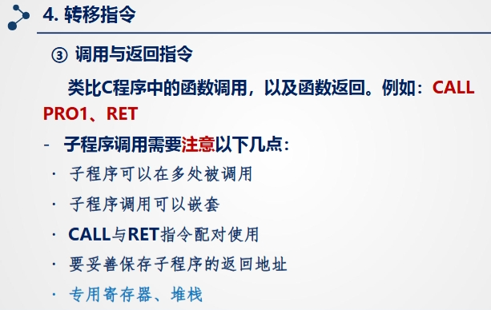
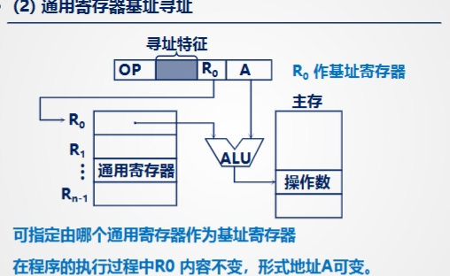

# 06指令系统

## 指令系统概述

### 指令系统
1.  **物理的计算机只能够执行机器语言程序：** 计算机硬件（物理计算机）能够直接理解和执行的唯一语言是**机器语言**。机器语言是由二进制代码（0和1）组成的。
2.  **组成程序的每一条语句称作一条机器指令：** 一个机器语言程序是由多条**机器指令**构成的。每一条机器指令对应着计算机硬件可以执行的一个非常基本的操作（例如：加法、数据移动、比较等）。
3.  **一种计算机能够执行的机器指令的集合就是这种计算机的指令系统：** 某一个型号或系列的计算机（或更准确地说，是它的中央处理器 CPU）所能识别和执行的**所有**机器指令的**总和**，就构成了这台计算机的**指令系统**。

**总结来说：**

指令系统就像是计算机硬件（CPU）的“词汇表”或“操作手册”。它规定了这块硬件能听懂哪些命令（指令），以及每个命令具体会让硬件做什么动作。不同的 CPU 架构（如 x86、ARM）有不同的指令系统。软件（如编译器）需要将高级语言（如 C++, Java, Python）编写的程序最终翻译成特定目标计算机指令系统中的机器指令，这样计算机才能执行。

因此，指令系统是连接软件和硬件的关键桥梁。

### 机器指令格式
**指令一般格式包括两部分：1.操作码字段，2.地址码字段**
**操作码 (Opcode)**

1.  **定义:**
    *   **位数反映机器指令数目:** 操作码字段所占用的二进制位数决定了这台计算机最多能够拥有多少条不同的机器指令。例如，。**如果操作码有 `n` 位，那么最多可以表示 `2^n` 条不同的指令**
    *   **内容反映机器做什么操作:** 操作码的具体二进制数值（它的内容）指明了这条指令要求计算机执行哪一种基本操作，比如加法 (ADD)、数据传送 (MOV)、加载 (LOAD)、存储 (STORE) 等。

2.  **操作码类别:**
    *   **长度固定 (Fixed Length):**
        *   **特点:** 在这种设计中，所有指令的操作码都具有相同的位数，并且通常位于指令字的相同位置。
        *   **例子:** 如 RISC (精简指令集计算机) 机器。
        *   **优点:** 指令格式规整、统一，使得指令的**译码**（识别指令是什么操作）过程更简单、更快。硬件设计相对容易。
    *   **长度可变 (Variable Length):**
        *   **特点:** 不同指令的操作码可能具有不同的长度，甚至操作码的信息可能分散在指令字的不同字段中。
        *   **例子:** 常见于 CISC (复杂指令集计算机) 机器，如 x86 架构。
        *   **缺点:** 指令格式不统一，增加了**控制器**（负责指令译码和执行流程控制的硬件部分）的设计复杂度。译码过程可能更慢。

**总结：** 操作码是指令的核心部分，它告诉 CPU **“做什么”**。它的位数决定了指令集的丰富程度，其编码方式（固定长度或可变长度）影响了指令译码的复杂度和效率。

---

**地址码 (Address Code)**

1.  **定义:**
    *   地址码部分用于提供执行指令所需的操作数（数据）的位置信息，以及存放操作结果的位置信息。
    *   具体来说，它可以用来指定：
        *   **操作数的地址:** 指明参与运算的数据存放在哪里（可能在内存的某个单元，或某个寄存器）。
        *   **结果的地址:** 指明运算完成后，结果要存放到哪里（也可能是内存单元或寄存器）。
        *   **(可能有的) 下一条指令的地址:** 在某些（尤其是早期的或特殊的）指令系统设计中，指令本身可能包含下一条要执行指令的地址（用于跳转或改变程序执行流程）。在现代大多数通用处理器中，下一条指令的地址通常由程序计数器 (Program Counter, PC) 自动管理（顺序执行时加1，跳转指令修改PC值），地址码主要用于操作数和结果。

2.  **例子指令: `MOV AX, [40]`**
    *   这是一个典型的汇编指令示例（x86架构）。
    *   `MOV`: 这是**操作码**（虽然这里写的是助记符，但它会被翻译成二进制的操作码），表示“移动”或“复制”数据。
    *   `AX`: 这是一个**寄存器**的名字。寄存器是 CPU 内部的高速存储单元。
    *   `[40]`: 这表示一个**内存地址**。方括号 `[]` 通常表示访问内存，`40` 是具体的内存单元地址（这里的40通常是十六进制数，但关键是它代表一个内存位置）。

3.  **地址解释:**
    *   **地址 “40” 指明了要操作的源操作数的地址:** 这条指令要移动的数据 *来源* 于内存地址为 40 的单元。`[40]` 是**源操作数地址**。
    *   **AX 指明了目的操作数的地址:** 数据要被移动 *到* AX 寄存器中。`AX` 是**目的操作数地址**（寄存器本身可以看作是一种地址）。

**总结：** 地址码告诉 CPU **“对哪里（或用哪里）的数据进行操作”** 以及 **“结果存到哪里”**。它提供了操作数和结果的位置信息，这些位置可以是内存地址，也可以是寄存器。

---

**总而言之：**

一条完整的机器指令通常由 **操作码** 和 **地址码**（可能包含一个或多个地址信息）组成。

*   **操作码 (Opcode):** 定义了要执行的操作类型 (What to do)。
*   **地址码 (Address Code):** 定义了操作涉及的数据的位置 (Where to find/put data)。

### 指令地址数目
**核心概念：**

机器指令通常需要告诉 CPU 两件事：
1.  **做什么操作**（由操作码 OP 定义）
2.  **用哪些数据做操作，结果存哪里**（由地址码 A 定义）

这条指令中明确给出了多少个“地址”（操作数或结果的位置），就决定了它是几地址指令。不同的计算机架构（设计思路）会采用不同地址数目的指令格式。

---

**不同地址数目的指令举例解释：**

假设我们要完成一个计算任务：`C = A + B`。这里 A, B 是源操作数（原始数据）存放的地址，C 是结果要存放的地址。我们看看用不同地址数目的指令如何实现：

1.  **四地址指令 (Four-address instruction):** 要进行4次访存
    *   **格式:** `OP, A1, A2, A3, A4`
    *   **含义:** 执行 OP 操作，使用地址 A1 的数据和地址 A2 的数据，将结果存到地址 A3，然后**下一条指令**从地址 A4 开始执行。
    *   **例子 (实现 C = A + B):**
        `ADD C, A, B, NextInstAddr`
        *   `ADD`: 操作码，表示加法。
        *   `A`: 第一个源操作数地址。
        *   `B`: 第二个源操作数地址。
        *   `C`: 结果存放地址。
        *   `NextInstAddr`: 明确指定下一条指令的地址（现在很少见，因为通常由程序计数器 PC 自动管理）。
    *   **特点:** 非常灵活，但指令字长很长。

2.  **三地址指令 (Three-address instruction):**
    *   **格式:** `OP, A1, A2, A3`
    *   **含义:** 执行 OP 操作，使用地址 A1 的数据和地址 A2 的数据，将结果存到地址 A3。下一条指令地址隐含地由 PC 顺序确定 (PC = PC + 1 指令长度)。
    *   **例子 (实现 C = A + B):**
        `ADD C, A, B`
        *   `ADD`: 操作码。
        *   `A`: 源操作数1地址。
        *   `B`: 源操作数2地址。
        *   `C`: 结果地址。
    *   **特点:** 代码直观，源操作数 A 和 B 不会被计算结果覆盖。指令字较长。常见于一些 RISC 架构。

3.  **二地址指令 (Two-address instruction):** 4次访存，若结果写入ACC中则3次访存
    *   **格式:** `OP, A1, A2`
    *   **含义:** 执行 OP 操作，使用地址 A1 的数据和地址 A2 的数据，**结果通常存回地址 A1**（或者有时存回 A2，具体看指令设计）。下一条指令地址隐含。
    *   **例子 (实现 C = A + B):**
        通常需要两条指令：
        1.  `MOV R1, A` (将 A 地址的数据移动到寄存器 R1)
        2.  `ADD R1, B` (将 R1 的内容与 B 地址的数据相加，结果存回 R1)
        3.  `MOV C, R1` (将 R1 的结果移动到 C 地址)
        *或者，如果允许其中一个地址同时作为源和目的：*
        1.  `MOV C, A` (将 A 的内容复制到 C)
        2.  `ADD C, B` (将 C 的内容 (原 A 的值) 与 B 的内容相加，结果存回 C)
    *   **特点:** 最常见的格式之一（如 x86）。指令字比三地址短。但通常会覆盖其中一个源操作数，如果需要保留原值，需要先用 MOV 指令备份。

4.  **一地址指令 (One-address instruction):** 两次访存
    *   **格式:** `OP, A1`
    *   **含义:** 操作数和结果通常隐含地使用一个**累加器 (Accumulator, ACC)** 寄存器。指令只提供一个显式地址 A1。下一条指令地址隐含。
    *   **例子 (实现 C = A + B):**
        需要三条指令：
        1.  `LOAD A` (将地址 A 的数据加载到累加器 ACC) -> `ACC = A`
        2.  `ADD B` (将累加器 ACC 的内容与地址 B 的数据相加，结果存回 ACC) -> `ACC = ACC + B`
        3.  `STORE C` (将累加器 ACC 的内容存储到地址 C) -> `C = ACC`
    *   **特点:** 指令字短，硬件设计相对简单（早期计算机常用）。但完成复杂运算需要更多条指令。

5.  **零地址指令 (Zero-address instruction):**
    *   **格式:** `OP`
    *   **含义:** 操作数和结果都隐含地来自或存放到一个**堆栈 (Stack)** 的顶部。指令本身不包含任何地址码。
    *   **例子 (实现 C = A + B):**
        需要多条指令来操作堆栈：
        1.  `PUSH A` (将地址 A 的数据压入堆栈顶部)
        2.  `PUSH B` (将地址 B 的数据压入堆栈顶部)
        3.  `ADD` (从堆栈弹出顶部的两个数 (B 和 A)，相加，将结果 (A+B) 压回堆栈顶部)
        4.  `POP C` (将堆栈顶部的数据 (结果 A+B) 弹出并存储到地址 C)
    *   **特点:** 指令非常短。非常适合计算表达式求值。需要硬件支持堆栈操作。Java 虚拟机 (JVM) 的字节码就是一种典型的零地址（基于栈）指令。

---

**最后一点：地址码与访存次数、寻址范围的关系**

*   **访存次数 (Memory Access Count):** 指令中地址码越多，或者地址码指向内存而非寄存器，执行这条指令就可能需要访问更多次内存（取指令本身+取操作数+存结果）。例如，三地址指令 `ADD M[C], M[A], M[B]` 可能需要4次访存（取指令，读A，读B，写C），而二地址寄存器指令 `ADD R1, R2` 可能只需要1次访存（取指令，操作数都在寄存器）。访存次数多通常意味着执行速度慢。
*   **寻址范围 (Addressing Range):** 地址码字段的**位数**决定了它能表示多少个不同的地址。位数越多，能直接访问的内存空间（寻址范围）就越大。例如，16位的地址码能寻址 2^16 = 65536 个单元，而 32位的地址码能寻址 2^32 ≈ 4GB 的空间。

**总结：** 指令中地址的数目是一种设计上的权衡，影响着指令长度、执行效率（所需指令条数和访存次数）、编程复杂度和硬件设计复杂度。现代计算机通常混合使用多种地址格式（尤其是二地址和三地址）。

### 操作码扩展技术

**核心思想：**

操作码扩展技术的主要目的是**缩短计算机系统中指令的平均长度**。它通过采用**可变长度的操作码**（有些指令的操作码长，有些短），而不是让所有指令都使用相同固定长度的操作码来实现这一点。这样做的关键在于一种权衡：

*   当一个指令的操作码**较短**时，指令字（存储这条指令的二进制位）中剩下的位数就**更多**，可以用来表示地址信息（地址码）。这意味着这条指令可以访问更大的内存范围或指定更多的操作数。
*   当一个指令的操作码需要**较长**时，留给地址码的位数就**较少**。

通过合理设计，特别是将短操作码分配给常用的指令，可以有效降低程序中所有指令操作码的平均位数。

1.  **“通过操作码扩展（对应的地址码长度收缩）技术，能够有效地缩短指令的平均长度。”**
    *   这句话点明了该技术的目标：**缩短指令的平均长度**。
    *   括号里的内容 `（对应的地址码长度收缩）` 解释了其工作方式：在一个固定总长度的指令字内，如果操作码部分变长（扩展），那么地址码部分就必须相应地缩短（收缩）。反之，操作码短，地址码就可以长。这个技术主要是通过优化操作码本身的编码方式来减少其平均长度，从而有助于减少整个指令的平均长度。

2.  **“例如，某计算机有5条指令，两种设计方法。”**
    *   这里举了一个例子，假设一个计算机系统需要支持 5 种不同的操作（即 5 条不同的指令），我们比较两种不同的操作码设计方法。

3.  **“等长操作码，3位；” （Fixed-length Opcode, 3 bits）**
    *   **方法一：固定长度操作码。** 如果要唯一标识 5 条指令，我们需要确定需要多少位：
        *   2 位二进制数最多能表示 2² = 4 种状态（不够表示 5 条指令）。
        *   3 位二进制数最多能表示 2³ = 8 种状态（足够表示 5 条指令）。
    *   因此，采用等长操作码方案时，**每条指令的操作码都必须是 3 位**。
    *   图中左侧列出了前 5 个 3 位编码（000, 001, 010, 011, 100）用来表示这 5 条指令。即使有 3 个编码（101, 110, 111）没被用到，但操作码字段仍然固定为 3 位。
    *   **这种情况下，操作码的平均长度就是 3 位。**

4.  **“变长操作码，平均2.4位。” （Variable-length Opcode, Average 2.4 bits）**
    *   **方法二：可变长度操作码（操作码扩展技术）。** 我们可以不让所有操作码都一样长。可以给一部分指令分配较短的操作码，然后用一个特殊的编码作为“前缀”或“扩展标志”，表示“这不是一个完整的短操作码，请继续往后看以确定具体指令”。
    *   图中右侧展示了一种可能的扩展方案：
        *   先用 2 位编码：`00`, `01`, `10`。这三个编码直接代表前 3 条指令。对于这 3 条指令，它们的操作码长度只有 2 位，比方法一节省了 1 位，可以留给地址码。
        *   将 2 位编码 `11` 作为**扩展码（或叫前缀码、逃逸码）**。当指令译码器读到 `11` 时，它知道这本身并不代表一条指令，而是意味着操作码还没结束，需要结合后面的位来确定是哪条指令。
        *   结合 `11` 后面的 1 位来区分剩下的指令：
            *   `110`：用这个 3 位的编码代表第 4 条指令。
            *   `111`：用这个 3 位的编码代表第 5 条指令。
    *   这样，我们就用不同长度的操作码表示了全部 5 条指令：
        *   指令 1, 2, 3 的操作码是 2 位 (`00`, `01`, `10`)。
        *   指令 4, 5 的操作码是 3 位 (`110`, `111`)。
    *   **计算平均操作码长度：**
        (拥有 2 位操作码的指令数 × 2 位 + 拥有 3 位操作码的指令数 × 3 位) / 总指令数
        = (3 × 2 + 2 × 3) / 5
        = (6 + 6) / 5
        = 12 / 5 = **2.4 位**。

**优势与劣势：**

*   **优势：**
    *   **降低平均长度：** 如例子所示，平均操作码长度从 3 位降到了 2.4 位。如果常用指令能获得短编码，程序整体占用的存储空间会减小（提高代码密度），也可能因为取指更快而提高执行效率。
    *   **灵活性：** 对于那些不需要很多地址信息（比如只需要寄存器操作数）的指令，可以用短操作码；而需要访问内存地址的指令，如果操作码短，就可以有更长的地址字段。
*   **劣势：**
    *   **译码复杂：** 解码可变长度操作码的硬件电路（译码器）比解码固定长度的要复杂。译码器需要根据看到的前几位来判断操作码是否结束，或者还需要看后面的位。

**总结：**

操作码扩展技术是一种通过使用不同长度的操作码来编码指令集的方法。它允许一部分指令（特别是常用指令）拥有较短的操作码，而用特定的“扩展”模式来引入较长的操作码给其他指令。这样做能够有效降低指令集中操作码的平均位数，优化存储空间使用，但会增加硬件译码器的设计复杂度。

#### 举例

### 1. 定长操作码设计 (Fixed Opcode Length Design)

**描述：** 这种方法为所有指令分配一个固定长度的操作码字段。在本例中，操作码长度固定为4位。这意味着最多可以有 $2^4 = 16$ 种不同的操作。指令的其余12位（三个4位字段）用于表示地址、寄存器或立即数。

**特点：**
* **优点：** 译码电路简单，译码速度快。指令结构统一，便于硬件实现。
* **缺点：** 可表示的指令数量有限（本例中只有16种）。如果需要更多的指令，这种方法可能不够用。

**指令格式示例 (基于16位字长，四个4位字段)：**

* **三地址指令 (Three-Address Instruction):**
    * 格式：`[操作码 (4位)] [目的寄存器/地址 (4位)] [源操作数1寄存器/地址 (4位)] [源操作数2寄存器/地址 (4位)]`
    * 说明：所有4个字段都被利用，操作码4位，每个地址码4位，可寻址16个寄存器或内存单元（如果地址是直接地址）。
    * 示例：`ADD R1, R2, R3` (R1 = R2 + R3)

* **两地址指令 (Two-Address Instruction):**
    * 格式：`[操作码 (4位)] [目的寄存器/地址 (4位)] [源操作数寄存器/地址 (4位)] [立即数/扩展地址 (4位)]`
    * 说明：操作码4位，两个地址码各4位。最后一个4位字段可以用于表示较小的立即数，或者作为地址的扩展部分（例如，与前一个地址码组合成8位地址）。
    * 示例：`MOV R1, R2` (R1 = R2) 或 `ADDI R1, R2, #Imm` (R1 = R2 + Immediate)

* **一地址指令 (One-Address Instruction):**
    * 格式：`[操作码 (4位)] [寄存器 (4位)] [地址高位 (4位)] [地址低位 (4位)]`
    * 说明：操作码4位，一个寄存器地址4位。后两个4位字段可以组合成一个8位地址，寻址 $2^8 = 256$ 个内存单元。
    * 示例：`LOAD R1, [Address]` (R1 = Memory[Address])

* **零地址指令/控制指令 (Zero-Address Instruction/Control Instruction):**
    * 格式：`[操作码 (4位)] [保留/无用 (12位)]`
    * 说明：操作码4位，不带操作数的指令（如HALT, NOP），或操作数隐含在操作码中。其余12位可以保留为0或用于未来的扩展。
    * 示例：`HALT`, `NOP`

### 2. 扩展操作码设计 (Expanding Opcode Design)

**描述：** 这种方法允许操作码的长度是可变的。通过利用指令中本应是地址码的字段作为操作码的扩展，可以在不增加指令字长的情况下增加指令的数量。这种设计通常遵循这样的原则：操作数越多的指令，其操作码越短；操作数越少的指令（或无操作数指令），其操作码越长。

**特点：**
* **优点：** 可以在固定的指令字长内支持更多的指令类型，对指令系统进行灵活的扩展。
* **缺点：** 译码电路更为复杂，因为需要首先确定操作码的实际长度才能正确解析指令。

**指令格式示例 (基于16位字长，四个4位字段)：**
假设每个4位字段都可以作为操作码的扩展，并约定使用一个特定的值（例如，`1111`）作为操作码扩展的标志。

* **第一级：短操作码 (4位操作码)**
    * 格式：`[操作码 (4位)] [地址码1 (4位)] [地址码2 (4位)] [地址码3 (4位)]`
    * 可用的操作码数量：$2^4 - 1 = 15$ 种（其中1种值如 `1111` 作为扩展标志）。
    * 这类指令通常是三地址指令，提供15种基本操作。

* **第二级：中等长度操作码 (8位操作码)**
    * 格式：`[标志操作码 (4位, 如1111)] [扩展操作码 (4位)] [地址码1 (4位)] [地址码2 (4位)]`
    * 可用的操作码数量：$1 \times (2^4 - 1) = 15$ 种。
    * 这类指令通常是两地址指令，提供15种操作。

* **第三级：较长操作码 (12位操作码)**
    * 格式：`[标志操作码 (4位)] [标志操作码 (4位)] [扩展操作码 (4位)] [地址码1 (4位)]`
    * 可用的操作码数量：$1 \times 1 \times (2^4 - 1) = 15$ 种。
    * 这类指令通常是一地址指令，提供15种操作。

* **第四级：最长操作码 (16位操作码)**
    * 格式：`[标志操作码 (4位)] [标志操作码 (4位)] [标志操作码 (4位)] [扩展操作码 (4位)]`
    * 可用的操作码数量：$1 \times 1 \times 1 \times 2^4 = 16$ 种。
    * 这类指令通常是零地址指令或控制指令，提供16种操作。

**总结：** 扩展操作码设计通过牺牲某些指令的操作数位数来换取更多的指令种类。在本例中，总共可以定义 $15 + 15 + 15 + 16 = 61$ 种不同的指令，远超定长操作码的16种。这种设计在指令系统设计中非常常见，例如PDP-11和DEC VAX指令集都使用了类似的概念。
### 指令字长
**内容解释：**

1.  **"> 指令字长取决于操作码长度、地址码长度和地址码个数。"**
    *   这句话说明了 **指令字长** 是由指令中各个组成部分的长度加起来决定的。一条机器指令通常包含：
        *   **操作码 (Opcode):** 指明指令要执行的操作类型 (如加法、减法、数据移动等)。操作码需要一定的位数来编码不同的操作。
        *   **地址码 (Address Code):** 指明操作数或结果的存储位置。地址码的长度和数量取决于指令需要操作的数据量和寻址方式。
        *   **其他字段 (可能存在):**  例如，一些指令可能还有寄存器字段、立即数字段、寻址方式字段等，这些也会影响指令的总长度。
    *   **总结:** 指令字长就是一条指令在计算机内存中或CPU内部表示时，所占用的二进制位数总长度。它是由构成指令的各个字段的长度累加而成的。

2.  **"> 指令按照字长是否可变分为两种："**
    *   这句话将指令根据其字长是否固定，分为了两大类：**指令字长固定** 和 **指令字长可变**。

3.  **"- 指令字长固定：指令字长 = 存储字长"**
    *   **指令字长固定 (Fixed Instruction Word Length):**  指在一个计算机系统中，**所有指令的长度都是固定的**，都是相同的二进制位数。
    *   **指令字长 = 存储字长:** 这句话非常关键。在早期计算机设计中，通常指令字长会和**存储字长**（计算机存储器一次能够访问或处理的数据位数）保持一致。例如，如果一个计算机的存储字长是 32 位，那么它的所有指令也可能设计成 32 位长。
    *   **优点:**
        *   **指令格式规整:** 所有指令长度一样，硬件设计相对简单，指令的**取指** (fetch) 和 **译码** (decode) 过程更容易控制和实现。
        *   **利于流水线:** 固定长度的指令更易于实现指令流水线，提高指令执行效率。
    *   **缺点:**
        *   **灵活性差:**  为了保证所有指令长度一致，一些简单的指令可能也会占用和复杂指令一样的位数，造成一定的空间浪费。
        *   **指令种类受限:** 在固定的指令字长内，操作码和地址码的总位数受到限制，可能会限制指令集能够支持的指令种类和寻址范围。

4.  **"- 指令字长可变：按字节的整数倍变化"**
    *   **指令字长可变 (Variable Instruction Word Length):** 指在一个计算机系统中，**不同指令的长度可以不同**。一些简单的指令可能用较短的位数表示，而复杂的指令可以用较长的位数表示。
    *   **按字节的整数倍变化:**  可变长度指令的长度通常是按照**字节 (Byte)** 的整数倍来变化的。这是因为字节是计算机存储和数据传输的基本单位（通常 1 字节 = 8 位）。例如，指令长度可能是 1 字节、2 字节、3 字节、4 字节等等。
    *   **优点:**
        *   **灵活性高:** 可以根据指令的复杂程度和所需的功能，灵活地分配指令长度。简单的指令可以用短指令字，节省存储空间；复杂的指令可以用长指令字，提供更丰富的功能和寻址能力。
        *   **提高代码密度:** 可以编写更紧凑的程序，减少程序占用的存储空间。
    *   **缺点:**
        *   **硬件复杂性增加:** 指令长度不固定，指令的取指和译码过程会更复杂，需要更复杂的硬件控制逻辑。
        *   **不利于流水线:** 可变长度指令会给指令流水线的实现带来挑战，因为指令长度不确定，难以精确控制流水线的节拍。

**总结：**

指令字长是衡量指令长度的指标，它直接影响指令的编码格式、硬件设计的复杂度和计算机的性能。

*   **固定字长指令** 简洁规整，硬件实现相对容易，利于流水线，但灵活性和代码密度稍差。
*   **可变字长指令** 灵活性高，代码密度高，但硬件实现复杂，不利于流水线。

现代计算机体系结构中，两者都有应用。一些 RISC 架构倾向于使用固定字长指令，以简化设计和提高执行效率。而一些 CISC 架构（如 x86）则采用可变字长指令，以提供更丰富的指令集和更高的代码密度。

**QA: 如何让最常用指令的操作码最短**：

* **哈夫曼编码 (Huffman Coding) 及其变体**

   哈夫曼编码是一种经典的**前缀编码**算法，其核心思想是根据符号（在这里是指令）出现的频率，为高频符号分配较短的编码，为低频符号分配较长的编码，从而达到数据压缩的目的。  在指令集设计中，我们可以借鉴哈夫曼编码的思想来设计操作码。

   **具体应用在操作码设计上，哈夫曼编码的思路是：**

   1. **指令频率统计:**  首先，通过分析大量的代表性程序，统计出每条指令在程序执行过程中出现的频率。
   2. **频率排序:**  将指令按照频率从高到低排序。
   3. **构建哈夫曼树 (或类似的编码树):**  根据指令频率构建哈夫曼树（或类似的变长编码树）。频率越高的指令，在树中路径越短，分配到的操作码位数也越少。
   4. **分配操作码:**  根据哈夫曼树，为每条指令分配对应的操作码。保证频率高的指令获得短操作码，频率低的指令获得长操作码。  通常使用前缀编码，确保解码的唯一性。

   **优点 (Advantages):**

   * **提高代码密度 (Improved Code Density):**  这是最主要也是最直接的优点。由于常用指令获得了更短的操作码，程序中大量出现的常用指令会占用更少的存储空间，从而减小程序的总大小。这可以节省内存、减少磁盘空间占用，并提高指令缓存 (Instruction Cache) 的效率。
   * **潜在的指令读取速度提升 (Potential for Faster Instruction Fetch):**  更短的指令意味着在相同的时间内可以从内存中读取更多的指令，或者读取相同数量的指令花费的时间更少。这理论上可以提升指令的获取速度，尤其是在内存带宽受限的情况下。
   * **优化整体性能 (Potential Performance Improvement):**  虽然解码复杂性增加，但如果代码密度提升带来的缓存效率提高、指令读取速度加快等优势能够抵消解码的开销，整体性能可能会得到提升。

   **缺点 (Disadvantages):**

   * **解码复杂性增加 (Increased Decoding Complexity):**  变长操作码 (哈夫曼编码会导致操作码长度不一) 使得指令解码过程变得更加复杂。硬件解码器需要能够识别不同长度的操作码，并进行正确解码。这会增加硬件设计的复杂性，也可能导致解码速度变慢，成为性能瓶颈。
   * **指令长度可变性带来的流水线挑战 (Challenges for Pipelining):**  可变长度指令会使指令流水线的设计更加复杂。例如，指令预取、指令对齐、分支预测等流水线环节都可能因为指令长度不确定而面临挑战。需要更精细的控制和更复杂的硬件逻辑来处理可变长度指令的流水线执行。
   * **频率统计的局限性 (Limitations of Frequency Profiling):**  哈夫曼编码的效果依赖于指令频率统计的准确性和代表性。如果用于统计的程序样本不能很好地代表实际应用场景，或者程序的工作负载发生变化，最优的操作码分配方案可能会变得次优。
   * **实现难度和硬件开销 (Implementation Difficulty and Hardware Overhead):**  实现变长操作码的解码器通常比固定长度操作码的解码器更复杂，需要更多的硬件资源。这会增加芯片的面积和功耗。
   * **并非纯粹的哈夫曼编码 (Adaptations and Simplifications in Practice):**  在实际的指令集设计中，很少直接完全照搬纯粹的哈夫曼编码，因为纯哈夫曼编码生成的操作码可能在硬件解码上过于复杂。通常会采用一些**简化或改进的变长编码方案**，例如，使用较简单的前缀编码结构，或者限制操作码的最大长度，以在代码密度和硬件复杂性之间取得平衡。  例如，使用**操作码扩展技术**，用较短的前缀码表示常用指令，用带有扩展码的较长编码表示不常用指令，这可以看作是哈夫曼编码思想的一种简化应用。

**总结:**

哈夫曼编码的思想可以有效地用于优化操作码设计，通过为常用指令分配短操作码来提高代码密度。然而，它也带来了硬件解码复杂性增加、流水线设计挑战等缺点。在实际应用中，需要权衡代码密度提升带来的好处和硬件复杂性增加的代价，并可能采用简化或改进的变长编码方案，而不是直接使用纯粹的哈夫曼编码。  **操作码扩展技术** 可以看作是在指令集设计中应用哈夫曼编码思想的一种更实用的方法。

### RISC技术
 **RISC 技术** 的介绍， **RISC 的产生和发展**。
* **RISC (Reduced Instruction Set Computer)**：精简指令集计算机
* **CISC (Complex Instruction Set Computer)**：复杂指令集计算机
* **VLSI 技术的发展**：超大规模集成电路技术的发展，这是 RISC 发展的基础。
* **典型程序中 80% 的语句仅仅使用处理器中 20% 的指令**：  这是一个重要的观察，指出在典型的程序中，大部分代码只使用了处理器指令集中一小部分常用的指令。
* **复杂指令集计算机设计复杂、成本高、维护困难**：  CISC 的缺点，为其被 RISC 取代提供了理由。
* **能否用 20% 的简单指令组合不常用的 80% 的指令功能**：  这是 RISC 的核心思想，即通过精简指令集，并用简单的指令组合来实现复杂指令的功能，从而提高效率、降低成本。
这张图片的内容是关于 **RISC (精简指令集计算机) 的主要特征** 的介绍。

#### RISC 架构的以下几个关键特点：

* **选用使用频度高的一些简单指令，复杂指令用简单指令组合。**:  RISC 架构选择使用频率最高的简单指令，对于复杂的指令，则通过组合这些简单指令来实现。这简化了指令集，提高了执行效率。
* **指令长度固定、指令格式种类少、寻址方式少**: RISC 指令的长度是固定的，指令格式的种类也较少，寻址方式也相对简单。这简化了指令的解码和执行过程。
* **只有 LOAD/STORE 指令访存。**:  在 RISC 架构中，只有 LOAD (加载) 和 STORE (存储) 指令可以访问内存。 所有的运算操作都在寄存器中完成。 这种方式简化了内存访问的复杂性，并提高了运算速度。
* **CPU 中有多个通用寄存器。**: RISC 架构通常配备大量的通用寄存器。  更多的寄存器可以减少对内存的访问次数，提高数据处理速度。
* **采用流水技术，一个时钟周期完成一条指令。**:  RISC 架构常采用流水线技术 (pipelining)。 理想情况下，在流水线中，每个时钟周期可以完成一条指令的不同阶段，从而提高指令的吞吐率。
* **采用组合逻辑实现控制器。**: RISC 的控制器通常使用组合逻辑 (硬布线逻辑) 来实现。  相比于微程序控制器，组合逻辑控制器速度更快，效率更高。
* **采用优化的编译程序。**: 为了充分发挥 RISC 架构的优势，需要使用优化的编译器。 编译器会针对 RISC 的特性进行代码优化，生成更高效的机器码。

**总而言之， RISC 架构的主要设计原则和特点，强调了其简洁性、高效性和对编译器的依赖。** 这些特点共同促成了 RISC 在高性能计算领域的广泛应用。

### CISC技术

#### **CISC (复杂指令集计算机) 的主要特征**：

* **指令系统庞大复杂，各种指令使用频度差别大。** 这意味着 CISC 架构拥有非常庞大的指令集，但其中许多指令在典型的程序中很少被使用。

* **指令长度不固定、指令格式种类多、寻址方式多。**  CISC 指令的长度可能会有所不同，指令格式的种类繁多，寻址内存位置的方式也很多样。 这增加了指令解码和执行的复杂性。

* **访存指令不受限制。** 与 RISC 通常限制内存访问只能通过 LOAD 和 STORE 指令不同，CISC 允许许多类型的指令直接访问内存。

* **CPU 中设有专用寄存器。**  CISC 架构通常除了通用寄存器外，还会使用一些专门用途的寄存器。

* **大多数指令需要多个时钟周期执行完毕。** 由于 CISC 指令的复杂性，许多指令需要多个时钟周期才能完成执行。

* **采用微程序控制器。**  CISC 处理器通常使用微程序控制器来实现复杂的指令集。 微程序设计提供了灵活性，但与 RISC 中的硬布线控制器相比，速度可能会较慢。

* **难以用优化编译生成高效的目的代码。** 由于 CISC 指令的复杂性和多样性，编译器更难有效地优化代码并生成高效的机器码。

**总而言之，突出了 CISC 架构的定义性特征，强调了它的复杂性、可变的指令格式、灵活的内存访问、专用寄存器的使用、多周期指令执行、微程序控制以及编译器优化方面的挑战。** 这些特征与 RISC 的设计原则形成对比，RISC 侧重于简洁性和效率。

### 8086的寄存器
8086微处理器是Intel公司于1978年推出的一款16位CPU，它的寄存器结构奠定了x86系列处理器寄存器设计的基础。8086的寄存器可以分为几个主要类别，总共有14个16位寄存器和一个16位标志寄存器。

#### 一、通用寄存器 (General Purpose Registers - GPRs)

8086有4个16位的通用寄存器，它们是AX、BX、CX、DX。每个16位寄存器又可以被拆分为两个8位的寄存器，分别称为高8位（H）和低8位（L），例如AX可以分为AH和AL。

* **AX (Accumulator Register - 累加器):**
    * **16位:** AX (e.g., `MOV AX, 1234H`)
    * **8位:** AH (High byte), AL (Low byte) (e.g., `MOV AL, 34H`, `MOV AH, 12H`)
    * **主要用途:**
        * 在乘法、除法、BCD调整等算术运算中用作默认的操作数或结果存储。
        * 输入/输出 (I/O) 操作中，通常用于存放输入/输出的数据。

* **BX (Base Register - 基址寄存器):**
    * **16位:** BX
    * **8位:** BH, BL
    * **主要用途:**
        * 在内存寻址中，作为基址寄存器使用，通常存放数据段中内存地址的基址。
        * 用于实现基址寻址方式 (Base Addressing)。

* **CX (Count Register - 计数寄存器):**
    * **16位:** CX
    * **8位:** CH, CL
    * **主要用途:**
        * 在循环 (LOOP) 指令中用作默认的循环计数器。当CX减为0时，循环终止。
        * 字符串操作中，存放字符串的长度。
        * 移位 (Shift) 和循环移位 (Rotate) 指令中，CL寄存器用于存放移位的位数。

* **DX (Data Register - 数据寄存器):**
    * **16位:** DX
    * **8位:** DH, DL
    * **主要用途:**
        * 在乘法和除法运算中，作为辅助寄存器，与AX一起存放32位操作数或结果。
        * 在I/O操作中，通常存放I/O端口地址。

#### 二、指针和变址寄存器 (Pointer and Index Registers)

这些寄存器主要用于内存地址的计算和访问。它们是16位的。

* **SP (Stack Pointer - 堆栈指针):**
    * **16位:** SP
    * **主要用途:** 总是指向当前堆栈段 (`SS`) 中堆栈顶部的16位偏移地址。`PUSH` 和 `POP` 指令会自动调整SP的值。

* **BP (Base Pointer - 基址指针):**
    * **16位:** BP
    * **主要用途:** 通常用于指向堆栈段 (`SS`) 中的某一特定数据区或活动记录帧的基址。用于实现基址相对寻址方式 (Base Relative Addressing)。

* **SI (Source Index - 源变址寄存器):**
    * **16位:** SI
    * **主要用途:** 在字符串操作指令中，默认指向源字符串所在的数据段 (`DS`) 中的偏移地址。也常用于普通的数据寻址，作为通用变址寄存器。

* **DI (Destination Index - 目的变址寄存器):**
    * **16位:** DI
    * **主要用途:** 在字符串操作指令中，默认指向目的字符串所在的数据段 (`ES`) 中的偏移地址。也常用于普通的数据寻址，作为通用变址寄存器。

#### 三、段寄存器 (Segment Registers)

8086的内存管理采用分段机制，物理地址由段寄存器内容乘以16 (左移4位) 加上一个16位偏移地址得到。这些寄存器都是16位的。

* **CS (Code Segment - 代码段寄存器):**
    * **16位:** CS
    * **主要用途:** 指向当前正在执行的程序指令所在的内存段的起始地址。与指令指针IP组合使用，形成下一条要执行指令的物理地址。
    * **物理地址 = CS * 16 + IP**

* **DS (Data Segment - 数据段寄存器):**
    * **16位:** DS
    * **主要用途:** 指向程序使用的数据所在的内存段的起始地址。大部分数据访问指令默认使用DS作为段寄存器。
    * **物理地址 = DS * 16 + 偏移地址**

* **SS (Stack Segment - 堆栈段寄存器):**
    * **16位:** SS
    * **主要用途:** 指向当前程序堆栈所在的内存段的起始地址。与堆栈指针SP或基址指针BP组合使用，访问堆栈中的数据。
    * **物理地址 = SS * 16 + SP/BP**

* **ES (Extra Segment - 附加段寄存器):**
    * **16位:** ES
    * **主要用途:** 作为一个额外的、通用的数据段寄存器。在字符串操作中，DI寄存器通常与ES段寄存器一起使用，指向目的字符串所在的段。

#### 四、指令指针 (Instruction Pointer - IP)

* **IP (Instruction Pointer - 指令指针):**
    * **16位:** IP
    * **主要用途:** 总是指向当前代码段 (`CS`) 中下一条要执行的指令的16位偏移地址。程序执行流程的控制就是通过修改IP寄存器来实现的（例如，通过JUMP、CALL等指令）。IP不能被程序直接访问和修改。

#### 五、标志寄存器 (Flags Register)

* **FLAGS (标志寄存器):**
    * **16位:** 标志寄存器
    * **主要用途:** 这是一个16位的寄存器，其中每个比特位都代表一个特定的标志 (Flag)，反映了CPU运算结果的状态，或控制CPU的操作模式。
    * **常见的标志位：**
        * **CF (Carry Flag - 进位标志):** 当算术运算产生最高有效位的进位或借位时置1。
        * **PF (Parity Flag - 奇偶标志):** 当运算结果的低8位中1的个数为偶数时置1。
        * **AF (Auxiliary Carry Flag - 辅助进位标志):** 在BCD (Binary-Coded Decimal) 运算中，当低4位发生进位或借位时置1。
        * **ZF (Zero Flag - 零标志):** 当运算结果为0时置1。
        * **SF (Sign Flag - 符号标志):** 当运算结果的最高位（符号位）为1时置1，表示结果为负数。
        * **TF (Trap Flag - 陷阱标志):** 用于单步调试，当置1时，CPU每执行一条指令后就会产生一个内部中断。
        * **IF (Interrupt Enable Flag - 中断允许标志):** 控制CPU是否响应外部可屏蔽中断请求。置1允许中断，置0禁止中断。
        * **DF (Direction Flag - 方向标志):** 控制字符串操作指令（如MOVSD, CMPSB）的地址增减方向。置1时地址递减，置0时地址递增。
        * **OF (Overflow Flag - 溢出标志):** 当有符号数运算结果超出其表示范围时置1。

这些寄存器协同工作，使得8086能够有效地执行指令、管理内存和处理数据。它们是理解x86架构和汇编语言编程的基础。

## 操作类型
### 操作数类型
1.  **地址 (Address):** 指出有时地址也需要进行计算，在这种情况下，地址也被视为数据。
2.  **数字 (Number):** 包括定点数、浮点数和十进制数。
3.  **字符 (Character):** 指的是ASCII码。
4.  **逻辑数据 (Logical Data):** 指的是布尔类型数据，每一位都代表真（1）或假（0）。这种数字串被称为逻辑数。

### 边界对齐

1.  **两种字节序 (Two Byte Orders):**
    * 小端 (Little-endian) vs 大端 (Big-endian): 这指的是多字节数据在内存中存储时，字节的顺序。小端模式下，低位字节存放在低地址；大端模式下，高位字节存放在低地址。幻灯片中只提到了这两种概念，没有详细解释它们的区别。

2.  **对齐方式 (Alignment):**
    * 为了方便硬件实现并提高机器运行速度，通常要求多字节数据在存储器中满足“边界对齐”的要求。
    * 这意味着虽然字节数据可以存放在任意地址，但对于多字节数据有特定的对齐要求：
        * 半字 (Half-word) 数据存放在偶数地址。
        * 字 (Word) 数据存放在末两位地址为0处（即地址能被4整除）。
        * 双字 (Double-word) 数据存放在末三位地址为0处（即地址能被8整除）。

图片左上角的标题“边界对齐 (32) 位机”明确了上下文。右侧的“地址 (十进制)”列出了内存地址。

以下是图片内容的详细解释，结合您提供的对齐规则：

1.  **字 (Word) 的对齐：**
    * 根据文字描述：“字 (Word) 数据存放在末两位地址为0处（即地址能被4整除）。”
    * 图片显示：
        * 第一个“字”从**地址 0** 开始，0 可以被 4 整除。
        * 第二个“字”从**地址 4** 开始，4 可以被 4 整除。
    * 这完美符合了字数据必须4字节对齐的要求。在32位系统中，一个字通常是4个字节。

2.  **字节 (Byte) 的存放：**
    * 根据文字描述：“字节数据可以存放在任意地址。”
    * 图片显示：在地址 8 和 12 处，内存被展示为单个“字节”的形式，并标明了每个字节的地址（如地址8、地址9、地址10、地址11，以及地址12到地址15）。
    * 这表明字节是内存的最小可寻址单位，可以从任何地址开始存放。图片在这里可能旨在强调内存是字节可寻址的，或者展示一个字（4字节）内部的字节分布。

3.  **半字 (Half-word) 的对齐：**
    * 根据文字描述：“半字 (Half-word) 数据存放在偶数地址。”
    * 图片显示：
        * “半字”从**地址 16** 开始，16 是偶数，并有一个“✓”标记。
        * 紧接着的“半字”从**地址 18** 开始，18 是偶数，也有一个“✓”标记。
        * 同样，下面的“半字”从**地址 20** 开始，20 是偶数，有“✓”标记。
        * 紧接着的“半字”从**地址 22** 开始，22 是偶数，也有“✓”标记。
    * 这些“✓”标记和地址都符合半字数据必须2字节对齐（即地址是偶数）的要求。在32位系统中，一个半字通常是2个字节。

4.  **双字 (Double-word) 的对齐：**
    * 根据文字描述：“双字 (Double-word) 数据存放在末三位地址为0处（即地址能被8整除）。”
    * 图片显示：
        * 第一个“双字”从**地址 24** 开始，24 可以被 8 整除，并有一个“▲”标记。这表示它是一个有效对齐的地址。
        * 第二个“双字”从**地址 28** 开始，28 不能被 8 整除，没有“▲”标记。这暗示它不是一个有效的双字起始对齐地址。
        * 第三个“双字”从**地址 32** 开始，32 可以被 8 整除，并有一个“▲”标记。这表示它是一个有效对齐的地址。
        * 第四个“双字”从**地址 36** 开始，36 不能被 8 整除，没有“▲”标记。这暗示它不是一个有效的双字起始对齐地址。
    * 这些“▲”标记和地址清晰地展示了双字数据必须8字节对齐的要求。在32位系统中，一个双字通常是8个字节。

**关于字节序 (Byte Orders) 的说明：**

您提供的文字中明确指出：“幻灯片中只提到了这两种概念，没有详细解释它们的区别。”
这张图片主要关注的是**内存地址的对齐方式**，它**没有**显示或解释多字节数据（如字、半字、双字）在内存中内部字节的排列顺序（即小端或大端模式）。图片只是给出了这些数据类型在内存中**起始地址**的对齐要求。

**总结：**

这张图片是一张教学图示，旨在视觉化地说明在32位计算机体系结构中，为了优化硬件访问效率，不同大小的数据类型（字、半字、双字）在内存中存放时需要遵循特定的边界对齐规则。它通过具体的地址示例和标记（✓和▲）来强调哪些地址是合法的对齐起始地址。

#### 边界未对齐举例

这张图片的主题是“**边界未对齐**”（Boundary Misalignment），它展示了数据在内存中存放时，如果其起始地址不满足特定对齐规则时的情况。这与上一张图片展示的“边界对齐”是相对的概念。

在计算机系统中，为了硬件访问效率和简便性，通常要求多字节数据（如半字、字、双字）的起始地址是其大小（或一个特定倍数）的倍数。如果数据没有满足这些要求，就被称为“未对齐”。

图片中列出了内存地址（十进制）：0、4、8。这通常代表以4字节（一个字）为单位的内存块。

**上半部分：**

* **`字 (地址2)`**：
    * 一个“字”（Word）通常是4字节，要求其起始地址能被4整除（即4字节对齐）。
    * 这里的“字”却从**地址2**开始。由于2不能被4整除，所以这是一个**未对齐的字**。
* **`半字 (地址0)`**：
    * 一个“半字”（Half-word）通常是2字节，要求其起始地址能被2整除（即偶数地址）。
    * 这里的“半字”从**地址0**开始，0是偶数，所以这个半字是**对齐的**。
* **`字节 (地址7)`** 和 **`字节 (地址6)`**：
    * “字节”（Byte）是内存的最小单位，可以存放在任意地址，因此不存在对齐问题。这里只是展示了字节可以在这些地址。
* **`字 (地址4)`**：
    * 这个“字”从**地址4**开始，4能被4整除，所以这个字是**对齐的**。
* **`半字 (地址10)`** 和 **`半字 (地址8)`**：
    * 这两个“半字”分别从**地址10**和**地址8**开始，10和8都是偶数，所以这两个半字是**对齐的**。

**下半部分：**

* **`字 (地址3)`**：
    * 这个“字”从**地址3**开始，3不能被4整除，所以这是一个**未对齐的字**。
* **`字节 (地址2)`** 和 **`字节 (地址7)`**：
    * 同上，字节可以存放在任意地址。
* **`半字 (地址0)`**：
    * 同上，这是一个**对齐的半字**。
* **`字 (地址6)`**：
    * 这个“字”从**地址6**开始，6不能被4整除，所以这是一个**未对齐的字**。
* **`字 (地址4/5)`**：
    * 这个标记表示一个“字”的数据，它的存储或访问方式导致它**未能完全在4字节边界上对齐**。它可能意味着这个字数据的一部分开始于地址4，但另一部分却需要从地址5开始访问，或者整个字从地址5开始（地址5不能被4整除）。无论哪种情况，它都表示了未对齐的情况，因为一个字通常需要被原子地从一个4的倍数地址开始访问。
* **`半字 (地址10)`** 和 **`半字 (地址8)`**：
    * 同上，这两个半字是**对齐的**。

**图片所传达的关键信息：**

1.  **未对齐现象：** 图片通过具体的地址例子，展示了当“字”数据没有从4的倍数地址开始，以及“半字”数据没有从偶数地址开始时，就发生了边界未对齐。
2.  **后果（隐含）：** 边界未对齐通常会导致：
    * **性能下降：** 硬件在访问未对齐数据时，可能需要进行多次内存访问和额外的处理（如字节移位、拼接），这会大大降低数据存取速度。
    * **异常/错误：** 在某些处理器架构上（如MIPS），尝试访问未对齐数据可能会引发硬件异常（“对齐错误”或“总线错误”），导致程序崩溃。
    * **代码复杂性：** 编译器或操作系统为了处理未对齐数据，可能需要插入额外的代码，增加程序体积和复杂性。

简而言之，这张图片是为了演示在计算机内存中，当多字节数据没有按照其数据类型所要求的边界规则存放时，所表现出的“未对齐”状态，以及这种状态可能导致的问题。

### 操作类型
#### 1.数据传送类指令
1.  **源 (Source) 到 目的 (Destination):**
    * **寄存器 到 寄存器 (Register to Register):** 将数据从一个寄存器传送到另一个寄存器。
        * 例子：`MOV AX, BX` - 将寄存器 BX 中的数据传送到寄存器 AX 中。
    * **寄存器 到 存储器 (Register to Memory):** 将数据从寄存器传送到内存中的某个位置。这通常被称为“存储”操作。
        * 例子：`MOV [20], AX` - 将寄存器 AX 中的数据传送到内存地址为 20 的位置。
        * 相关的指令类型：STORE 指令。
    * **存储器 到 寄存器 (Memory to Register):** 将数据从内存中的某个位置传送到寄存器。这通常被称为“加载”操作。
        * 例子：`MOV AX, [20]` - 将内存地址为 20 的位置的数据传送到寄存器 AX 中。
        * 相关的指令类型：LOAD 指令。
    * **存储器 到 存储器 (Memory to Memory):** 将数据从内存中的一个位置传送到内存中的另一个位置。
        * 例子：`MOV [20], [30]` - 将内存地址为 30 的位置的数据传送到内存地址为 20 的位置。

2.  **堆栈操作 (Stack Operations):**
    * **PUSH:** 将数据压入堆栈。
        * 例子：`PUSH AX` - 将寄存器 AX 中的数据压入堆栈。
    * **POP:** 从堆栈顶部弹出数据。
        * 例子：`POP AX` - 从堆栈顶部弹出一个数据，并将其存入寄存器 AX 中。

3.  **清零、置1 (Clear to Zero, Set to One):**
    * 将寄存器或内存位置的数据清零或设置为1。
        * 例子：`MOV AX, 0` - 将寄存器 AX 的值设置为 0。
        * 例子：`MOV AX, 1` - 将寄存器 AX 的值设置为 1。

#### 2.运算类指令
第二类操作：“运算类指令”。这类指令用于对数据进行各种计算和逻辑操作。
1.  **算术运算 (Arithmetic Operations):**
    * 包括加、减、乘、除、求补、浮点运算和十进制运算。
    * 例子：
        * `ADD AX, 20`: 将寄存器 AX 中的值与 20 相加，结果存回 AX。
        * `DIV AX, 3`: 将寄存器 AX 中的值除以 3，结果（通常是商）存回 AX（具体的商和余数存储方式取决于具体的指令集）。

2.  **逻辑运算 (Logical Operations):**
    * 包括与 (AND)、或 (OR)、非 (NOT)、异或 (XOR)。
    * 例子：
        * `AND AX, 30`: 将寄存器 AX 中的值与 30 进行按位“与”运算，结果存回 AX。
        * `XOR AX, 30`: 将寄存器 AX 中的值与 30 进行按位“异或”运算，结果存回 AX。

3.  **其他 (Others):**
    * 包括位测试 (Bit Test)、位清除 (Bit Clear)、位求反 (Bit Complement/Invert)。这些是针对数据中的单个位进行操作。

#### 3.移位指令

图片中的内容是关于计算机指令中的“移位指令”。这类指令用于将二进制数据的所有位向左或向右移动指定位数。幻灯片中提到了以下几点：

1.  **移位指令的种类:** 幻灯片指出，一般来说有8种移位指令：
    * **算术左移 (Arithmetic Left Shift):** 通常用于乘以2的幂，符号位不变，低位补0。
    * **算术右移 (Arithmetic Right Shift):** 通常用于除以2的幂，对于有符号数，符号位不变，高位补符号位；对于无符号数，高位补0。
    * **逻辑左移 (Logical Left Shift):** 高位移出，低位补0。与算术左移结果相同（忽略溢出）。
    * **逻辑右移 (Logical Right Shift):** 低位移出，高位补0。通常用于无符号数的除法。
    * **小循环左移 (Rotate Left without Carry):** 最高位移到最低位，同时移出最高位到进位标志CF。
    * **小循环右移 (Rotate Right without Carry):** 最低位移到最高位，同时移出最低位到进位标志CF。
    * **大循环左移 (Rotate Left through Carry):** 最高位移到进位标志CF，同时将CF的值移到最低位。
    * **大循环右移 (Rotate Right through Carry):** 最低位移到进位标志CF，同时将CF的值移到最高位。

2.  **移出位的保存:** 幻灯片强调，无论是哪一种移位，移出的位（也就是最左边或最右边移出去的那一位）都会被保存在**进位标志C (Carry Flag, CF)** 中。

3.  **标志寄存器 (Flags Register) 示意图:** 幻灯片下方显示了一个标志寄存器的示意图，其中特别标出了 **CF (Carry Flag)** 的位置（通常是第0位）。这个寄存器中的各个标志位记录了CPU执行指令后的状态信息，例如运算是否产生进位、结果是否为零、是否溢出等。

总的来说，这张幻灯片介绍了计算机中不同类型的移位操作指令，并指出了移位过程中从数据中移出的位会被存放在标志寄存器中的进位标志位（CF）里。

#### 4.转移指令

图片中的内容是关于计算机指令中的“转移指令”。这类指令用于改变程序执行的顺序，不再按照指令在内存中的先后顺序依次执行，而是跳到指定的地址继续执行。幻灯片中介绍了两种主要的转移指令：

1.  **无条件转移指令 (Unconditional Transfer Instruction):**
    * 这种指令会直接跳转到指定的地址执行，不依赖于任何条件。它类似于 C 语言中的 `goto` 语句。
    * 例子：`JMP LOOP` - 这条指令会无条件地跳转到名为 `LOOP` 的程序标签处继续执行。

2.  **条件转移指令 (Conditional Transfer Instruction):**
    * 这种指令是否执行转移取决于机器当前状态字（即标志寄存器，Flags Register）中某个标志位的值。
    * 例子：`JZ LOOP` - 这条指令的意思是“如果零标志 Z (Zero Flag, ZF) 为1（表示上一个运算结果为零），则跳转到名为 `LOOP` 的程序标签处执行”。如果零标志 Z 为0，则程序会继续执行下一条指令。

幻灯片下方再次展示了标志寄存器的示意图，其中包含了 ZF (Zero Flag) 等标志位，这些标志位的值会影响条件转移指令的执行。

3.	**调用与返回指令 (Call and Return Instructions)**
	* 这类指令类似于 C 语言程序中的函数调用（`CALL`）以及函数返回（`RET`）。它们用于实现程序模块化，允许程序跳转到子程序（或函数）执行，并在子程序完成后返回到调用点继续执行。

* **子程序可以在多处被调用:** 同一个子程序可以在程序的不同地方被多次调用，避免了代码的重复。
* **子程序调用可以嵌套:** 一个子程序可以调用另一个子程序，形成嵌套调用结构。
* **`CALL` 与 `RET` 指令需配对使用:** 每一次子程序调用（`CALL`）都应该有一个对应的返回指令（`RET`），以确保程序能够正确返回到调用点。
* **要妥善保存子程序的返回地址:** 当执行 `CALL` 指令时，CPU 需要记住调用该子程序后应该返回到哪条指令继续执行。这个地址就是返回地址。必须将这个返回地址保存起来，以便在子程序执行 `RET` 指令时能够找到返回的位置。
* **保存返回地址的方式:** 返回地址通常保存在**专用寄存器**或**堆栈**中。使用堆栈是一种常见且灵活的方式，特别是在处理嵌套调用时。

总的来说，这张幻灯片解释了计算机指令中用于实现子程序调用和返回的机制，强调了 `CALL` 和 `RET` 指令的作用以及在进行子程序调用时需要注意的关键事项，特别是返回地址的保存。

4. **陷阱指令:**

陷阱指令是一种特殊的转移指令，它不像前面介绍的无条件或条件转移那样是程序正常流程的一部分，而是**由机器在发生意外故障时自动产生的**。

幻灯片中解释了陷阱指令的几个要点：

* **发生时机:** 一旦机器在运行过程中出现意外故障，例如：
    * 执行了未定义的指令
    * 发生了除以零的操作
    * 设备出现故障
    * 电压不稳定等
    计算机就会发出陷阱信号（或者说产生一个陷阱隐指令）。
* **作用:** 陷阱信号会**暂停当前指令的执行**，然后**转移到故障处理程序**去执行。故障处理程序是操作系统或系统软件的一部分，用于处理发生的异常情况，例如报告错误、尝试恢复或终止程序。
* **使用限制:** 陷阱指令通常**不提供给普通用户程序直接使用**，而是由机器硬件或操作系统**自动执行**。
* **作为系统调用的方式:** 幻灯片也提到，有些机器提供了陷阱指令（也称为软中断指令），例如 IBM-PC 中的 `INT xx` 指令，用来**完成系统调用**。在这种情况下，虽然形式上是指令，但其作用类似于触发一个预设的陷阱，从而进入操作系统内核执行特定的服务（系统调用）。

总的来说，陷阱指令是一种用于处理计算机运行时出现的异常情况的特殊转移机制，它使得系统能够在发生故障时中断当前任务并转去执行相应的错误处理程序。在某些系统中，它也被用作用户程序与操作系统进行交互（系统调用）的一种方式。

#### 5.输入输出指令
**对I/O单独编址的计算机，设置有专门的输入输出指令，用来操纵外设。**

#### 统一编址

#### 独立编址

图片中的内容是关于计算机指令中的“输入输出指令”。这类指令用于计算机与外部设备（外设，如键盘、显示器、硬盘等）之间进行数据交换。
* **对 I/O 单独编址的计算机:** 这种计算机体系结构将内存地址空间和 I/O 设备地址空间分开，为 I/O 设备分配独立的地址。为了访问这些独立的 I/O 地址，需要使用专门的输入输出指令。
* **专门的输入输出指令:** 这类计算机设置有专门的指令来操作外设。
* **例子:**
    * `IN AX, [20]`: 这是一条输入指令。它的作用是从外设的端口地址为 20 的位置读取数据，并将其存入 CPU 的寄存器 AX 中。箭头 `外设端口 → CPU 的寄存器` 清晰地表示了数据流向。
    * `OUT DX, AX`: 这是一条输出指令。它的作用是将 CPU 的寄存器 AX 中的数据写入到外设的端口地址由寄存器 DX 指定的位置。箭头 `CPU 的寄存器 → 外设端口` 清晰地表示了数据流向。

总的来说，这张幻灯片解释了在采用 I/O 独立编址的计算机系统中，如何使用专门的输入输出指令来实现 CPU 与外设之间的数据传输。`IN` 指令用于从外设读取数据到 CPU，而 `OUT` 指令用于将数据从 CPU 发送到外设。

#### 6.其他指令

## 寻址方式
### 指令寻址

图片中的内容是关于计算机中的“指令寻址”，也就是计算机如何确定下一条要执行的指令在哪里。

图中主要解释了两种指令寻址方式：

1.  **顺序寻址 (Sequential Addressing):**
    * 这是最常见的指令寻址方式。在大多数情况下，程序是按照指令在内存中的存储顺序依次执行的。
    * 如图中所示，计算机使用一个特殊的寄存器叫做 **程序计数器 (PC - Program Counter)** 来存放下一条要执行的指令的地址。
    * 在执行完当前指令后，PC 的值会自动增加（通常是加 1，表示跳到下一条指令的地址），从而指向下一条顺序执行的指令。图中的 `(PC) + 1 → PC` 就表示了这个过程。
    * 在图示的指令列表中，地址 0、1、2、4、5、6、7、8 处的指令都采用了顺序寻址。

2.  **跳跃寻址 (Jump Addressing):**
    * 这种寻址方式用于改变程序的执行流程，不再按照顺序执行，而是跳到程序中指定的另一个地址去执行指令。
    * 跳跃寻址是由**转移指令 (Transfer Instruction)** 来实现的，比如图中地址 3 处的 `JMP 7` 指令。
    * 当执行到转移指令时，PC 的值会被更新为转移指令指定的目标地址（例如图中的地址 7），而不是简单地加 1。这样，程序就会跳转到目标地址处继续执行。
    * 图示中，地址 3 处的指令是 `JMP 7`，其“指令地址寻址方式”被标记为“跳跃寻址”，表示下一条指令的地址不是 3+1=4，而是指令中指定的地址 7。

图中的表格列出了指令的地址、指令本身（例如 LDA、ADD、JMP 等）以及获取下一条指令所使用的寻址方式。通过表格可以看出，除了 `JMP` 指令使用了跳跃寻址外，其他指令在执行完毕后都默认采用顺序寻址来获取下一条指令。

总的来说，这张图清晰地说明了指令寻址的两种基本方式：基于程序计数器自动递增的顺序寻址，以及由转移指令改变程序计数器值从而实现跳转的跳跃寻址。程序计数器 PC 在指令寻址中起着至关重要的作用，它始终指向下一条要执行的指令的地址。
### 数据寻址

#### 1.立即寻址

图片中的内容是关于计算机指令的“立即寻址”。这是一种指令寻址方式，用于指定操作数（要进行运算的数据）的位置。

幻灯片解释了立即寻址的几个要点：

* **定义:** 立即寻址，又称立即数寻址。在这种寻址方式中，指令中的形式地址部分（通常是指令的一部分）**不是操作数的地址**，而是**操作数本身**。也就是说，操作数的值直接包含在指令中。
* **立即寻址特征:** 图中用简化的指令格式示意图 `OP | # | A` 来表示。
    * `OP` 代表操作码（指令要执行的操作）。
    * `#` 通常用来表示后面的 `A` 是一个立即数。
    * `A` 就是**立即数**本身，它是指令的操作数。
    * 立即数可以是正数或负数，通常用补码形式表示。
* **指令执行阶段不访存:** 由于操作数直接包含在指令中，计算机在执行这类指令时，**不需要再去内存中读取操作数**。这通常可以提高指令的执行速度。
* **A 的位数限制了立即数的范围:** 立即数 `A` 在指令中所占的位数是固定的。这就意味着立即数的大小是有限制的，其取值范围由 `A` 所占的位数决定。

图中给出了一个例子：`MOV AX, 20H`
* `MOV` 是操作码，表示数据传送操作。
* `AX` 是目的操作数，表示将数据传送到 AX 寄存器。
* `20H` 是立即数（十六进制的 20，即十进制的 32）。
这条指令的作用是将立即数 20H 直接传送到寄存器 AX 中。在执行这条指令时，CPU 直接从指令中取出 20H 这个值，而不需要访问内存。（**寄存的是数据本身，而不是地址**）

总的来说，立即寻址是一种简单高效的寻址方式，它将操作数的值直接嵌入到指令中，从而避免了额外的内存访问，提高了指令执行速度，但操作数的取值范围受到指令中用于存放立即数位数的限制。

#### 2.直接寻址

图片中的内容是关于计算机指令的“直接寻址”。这是一种指令寻址方式，用于确定操作数在内存中的位置。

幻灯片解释了直接寻址的几个要点：

* **定义:** 指令中的形式地址部分**直接就是操作数的有效地址 (EA - Effective Address)**。也就是说，指令中给出的地址就是操作数实际存储在内存中的位置。
* **寻址特征与图示:** 图中用简化的指令格式示意图 `LDA | A` 来表示，其中 `A` 代表指令中的地址字段。
    * `LDA` 是操作码，表示加载累加器指令。
    * `A` 是指令中包含的地址。
    * 图示中，`EA = A` 表示有效地址就是指令中的地址 `A`。
    * 数据流向图显示，根据指令中的地址 `A`，直接去**主存**中找到对应的位置，取出其中的**操作数**，然后将操作数放入寄存器 `AX` 中（这里的 `AX` 是一个例子，表示操作数被加载到某个寄存器）。
* **执行阶段访问一次存储器:** 与立即寻址不同，由于操作数存储在内存中，所以在指令执行阶段，需要根据指令中的地址去访问一次主存储器来获取操作数。
* **A 的位数限制了寻址范围:** 指令中用于表示地址 `A` 的位数是有限的。这就意味着直接寻址能够访问的内存地址范围是有限的，由 `A` 所占的位数决定。
* **操作数的地址不易修改:** 如果想要改变操作数的地址，需要修改指令本身中的地址字段 `A`。这意味着在程序运行时，如果需要访问不同位置的数据，使用直接寻址不够灵活，除非修改指令本身。

图中给出了一个例子：`MOV AX, [20H]`
* `MOV` 是操作码，表示数据传送。
* `AX` 是目的操作数，表示数据传送到 AX 寄存器。
* `[20H]` 表示使用直接寻址，方括号 `[]` 通常表示内存地址。`20H` 是一个十六进制的地址。
这条指令的作用是到内存地址为 20H 的位置去取出数据，并将其传送到寄存器 AX 中。

总的来说，直接寻址是一种简单直观的寻址方式，指令中直接包含了操作数的内存地址，易于理解和实现，但寻址范围受限且不够灵活，如果需要访问的数据地址经常变化，则需要频繁修改指令。

#### 3.隐含寻址

这张幻灯片和图片解释了计算机体系结构中的一种寻址方式，称为“**隐含寻址**”（Implied Addressing）。
**1. 隐含寻址的定义：**

根据幻灯片上的文字定义，隐含寻址的特点是：
* **指令中不直接给出操作数地址：** 这意味着在指令的机器码中，不会有一个专门的字段来存储操作数的完整内存地址。
* **操作数地址通常隐含在操作码或某个（约定）寄存器中：** 操作数的位置是预先约定好的。处理器在执行这类指令时，就知道应该从哪里去获取操作数。这个“哪里”可能是由指令的操作码本身决定的（例如，某个指令总是对累加器进行操作），或者它总是指向一个特定的、约定好的寄存器。

**2. 图片对隐含寻址的图解：**

图片通过一个 `ADD A` 指令的执行流程来展示隐含寻址。

* **指令部分 (`ADD A`)：**
    * `ADD` 是操作码，表示加法操作。
    * `A` 是指令中显式给出的一个地址（或立即数，但在此图中作为地址）。
    * **关键点：** 图中明确指出“**另一个操作数隐含在 ACC 中**”（Another operand is implied in ACC）。`ACC` 代表累加器（Accumulator），这是一个特殊的CPU寄存器。这意味着，当处理器看到 `ADD A` 这条指令时，它会自动知道加法操作的一个操作数是存储在累加器 `ACC` 里的，而不需要指令显式地指出 `ACC` 的地址。

* **数据获取流程：**
    1.  **从内存获取操作数：** 指令中的 `A` 被解释为一个内存地址。处理器会根据地址 `A`，从**主存**（Main Memory）中读取第一个操作数。
    2.  **从累加器获取隐含操作数：** 同时，处理器会根据隐含寻址的约定，从**累加器 `ACC`** 中获取第二个操作数。
    3.  **执行加法：** 这两个操作数（一个来自主存，一个来自 `ACC`）被送入**算术逻辑单元（ALU）**。ALU 执行加法运算。
    4.  **存储结果：** 加法的结果被存储在一个**暂存**寄存器中。在许多累加器架构中，这个结果通常会再写回 `ACC` 寄存器，覆盖原来的值。

**3. 隐含寻址的特点与优点：**

* **指令长度短：** 由于指令不需要为隐含的操作数提供地址字段，因此指令的长度可以大大缩短。这有助于节省程序存储空间。
* **执行速度快：** 由于不需要额外的内存访问来获取操作数的地址（甚至不需要额外的指令周期来解码地址），隐含寻址的指令通常执行速度较快。
* **常用于特定操作：** 这种寻址方式常用于那些操作数位置固定不变的指令，例如：
    * 对累加器进行操作的指令（如 `CLR ACC` 清零累加器，`INC ACC` 累加器加1）。
    * 栈操作指令（如 `PUSH` 和 `POP`，它们隐含地操作栈顶指针寄存器）。
    * 一些无操作数指令（如 `NOP`，不执行任何操作）。

总而言之，隐含寻址是一种高效的寻址模式，通过事先约定操作数的位置（通常是特定的寄存器或内存位置），使得指令更短、执行更快。图片生动地展示了在这种模式下，处理器如何从内存和隐含寄存器中获取操作数，并由ALU执行运算。

#### 4.间接寻址

图片中的内容是关于计算机指令的“间接寻址”。这是一种更复杂的寻址方式，与直接寻址不同。

幻灯片解释了间接寻址的几个要点：

* **定义:** 指令中的形式地址部分**不是操作数的地址**，而是**“操作数地址的地址”**。也就是说，指令中给出的地址指向内存中的另一个位置，而这个位置存放的才是操作数真正的地址。
* **寻址特征与图示:** 图中用简化的指令格式示意图 `OP | A` 来表示，其中 `A` 代表指令中的地址字段。
    * `OP` 是操作码。
    * `A` 是指令中包含的地址。
    * **一次间接寻址 (Single-level Indirect Addressing):**
        * 图示显示，根据指令中的地址 `A`，首先去**主存**中读取一个值，这个值就是操作数的**有效地址 (EA)**。
        * 然后再根据这个有效地址 `EA`，第二次去**主存**中读取，才能最终获取到**操作数**。
        * 对应的公式是 `EA = (A)`，括号表示取存储器中地址 A 处的内容作为有效地址。
    * **多次间接寻址 (Multi-level Indirect Addressing):**
        * 图示右侧展示了多次间接寻址的概念。根据指令中的地址 `A`，第一次访问主存得到地址 `A1`，如果这个位置的内容仍然指示是间接寻址（例如，通过一个标志位判断），那么再根据 `A1` 访问主存得到地址 `A2`...直到某个地址（例如图中的 `EA`）指示它存储的是操作数本身。
        * 图示中 `A` 指向主存中地址为 1 的位置，该位置的内容 `A1` 又指向主存中地址为 0 的位置，该位置的内容 `EA` 才是操作数的地址。

* **执行阶段的访存次数:**
    * 对于一次间接寻址，指令执行阶段**至少需要访问两次存储器**：第一次是根据指令中的地址 `A` 读取有效地址 `EA`，第二次是根据 `EA` 读取操作数。
    * 对于多次间接寻址，需要访问存储器的次数更多，具体取决于间接的层数。

* **优点:**
    * **可以扩大寻址范围:** 即使指令中地址字段 `A` 的位数较少，通过间接寻址，实际的操作数地址 `EA` 可以是一个更长的地址，从而访问更大的内存空间。例如，指令中 16 位的地址 `A` 可以指向一个存放 32 位或 64 位地址的位置。
    * **便于编制转移程序:** 间接寻址在实现指针、数组、以及需要动态改变访问地址的程序（如子程序调用和返回）时非常有用。可以通过修改存放有效地址的内存位置的内容，来改变指令实际访问的数据位置，而无需修改指令本身。

总的来说，间接寻址是一种通过一个中间地址来找到操作数实际地址的寻址方式。它增加了访问内存的次数，但提供了更大的寻址范围和更灵活的数据访问方式，常用于实现指针、数组等复杂的数据结构和程序控制流。多次间接寻址是间接寻址的扩展，通过多层地址查找最终找到操作数。

#### 5.寄存器寻址

#### 6.寄存器间接寻址

#### 7.基址寻址

图片中的内容是关于计算机指令的“基址寻址”。这是一种寻址方式，用于计算操作数在内存中的有效地址。

幻灯片解释了基址寻址的核心概念：

* **有效地址的计算:** 指令中的形式地址与基址寄存器（Base Register）中的内容之和，就是操作数的有效地址（Effective Address）。公式可以表示为：`EA = 指令中的形式地址 + (基址寄存器的内容)`。
    * 基址寄存器是一个专门的寄存器，其中存放着一个基准地址（或称起始地址）。
    * 指令中的形式地址通常是一个偏移量（或称位移量），表示操作数相对于基准地址的偏移量。
    * 通过将基准地址和偏移量相加，就可以得到操作数的实际内存地址。

* **基址寄存器的类型:**
    * **采用专用寄存器作为基址寄存器（隐式）:** 某些计算机体系结构中，会指定一个或几个专用的寄存器作为基址寄存器。在这种情况下，指令中可能不需要明确指出使用哪个基址寄存器，而是隐含指定的。
    * **采用通用寄存器作为基址寄存器（显式）:** 更常见的做法是允许使用通用寄存器中的任意一个作为基址寄存器。在这种情况下，指令中需要明确指出使用哪个通用寄存器作为基址寄存器来计算有效地址。

基址寻址的主要优点在于：

* **便于程序浮动:** 通过改变基址寄存器的内容，可以在不修改指令本身的情况下，让程序访问内存中的不同区域。这对于实现程序的重定位（Program Relocation）非常有用，可以将程序加载到内存的任意位置执行。
* **支持多道程序:** 操作系统可以为每个程序分配一个基址，并将其加载到不同的内存区域，通过设置基址寄存器来隔离不同程序的地址空间，实现多道程序的并发执行。
* **扩大寻址范围:** 当指令中的形式地址位数有限时，通过与位数更长的基址寄存器内容相加，可以计算出更大的有效地址，从而访问更大的内存空间。

总的来说，基址寻址是一种利用基址寄存器内容与指令中偏移量相加来计算操作数有效地址的寻址方式，它在支持程序重定位、多道程序以及扩大寻址范围等方面具有重要作用。
##### (1).专用寄存器基址寻址

这张图片解释了计算机体系结构中的一种寻址方式：**专用寄存器基址寻址** (Dedicated Register Base Addressing)。

**核心概念：**

* **寻址方式**是指令中用来确定操作数地址的方法。
* **基址寻址**是一种常用的寻址方式，它将指令中的地址部分（通常称为位移量或偏移量）与一个基址寄存器 (Base Register, BR) 中的值相加，得到操作数的有效地址 (Effective Address, EA)。

**图片内容详解：**

1.  **标题：**(1) 专用寄存器基址寻址
    * 这表明图片介绍的是基址寻址的一种类型，其中使用了专门的寄存器作为基址寄存器。

2.  **公式：** $EA = (BR) + A$
    * **EA (Effective Address)**：有效地址，即操作数在主存中的实际物理地址。
    * **(BR)**：基址寄存器 BR 中存放的内容。
    * **A**：指令地址码部分给出的地址（通常是偏移量或位移量）。
    * 这个公式说明，有效地址是通过将基址寄存器中的值与指令地址码部分的值相加计算得到的。

3.  **文字说明：** BR 为基址寄存器
    * 明确指出 BR 的含义。

4.  **寻址特征图示：**
    * **指令格式 (OP | A)**：指令通常包含操作码 (OP) 和地址码 (A) 两部分。这里的 A 就是上面公式中的 A。
    * **BR (基址寄存器)**：存放基地址值的寄存器。
    * **ALU (Arithmetic Logic Unit)**：算术逻辑单元，负责执行加法运算。图中的箭头表示将 BR 和 A 的值输入到 ALU 中。
    * **计算过程：** ALU 将 (BR) 和 A 相加，计算结果就是有效地址 EA。
    * **主存 (Main Memory)**：计算机的内存。
    * **通过 EA 访问主存：** 计算出的有效地址 EA 被用来访问主存，从中取出指令所需的操作数。
    * **操作数：** 从主存中根据 EA 取出的数据，这就是指令要处理的对象。

**工作原理：**

在专用寄存器基址寻址中，程序在执行前，会将数据块的起始地址（或某个固定基点）加载到基址寄存器 BR 中。指令中的地址码 A 则表示操作数相对于这个基地址的偏移量。在指令执行时，CPU 会自动将 BR 中的基地址与指令中的偏移量 A 相加，计算出操作数的实际物理地址 EA，然后根据 EA 从主存中获取操作数。

**优点：**

* **程序浮动 (Relocatability)**：通过修改基址寄存器 BR 的值，可以将程序和数据块整体移动到内存中的不同位置，而无需修改指令中的地址码 A。这使得程序更容易实现浮动（重定位）。
* **扩大寻址范围：** 如果指令中的地址码 A 位数有限，通过加上基址寄存器中的值，可以访问更大的内存空间。

总的来说，专用寄存器基址寻址是一种灵活有效的寻址方式，它通过基址寄存器和偏移量的组合来确定操作数的地址，支持程序的浮动和扩大寻址范围。
##### (2).通用寄存器基址寻址

这张幻灯片解释了计算机体系结构中一种重要的寻址方式——“**通用寄存器基址寻址**”（General Purpose Register Base Addressing）。

**1. 通用寄存器基址寻址的定义和原理：**

这种寻址方式的核心思想是，操作数的有效地址（Effective Address，EA）是通过**将一个基址寄存器（Base Register）中的内容与指令中给出的一个偏移量（Offset 或 Displacement）相加来计算**得到的。

* **寻址特征（指令格式）：**
    * `OP`：操作码，指示要执行的操作类型。
    * **高亮部分 `R_0`：** 指令中包含一个字段，用于指定哪个**通用寄存器**将作为基址寄存器。图中使用 `R_0` 作为例子，但下方文字指出“**可指定由哪个通用寄存器作为基址寄存器**”，这意味着可以是任何一个通用寄存器（如R1, R2等）。
    * `A`：指令中包含的另一个字段，它是一个**偏移量**或**位移量**。

* **有效地址计算：**
    * 图示中，基址寄存器 `R_0` 的内容（即基地址）和指令中的偏移量 `A` 被送入**算术逻辑单元（ALU）**。
    * ALU 执行加法运算：`有效地址 (EA) = Content(R_0) + A`。
    * 这个计算出的有效地址会指向主存（Main Memory）中的一个位置，该位置存储着指令要操作的**操作数**。

**2. 图片所传达的关键信息和优点：**

* **基址寄存器（`R_0`作基址寄存器）：** 明确了 `R_0` 在此寻址方式中的作用，它存放的是一个基地址，通常是某个数据结构、数组或程序段的起始地址。
* **偏移量（`A`）：** 指令中的 `A` 字段提供了一个相对基地址的偏移量，用于定位数据结构中的具体元素或程序段中的某个指令。
* **动态可变性：**
    * “**在程序的执行过程中 R0 内容不变，形式地址A可变。**” 这句话非常重要。它说明了这种寻址方式的典型应用场景：在访问一个连续的数据块（如数组、记录或程序代码段）时，可以将该数据块的起始地址加载到基址寄存器 `R_0` 中。然后，通过改变指令中的偏移量 `A`，就可以方便地访问该数据块中的不同元素。
    * 例如，如果 `R_0` 存储了一个数组的起始地址，那么 `R_0 + 0` 可以访问第一个元素，`R_0 + 4` 可以访问第二个元素（假设每个元素占4字节），以此类推。

**3. 适用场景与优点：**

* **程序和数据的重定位（Relocation）：** 这是基址寻址最主要的优点之一。当程序或数据在内存中的起始位置不确定或需要动态调整时（例如在多任务操作系统中），只需修改基址寄存器 `R_0` 的内容，而无需修改程序中的所有地址。这使得程序更具灵活性和可移植性。
* **访问数据结构和数组：** 基址寻址非常适合访问数组、链表、记录等数据结构中的元素。基址寄存器指向结构的起始，偏移量则指向结构内的成员。
* **多道程序环境：** 在多道程序系统中，不同程序可能同时驻留在内存中。通过为每个程序或其数据段设置不同的基址寄存器，可以方便地进行内存管理和地址转换，实现程序间的隔离。

总而言之，通用寄存器基址寻址是一种高效且灵活的寻址模式，它允许通过一个固定的基地址和可变的偏移量来访问内存中的数据。这对于实现程序重定位、管理内存以及高效访问数据结构和数组具有重要意义。

#### 基址寻址的作用

### 8.变址寻址

这张图片解释了计算机体系结构中一种常见的寻址方式，称为“**变址寻址**”（Indexed Addressing）。

**1. 变址寻址的定义和原理：**

根据幻灯片上的文字定义，变址寻址的核心思想是：
* **指令中的形式地址与变址寄存器内容之和为有效地址：** 这意味着操作数在主存中的最终地址（有效地址 EA）是通过将指令中给出的一个**形式地址**（或称为基地址、偏移量）与一个**变址寄存器**（Index Register）中的内容相加而得到的。

* **寻址特征（指令格式）：**
    * `OP`：操作码，指示要执行的操作类型。
    * **`A`：** 指令中包含的一个字段，它是一个**形式地址**（或可以理解为一个基地址、起始地址）。
    * **`IX` 为变址寄存器：** `IX` 代表变址寄存器。这个寄存器中存放的是一个**索引值**或**偏移量**。
    * **`EA = (IX) + A`：** 这是计算有效地址的核心公式。它表示将变址寄存器 `IX` 中的内容（用 `(IX)` 表示）加上指令中的形式地址 `A`，就得到了操作数在内存中的实际地址。
    * **`通用寄存器也可以作为变址寄存器`：** 这说明在某些CPU架构中，不一定需要专门的变址寄存器，任何一个通用寄存器都可以被指定为变址寄存器来执行此寻址功能。

**2. 图片对变址寻址的图解：**

图片通过数据流的形式展示了变址寻址的执行过程：

* **指令输入：** 指令由操作码 `OP` 和形式地址 `A` 组成。
* **获取索引值：** 变址寄存器 `IX` 的内容被取出。这个内容通常代表一个索引或偏移量。
* **形式地址输入：** 指令中的形式地址 `A` 被取出。
* **地址计算：** 变址寄存器 `IX` 的内容和形式地址 `A` 被送入**算术逻辑单元（ALU）**。ALU 执行加法运算，即计算 `(IX) + A`。
* **访问主存：** ALU 计算出的结果就是操作数的**有效地址**。这个有效地址被用来访问**主存**，从中取出指令要操作的**操作数**。

**3. 变址寻址的主要应用场景和优点：**

* **高效访问数组和表格：** 这是变址寻址最主要的用途。
    * 通常，指令中的形式地址 `A` 会被设置为数组或表格的起始地址。
    * 变址寄存器 `IX` 中存放的是数组元素的**下标**（索引）。当程序在循环中遍历数组时，只需修改 `IX` 寄存器中的内容，就可以方便、高效地访问数组中的不同元素，而无需修改指令本身。例如，`A` 指向数组的第一个元素，`IX` 可以是 `0, 4, 8, ...`（假设元素大小为4字节），从而访问数组的不同成员。
* **处理连续数据块：** 与基址寻址（通常用于程序或数据段的重定位）类似，变址寻址也非常适合处理内存中连续存放的数据块。
* **简化编程：** 变址寻址使得循环访问数据结构的代码编写变得更加简洁和高效。

总而言之，变址寻址是一种通过将指令中的基地址与变址寄存器中的索引值相加来计算操作数有效地址的寻址方式。它在处理数组、表格等连续数据结构时非常有效，能够大大简化循环访问逻辑，并提高程序的执行效率。

### 9.相对寻址

**当CPU取指令时，程序计数器+1，1是条指令的长度**
这张幻灯片和图片解释了计算机体系结构中的一种重要寻址方式——“**相对寻址**”（Relative Addressing）。

**1. 相对寻址的定义：**

根据幻灯片上的文字定义：
* “**有效地址为程序计数器PC的值与形式地址之和**”：这意味着操作数的最终地址（有效地址 EA）是通过将**程序计数器（PC）**的当前内容（通常是正在执行指令的地址或下一条指令的地址）与指令中给出的一个**形式地址（A）**相加而得到的。

**2. 图片对相对寻址的图解：**

图片通过一个详细的流程图展示了相对寻址的工作原理：

* **指令格式：** 指令由操作码 `OP` 和形式地址 `A` 组成。
* **程序计数器（PC）：**
    * `PC [1000]`：图中显示PC的值为1000，这代表当前指令的地址（或通常是下一条指令的地址，具体取决于CPU设计）。
    * PC的值被取出，作为地址计算的基准。
* **形式地址（A）：**
    * 指令中的 `A` 字段被取出。
    * **`A是相对于当前指令的位移量 (可正可负，补码)`**：这明确指出 `A` 是一个偏移量，它可以是正值（向前寻址）或负值（向后寻址），通常以补码形式表示以处理负数。
* **地址计算：**
    * `PC` 的内容和指令中的 `A` 值被送入**算术逻辑单元（ALU）**。
    * ALU 执行加法运算：`有效地址 (EA) = (PC) + A`。
* **访问主存：**
    * ALU 计算出的结果就是操作数在**主存**中的实际地址。
    * 这个地址被用来访问主存，从中取出指令要操作的**操作数**。
    * 图中的 `相对距离 A` 标签进一步强调了 `A` 是一个相对距离。

**3. 相对寻址的特点与优点：**

* **程序可重定位（Relocatable Programs / 浮动程序）：**
    * **`A的位数决定操作数的寻址范围，可编写浮动程序`**：这是相对寻址最核心的优点。由于地址的计算是相对于 `PC` 的当前值，而不是绝对的内存地址，因此程序可以被加载到内存中的任何位置执行，而不需要修改程序内部的地址。这种程序被称为“可重定位程序”或“浮动程序”。
    * 这对于现代操作系统尤为重要，因为它允许操作系统灵活地管理内存，将程序加载到可用的内存空间，并支持共享库等机制。

* **指令长度短：**
    * 由于 `A` 是一个相对位移量，它通常不需要覆盖整个内存地址空间，只需覆盖 `PC` 周围的一个有限范围即可。因此，`A` 字段所需的位数可以比表示绝对地址所需的位数少，从而缩短了指令的长度。

* **适用于分支和循环：**
    * 相对寻址特别适用于程序中的**分支（Jump）**和**循环（Loop）**指令。因为这些跳转的目标地址通常都在当前指令的附近，使用相对地址可以更高效地实现这些控制流。

总而言之，相对寻址是一种通过将程序计数器中的内容与指令中的相对位移量相加来计算有效地址的寻址方式。它的最大优势在于支持程序的**可重定位性**，使得程序可以在内存中灵活加载和执行，同时也有助于缩短指令长度，是现代计算机体系结构中非常常见和重要的寻址模式。
#### 相对寻址举例

这张图片是一个关于“**相对寻址**”的**具体示例**，它展示了这种寻址方式如何在实际程序中应用，特别是在控制流程（如循环）中。

**1. 代码片段分析：**

图片展示了一个简短的汇编代码序列，并给出了它们在内存中的相对地址。假设程序从地址 `M` 开始存放：

* `LDA #0`：加载立即数 0 到累加器（Accumulator）。
* `LDX #0`：加载立即数 0 到变址寄存器 X。
* `M: ADD X, D`：这是循环的开始处，位于地址 `M`。这条指令表示将地址 `D` 加上变址寄存器 `X` 的内容（即 `D + (X)`）所指向内存位置的值，加到累加器中。
* `M+1: INX`：位于地址 `M+1`。这条指令通常表示将变址寄存器 `X` 的内容加 1。
* `M+2: CPX #N`：位于地址 `M+2`。这条指令表示将变址寄存器 `X` 的内容与立即数 `N` 进行比较。
* `M+3: BNE M`：位于地址 `M+3`。这条指令是关键，`BNE` 表示“若不相等则分支”（Branch if Not Equal）。它的目标是地址 `M`。
* `DIV #N`：位于地址 `M+4`。如果 `X` 等于 `N`，程序会跳过 `BNE M`，继续执行这里的指令。
* `STA ANS`：位于地址 `M+5`。存储累加器内容到地址 `ANS`。

**2. 相对寻址的举例（`BNE M`指令）：**

图片中的星号 `*` 指向 `M+3` 处的 `BNE M` 指令，并用 `* -> -3` 标注了“相对寻址特征”。这具体解释了 `BNE M` 如何使用相对寻址：

* **当前指令地址 (PC)：** 当CPU执行 `BNE M` 指令时，其程序计数器 `PC` 的值通常指向 `BNE M` 这条指令的起始地址，即 `M+3`。
* **目标地址：** `BNE` 指令的目标是回到循环的起始点 `M`。
* **相对位移量：** 为了从当前 `PC` 的位置（`M+3`）跳转到目标地址 `M`，所需的位移量就是：
    * `目标地址 - 当前指令地址 = M - (M+3) = -3`。
* 这个 `-3` 就是指令中编码的**形式地址 `A`**。当 `BNE M` 指令被执行时，ALU 会将 `PC` 的当前值（`M+3`）与这个位移量（`-3`）相加，得到最终的有效地址 `M+3 + (-3) = M`，从而实现跳回循环起始点的功能。

**3. 程序可重定位性：**

图片最下方明确指出：“**程序可存放于内存任意位置，有利于程序浮动。**”

* **“程序浮动”** 或 **“程序可重定位”** 是相对寻址最重要的优点。这意味着编写好的程序代码可以不依赖于特定的内存起始地址。
* 无论这段代码被加载到内存的 `M` 处、`X` 处还是 `Y` 处，只要 `BNE` 指令中的相对位移量是正确的，它总是能正确地跳转到相对自身 `-3` 的那个位置。
* 这使得操作系统可以更灵活地管理内存，将程序加载到任意可用的空间，而无需修改程序内部的地址信息。

这张图片是一个关于“**按字节寻址的相对寻址**”的**具体计算示例**。它在前面“相对寻址”概念的基础上，进一步详细解释了在计算相对位移量时，程序计数器（PC）的值是如何变化的，以及指令长度对这个计算的影响。

**核心概念回顾：**
相对寻址的有效地址（EA）= 程序计数器（PC）的值 + 指令中给出的位移量（A）。

**图片内容解析：**

1.  **指令示例：`JMP*+8`**
    * `JMP`：跳转指令。
    * `*`：通常表示当前指令的地址。
    * `+8`：表示要跳转到的地址是当前指令（或PC指向的地址）向前偏移8个字节。
    * **`二字节指令`**：明确指出这条 `JMP` 指令占用内存中的两个字节。第一个字节通常是操作码（OP），第二个字节用于存放位移量。

2.  **问题设置与图示：**
    * **`2000H`**：指令的起始地址。
    * 左图展示了 `JMP` 指令占用 `2000H` 和 `2001H` 两个字节。其中 `2000H` 存放 `OP`，`2001H` 存放 `位移量`。
    * **`2008H`**：最终要转移到的目的地址。

3.  **计算过程（关键点）：**
    * **问题：** “设：当前指令地址 PC=2000H，转移后的目的地址为2008H，求位移量为多少。”
    * **计算逻辑：**
        * “**因为：取出 JMP\*+8 后 PC=2002H**”：这是理解相对寻址计算的关键。在大多数计算机体系结构中，当CPU**取出（fetch）**一条指令后，程序计数器（PC）会自动**更新**，指向**下一条指令的起始地址**。
            * 当前 `JMP` 指令从 `2000H` 开始。
            * **指令长度为 2 字节**。
            * 因此，当 `JMP` 指令被取出并准备执行时，PC 会自动增加 2，指向 `2000H + 2H = 2002H`。这个 `2002H` 才是用来计算相对地址的基准PC值。
        * “**故：JMP\*+8 指令的第二字节为 2008H-2002H=06H**”：
            * 我们知道相对寻址的公式是：`目的地址 = PC (更新后的值) + 位移量`。
            * 题目给出目的地址是 `2008H`。
            * 我们刚刚算出更新后的 `PC` 是 `2002H`。
            * 所以，`2008H = 2002H + 位移量`。
            * 解得 `位移量 = 2008H - 2002H = 06H`。
            * 右图也验证了这个结果，它显示 `JMP` 指令的 `位移量` 部分被填充为 `06 H`。

**总结：**

这个例子详细阐明了“相对寻址”在**按字节寻址**的内存系统中，以及**变长指令**（这里是2字节指令）环境下的工作原理。它强调了一个重要的细节：**计算相对位移量时所使用的PC值，是指令被取出后指向下一条指令的地址，而不是指令本身的起始地址**。这种方式使得程序能够灵活地跳转到相对于当前位置的任意目标，并支持程序的重定位（即程序代码可以加载到内存的任何位置而无需修改内部地址）。

### 10.堆栈寻址

这张图片解释了计算机体系结构中的“**堆栈寻址**”（Stack Addressing），这是一种特殊的寻址方式，它与数据结构中的堆栈（Stack）概念紧密相关。

**1. 堆栈的运行方式：**

* **“后进先出 (LIFO)、先进后出 (FILO)”**：这是堆栈最基本的原则。想象一个只允许在一端（称为“栈顶”）进行添加（**压入，Push**）和移除（**弹出，Pop**）操作的容器。最后放入的元素会最先被取出，而最先放入的元素则会最后被取出。

**2. 堆栈的种类：**

* **a) 硬堆栈：寄存器型**
    * **实现方式：** 这种堆栈由CPU内部的专用硬件（如一组寄存器）来实现。
    * **特点：** “**栈底浮动，栈顶不变**”。这通常意味着堆栈的访问点（栈顶）是固定在某个特定寄存器或内存位置的，而堆栈的实际底部（数据存放的起始位置）可能会因数据量的变化而有所“浮动”或调整。这可能是指一个固定容量的寄存器堆栈，其中的数据在寄存器间移动，或者它通常指一个特定寄存器被指定为栈顶指针，而实际的存储是其下的多个寄存器。这种类型多用于存储少量的如子程序返回地址等信息，其深度通常是固定的。

* **b) 软堆栈：存储器型**
    * **实现方式：** 这种堆栈通常在**主存储器（内存）**中实现，由一个特殊的寄存器，即**堆栈指针（Stack Pointer, SP）**来维护栈顶的地址。
    * **特点：** “**栈底不变，栈顶浮动**”。这意味着堆栈在内存中有一个固定的起始地址（栈底），而堆栈指针 `SP` 会随着数据的压入和弹出而向上或向下移动，从而使栈顶的位置不断变化。
    * **生长方向：** 在大多数现代计算机系统中，内存型堆栈是**向下生长**的（即栈顶向内存地址小的方向移动）。图片中的图示就符合这种向下生长的模式：`栈顶`在 `1`，`栈底`在 `8`，表明地址从左到右是递增的，而栈顶在较低的地址，栈底在较高的地址，所以压入新元素时，栈顶会向更小的地址移动。

**3. 图片图示解释：**

* 图中的方框 `1` 到 `8` 代表内存中的连续存储单元。
* **`栈顶`** 标签指向 `1`，表示当前堆栈的最顶部元素在地址 `1` 处。
* **`栈底`** 标签指向 `8`，表示堆栈的底部固定在地址 `8` 处（这也是它能达到的最高地址）。
* **箭头：**
    * 左侧指向 `1` 的箭头表示 **“压入”（Push）**操作的方向。当有新数据压入时，它会存放到比当前栈顶地址更小的地址，然后栈顶指针会移动到新压入数据的位置。
    * 从 `1` 指向左侧的箭头表示 **“弹出”（Pop）**操作的方向。当数据从栈顶弹出时，当前栈顶的数据被移除，栈顶指针会向内存地址大的方向移动，指向新的栈顶元素。

**总结：**

堆栈寻址是利用堆栈这种特殊的“后进先出”数据结构来访问数据的一种寻址方式。它广泛应用于子程序调用与返回、中断处理、参数传递、局部变量的存储等方面。硬件堆栈通常是固定大小、用于特定目的，而软件堆栈（内存型堆栈）则是程序运行中更常用的方式，其栈顶随压入/弹出操作而动态变化，通常向下生长。
#### 堆栈指针与主存编址

进栈（Push）：(SP) - 2 → SP
当压入一个 16 位的字（即 2 个字节）时，由于内存是按字节编址的，SP 必须移动 2 个字节才能指向新的栈顶。所以 SP 会减去 2。
出栈（Pop）：(SP) + 2 → SP
当弹出一个 16 位的字时，SP 会加上 2。
#### 堆栈的工作形式

这张幻灯片列出了**堆栈的四种基本工作形式**，这些形式描述了堆栈在内存中增长的方向以及堆栈指针（SP）如何指向栈顶。

理解这四种形式，需要弄清两个关键概念：

1.  **栈的增长方向：**
    * **递减（Descending）**：堆栈向**低内存地址**方向增长。这意味着每当有数据压入（Push）时，堆栈指针（SP）的值会减小。
    * **递增（Ascending）**：堆栈向**高内存地址**方向增长。这意味着每当有数据压入（Push）时，堆栈指针（SP）的值会增大。

2.  **堆栈指针（SP）指向的位置：**
    * **满栈（Full Stack）**：堆栈指针 `SP` 总是指向**栈中最后一个（已填充的）数据元素**的位置。
        * **压入（Push）操作时**：SP 先更新（递减或递增），再将数据写入新的SP指向的位置。
        * **弹出（Pop）操作时**：SP 先不动，从当前SP指向的位置读取数据，然后SP再更新。
    * **空栈（Empty Stack）**：堆栈指针 `SP` 总是指向**栈中下一个可用（空的）位置**。
        * **压入（Push）操作时**：数据先写入当前SP指向的位置，然后SP再更新。
        * **弹出（Pop）操作时**：SP 先更新（递减或递增），再从新的SP指向的位置读取数据。

结合这两个维度，便形成了四种堆栈的工作形式：

---

**1. 满栈递减 (Full Descending Stack)**

* **特点：** 堆栈向**低地址**方向增长，堆栈指针 `SP` 始终指向**栈中最后一个已填充的数据元素**。
* **压入（Push）操作：**
    1.  `SP = SP - 数据大小` (SP 先减小)
    2.  `内存[SP] = 数据` (将数据写入 SP 指向的新位置)
* **弹出（Pop）操作：**
    1.  `数据 = 内存[SP]` (从 SP 指向的当前位置读取数据)
    2.  `SP = SP + 数据大小` (SP 再增大)
* **例子：** ARM 架构中的 `STMDB` 指令（Store Multiple Decrement Before）常用于实现这种堆栈。

---

**2. 满栈递增 (Full Ascending Stack)**

* **特点：** 堆栈向**高地址**方向增长，堆栈指针 `SP` 始终指向**栈中最后一个已填充的数据元素**。
* **压入（Push）操作：**
    1.  `SP = SP + 数据大小` (SP 先增大)
    2.  `内存[SP] = 数据` (将数据写入 SP 指向的新位置)
* **弹出（Pop）操作：**
    1.  `数据 = 内存[SP]` (从 SP 指向的当前位置读取数据)
    2.  `SP = SP - 数据大小` (SP 再减小)

---

**3. 空栈递减 (Empty Descending Stack)**

* **特点：** 堆栈向**低地址**方向增长，堆栈指针 `SP` 始终指向**栈中下一个可用（空）的位置**。
* **压入（Push）操作：**
    1.  `内存[SP] = 数据` (将数据写入 SP 指向的当前空位置)
    2.  `SP = SP - 数据大小` (SP 再减小，指向下一个新的空位置)
* **弹出（Pop）操作：**
    1.  `SP = SP + 数据大小` (SP 先增大，指向要弹出的数据)
    2.  `数据 = 内存[SP]` (从新的 SP 指向的位置读取数据)
* **例子：** x86 架构的堆栈通常就是这种类型。

---

**4. 空栈递增 (Empty Ascending Stack)**

* **特点：** 堆栈向**高地址**方向增长，堆栈指针 `SP` 始终指向**栈中下一个可用（空）的位置**。
* **压入（Push）操作：**
    1.  `内存[SP] = 数据` (将数据写入 SP 指向的当前空位置)
    2.  `SP = SP + 数据大小` (SP 再增大，指向下一个新的空位置)
* **弹出（Pop）操作：**
    1.  `SP = SP - 数据大小` (SP 先减小，指向要弹出的数据)
    2.  `数据 = 内存[SP]` (从新的 SP 指向的位置读取数据)

---

理解这四种堆栈的工作形式对于汇编语言编程和理解处理器的工作原理至关重要，因为不同的架构和编程习惯会选择不同的堆栈实现方式。
