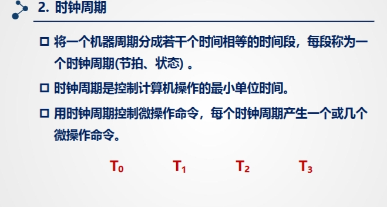
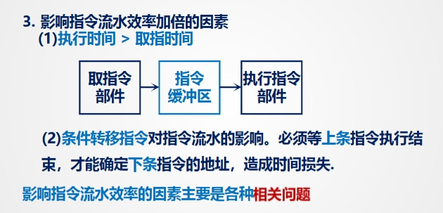

# 07CPU的结构与功能
## 控制器概述
### 控制器的功能

### 控制单元的特性

- 外特性：CPU内部的其他部分以及整个计算机系统是如何进行信息交换的

**CPU 的控制单元 (CPU's Control Unit)** 的 **外部特性 (External Characteristics)**。

* **控制单元 CU (Control Unit CU):** 这是图中显示的核心组件。它是 CPU 中负责指挥处理器操作的部分。它告诉计算机的内存、算术逻辑单元以及输入/输出设备如何响应发送到处理器的指令。
* **指令寄存器 (Instruction Register):** 当前正在执行的指令就保存在这里。控制单元从这里获取指令，进行解码，并确定需要执行哪些操作。
* **标志 (Flags):** 这些是状态位，指示操作的结果（例如，零标志、进位标志、溢出标志）。控制单元使用这些标志来做出决策，尤其是在条件跳转指令中。
* **时钟 (Clock):** 时钟提供时序信号，用于同步 CPU 内的所有操作。控制单元使用时钟信号来安排其操作顺序。
* **CPU 内部的控制信号 (Internal CPU control signals):** 这些是由控制单元生成的信号，用于控制 CPU *内部* 其他组件的操作，例如 ALU (算术逻辑单元) 和寄存器。
* **到系统总线的控制信号 (Control signals to the system bus):** 这些是由控制单元生成的信号，发送到系统总线以控制连接到总线的其他设备，例如内存和 I/O 设备。这些信号决定了诸如从内存读取或向内存写入等操作。
* **来自系统总线的控制信号 (Control signals from the system bus):** 这些是控制单元从系统总线上其他设备接收到的控制信号。这可能包括与中断或总线请求相关的信号。
* **系统总线 (System Bus):** 这是一组导线的集合，数据、地址和控制信号通过它在 CPU 与计算机系统的其他组件（如内存和 I/O 设备）之间传输。

总而言之，这张图显示控制单元从指令寄存器接收指令，从标志接收状态信息，并从时钟接收时序信号。基于这些输入，它生成控制信号，管理 CPU 内部以及通过系统总线与外部设备的交互操作。它也接收来自系统总线的控制信号。这种信号流使得控制单元能够协调指令的执行。

### 指令周期

#### 基本概念

#### 指令周期长度

- **没有任何操作是只有取指周期的**
- **间址周期 (间址周期)**: 这是因为采用了间接寻址而额外增加的一个周期。在取指周期获取指令后，CPU 发现这条指令使用的是间接寻址方式。指令中的地址码指向的是一个内存地址 A。在间址周期中，CPU 会根据地址 A 再次访问内存，从地址 A 指向的内存单元中取出真正的操作数地址（假设是地址 B）。现在 CPU 知道了操作数存放在地址 B。
- **中断周期**就是CPU处理中断请求的阶段。如果检测到有中断请求， CPU就会进入中断周期。在这个周期中，CPU会做一些准备工作，以便之后能够回到被中断的程序继续执行。这些工作通常包括：
保存当前程序的状态：将当前程序计数器 (PC) 的值（即下一条要执行指令的地址）以及其他重要的寄存器内容保存到内存中的某个特定位置（通常是栈），这样在中断服务程序执行完毕后，可以恢复现场，回到原来被中断的地方继续执行。
载入中断服务程序的入口地址：根据中断类型，确定相应的中断服务程序在内存中的起始地址，并将其加载到程序计数器 (PC) 中。这样，下一个取指周期就会从中断服务程序的第一条指令开始。
#### 指令周期流程

#### CPU的工作周期的标志

- **FED, INDD, EXD, INTD** 可以看作是控制单元发出的控制信号，就像交通信号灯一样，告诉CPU内部的其他部件（比如ALU、寄存器、总线接口等）当前处于哪个工作阶段，从而激活或禁用相应的功能电路。例如，当 FED 信号有效时，数据总线会被配置为接收指令数据；当 EXD 信号有效时，ALU 可能被激活以执行计算。
- **1 → FE, 1 → IND, 1 → EX, 1 → INT** 表示了这些周期开始的条件或标志。它们是由控制单元根据当前指令、标志位、时钟信号以及是否发生中断等因素内部产生的状态转换。
- 整个过程由 **CLK** 精确计时和同步，确保各个阶段有序进行。

### 机器周期：CPU 完成一个基本步骤所需的时间

1.  **若指令字长 = 存储字长**
    * **指令字长 (Instruction Word Length)**：一条指令包含的二进制位数。不同的指令可能有不同的长度，但在讨论基本概念时，常指一种标准或常见的指令长度。
    * **存储字长 (Storage Word Length)** 或 **内存字长 (Memory Word Length)**：内存进行一次读/写操作所能存取（读出或写入）的二进制位数。这通常是由数据总线的宽度决定的。
    * 这句话的意思是：**如果一条指令的长度恰好等于内存一次能读写的数据宽度。**

2.  **访问周期 = 机器周期**
    * **访问周期 (Access Cycle)** 或 **存取周期 (Memory Cycle)**：指CPU向内存发出读/写命令到完成该操作所需的全部时间。简单来说，就是CPU访问一次内存所需的时间。
    * **机器周期 (Machine Cycle)**：这是CPU工作中最基本的时间单位。一个指令周期（执行一条指令的总时间）通常由若干个机器周期组成。每个机器周期完成CPU的一个基本操作，比如一次内存访问、一次I/O访问或者一次寄存器操作等。不同的CPU设计对机器周期的定义可能略有差异，但它是一个固定的时间长度，通常等于若干个时钟周期。
    * 这句话的意思是：**如果CPU进行一次内存访问所需的时间，恰好等于一个机器周期的长度。**

**综合理解：**

这两句话合在一起，描述了一种理想或简化的计算机系统模型下的情况。

当 **指令字长等于存储字长** 时，CPU 只需要进行 **一次内存访问** 就可以完整地取出一条指令。

如果同时满足 **访问周期等于机器周期**，那么意味着进行这次“取指令”所需的内存访问操作，正好耗时一个机器周期。

因此，在这种 **“指令字长 = 存储字长”** 且 **“访问周期 = 机器周期”** 的条件下，**取指周期 (Fetch Cycle)** 的时间长度就**等于一个机器周期**。

这简化了指令周期的时序控制，因为最基本的取指操作恰好与CPU的一个基本时间单元（机器周期）对齐。在一些早期的或概念性的计算机体系结构中，常常会设定机器周期的时间长度就等于内存访问周期的时间长度，以方便设计和理解。但在现代复杂的CPU中，由于指令长度可变、内存访问速度与CPU主频的差异、流水线技术等，指令周期、机器周期和内存访问周期之间的关系会复杂得多。

总而言之，这两句话描述的是一个特定场景下的等价关系，表明在指令长度与内存宽度匹配，并且内存访问时间恰好是一个机器周期时，最基本的取指令操作可以在一个机器周期内完成。

### 时钟周期

#### 时钟周期产生的方法

- 最底层、最基本的时间单位是时钟周期 (CLK 的周期)。
- 在时钟周期的基础上，通过时序电路生成更精细的时序脉冲 (T0, T1, T2, T3 等)。
- 若干个时钟周期或时序脉冲组合起来，构成一个机器周期，用于完成一个基本操作。
- 最后，若干个机器周期组合起来，构成一个指令周期，用于完成一条指令的取指、译码、执行等全过程（如前几张图所示，一个指令周期可能包含取指机器周期、间址机器周期、执行机器周期等）。

#### 机器周期的类型
- 1.定长机器周期类型：每一个**机器周期**的时间长度**固定不变**。无论 CPU 在这个机器周期内执行什么具体的基本操作（如取指令、读数据、写数据等），所花费的时间都是一样的。

- 2.不定长机器周期类型：**不同的机器周期**可以有不同的时间长度。一个机器周期包含多少个时钟周期（或者说多少个节拍 T0, T1, T2...），取决于在这个机器周期内执行的具体操作的复杂程度和所需时间。

### 多级时序系统

## 指令周期的数据流

### 取指周期

1.  **PC → MAR → 地址总线**:
    * **程序计数器 (PC)** 中存放着下一条要执行的指令在内存中的地址。
    * 在取指周期的开始，CPU 将 PC 中的地址**传送到 内存地址寄存器 (MAR)**。
    * 然后，MAR 中的地址被**放到地址总线**上。地址总线是 CPU 指向内存中特定位置的通道。

2.  **1 → R (或 发出读命令)**:
    * **控制单元 (CU)** 通过**控制总线**向内存发出一个“读”命令（这里的 `1 → R` 表示发出读信号）。这个信号告诉内存，CPU 现在要从地址总线上指定的地址读取数据。

3.  **M(MAR) → MDR**:
    * **内存 (存储器)** 接收到地址总线上的地址和控制总线上的读命令后，找到该地址对应的存储单元。
    * 将该存储单元中的数据（即要取的指令）**放到 数据总线**上。
    * CPU 通过数据总线接收到这条指令数据，并将其**存入 内存数据寄存器 (MDR)** 中。这里的 `M(MAR)` 表示内存中由 MAR 指向的地址的内容。

4.  **MDR → IR**:
    * 存放在 MDR 中的指令是二进制编码形式的。
    * CPU 将 MDR 中的指令**传送并存入 指令寄存器 (IR)** 中。此时，指令已经被成功取到 CPU 内部，准备进行下一步的译码和执行。

5.  **OP(IR) → CU**:
    * 指令寄存器 (IR) 中的指令通常包含操作码 (Opcode) 和操作数/地址信息。
    * 指令中的**操作码部分 (OP(IR)) 被送到 控制单元 (CU)** 进行**译码**。控制单元分析操作码，确定这是一条什么类型的指令，需要执行什么操作，以及操作数在哪里。这是为接下来的执行周期做准备。

6.  **(PC) + 1 → PC**:
    * 为了准备取下一条指令，程序计数器 (PC) 需要**自动加 1**（或者加上当前指令的长度，如果是变长指令系统）。
    * 更新后的地址再**写回 PC**。这个操作通常与内存访问并行进行，以提高效率

#### 取指周期的操作命令

**受控信号依次传递->受控门依次打开->数据依次流动**

#### 间址周期的数据流

1.  **Ad(IR) → MAR**:
    * 在取指周期结束后，当前指令已经保存在**指令寄存器 (IR)** 中。如果控制单元发现这条指令使用了间接寻址，那么指令中地址码部分 **Ad(IR)**（即指令中指定的那个间接地址，它本身并不是操作数的最终地址）将被**传送到 内存地址寄存器 (MAR)**。这个地址是存放操作数实际地址的那个内存单元的地址。

2.  **1 → R (或 发出读命令)**:
    * **控制单元 (CU)** 通过**控制总线**向内存发出一个“读”命令。这次读内存的目的不是取指令，而是为了读取存放在刚刚传送到 MAR 的地址中的内容（这个内容就是操作数的实际地址）。

3.  **M(MAR) → MDR**:
    * **内存 (存储器)** 接收到 MAR 中的地址和读命令后，找到该地址对应的存储单元。
    * 将该存储单元中的**内容**（这个内容就是我们正在寻找的操作数的**实际地址**）**放到 数据总线**上。
    * CPU 通过数据总线接收到这个实际地址，并将其**存入 内存数据寄存器 (MDR)** 中。

4.  **MDR → Ad(IR)**:
    * 此时，MDR 中存放的就是操作数的**实际地址**。
    * CPU 将 MDR 中的这个实际地址**传送回 指令寄存器 (IR) 的地址码部分 Ad(IR)**，替换掉原来存放的间接地址。
    * （在某些体系结构中，这个实际地址也可能直接传送到 MAR，为接下来的执行周期访问操作数做准备）。
    * 现在，IR 的地址码部分已经包含了操作数的**有效地址**，可以用于在执行周期中直接访问操作数了。

#### 间址周期的操作命令

### 执行周期
#### 执行周期的操作命令分析
- **1.非访存指令**

  * 非访存指令是指那些在执行过程中**不需要访问内存**的指令。它们的操作通常只在 CPU 内部的寄存器之间进行。
	* 五种非访存指令：

		1.  **CLA**
			* **中文含义**: **清 A** (Clear Accumulator)
			* **微操作**: `0 → ACC`
			* **解释**: 将累加器 (ACC) 的内容清零，即把 0 写入 ACC 寄存器。

		2.  **COM**
			* **中文含义**: **取反** (Complement Accumulator)
			* **微操作**: `ACC → ACC` (上面有一横线表示取反)
			* **解释**: 将累加器 (ACC) 中的所有二进制位取反（0 变 1，1 变 0），并将结果存回 ACC。

		3.  **SHR**
			* **中文含义**: **算术右移** (Arithmetic Right Shift)
			* **微操作**: `L(ACC) → R(ACC)`, `ACC₀ → ACC₀`
			* **解释**: 对累加器 (ACC) 数据进行算术右移。
					* `L(ACC) → R(ACC)` 表示 ACC 中除了最高位（符号位）之外的其他位整体向右移动一位。
					* `ACC₀ → ACC₀` 表示最高位（符号位 ACC₀）的值保持不变。
					* 最右边移出的一位通常会进入一个标志位（如进位标志），但图中未 explicitly 表示。最左边空出的一位由原来的符号位填充，以保持原数的符号。

		4.  **CSL**
			* **中文含义**: **循环左移** (Cyclic Left Shift)
			* **微操作**: `R(ACC) → L(ACC)`, `ACC₀ → ACCn`
			* **解释**: 对累加器 (ACC) 中的数据进行循环左移。
					* `R(ACC) → L(ACC)` 表示 ACC 中除了最低位之外的其他位整体向左移动一位。
					* `ACC₀ → ACCn` 表示原来的最高位（符号位 ACC₀）的值会移动到最低位（ACCn，n 是 ACC 的位数减一）。被移出的最低位通常会进入进位标志，图中未 explicit 表示，但图中描述的是循环左移回 ACC 的最低位。

		5.  **STP**
			* **中文含义**: **停机指令** (Halt Instruction)
			* **微操作**: `0 → G`
			* **解释**: 执行停机操作。`0 → G` 可能表示将某个控制寄存器或标志位 G 设置为 0，从而使 CPU 停止执行指令。

- **2. 访存指令**

- **3. 转移指令**

	**转移指令 (Transfer Instructions)**。转移指令的作用是改变程序正常的顺序执行流程，让 CPU 跳转到程序的其他位置去执行指令。
		1.  **无条件转移 (Unconditional Transfer)**
				* **指令**: `JMP X`
				* **解释**: `JMP` 是助记符，表示“跳”，`X` 通常表示目标地址。这条指令的作用是**无条件地**跳转到地址 X 去执行下一条指令。
				* **微操作**: `Ad(IR) → PC`
				* **解释**: 这条微操作说明了如何实现无条件转移。`Ad(IR)` 表示当前指令（已经在指令寄存器 IR 中）的地址码部分，也就是目标地址 X。这条微操作将目标地址 X 直接**送入 程序计数器 (PC)**。我们知道 PC 总是指向下一条要执行的指令的地址，所以将 PC 的值修改为 X 后，CPU 下一个取指周期就会从地址 X 开始取指令，从而实现了跳转。
		2.  **条件转移 (Conditional Transfer)**
				* **指令**: `BAN X (负则转)`
				* **解释**: `BAN` 可能是某种指令系统的助记符，`X` 是目标地址。括号里的“负则转”是中文解释，意思是“如果（某个条件）为负，则跳转”。这个条件通常是根据前一条指令的运算结果产生的状态标志来判断的。在这个例子中，判断条件是“负”，通常指累加器 (ACC) 的值是否为负，也就是检查 ACC 的符号位。
				* **微操作**: `A₀ • Ad(IR) + Ā₀ • (PC) → PC`
				* **解释**: 这是一条描述条件转移逻辑的微操作表达式。
						* `A₀`: 表示累加器 (ACC) 的符号位。如果 ACC 的值为负，通常 A₀=1；如果 ACC 的值为非负，通常 A₀=0。
						* `Ad(IR)`: 目标地址 X。
						* `(PC)`: 当前程序计数器 PC 的值（指向下一条按顺序执行的指令）。
						* `Ā₀`: 表示 A₀ 的逻辑非（如果 A₀=1，则 Ā₀=0；如果 A₀=0，则 Ā₀=1）。
						* `•`: 表示逻辑“与”（AND）操作。
						* `+`: 在这里表示逻辑“或”（OR）操作，用于选择两个可能的值之一。
						* 整个表达式 `A₀ • Ad(IR) + Ā₀ • (PC) → PC` 的含义是：
								* **如果 A₀ 为 1 (即累加器 ACC 为负)**，则 `A₀ • Ad(IR)` = `1 • Ad(IR)` = `Ad(IR)`，而 `Ā₀ • (PC)` = `0 • (PC)` = `0`。所以 PC 的新值是 `Ad(IR) + 0` = `Ad(IR)`。CPU 跳转到地址 X。
								* **如果 A₀ 为 0 (即累加器 ACC 非负)**，则 `A₀ • Ad(IR)` = `0 • Ad(IR)` = `0`，而 `Ā₀ • (PC)` = `1 • (PC)` = `(PC)`。所以 PC 的新值是 `0 + (PC)` = `(PC)`。PC 值不变，CPU 会继续顺序执行下一条指令。
#### 指令周期长度

### 中断周期的数据流

* **CPU (中央处理器):** 计算机的核心。
    * **PC (Program Counter，程序计数器):** 存储下一条要执行的指令的内存地址。
    * **MAR (Memory Address Register，内存地址寄存器):** 存储要访问的内存地址。
    * **MDR (Memory Data Register，内存数据寄存器):** 存储从内存读取的数据或要写入内存的数据。
    * **CU (Control Unit，控制单元):** 控制 CPU 的操作和数据流向。
* **存储器 (Memory):** 存储程序指令和数据。
* **地址总线 (Address Bus):** CPU 用它来指定要访问的内存地址。
* **数据总线 (Data Bus):** CPU 用它来传输数据到内存或从内存读取数据。
* **控制总线 (Control Bus):** CPU 用它来发送控制信号，例如读写信号。

中断周期发生在 CPU 检测到中断请求并决定响应时。图示流程可以分解为以下几个步骤：

1.  **保存被中断程序的现场（部分）：**
    * **`PC -> MDR`**: 这是图示中首先明确表示的操作。程序计数器 (PC) 中存储着下一条本来应该执行的指令的地址。在响应中断时，需要将这个地址（也就是被中断程序的返回点）保存起来，以便中断服务程序执行完毕后能够正确返回继续执行原来的程序。这里将 PC 的内容传输到存储器数据寄存器 (MDR) 中，作为即将要保存的数据。
    * **`0 -> MAR`**: 这个操作表示将地址值 0 放入存储器地址寄存器 (MAR) 中。在某些简单的体系结构或特定的中断处理机制中，CPU 会将重要的状态信息（如 PC 值）保存到内存中的一个固定地址，这里假设是地址 0。所以 MAR 被设置为 0，指示接下来要访问内存地址 0。
    * **`1 -> W`**: 这里的 `W` 很可能代表写控制信号。`1 -> W` 表示发出写（Write）命令。这意味着 CPU 准备将数据写入内存。
    * **`MDR -> M(MAR)`**: 这个操作表示将 MDR 中的内容（之前保存的 PC 值）写入到 MAR 所指向的内存地址中（这里是内存地址 0）。这样，被中断程序的返回地址就被保存到内存的特定位置了。

2.  **获取中断服务程序的入口地址（向量地址）：**
    * **`向量地址 -> PC`**: 在保存了被中断程序的返回地址后，CPU 需要知道相应中断服务程序的入口地址。这个地址通常通过中断向量表等机制获得，并被送入 PC 中。图示中的“向量地址”代表了这个过程的结果——找到了中断服务程序的起始地址。将这个地址加载到 PC 中，使得 CPU 在下一个取指周期就会从这个地址开始取指令，从而跳转到中断服务程序。

3.  **关闭中断（防止嵌套中断）：**
    * **`0 -> EINT (置 "0")`**: 这里的 `EINT` 可能代表中断允许标志或寄存器（Enable Interrupt）。将 `EINT` 置为 0 表示关闭中断。这是为了防止在执行中断服务程序的过程中，被其他中断再次打断，造成混乱。

4.  **控制单元 (CU) 的协调作用：**
    * 图示中的 CU 连接着 PC, MAR, MDR 以及总线和存储器。这表明上述所有数据传输和控制信号（如读/写命令）都是由控制单元 CU 根据当前所处的中断周期状态发出的。

**总结整个流程：**

当 CPU 收到中断请求并响应时，它首先执行一个中断周期。在这个周期中，CPU 会暂停当前程序的执行，进行现场保护（至少保存 PC 的值），将 PC 的值写入内存的指定位置（图示中是地址 0），然后获取相应中断服务程序的入口地址（向量地址），将该地址载入 PC，同时关闭中断。完成这些步骤后，CPU 就会从新的 PC 值（即中断服务程序的入口地址）开始取指令，进入中断服务程序的执行阶段。

**图中额外的操作：**

* **向量地址 → PC:** 在保存了返回地址之后，需要跳转到中断服务程序 (ISR) 去执行。向量地址就是对应于此次中断的 ISR 的起始地址。这个地址被加载到 PC 中，使得 CPU 下一步将从 ISR 的第一条指令开始执行。
* **0 → EINT (置 "0"):** EINT 可能代表中断允许标志 (Enable Interrupt)。将 EINT 设置为 '0' 表示禁用进一步的中断，这通常是为了防止在处理当前中断时被其他中断打断（尽管复杂系统中可能有优先级更高的中断可以打断）。

#### 中断周期的操作命令分析

**控制器发出控制信号=>一系列通道打开=>一系列操作执行**

## 控制信号

### 控制信号举例
#### 1.取指周期

C1->C2->C3->C4

该取指流程（基于图示）叙述如下：

1.  **准备取指令地址：**
    * 控制单元（CU）发出控制信号 **C0** 和 **C1**。
    * **C0** 使程序计数器（PC）的数据输出有效。
    * **C1** 使存储器地址寄存器（MAR）的数据输入有效。
    * 在 **C0** 和 **C1** 的共同控制下，PC 中存放的下一条指令的地址被送入 MAR。
    * **数据流：** `PC -> MAR`

2.  **访问存储器取指令：**
    * MAR 中的地址通过地址总线（未在 CPU 内部详细画出）送往主存储器。
    * 控制单元（CU）发出存储器读（Read）命令（未用具体 C 号表示，但由 CU 控制总线发出）。
    * 存储器根据地址总线和读命令，找到对应的存储单元，将其中存放的指令读出，并通过数据总线（未在 CPU 内部详细画出）送入存储器数据寄存器（MDR）。
    * **数据流：** `M(MAR) -> MDR` (M(MAR) 表示 MAR 指向的内存单元内容)

3.  **指令送入指令寄存器：**
    * 控制单元（CU）发出控制信号 **C2**。
    * **C2** 使 MDR 的数据输出有效，并将 MDR 中的指令内容送入指令寄存器（IR）。
    * **数据流：** `MDR -> IR`
    * 至此，取指操作完成，指令已进入 IR，等待译码和执行。

4.  **准备译码和后续操作：**
    * 控制单元（CU）发出控制信号 **C3**（图示显示从 CU 到 IR，具体控制功能在此图示中不够明确，可能与 IR 的内部状态或下一步操作准备有关）。
    * 控制单元（CU）发出控制信号 **C4**。
    * **C4** 使 IR 的部分数据输出有效，将指令中与地址或操作数相关的信息（例如，对于 `ADD @X`，可能是地址 X 的信息）送往算术逻辑单元（ALU）。这通常是译码阶段和后续地址计算或取数操作的准备。
    * **数据流：** `IR (部分) -> ALU`

整个流程由时钟信号驱动，控制单元（CU）根据时钟周期和当前的指令阶段（这里是取指周期），按时序发出相应的控制信号（C0, C1, C2, C3, C4 等），协调各部件完成数据的流动。图示下方列出的 `C1->C2->C3->C4` 可能暗示了这些控制信号激活的时序顺序（在 PC->MAR 传输之后，可能先激活 C1/C0，然后是 C2，接着是 C3 和 C4）。
#### 2.间址周期

C5->C1->C2->C3->C4

### 执行周期

C5->C1->C2->C6->C7->C8

## 流水线技术
### 提高机器速度的方法

### 系统的并行性

1.  **并行的概念 (Concept of Parallelism):**
    * 并行是指**时间上互相重叠**的多个事件。这意味着多个事情在同一段时间内都在发生。
    * 图中进一步区分了并行的两种情况：
        * **并发 (Concurrency):** 指**两个或两个以上事件在同一时间段发生**。在单核处理器上，并发通常是通过CPU在不同任务之间快速切换（时间片轮转等）来实现的，从宏观上看，它们是同时进行的，但微观上看，在任何一个时刻，CPU实际上只在处理一个任务。
        * **同时 (Simultaneity):** 指**两个或两个以上事件在同一时刻发生**。这通常需要多核处理器或多个处理单元才能实现，即在同一瞬间，多个任务或操作确实在物理上一起执行。

    * 简单来说，**并发**强调的是在一段时间内宏观上的并行，可能是通过任务切换实现的；而**同时**强调的是在同一瞬间微观上的并行，需要物理上的并行处理能力。

2.  **并行性的等级 (Levels of Parallelism):**
    图将并行性分为了两个主要的等级，并描述了它们的特点：
    * **过程级 (进程级) (Process Level):**
        * 对应于计算机中的**进程 (Process)**。一个进程是程序的一次执行实例，拥有独立的地址空间和资源。
        * 特点是**粗粒度 (Coarse-grained)**：指并行任务之间的计算量比较大，任务切换或通信的开销相对占比较小。
        * 通常通过**软件实现 (Software Implementation)**：例如操作系统调度不同的进程在CPU上执行，实现进程间的并发。在多核系统上，不同的进程可以在不同的核上真正同时执行。

    * **指令级 (Instruction Level):**
        * 对应于计算机程序中的**指令 (Instruction)**。
        * 特点是**细粒度 (Fine-grained)**：指并行操作之间的计算量非常小，可能是单个指令或几个指令，因此任务切换或数据依赖带来的开销影响较大。
        * 通常通过**硬件实现 (Hardware Implementation)**：例如在流水线处理、超标量处理器中，通过硬件技术让多条指令在同一周期内并行执行，或者让指令的不同阶段重叠执行。

### 指令流水原理
#### 1.指令的串行执行

#### 2. 指令的二级流水

### 指令的六级流水

好的，这张图解释了“指令的六级流水线”。指令流水线是一种计算机体系结构技术，用来提高处理器执行指令的效率和吞吐量。它将一条指令的执行过程分解成若干个小的、可以独立进行的步骤（阶段），并让这些不同指令的不同阶段能够重叠执行，就像工厂的生产流水线一样。
1.  **取指 (Fetch Instruction - FI):**
    * 阶段任务：从内存中取出下一条要执行的指令。
    * 操作：根据程序计数器 (PC) 中的地址，从内存中读取指令，并将指令存入指令寄存器。同时，更新 PC 指向下一条指令的地址。

2.  **译码 (Decode Instruction - DI):**
    * 阶段任务：对取出的指令进行译码，分析指令的操作类型、操作数、操作数地址等信息。
    * 操作：识别指令是哪种操作（如加、减、乘、除、加载、存储等），确定需要哪些操作数以及它们在哪里（寄存器或内存地址）。

3.  **计算操作数地址 (Calculate Operand Address - CO):**
    * 阶段任务：如果指令的操作数在内存中，则计算出操作数在内存中的实际地址。
    * 操作：根据指令中提供的地址信息（如基址、变址、偏移量等）和寻址方式，计算出操作数在内存中的有效地址。

4.  **取数 (Fetch Operand - FO):**
    * 阶段任务：根据上一步计算出的地址，从内存或寄存器中取出操作数。
    * 操作：从内存或寄存器中读取操作数，并将操作数放入 CPU 的内部寄存器或缓冲区。

5.  **执行 (Execute Instruction - EI):**
    * 阶段任务：执行指令规定的操作。
    * 操作：根据指令类型，进行算术运算（加、减等）、逻辑运算、数据传输等操作。如果指令是控制转移指令（如跳转、分支），也在此阶段计算出新的程序地址。

6.  **写回 (Write Back - WB):**
    * 阶段任务：将指令的执行结果写回指定的目的地（寄存器或内存）。
    * 操作：将上一步执行阶段产生的结果（如运算结果）存入目标寄存器或写入内存中的指定位置。

**流水线的工作原理：**

在没有流水线的情况下，CPU 需要一个指令执行完所有六个阶段后，才能开始下一条指令的取指。而有了六级流水线后，当第一条指令处于“译码”阶段时，第二条指令就可以开始“取指”；当第一条指令处于“执行”阶段时，第二条指令处于“取数”，第三条指令处于“计算操作数地址”，第四条指令处于“译码”，第五条指令处于“取指”。理论上，在一个时钟周期内，每个阶段都可以处理一条不同的指令，从而大大提高了指令的吞吐率（单位时间内完成的指令数量）。

#### 3.影响指令流水效率加倍的因素

### 流水线性能
#### 1.吞吐量与吞吐率

**最大吞吐率：** n -> ∞

公式的解释：

- 分母 m⋅Δt+(n−1)⋅Δt: 这代表处理这连续 n 条指令所需要的总时间。
- 第一条指令通过流水线的 m 个阶段，需要 m⋅Δt 的时间才能完全流出流水线。
- 在理想情况下，当第一条指令进入第 2 级时，第二条指令就可以进入第 1 级。此后，每隔 Δt 时间，就有一条新的指令进入流水线，并且每隔 Δt 时间，就有一条指令从流水线中流出（完成）。
- 因此，从第一条指令开始进入流水线，到第 n 条指令完全流出流水线，总共花费的时间是：第一条指令通过所有阶段的时间 (m⋅Δt)，加上后面 (n-1) 条指令“紧跟着”流出所需要的时间 ((n−1)⋅Δt)。
- 分子 n: 这是完成的指令总数。
- 所以，实际吞吐率就是 完成的指令总数 / 处理这些指令所花费的总时间。

#### 2.加速比Sp

**最大加速比：** n -> ∞

#### 3.效率

**最大效率：** n -> ∞
好的，您提供的图片解释的是流水线技术中的**效率 (Efficiency)**。

效率是衡量流水线各个段（级）在运行时间内的**实际利用率**。简单来说，它表示在总的运行时间内，流水线的各个段有多少时间是真正处于工作状态的。

图示给出了效率的定义和计算公式：

**定义：**
效率 = 流水线各段处于工作时间时的时空区 / 流水线中各段总的时空区

**计算公式：**
效率 $= \frac{mn\Delta t}{m(m+n-1)\Delta t}$

1.  **$n$**: 要处理的指令总数。
2.  **$m$**: 流水线的级数，即一条指令需要经过 m 个阶段（段）才能完成。
3.  **$\Delta t$**: 流水线每一段（级）需要的时间，通常等于一个时钟周期。

**公式分子：$mn\Delta t$**

* 这代表的是**流水线各段处于工作时间时的时空区**，可以理解为**总的有效工作时间**。
* 每一条指令都需要通过 m 个阶段，每个阶段花费 $\Delta t$ 时间。
* 如果处理 n 条指令，理想情况下每条指令都完整地使用了这 m 个阶段。
* 因此，所有指令在所有阶段总共花费的**有用时间**（或者说占据的时空面积）就是 n 条指令 * 每条指令的级数 * 每级的时间 = $n \cdot m \cdot \Delta t$。

**公式分母：$m(m+n-1)\Delta t$**

* 这代表的是**流水线中各段总的时空区**，可以理解为在处理这 n 条指令的**总时间段内**，流水线所有段的**总容量**或**总潜力**。
* 处理 n 条指令所花费的总时间（从第一条指令进入流水线到最后一条指令完成并流出）是 $m\Delta t + (n-1)\Delta t$。这与我们之前解释吞吐率时提到的总时间一致，也可以从图示的“时空图”中看出，总时间轴的长度是 $(m+n-1)\Delta t$。
* 流水线有 m 个段。
* 所以，在这段总时间 $(m+n-1)\Delta t$ 内，m 个段的总时空容量（或者说图示中包含所有方格的总矩形面积）就是 流水线段数 * 总时间 = $m \cdot (m+n-1)\Delta t$。

**时空图 (Space-Time Diagram):**

图示下方的时空图直观地展示了这一概念。
* 纵轴 S空间 表示流水线的各个段（S1, S2, ..., Sm）。
* 横轴 T时间 表示时间。
* 每一个小方格代表流水线的一个段在一个时间单位 $\Delta t$ 内的状态。
* 标记数字的方格表示该段正在处理该编号的指令。这些标记数字的方格的总面积就是分子所代表的“流水线各段处于工作时间时的时空区” $mn\Delta t$。
* 整个图示覆盖的矩形区域（高度是 m 段，宽度是总时间 $(m+n-1)\Delta t$）代表了分母所代表的“流水线中各段总的时空区” $m(m+n-1)\Delta t$。

**公式化简：**

将分子和分母中的 $m$ 和 $\Delta t$ 消去，得到：
效率 $= \frac{n}{m+n-1}$

**结论：**

这个公式表明，流水线的效率等于完成的指令数 n 除以总时间段内“有效使用”的时钟周期数。
* 当处理的指令数量 n **远大于**流水线级数 m 时 ($n \gg m$)，效率接近于 $\frac{n}{n} = 1$。这意味着流水线几乎没有空闲，达到了很高的利用率。
* 当处理的指令数量 n **较少**或等于流水线级数 m 时，效率会比较低，因为流水线在启动阶段（填满流水线）和结束阶段（排空流水线）会有较多的空闲时间。

因此，流水线效率反映了其并行处理能力的发挥程度，受到流水线级数 m 和任务数量 n 的影响。

### 流水线结构
#### 1.流水线结构

#### 2.运算流水线结构 

- 锁存器：防止指令提前流入后续阶段

## 流水线的相关问题
### 结构相关

1,4冲突 1，3，6冲突
### 解决方法
- 1.后续指令停顿=>流水线性能下降
- 2.指令存储器和数据存储器分开，多部件=>准备两个存储器：1-存储指令，2-存储数据（哈弗结构）
- 3.指令预取技术（适用于访存周期短的情况）：**通过提前获取指令来隐藏访存延迟、保证流水线持续流动的性能**，在处理器真正需要某条指令之前，就提前把它从内存（或缓存）中读取到离处理器核心更近的地方（通常是一个预取缓冲区 Instruction Prefetch Buffer 或直接放入指令缓存 Instruction Cache）。相当于取指部件一直取指令存到预取缓冲区，将来发生取指令和取数据冲突优先取数据。
### 数据相关
- 1.写后读相关

- 2.读后写相关

- 3.写后读相关

### 数据相关的解决方法
- **1.从算数逻辑单元直接取数**

- **2.指令静态调度**
	- 谁做？ 主要由编译器 (Compiler) 在程序编译阶段完成。
	-	怎么做？ 编译器分析程序的指令序列，识别出数据相关性。然后，它根据这些依赖关系和目标处理器的流水线特性（例如，不同指令的执行延迟），在基本块内或跨基本块（如果编译器足够高级）对指令进行重新排序。**编译器会尽量把不相关的指令插入到有数据相关指令之间，从而填充流水线中的空闲槽（Pipeline Bubbles）。**
	-	如何解决数据相关？ 编译器在已知指令执行延迟的情况下，通过预测和预先安排指令的顺序，使得当有数据相关的指令需要执行时，其所需的数据已经准备好或者正在传输的路上，从而减少或消除等待时间。它是在程序运行前就确定了执行顺序。
	-	优点： 硬件实现相对简单，成本较低。编译器可以有更全局的代码视图（至少在一个编译单元内）。
	-	缺点：
		调度效果高度依赖于编译器的水平和对目标硬件特性的了解。
		编译器无法预测运行时才会发生的情况，例如缓存未命中 (Cache Miss) 的延迟、分支预测失败等，这些情况会引入运行时变动，导致编译时做出的静态调度并非最优。
		通常只能在有限的范围内（如基本块）进行有效调度，跨越较大的代码区域进行静态调度比较困难。
- **3.指令动态调度**
	- 谁做？ 主要由处理器硬件 (Hardware) 在程序运行阶段完成。
  - 怎么做？ 处理器在运行时，会动态地检查指令的数据相关性。**它不会严格按照程序原始顺序执行指令，而是允许指令乱序 (Out-of-Order) 执行，只要它们的操作数已经准备好并且有所需的功能单元可用**。常用的硬件机制包括保留站 (Reservation Station) 用于存放指令和操作数，以及重排序缓冲区 (Reorder Buffer) 用于保证乱序执行后的结果能够按程序顺序正确提交（Commit）。
  - 如何解决数据相关？ 硬件在运行时实时检测指令的输入数据是否可用。一旦数据准备好，即使这条指令在程序顺序中比较靠后，它也可以立即被调度到功能单元执行。这通过并行执行无关指令来隐藏数据相关的延迟，从而避免流水线停顿。它是根据实际运行情况动态地调整执行顺序。
  - 优点：
		能够处理编译时无法预测的运行时事件（如缓存未命中、分支结果）。
		可以更好地利用处理器的空闲资源，挖掘更多的指令级并行性。
		不受限于基本块的边界，可以在更大的范围内进行调度。
  - 缺点：
		硬件实现非常复杂，需要大量的电路和功耗（例如，实现保留站、重排序缓冲区、公共数据总线等）。
		硬件动态调度的范围通常受限于发射窗口的大小。	
### 控制相关
由指令转移引起

#### 例子

导致指令4，5，6，7执行浪费。直到第13个周期才会有一条指令完成。

#### 控制相关的解决方法
- 1.分支预测法

对于循环前99次都要从循环体末尾跳回开头重新执行。于是我们每次预取的指令不从循环外部取，而是从循环体内预取

分支预测是现代计算机处理器为了提高执行效率而采用的一种技术。它主要解决的是**流水线 (Pipeline)** 执行指令时遇到的一个挑战：**分支指令**。

**首先，为什么需要分支预测？**

现代处理器为了提高性能，通常采用流水线技术。这意味着处理器可以同时处理多条指令的不同阶段（例如：取指、译码、执行、访存、写回）。理想情况下，流水线可以持续不断地流动，每隔一个时钟周期就完成一条指令。

然而，当遇到**分支指令**（比如 `if` 语句、`while` 循环、`for` 循环中的条件判断）时，问题就来了。处理器在执行到分支指令之前，并不知道这个分支是会“跳转”（分支被Taken，执行跳转目标地址的指令）还是“不跳转”（分支未被Taken，执行下一条顺序指令）。

例如，在 `if (condition) { ... } else { ... }` 中，只有 `condition` 计算出来之后，处理器才知道是执行 `if` 里面的代码还是 `else` 里面的代码。

如果在流水线中遇到分支指令，处理器必须等待分支条件判断的结果出来后，才能确定下一条要取的指令地址。如果处理器停下来等待，流水线就会中断，形成**停顿 (Stall)**，这会大大降低处理器的吞效率。

**分支预测法的核心思想：**

为了避免这种停顿，分支预测技术出现了。它的基本思想是：**在分支指令的条件结果出来之前，处理器就“猜测”一下分支的走向（会跳转还是不跳转），并根据这个猜测提前从预测的路径上取下一条可能的指令，并让这些指令进入流水线进行预处理。**

**工作流程大致是：**

1.  当处理器遇到一个分支指令时，分支预测单元会根据某种策略（下面会提到）预测这个分支是会跳转还是不跳转。
2.  根据预测结果，处理器不等分支条件实际计算出来，就立即从预测的下一条指令地址开始取指令，并将它们放入流水线中继续执行。
3.  稍后，当分支指令实际执行完毕，分支的真实结果（真正跳转了还是没跳转）就确定了。
4.  **如果预测正确：** 处理器继续愉快地执行已经在流水线中的指令，没有发生停顿，性能得到了提升。
5.  **如果预测错误：** 处理器会发现之前根据错误预测取进来并开始处理的指令是无用的。这时，处理器必须**撤销 (Flush)** 或**冲刷**掉这些错误的指令，并回到分支指令的位置，重新从正确的路径上取下一条指令，然后流水线才能继续正常工作。预测错误会带来一定的性能损失，因为它浪费了之前在错误路径上执行的工作，并引入了重新取指的延迟。

**预测的策略：**

分支预测有不同的策略，从简单到复杂：

* **静态预测 (Static Prediction):** 基于指令本身的特点或者简单的规则进行预测。例如，有些处理器可能固定地预测所有的向后分支（常用于循环）都会跳转，而所有的向前分支（常用于 if-then-else）都不会跳转。
* **动态预测 (Dynamic Prediction):** 这是现代处理器主要采用的方法。它根据分支指令过去的执行历史来预测未来的走向。例如，如果一个分支在过去几次执行中都跳转了，那么预测它下一次也会跳转的可能性就比较大。动态预测通常使用一个称为**分支历史表 (Branch History Table)** 或**模式历史表 (Pattern History Table)** 的结构来记录分支的历史信息。

**与图中内容的关联：**

图中显示了一个 `for` 循环 `for(i=0; i<100; i++)`。这个循环会执行 100 次。循环体内部的代码执行完成后，会有一个隐含的分支指令跳回到循环条件的检查处 (`i<100`)。

* 在前 99 次迭代中，`i < 100` 条件都为真，分支会**跳转**回循环体开头。
* 在第 100 次迭代时，`i < 100` 条件为假，分支会**不跳转**，退出循环。

对于这种循环结构，除了最后一次，前面的分支都是跳转的。动态分支预测器会很快学习到这个模式。在前几次迭代后，它就会预测这个分支会跳转。因此，当执行到循环体末尾时，预测器会预测将要跳转回循环体开头，处理器就会提前从循环体内部的下一条指令地址开始取指令。

这正是图下方文字描述的意思：“对于循环前99次都要从循环末尾跳回开头重新执行。于是我们每次预取的指令不从循环外部取，而是从循环体内预取”。这说明了分支预测成功地预测了循环内部的跳转，使得处理器能够持续高效地从循环体内部取指令并填充流水线，从而加速了循环的执行。

**总结：**

分支预测法是一种通过预测分支指令未来走向来提前取指的技术，目的是减少流水线停顿，提高处理器效率。它通过预测分支是跳转还是不跳转，并提前加载预测路径上的指令，从而在分支结果确定前保持流水线的流畅运行。如果预测正确，则大幅提高性能；如果预测错误，则需要付出一定的代价来纠正。现代处理器通常使用动态预测来提高预测准确率。

## 流水线的多发射技术
### 1.超标量技术

**超标量技术**是一种CPU设计技术，它的主要特点是：

1.  **在一个时钟周期内可以同时发出多条独立的指令。** 这意味着CPU不是一个时钟周期只能处理一条指令，而是可以像工厂里的多条生产线一样，同时启动多条指令的处理过程。为了实现这一点，超标量处理器需要配置多个功能部件（例如多个整数ALU、浮点单元、内存访问单元等），以便不同的指令可以在不同的部件上并行执行。
2.  **不能调整指令的执行顺序。** 与乱序执行不同，基本的超标量技术并不会改变程序原有的指令顺序。它依赖于**编译优化技术**来发挥并行性。编译器会分析代码，找出那些相互之间没有依赖关系（即可以并行执行）的指令，并将它们安排在一起，以便处理器可以在同一个时钟周期内同时发出它们。

图中的甘特图（Gantt chart）样式的时间线展示了指令的并行执行。横轴代表时钟周期，纵轴代表不同的指令。IF (Instruction Fetch)、ID (Instruction Decode)、EX (Execute)、WR (Write Back) 代表指令执行的各个阶段。图示表明，在同一个时钟周期内，多条指令的不同阶段可以同时进行，从而提高了CPU的整体吞吐量和性能。例如，当第一条指令在执行（EX）阶段时，第二条指令可能正在译码（ID），第三条指令正在取指（IF）。

总而言之，超标量技术通过在每个时钟周期内并行发射多条指令，并配置多个功能部件来提高处理器的性能，但其指令执行顺序通常由编译器优化来安排。
### 2.超流水线技术

**超流水线技术**是一种提高CPU性能的技术，它与之前的超标量技术（并行发射多条指令）不同，超流水线技术主要通过**深化流水线**来实现性能提升。

其主要特点是：

1.  **在一个时钟周期内将流水线的某个阶段进一步细分成多个子阶段。** 图片中提到“在一个时钟周期内再分段 (3段)”，这意味着原本在一个时钟周期内完成的一个流水线阶段（例如执行阶段EX），被进一步划分成了3个更小的子阶段。这样做的好处是，每个子阶段的工作量更小，因此可以采用更高的时钟频率，或者在相同频率下，一个功能部件在一个时钟周期内可以处理更多的数据或执行更多的操作。图片中也提到“在一个时钟周期内一个功能部件使用多次 (3次)”，这进一步说明了流水线阶段被细分，使得功能部件在一个周期内被重复利用以处理不同指令的不同子阶段。
2.  **通常不能调整指令的执行顺序。** 和基本的超标量技术一样，超流水线技术本身并不改变程序原有的指令执行顺序。它也**依靠编译程序进行优化**，通过合理的指令调度，确保流水线的各个阶段都能得到充分利用，避免停顿。
3.  **提高流水线的吞吐量。** 通过将流水线阶段细分并在一个时钟周期内完成多个子阶段，可以在单位时间内完成更多的指令。图片中提到“流水线速度是原来速度的3倍”，这正是超流水线技术带来的效果，通过更深的流水线，每个时钟周期可以流出（完成）更多指令的一部分，整体看起来指令完成的速度加快了。

图中的甘特图也展示了这种效果。虽然看起来指令的延迟（从开始到结束的总时钟周期数）可能没有显著减少，但在单位时间内启动的新指令数量增加了，使得吞吐量提高。可以看到在同一个时钟周期内，多条指令的不同子阶段都在进行。

总而言之，超流水线技术通过在一个时钟周期内进一步细化流水线阶段，使得功能部件在一个周期内可以被多次使用，从而提高了流水线的吞吐量和处理器的整体性能。
### 3.超长指令字技术（Very Long Instruction Word Technology）

VLIW技术是一种计算机体系结构设计思想，它的核心是将多条可以并行执行的指令组合成一个非常长的指令字。与超标量技术（处理器在运行时动态地检测和调度并行指令）不同，VLIW技术的并行性挖掘和调度工作主要在**编译阶段**完成。

其主要特点是：

1.  **编译程序负责挖掘并行性并将指令打包。** VLIW处理器硬件相对简单，它不负责在运行时动态地查找指令间的并行性。这项任务完全交给编译器。编译器会分析程序代码，找出那些没有数据或控制依赖关系、可以同时执行的多条独立指令。
2.  **将多条可并行执行的指令组合成一个超长指令字。** 编译器找到可并行的指令后，会将它们打包到一个单一的、很长的指令字中。这个指令字包含多个操作码（opcode）字段，每个字段控制一个独立的功能部件执行一条指令。图片中提到“可达几百位”，就是指这个指令字非常长，可以包含多条子指令的信息。
3.  **采用多个处理部件。** 为了能够同时执行超长指令字中的多条子指令，VLIW处理器必须拥有多个功能部件（例如多个ALU、浮点单元等），每个功能部件对应指令字中的一个操作码字段。
4.  **简化硬件复杂度，但对编译器要求高。** 由于并行性是由编译器确定的，处理器硬件无需复杂的指令调度和乱序执行逻辑，这可以简化硬件设计。但是，这对编译器的能力提出了很高的要求，编译器必须能够有效地找出并行性并进行合理的指令调度，才能充分发挥VLIW架构的性能潜力。如果编译器无法有效地填充超长指令字中的槽位（即找不到足够的并行指令），就会造成功能部件的浪费。

图中的甘特图也反映了这种并行执行模式，在一个时钟周期内，一条超长指令字中的多条子指令可以在不同的处理部件上同时执行各自的阶段（IF, ID, EX, WR）。

总而言之，VLIW技术是一种依赖于编译器在编译时挖掘并行性，并将多条并行指令打包成一个超长指令字，然后由具有多个功能部件的处理器同时执行的技术。它的优点是硬件相对简单，但对编译器的优化能力依赖很大。

## QA
### 什么是微操作命令
在计算机组成原理中，**微操作命令（Micro-operation Command）**是指由控制单元发出的、用于控制数据通路上的门电路和功能组件执行特定微操作的控制信号。简单来说，它们是CPU在执行指令过程中，控制各个部件（如寄存器、ALU、总线等）执行最基本、最细节操作的命令。

一条机器指令的执行可以分解成一系列更基本的操作，这些基本操作就是**微操作（Micro-operation）**。微操作是计算机中最基本、不可再分的操作，例如：

* 数据从一个寄存器传送到另一个寄存器 (Register Transfer)
* 寄存器内容的算术运算（如加、减）
* 寄存器内容的逻辑运算（如与、或、非）
* 寄存器内容的移位
* 从内存读取数据到寄存器
* 将寄存器数据写入内存

而**微操作命令**就是触发这些微操作的信号。控制单元根据当前执行的指令、指令周期的阶段以及条件状态，产生一系列的微操作命令，这些命令通过控制线传送到CPU的各个部件，控制它们在特定的时钟周期内完成相应的微操作。

例如，一条“将寄存器R1的内容加到寄存器R2”的指令，在微操作层面可能被分解为：

1.  将R1的内容发送到算术逻辑单元（ALU）的一个输入端。
2.  将R2的内容发送到ALU的另一个输入端。
3.  ALU执行加法操作。
4.  将ALU的输出结果（和）传送到R2。

每一个步骤都需要一个或多个微操作来完成，而每一个微操作的执行都由控制单元发出的相应的微操作命令来驱动。

**总结：**

* **微操作**是计算机执行指令的最基本操作单元。
* **微操作命令**是控制单元发出的、用于启动特定微操作的控制信号。
* 一条机器指令的执行就是通过一系列微操作命令控制下的微操作序列来实现的。

微操作命令是连接指令和硬件操作的桥梁，它们体现了控制单元如何控制数据通路，是计算机硬件执行指令的微观层面的具体体现。在微程序控制的CPU中，这些微操作命令的序列被存储在控制存储器中，形成所谓的“微指令”。
