# 08控制器设计
## 组合逻辑控制器设计流程
### 操作码译码
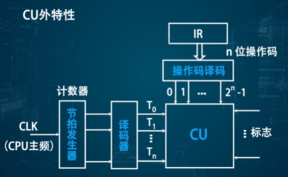
**根据操作码确定有效操作指令**

### 微操作的节拍安排
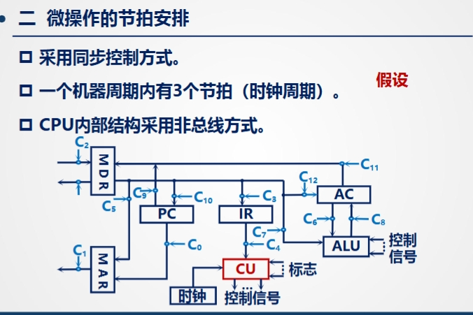

#### 安排微操作时序的原则
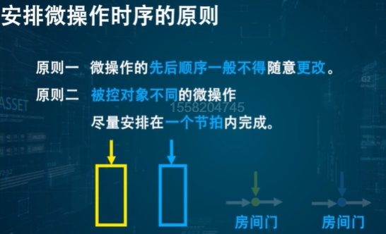
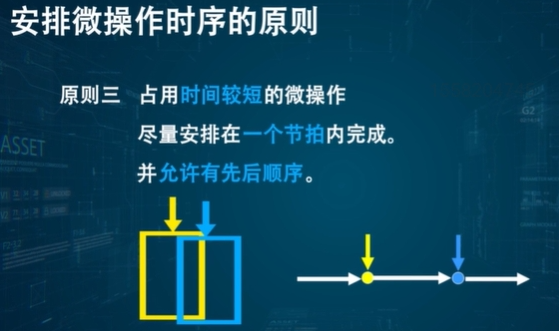

**原则一：微操作的先后顺序一般不得随意更改。**
这意味着微操作的执行顺序通常是由指令的功能、数据依赖关系或控制逻辑严格规定的，不能为了优化时序而随意调整。如果某个微操作的结果是另一个微操作的输入，那么这两个微操作之间就存在依赖，必须按照特定的顺序执行。

**原则二：被控对象不同的微操作 尽量安排在一个节拍内完成。**
“节拍”可以理解为一个时钟周期或一个更小的时序单位。这个原则是指，如果多个微操作控制的是CPU内部不同的、相互独立的部分（比如一个控制寄存器的数据加载，另一个控制ALU进行加法），并且它们之间没有直接的依赖关系，那么可以尽量让它们在同一个时钟节拍内并行执行。图片下方的图示可能就暗示了这一点：两个不同的操作（蓝色和黄色块）在同一个节拍内并行发生，控制着不同的路径（通往不同的“房间门”）。这体现了并行处理的思想，可以提高效率。

**原则三：占用时间较短的微操作 尽量安排在一个节拍内完成。并允许有先后顺序。**
这个原则是说，对于那些执行时间比较短的微操作，即使它们之间可能存在一定的先后关系（但这种先后关系可以在一个节拍内解决），也尽量把它们安排在同一个时钟节拍内完成。图片下方的图示可能表示，虽然黄色操作和蓝色操作之间存在一个箭头指示的联系（先后顺序），但由于它们可能都比较短，可以在同一个节拍内紧密地依次完成，而不需要跨越多个节拍。这样做可以更充分地利用每个时钟节拍的时间，减少空闲等待，提高微操作的执行效率。

总的来说，这三个原则反映了在设计CPU的微指令或控制逻辑时，需要在保证正确性的前提下（原则一），尽可能地挖掘微操作的并行性（原则二），并优化时钟节拍的利用率（原则三），以提高指令的执行速度和CPU的整体性能。
### 组合逻辑控制器设计流程
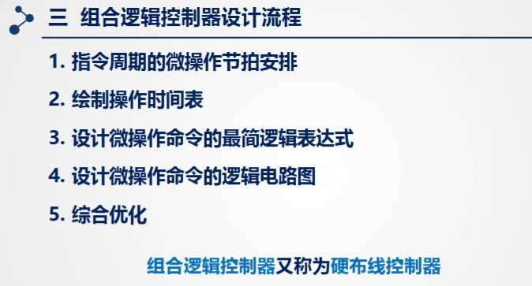

#### 1.指令周期微操作节拍安排
- 1.取指周期微操作的节拍安排
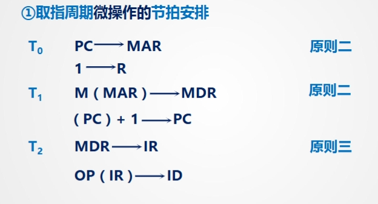
使用不同原则，将指令放入合适的周期
这张图片展示了CPU在执行“取指周期”（Fetch Cycle）时，微操作是如何按“节拍”（通常对应于时钟周期）进行安排的。取指周期是CPU执行一条指令的第一步，它的任务是从内存中取出下一条要执行的指令。

**① 取指周期微操作的节拍安排**

* **T0 节拍:**
    * `PC -> MAR`：将程序计数器（PC，存储下一条指令的地址）中的地址送入存储器地址寄存器（MAR）。这是为了告诉内存，CPU想要访问哪个地址的数据。
    * `1 -> R`：将数值 1 送入寄存器 R。这里的 R 可能是一个用于控制或状态跟踪的内部寄存器。这个操作与 PC -> MAR 同时进行。
    * **对应原则：** 原则二（被控对象不同的微操作，尽量安排在一个节拍内完成）。PC、MAR 和 R 是不同的寄存器或控制逻辑所控制的对象，因此这两个微操作可以并行安排在 T0 节拍内。

* **T1 节拍:**
    * `M (MAR) -> MDR`：根据 MAR 中存放的地址，从主存储器 M 中读取数据（即当前的指令），送入存储器数据寄存器（MDR）。这是一个内存读操作。
    * `(PC) + 1 -> PC`：将程序计数器 PC 的值加 1，使其指向下一条指令的地址。这个操作与内存读操作同时进行。
    * **对应原则：** 原则二（被控对象不同的微操作，尽量安排在一个节拍内完成）。内存读操作涉及内存和 MDR，而 PC 加 1 操作涉及 ALU（或加法器）和 PC，它们控制的是不同的硬件部件，可以并行进行。

* **T2 节拍:**
    * `MDR -> IR`：将 MDR 中存放的指令（刚从内存读出的）送入指令寄存器（IR）。IR 中存放的是当前正在执行或待译码的指令。
    * `OP (IR) -> ID`：从指令寄存器 IR 中取出操作码（OP），送入指令译码器（ID）或控制单元进行译码。译码器会根据操作码确定指令的类型和后续需要执行的操作。
    * **对应原则：** 原则三（占用时间较短的微操作尽量安排在一个节拍内完成，并允许有先后顺序）。通常，寄存器之间的数据传送（MDR->IR）和操作码的译码（OP(IR)->ID）都是相对快速的微操作。它们被安排在同一个节拍内，并且可能允许在节拍内紧密地依次发生，以提高节拍的利用率。

**总结：**

这个安排展示了如何在取指周期中运用并行处理的思想。在每个节拍内，CPU尽量同时执行多个相互独立的微操作（符合原则二）。特别是在 T2 节拍，通过将耗时较短的微操作打包在一起（符合原则三），进一步提高了效率。经过这三个节拍，CPU就成功地从内存中取出了当前指令，并将其送入了指令寄存器和译码器，为后续的指令执行阶段做好了准备。

- 2.间址周期微操作的节拍安排
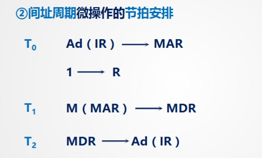

**什么是间接寻址？**
在间接寻址中，指令的地址字段中存放的不是操作数的直接地址，而是存放操作数地址的**存储单元的地址**。也就是说，CPU需要先根据指令地址字段中的地址，去内存中取出一个地址，这个取出的地址才是操作数真正的地址（有效地址）。间址周期就是完成这个“取操作数的地址的地址”的过程。

**② 间址周期微操作的节拍安排**

图片将间址周期分为了三个节拍：T0、T1 和 T2。

* **T0 节拍:**
    * `Ad (IR) -> MAR`：将指令寄存器（IR）中指令的地址码字段（Ad）的内容，送入存储器地址寄存器（MAR）。这里的 Ad 存放的是操作数地址的那个内存单元的地址（即间接地址）。
    * `1 -> R`：将数值 1 送入寄存器 R。与取指周期类似，这可能是一个用于控制或状态指示的微操作，与设置 MAR 同时进行。
    * 这个节拍是为了准备好去内存中读取存放有效地址的那个位置。

* **T1 节拍:**
    * `M (MAR) -> MDR`：根据 MAR 中存放的地址（间接地址），从主存储器 M 中读取数据，送入存储器数据寄存器（MDR）。此时从内存读出的数据，就是操作数的**有效地址**。
    * 这个节拍完成了根据间接地址获取有效地址的内存读取操作。

* **T2 节拍:**
    * `MDR -> Ad (IR)`：将 MDR 中存放的有效地址，送回指令寄存器 IR 的地址码字段 Ad 中。现在，IR 中的指令的地址码字段已经更新为操作数的真实地址了。
    * 这个节拍将取到的有效地址替换掉指令中的间接地址。

**总结：**

经过这三个节拍的间址周期，CPU成功地通过间接寻址方式，从内存中获取到了操作数的最终有效地址，并将其放回指令寄存器的地址字段。这样，在后续的执行周期中，CPU就可以直接使用这个有效地址去访问或操作数据了。整个间址周期是一个额外的内存访问过程，用于解析间接地址，是指令执行周期（Fetch -> Decode -> **Indirect (if needed)** -> Execute -> Interrupt (if needed)) 中的一个可能阶段。

- 3.执行周期微操作的节拍安排
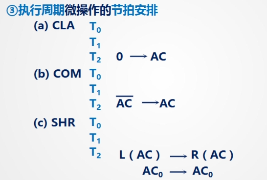
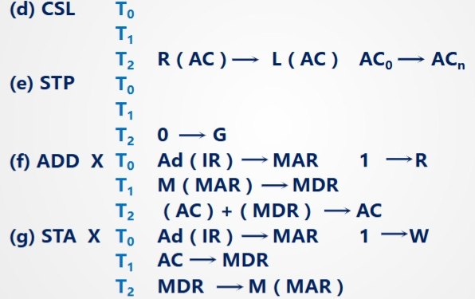
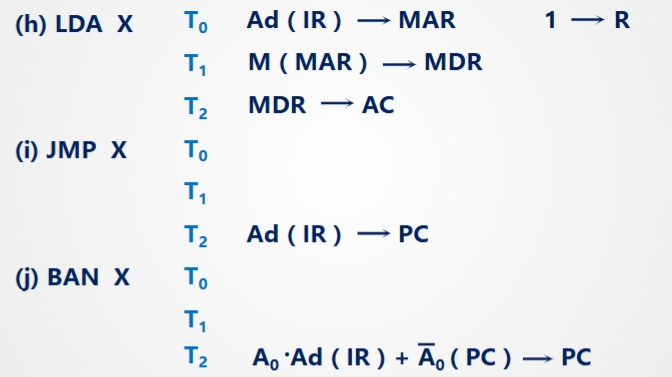

- 4.中断周期微操作的节拍安排
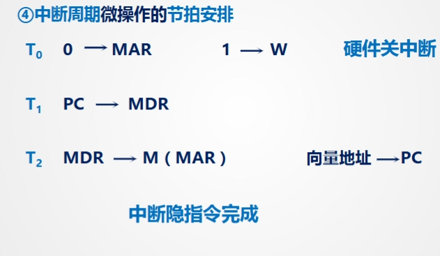

**什么是中断周期？**
中断周期的目的是暂停当前程序的执行，转而去执行处理中断事件的程序（称为中断服务程序），处理完中断后再返回原来的程序继续执行。为了实现这一点，CPU需要在转去执行中断服务程序之前，保存当前程序的关键状态信息（至少包括下一条要执行指令的地址，即PC的值），并找到中断服务程序的入口地址。

**④ 中断周期微操作的节拍安排**

图片将中断周期分为了三个节拍：T0、T1 和 T2。

* **T0 节拍:**
    * `0 -> MAR`：将数值 0 送入存储器地址寄存器（MAR）。这通常是为了指定一个内存地址，用于保存当前程序的状态信息（比如PC值），或者作为查找中断向量表（存储中断服务程序入口地址的表）的起始地址。在很多系统中，这是准备将返回地址压入栈的操作，MAR会指向栈顶。
    * `1 -> W`：将数值 1 送入寄存器 W。这里的 W 可能是一个控制寄存器或标志，设置 1 通常表示使能写操作（Write Enable）。
    * `硬件关中断`：在这个节拍，CPU会通过硬件方式关闭中断，以防止在处理当前中断的过程中，再次被其他中断打断。
    * 这个节拍准备了保存返回地址的内存位置，使能了写操作，并关闭了中断。

* **T1 节拍:**
    * `PC -> MDR`：将程序计数器（PC，存储当前被中断指令的下一条指令地址）的值送入存储器数据寄存器（MDR）。PC的值就是需要保存的返回地址。
    * 这个节拍将返回地址转移到 MDR，准备写入内存。

* **T2 节拍:**
    * `MDR -> M (MAR)`：将 MDR 中存放的返回地址写入到 MAR 所指向的内存单元中。这完成了返回地址的保存操作（例如压栈）。
    * `向量地址 → PC`：将与本次中断事件对应的中断向量地址（即中断服务程序的入口地址）送入程序计数器 PC。
    * 这两个微操作通常是并行进行的。将PC指向中断服务程序的入口地址，使得CPU在下一个取指周期会从中断服务程序开始执行。

* **中断隐指令完成**：
    * 这个标志表示上述一系列微操作已经执行完毕。这些微操作共同完成了一个“中断隐指令”的功能，即在硬件层面自动完成的中断响应和跳转过程，程序员无需显式地编写指令来保存PC和跳转。

**总结：**

中断周期通过 T0、T1、T2 这三个节拍的微操作，完成了保存当前程序的返回地址、关闭硬件中断、确定中断服务程序的入口地址并将PC指向它等一系列关键步骤，使得CPU能够平滑地从当前程序切换到中断服务程序去处理中断事件。它是CPU响应外部或内部中断请求的标准化流程。

#### 2.绘制操作时间表
- 1.取指周期操作时间表
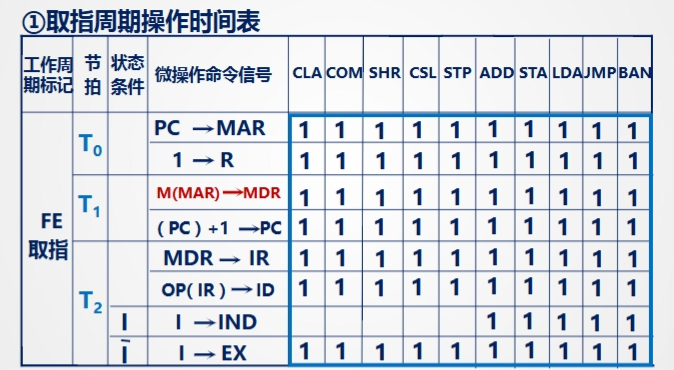

- 2.间址周期操作时间表
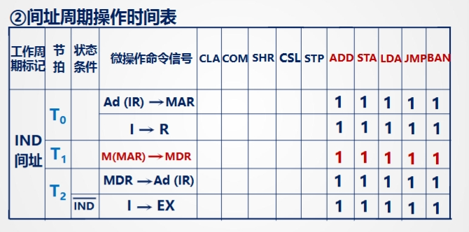

- 3.执行周期操作时间表
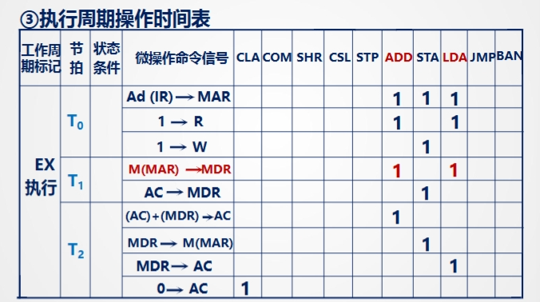

#### 3.设计微操作命令的最简逻辑表达式
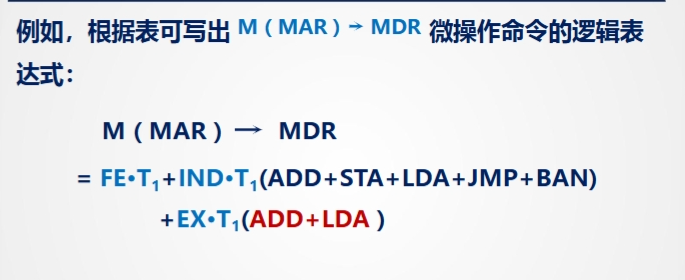
- **EX T1 (ADD+LDA)表示在EX-执行周期T1节拍两条指令ADD,LDA要用到M(MAR)->MDR信号**
- **IND T1 (ADD+STA+LDA+JMP+BAN)表示IND间址周期T1节拍这几条指令要用到M(MAR)->MDR信号**
- **FE T1表示所有指令都需要这个控制信号**

- **化简逻辑表达式**
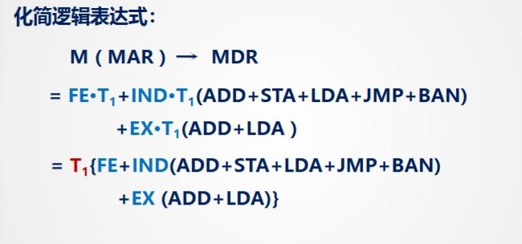
**当所有条件都为已知才相等**

- **已知条件**
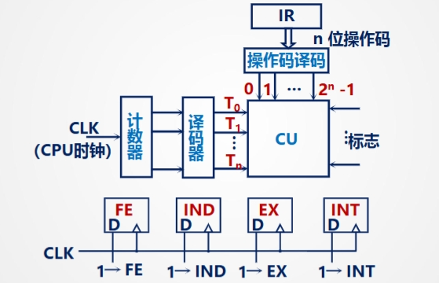

#### 4.设计微操作命令的逻辑图
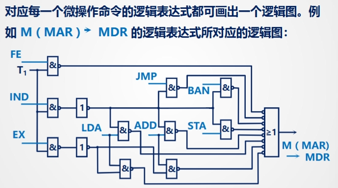

#### 5.综合优化
**将全部微操作命令的逻辑图综合起来，并进行优化工作**

### 组合逻辑电路控制器设计的特点
- 1.思路清晰，简单明了
- 2.电路庞杂，调试难，修改难，升级维护难
- 3.速度快
- 4.RISC处理器采用-速度快

## 微程序控制器
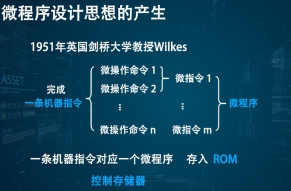

### 微程序与硬布线设计方式的联系
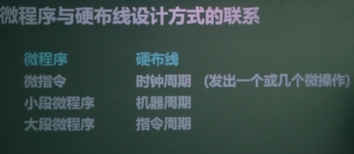

### 工作原理
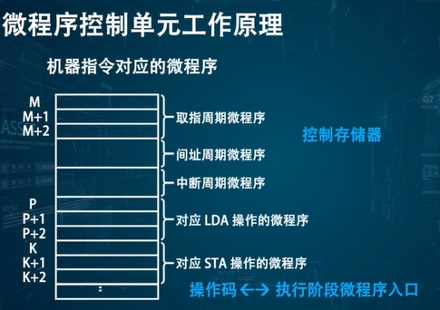
不同指令区别在于执行周期程序不同，但在取指，间址、中断周期微程序相同

指令在执行阶段的微程序不同
指令操作<->指令执行阶段微程序的入口地址

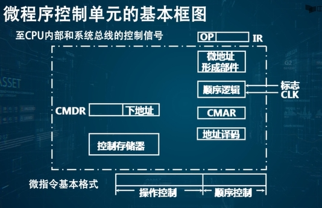

